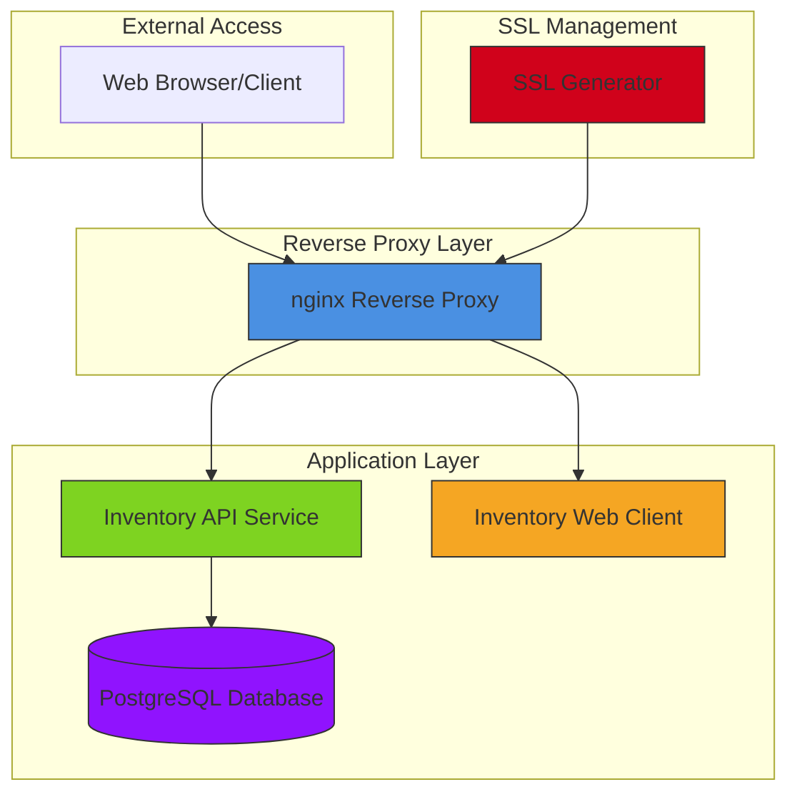
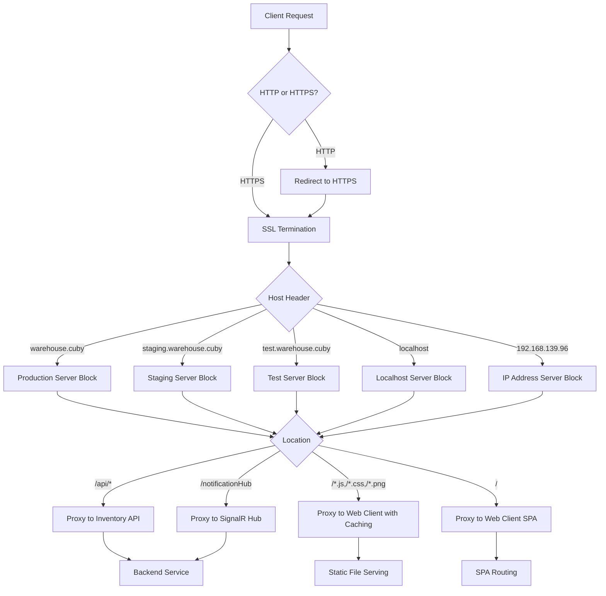
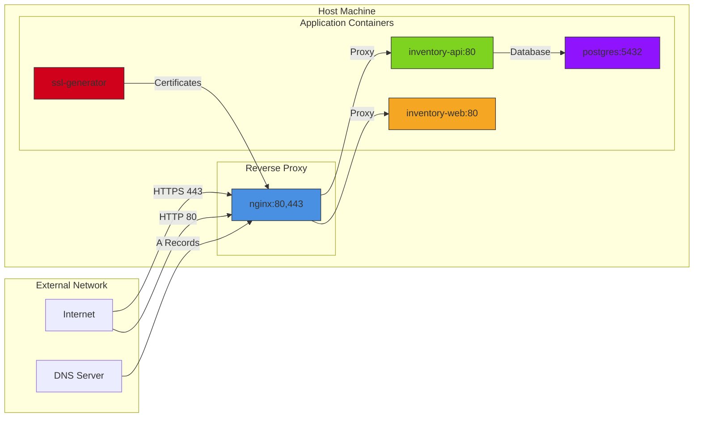

# Deployment Architecture

<cite>
**Referenced Files in This Document**   
- [docker-compose.yml](file://docker-compose.yml)
- [docker-compose.production.yml](file://docker-compose.production.yml)
- [docker-compose.staging.yml](file://docker-compose.staging.yml)
- [docker-compose.test.yml](file://docker-compose.test.yml)
- [docker-compose.ssl.yml](file://docker-compose.ssl.yml)
- [deploy/nginx/nginx.conf](file://deploy/nginx/nginx.conf)
- [deploy/nginx/nginx-staging.conf](file://deploy/nginx/nginx-staging.conf)
- [deploy/nginx/nginx-staging-http.conf](file://deploy/nginx/nginx-staging-http.conf)
- [deploy/nginx/conf.d/locations.conf](file://deploy/nginx/conf.d/locations.conf)
- [deploy/deploy-production.ps1](file://deploy/deploy-production.ps1)
- [deploy/deploy-staging.ps1](file://deploy/deploy-staging.ps1)
- [deploy/deploy-test.ps1](file://deploy/deploy-test.ps1)
- [deploy/deploy-with-ssl.ps1](file://deploy/deploy-with-ssl.ps1)
- [deploy/diagnose-ssl.ps1](file://deploy/diagnose-ssl.ps1)
- [deploy/fix-ssl-deployment.ps1](file://deploy/fix-ssl-deployment.ps1)
- [deploy/SSL_TROUBLESHOOTING.md](file://deploy/SSL_TROUBLESHOOTING.md)
</cite>

## Table of Contents
1. [Introduction](#introduction)
2. [Deployment Topology](#deployment-topology)
3. [Containerized Deployment Configuration](#containerized-deployment-configuration)
4. [Nginx Reverse Proxy Configuration](#nginx-reverse-proxy-configuration)
5. [PowerShell Deployment Automation](#powershell-deployment-automation)
6. [Network Topology and Port Mappings](#network-topology-and-port-mappings)
7. [SSL/TLS Implementation](#ssltls-implementation)
8. [Infrastructure Requirements](#infrastructure-requirements)
9. [Scalability Considerations](#scalability-considerations)
10. [System Context Diagram](#system-context-diagram)
11. [Component Breakdown](#component-breakdown)
12. [Troubleshooting Guide](#troubleshooting-guide)
13. [Conclusion](#conclusion)

## Introduction
The InventoryCtrl_2 system employs a containerized deployment architecture using Docker and docker-compose, with environment-specific configurations for production, staging, test, and SSL-enabled deployments. The architecture centers around an nginx reverse proxy that handles SSL termination, location-based routing, and static file serving. Deployment is automated through PowerShell scripts that provide environment-specific deployment capabilities and diagnostic functions. This document details the complete deployment architecture, including container interactions, network topology, SSL implementation, and operational considerations.

## Deployment Topology
The deployment architecture of InventoryCtrl_2 follows a microservices pattern with container isolation for different components. The system consists of multiple Docker containers orchestrated through docker-compose, with distinct configuration files for different deployment environments. The core components include the inventory API service, web client, PostgreSQL database, and nginx reverse proxy. In SSL deployments, an additional SSL generator container is included to create and manage certificates. The topology supports multiple deployment scenarios including production, staging, testing, and SSL-enabled environments, each with specific configuration requirements and security considerations.

**Diagram sources**
- [docker-compose.yml](file://docker-compose.yml)
- [docker-compose.ssl.yml](file://docker-compose.ssl.yml)
- [deploy/nginx/nginx.conf](file://deploy/nginx/nginx.conf)

## Containerized Deployment Configuration
InventoryCtrl_2 utilizes multiple docker-compose configuration files to support different deployment environments. The base configuration (docker-compose.yml) defines the standard container setup with the nginx reverse proxy, inventory API, web client, and PostgreSQL database. Environment-specific configurations extend this base setup with appropriate settings. The production environment (docker-compose.production.yml) includes optimized settings for performance and security. The staging environment (docker-compose.staging.yml) provides configuration suitable for pre-production testing. The test environment (docker-compose.test.yml) configures containers for automated testing scenarios. For SSL deployments, docker-compose.ssl.yml extends the base configuration with SSL certificate generation and HTTPS termination capabilities, including the SSL generator container that creates and manages certificates for secure communication.

**Section sources**
- [docker-compose.yml](file://docker-compose.yml)
- [docker-compose.production.yml](file://docker-compose.production.yml)
- [docker-compose.staging.yml](file://docker-compose.staging.yml)
- [docker-compose.test.yml](file://docker-compose.test.yml)
- [docker-compose.ssl.yml](file://docker-compose.ssl.yml)

## Nginx Reverse Proxy Configuration
The nginx reverse proxy serves as the entry point for all incoming traffic to the InventoryCtrl_2 system. It is configured with comprehensive SSL termination capabilities, handling HTTPS requests and decrypting them before forwarding to backend services. The configuration includes multiple server blocks for different domains and IP addresses, including warehouse.cuby (production), staging.warehouse.cuby (staging), test.warehouse.cuby (testing), localhost, and the specific IP address 192.168.139.96. HTTP requests are redirected to HTTPS for secure communication, except in staging environments where HTTP access is permitted for development purposes. The proxy implements location-based routing, directing API requests to the inventory API service and web client requests to the appropriate container. Static files are served with aggressive caching (1 year expiration) to improve performance. The configuration also includes WebSocket support for the SignalR notification hub, with appropriate proxy settings for connection upgrades.

**Diagram sources**
- [deploy/nginx/nginx.conf](file://deploy/nginx/nginx.conf)
- [deploy/nginx/nginx-staging.conf](file://deploy/nginx/nginx-staging.conf)
- [deploy/nginx/nginx-staging-http.conf](file://deploy/nginx/nginx-staging-http.conf)
- [deploy/nginx/conf.d/locations.conf](file://deploy/nginx/conf.d/locations.conf)

## PowerShell Deployment Automation
The deployment process for InventoryCtrl_2 is automated through a suite of PowerShell scripts located in the deploy directory. These scripts provide environment-specific deployment capabilities and diagnostic functions. The primary deployment scripts (deploy-production.ps1, deploy-staging.ps1, deploy-test.ps1) are wrappers around a universal deploy.ps1 script, each setting the appropriate environment parameter. The deploy-with-ssl.ps1 script orchestrates SSL-enabled deployments, handling certificate generation and HTTPS configuration. Diagnostic scripts include diagnose-ssl.ps1 for comprehensive SSL deployment diagnostics and fix-ssl-deployment.ps1 for automated resolution of common SSL deployment issues. These scripts perform pre-deployment checks for Docker availability, required files, and port availability, provide verbose output for troubleshooting, and handle error conditions with appropriate guidance. The automation ensures consistent deployment across environments and simplifies the operational workflow for developers and system administrators.

**Section sources**
- [deploy/deploy-production.ps1](file://deploy/deploy-production.ps1)
- [deploy/deploy-staging.ps1](file://deploy/deploy-staging.ps1)
- [deploy/deploy-test.ps1](file://deploy/deploy-test.ps1)
- [deploy/deploy-with-ssl.ps1](file://deploy/deploy-with-ssl.ps1)
- [deploy/diagnose-ssl.ps1](file://deploy/diagnose-ssl.ps1)
- [deploy/fix-ssl-deployment.ps1](file://deploy/fix-ssl-deployment.ps1)

## Network Topology and Port Mappings
The network topology of InventoryCtrl_2 follows a layered approach with clear separation between external access, reverse proxy, and application layers. All external traffic enters through the nginx reverse proxy, which listens on ports 80 (HTTP) and 443 (HTTPS). The proxy forwards requests to backend services on port 80 within the Docker network. The inventory API service is accessible externally through the proxy on port 5000 for direct API access during development. The PostgreSQL database listens on port 5432, exposed only within the Docker network for security. In the Docker network, containers communicate through a dedicated bridge network, with service discovery by container name. The nginx configuration includes specific server blocks for different domains and IP addresses, enabling access through warehouse.cuby (production), staging.warehouse.cuby (staging), test.warehouse.cuby (testing), localhost, and the IP address 192.168.139.96. SSL certificates are stored in a Docker volume (inventoryctrl_2_ssl_certificates) for persistence across container restarts.

**Diagram sources**
- [docker-compose.yml](file://docker-compose.yml)
- [docker-compose.ssl.yml](file://docker-compose.ssl.yml)
- [deploy/nginx/nginx.conf](file://deploy/nginx/nginx.conf)

## SSL/TLS Implementation
The SSL/TLS implementation in InventoryCtrl_2 provides secure communication through HTTPS with proper certificate management. The system supports both self-signed certificates for development and testing environments and Let's Encrypt integration for production deployments. SSL certificates are generated by a dedicated container (ssl-generator) that runs during deployment and creates certificates for all required domains and IP addresses. Certificates are stored in a Docker volume (inventoryctrl_2_ssl_certificates) to ensure persistence across container restarts. The nginx reverse proxy handles SSL termination, offloading encryption/decryption from the application containers. The configuration supports modern TLS protocols (TLSv1.2 and TLSv1.3) with strong cipher suites (ECDHE-RSA-AES128-GCM-SHA256, ECDHE-RSA-AES256-GCM-SHA384, ECDHE-RSA-CHACHA20-POLY1305). Security headers are implemented including HSTS, CSP, X-Frame-Options, and X-XSS-Protection to enhance protection against common web vulnerabilities. The deployment scripts automate certificate generation and renewal processes, ensuring minimal manual intervention.

**Section sources**
- [docker-compose.ssl.yml](file://docker-compose.ssl.yml)
- [deploy/nginx/nginx.conf](file://deploy/nginx/nginx.conf)
- [deploy/deploy-with-ssl.ps1](file://deploy/deploy-with-ssl.ps1)
- [deploy/SSL_TROUBLESHOOTING.md](file://deploy/SSL_TROUBLESHOOTING.md)

## Infrastructure Requirements
The deployment infrastructure for InventoryCtrl_2 requires Docker and Docker Compose to be installed and running on the host system. The minimum system requirements include a 64-bit operating system with virtualization support enabled (Hyper-V on Windows, virtualization extensions on Linux), at least 4GB of RAM (8GB recommended for production), and sufficient disk space for container images and data volumes. Network requirements include availability of ports 80 (HTTP), 443 (HTTPS), 5000 (API), and 5432 (PostgreSQL), which must not be blocked by firewalls or occupied by other services. For SSL deployments with Let's Encrypt, internet connectivity is required for certificate issuance and renewal. The system supports both Windows and Linux hosts, with PowerShell scripts for Windows and bash scripts for Linux environments. Domain name resolution must be properly configured, with DNS records pointing to the server IP address for production domains.

**Section sources**
- [deploy/deploy-with-ssl.ps1](file://deploy/deploy-with-ssl.ps1)
- [deploy/diagnose-ssl.ps1](file://deploy/diagnose-ssl.ps1)
- [deploy/fix-ssl-deployment.ps1](file://deploy/fix-ssl-deployment.ps1)

## Scalability Considerations
The containerized architecture of InventoryCtrl_2 provides several scalability options. The nginx reverse proxy can be configured for load balancing across multiple instances of the API and web client containers. Horizontal scaling can be achieved by increasing the number of container instances for stateless components (API and web client) while maintaining a single PostgreSQL database