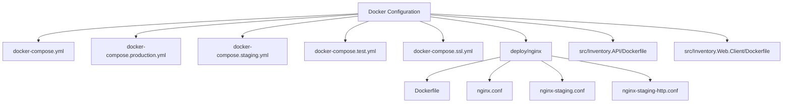
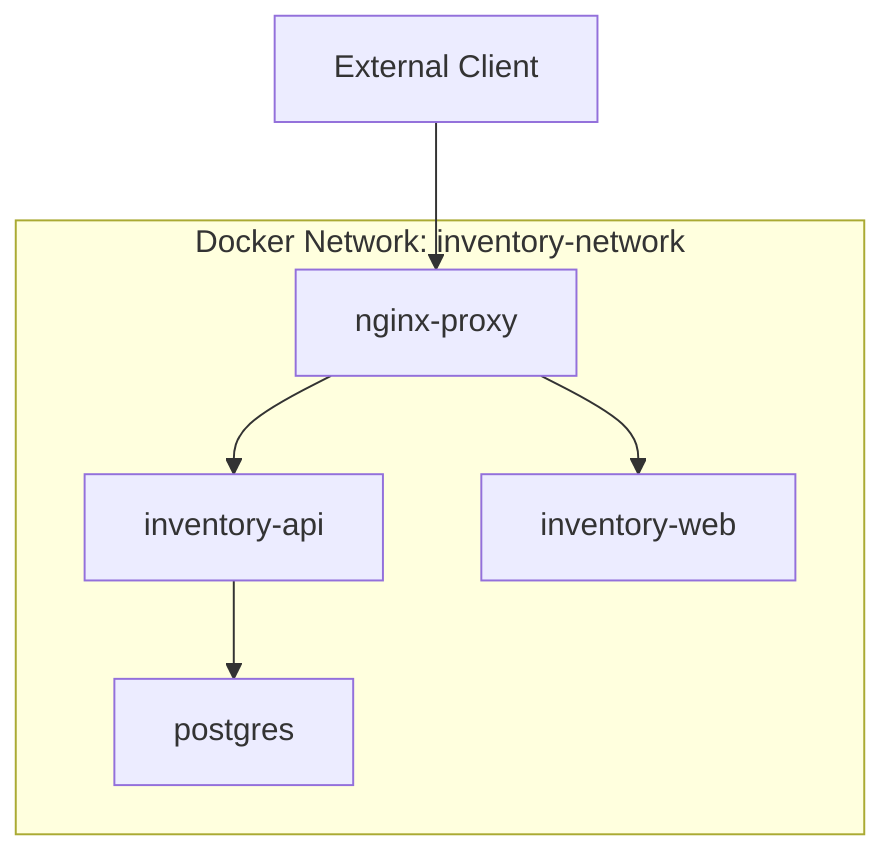
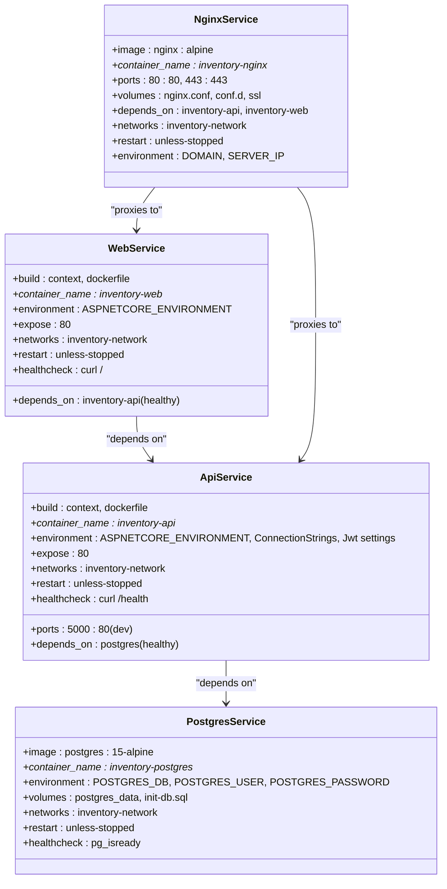
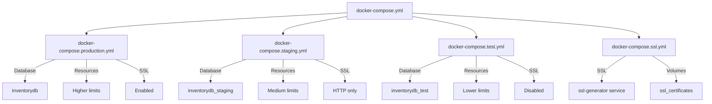
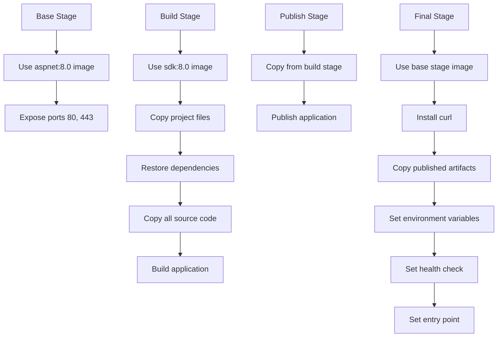
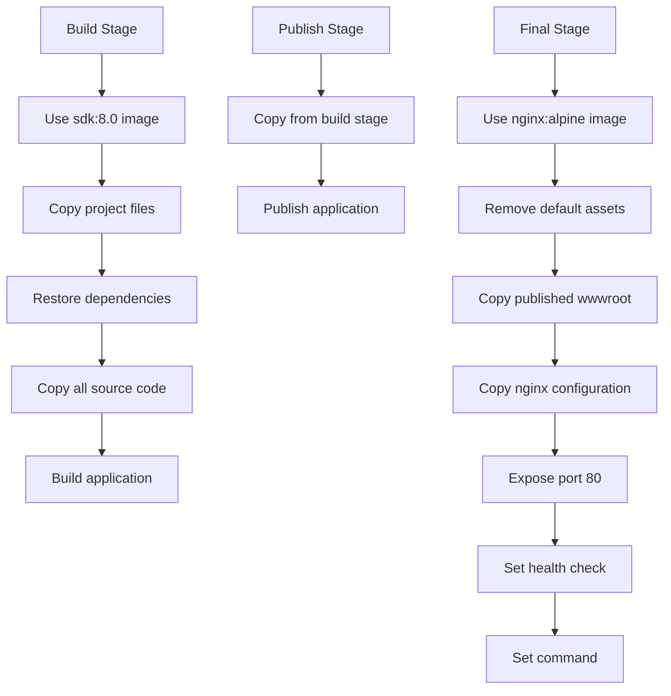
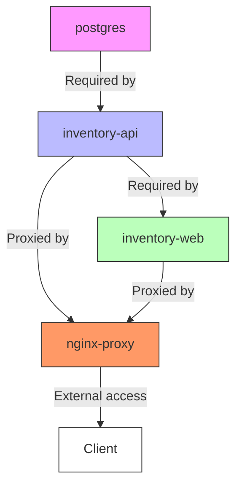

# Docker Configuration

<cite>
**Referenced Files in This Document**   
- [docker-compose.yml](file://docker-compose.yml)
- [docker-compose.production.yml](file://docker-compose.production.yml)
- [docker-compose.staging.yml](file://docker-compose.staging.yml)
- [docker-compose.test.yml](file://docker-compose.test.yml)
- [docker-compose.ssl.yml](file://docker-compose.ssl.yml)
- [src/Inventory.API/Dockerfile](file://src/Inventory.API/Dockerfile)
- [src/Inventory.Web.Client/Dockerfile](file://src/Inventory.Web.Client/Dockerfile)
- [deploy/nginx/Dockerfile](file://deploy/nginx/Dockerfile)
- [deploy/nginx/nginx.conf](file://deploy/nginx/nginx.conf)
- [deploy/nginx/nginx-staging.conf](file://deploy/nginx/nginx-staging.conf)
- [deploy/nginx/nginx-staging-http.conf](file://deploy/nginx/nginx-staging-http.conf)
</cite>

## Table of Contents
1. [Introduction](#introduction)
2. [Project Structure](#project-structure)
3. [Core Components](#core-components)
4. [Architecture Overview](#architecture-overview)
5. [Detailed Component Analysis](#detailed-component-analysis)
6. [Dependency Analysis](#dependency-analysis)
7. [Performance Considerations](#performance-considerations)
8. [Troubleshooting Guide](#troubleshooting-guide)
9. [Conclusion](#conclusion)

## Introduction
The InventoryCtrl_2 application utilizes a multi-container Docker architecture to deploy a scalable and maintainable inventory management system. This documentation details the Docker configuration strategy, including service orchestration via docker-compose, environment-specific deployments, and containerization of the .NET-based API and Blazor WebAssembly frontend. The system integrates PostgreSQL for data persistence, nginx as a reverse proxy and SSL termination point, and supports multiple deployment environments including production, staging, testing, and SSL-enabled configurations.

## Project Structure
The Docker configuration for InventoryCtrl_2 is organized around a core set of docker-compose files that extend a base configuration for different deployment scenarios. The structure includes environment-specific compose files, nginx configuration for routing and security, and Dockerfiles for building container images. The deployment scripts in the `deploy` directory provide automation for various deployment workflows, while the `scripts` directory contains SQL initialization scripts and SSL certificate generation utilities.



**Diagram sources**
- [docker-compose.yml](file://docker-compose.yml)
- [docker-compose.production.yml](file://docker-compose.production.yml)
- [docker-compose.staging.yml](file://docker-compose.staging.yml)
- [docker-compose.test.yml](file://docker-compose.test.yml)
- [docker-compose.ssl.yml](file://docker-compose.ssl.yml)
- [deploy/nginx/nginx.conf](file://deploy/nginx/nginx.conf)
- [deploy/nginx/nginx-staging.conf](file://deploy/nginx/nginx-staging.conf)
- [deploy/nginx/nginx-staging-http.conf](file://deploy/nginx/nginx-staging-http.conf)
- [src/Inventory.API/Dockerfile](file://src/Inventory.API/Dockerfile)
- [src/Inventory.Web.Client/Dockerfile](file://src/Inventory.Web.Client/Dockerfile)

**Section sources**
- [docker-compose.yml](file://docker-compose.yml)
- [docker-compose.production.yml](file://docker-compose.production.yml)
- [docker-compose.staging.yml](file://docker-compose.staging.yml)
- [docker-compose.test.yml](file://docker-compose.test.yml)
- [docker-compose.ssl.yml](file://docker-compose.ssl.yml)
- [deploy/nginx](file://deploy/nginx)
- [src/Inventory.API/Dockerfile](file://src/Inventory.API/Dockerfile)
- [src/Inventory.Web.Client/Dockerfile](file://src/Inventory.Web.Client/Dockerfile)

## Core Components
The Docker configuration consists of four primary services: PostgreSQL for database storage, Inventory.API for backend business logic, Inventory.Web.Client for the frontend interface, and nginx-proxy for routing and SSL termination. These services are orchestrated through docker-compose with environment-specific overrides for production, staging, testing, and SSL deployments. The configuration includes health checks, restart policies, resource constraints, and network isolation to ensure reliable operation.

**Section sources**
- [docker-compose.yml](file://docker-compose.yml)
- [docker-compose.production.yml](file://docker-compose.production.yml)
- [docker-compose.staging.yml](file://docker-compose.staging.yml)
- [docker-compose.test.yml](file://docker-compose.test.yml)
- [docker-compose.ssl.yml](file://docker-compose.ssl.yml)

## Architecture Overview
The Docker architecture for InventoryCtrl_2 follows a microservices-inspired pattern with four containerized services communicating over a dedicated Docker network. The nginx reverse proxy serves as the entry point, routing requests to either the API backend or the static web assets. The API service connects to PostgreSQL for data persistence and exposes REST endpoints and SignalR hubs. The web client is served as static files through nginx, enabling efficient caching and delivery.



**Diagram sources**
- [docker-compose.yml](file://docker-compose.yml)
- [docker-compose.production.yml](file://docker-compose.production.yml)

## Detailed Component Analysis

### Service Configuration Analysis
The docker-compose configuration defines four services with specific roles and dependencies. The PostgreSQL service provides database storage with volume persistence and initialization scripts. The Inventory.API service runs the .NET backend with environment-specific configuration and health checks. The Inventory.Web.Client service hosts the Blazor WebAssembly frontend. The nginx-proxy service handles routing, SSL termination, and security headers.

#### Docker Compose Service Definitions


**Diagram sources**
- [docker-compose.yml](file://docker-compose.yml)
- [docker-compose.production.yml](file://docker-compose.production.yml)
- [docker-compose.staging.yml](file://docker-compose.staging.yml)
- [docker-compose.test.yml](file://docker-compose.test.yml)

**Section sources**
- [docker-compose.yml](file://docker-compose.yml#L1-L109)
- [docker-compose.production.yml](file://docker-compose.production.yml#L1-L127)
- [docker-compose.staging.yml](file://docker-compose.staging.yml#L1-L130)
- [docker-compose.test.yml](file://docker-compose.test.yml#L1-L126)

### Environment-Specific Configuration
The system supports multiple deployment environments through specialized docker-compose files that extend or override the base configuration. Each environment has specific settings for database naming, resource allocation, security policies, and network exposure.

#### Environment Configuration Strategy


**Diagram sources**
- [docker-compose.yml](file://docker-compose.yml)
- [docker-compose.production.yml](file://docker-compose.production.yml)
- [docker-compose.staging.yml](file://docker-compose.staging.yml)
- [docker-compose.test.yml](file://docker-compose.test.yml)
- [docker-compose.ssl.yml](file://docker-compose.ssl.yml)

**Section sources**
- [docker-compose.production.yml](file://docker-compose.production.yml#L1-L127)
- [docker-compose.staging.yml](file://docker-compose.staging.yml#L1-L130)
- [docker-compose.test.yml](file://docker-compose.test.yml#L1-L126)
- [docker-compose.ssl.yml](file://docker-compose.ssl.yml#L1-L147)

### Dockerfile Build Process
The container images for the API and web client are built using multi-stage Dockerfiles that optimize layer caching and minimize final image size. The build process restores dependencies, compiles the application, and publishes the artifacts to create lean runtime images.

#### API Dockerfile Build Process


**Diagram sources**
- [src/Inventory.API/Dockerfile](file://src/Inventory.API/Dockerfile)

#### Web Client Dockerfile Build Process


**Diagram sources**
- [src/Inventory.Web.Client/Dockerfile](file://src/Inventory.Web.Client/Dockerfile)

**Section sources**
- [src/Inventory.API/Dockerfile](file://src/Inventory.API/Dockerfile#L1-L57)
- [src/Inventory.Web.Client/Dockerfile](file://src/Inventory.Web.Client/Dockerfile#L1-L49)

### nginx Configuration Analysis
The nginx reverse proxy is configured with comprehensive routing rules, security headers, and SSL termination capabilities. The configuration supports multiple domains and IP addresses, with different policies for production, staging, and development environments.

#### nginx Configuration Structure
```mermaid
graph TD
A[nginx.conf] --> B[HTTP Block]
B --> C[Upstream Servers]
C --> D[inventory_api: inventory-api:80]
C --> E[inventory_web: inventory-web:80]
B --> F[Server Blocks]
F --> G[HTTP Server:80]
G --> H[Redirect to HTTPS]
G --> I[Allow API access for localhost/IP]
F --> J[HTTPS Server:443]
J --> K[SSL Configuration]
K --> L[Certificates for warehouse.cuby, staging.warehouse.cuby, etc.]
K --> M[SSL Protocols: TLSv1.2, TLSv1.3]
K --> N[SSL Ciphers: ECDHE-RSA-AES*]
J --> O[Security Headers]
O --> P[X-Frame-Options: SAMEORIGIN]
O --> Q[X-Content-Type-Options: nosniff]
O --> R[Strict-Transport-Security]
O --> S[Content-Security-Policy]
J --> T[Location Blocks]
T --> U[/api/: Proxy to inventory_api]
T --> V[/notificationHub: Proxy to inventory_api]
T --> W[/health: Proxy to inventory_api]
T --> X[/ (root): Proxy to inventory_web]
```

**Diagram sources**
- [deploy/nginx/nginx.conf](file://deploy/nginx/nginx.conf)
- [deploy/nginx/nginx-staging.conf](file://deploy/nginx/nginx-staging.conf)
- [deploy/nginx/nginx-staging-http.conf](file://deploy/nginx/nginx-staging-http.conf)

**Section sources**
- [deploy/nginx/nginx.conf](file://deploy/nginx/nginx.conf#L1-L379)
- [deploy/nginx/nginx-staging.conf](file://deploy/nginx/nginx-staging.conf#L1-L506)
- [deploy/nginx/nginx-staging-http.conf](file://deploy/nginx/nginx-staging-http.conf#L1-L179)

## Dependency Analysis
The services in the InventoryCtrl_2 Docker configuration have well-defined dependencies that ensure proper startup order and runtime connectivity. The dependency graph shows both direct service dependencies and network-level dependencies through the reverse proxy.



**Diagram sources**
- [docker-compose.yml](file://docker-compose.yml)
- [docker-compose.production.yml](file://docker-compose.production.yml)

**Section sources**
- [docker-compose.yml](file://docker-compose.yml#L1-L109)
- [docker-compose.production.yml](file://docker-compose.production.yml#L1-L127)

## Performance Considerations
The Docker configuration includes several performance optimizations across all environments. Resource constraints are defined using Docker's deploy resources specification, with memory limits and reservations tailored to each service's requirements. The nginx configuration includes gzip compression, static file caching, and rate limiting to optimize network performance. Health checks are configured with appropriate intervals and timeouts to balance monitoring frequency with system overhead.

**Section sources**
- [docker-compose.production.yml](file://docker-compose.production.yml#L1-L127)
- [docker-compose.staging.yml](file://docker-compose.staging.yml#L1-L130)
- [docker-compose.test.yml](file://docker-compose.test.yml#L1-L126)
- [deploy/nginx/nginx.conf](file://deploy/nginx/nginx.conf#L1-L379)

## Troubleshooting Guide
Common issues in the Docker deployment of InventoryCtrl_2 typically involve container startup failures, networking problems, or SSL configuration errors. The comprehensive health checks and logging configuration help diagnose these issues. For container startup problems, check the service logs and verify that dependencies are healthy before startup. For networking issues, ensure that services are on the same Docker network and that ports are properly exposed. For SSL problems, verify certificate paths and permissions, especially in the SSL-enabled deployment configuration.

**Section sources**
- [docker-compose.yml](file://docker-compose.yml#L1-L109)
- [docker-compose.ssl.yml](file://docker-compose.ssl.yml#L1-L147)
- [deploy/nginx/nginx.conf](file://deploy/nginx/nginx.conf#L1-L379)
- [deploy/nginx/Dockerfile](file://deploy/nginx/Dockerfile#L1-L23)

## Conclusion
The Docker configuration for InventoryCtrl_2 provides a robust, scalable, and secure deployment architecture for the inventory management system. Through the use of docker-compose files for different environments, multi-stage Docker builds, and a comprehensive nginx reverse proxy configuration, the system achieves high availability, performance, and security. The modular design allows for easy customization and extension to support additional environments or deployment requirements. The inclusion of health checks, resource constraints, and automated SSL certificate generation ensures reliable operation in production environments.