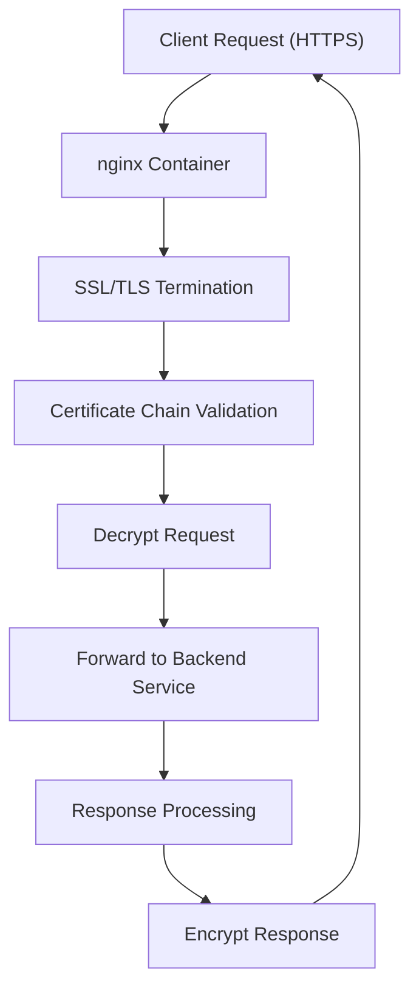
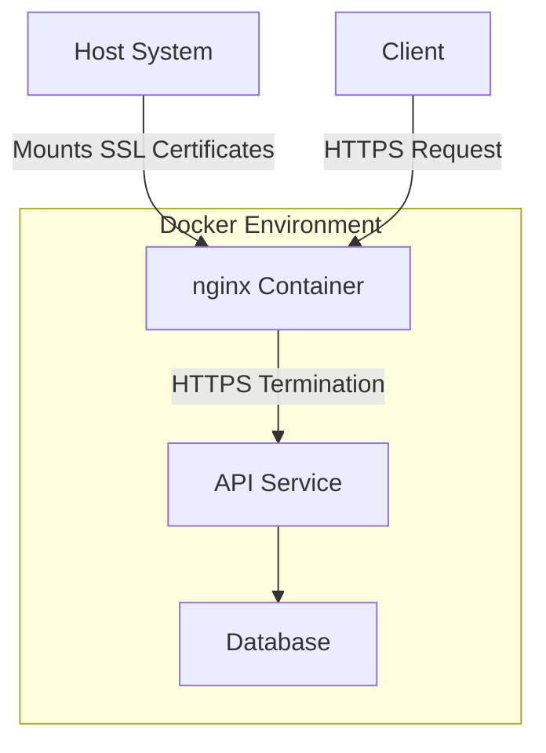

# SSL/TLS Implementation

<cite>
**Referenced Files in This Document**   
- [generate-ssl.ps1](file://scripts/generate-ssl.ps1)
- [generate-ssl-linux.sh](file://scripts/generate-ssl-linux.sh)
- [docker-compose.ssl.yml](file://docker-compose.ssl.yml)
- [nginx-staging.conf](file://deploy/nginx/nginx-staging.conf)
- [deploy-with-ssl.ps1](file://deploy/deploy-with-ssl.ps1)
- [deploy-with-ssl-fixed.ps1](file://deploy/deploy-with-ssl-fixed.ps1)
- [diagnose-ssl.ps1](file://deploy/diagnose-ssl.ps1)
- [SSL_TROUBLESHOOTING.md](file://deploy/SSL_TROUBLESHOOTING.md)
</cite>

## Table of Contents
1. [Introduction](#introduction)
2. [Certificate Generation Process](#certificate-generation-process)
3. [nginx SSL Configuration](#nginx-ssl-configuration)
4. [Docker Compose SSL Integration](#docker-compose-ssl-integration)
5. [Automated Deployment Workflows](#automated-deployment-workflows)
6. [SSL Diagnostics and Validation](#ssl-diagnostics-and-validation)
7. [Troubleshooting Common SSL Issues](#troubleshooting-common-ssl-issues)
8. [Production Best Practices](#production-best-practices)

## Introduction
This document provides comprehensive documentation for the SSL/TLS implementation in InventoryCtrl_2. It covers the end-to-end process of generating, deploying, and managing SSL certificates across development and staging environments. The implementation includes PowerShell and Linux-based certificate generation, nginx HTTPS termination, Docker container integration, and automated deployment workflows with diagnostic capabilities.

## Certificate Generation Process

InventoryCtrl_2 supports cross-platform certificate generation for both Windows and Linux environments using dedicated scripts. The process creates self-signed certificates suitable for development and staging use.

The PowerShell script `generate-ssl.ps1` automates certificate creation on Windows systems using .NET's cryptographic APIs. It generates a 2048-bit RSA key pair and creates a self-signed X.509 certificate valid for two years, stored in both PFX and PEM formats for maximum compatibility.

The Linux counterpart `generate-ssl-linux.sh` uses OpenSSL to create equivalent certificates. The script generates a private key and certificate pair, ensuring proper file permissions and directory structure for secure storage.

Both scripts output certificates to standardized locations and include validation steps to confirm successful generation before deployment.

**Section sources**
- [generate-ssl.ps1](file://scripts/generate-ssl.ps1#L1-L150)
- [generate-ssl-linux.sh](file://scripts/generate-ssl-linux.sh#L1-L80)

## nginx SSL Configuration

The nginx server is configured for HTTPS termination using TLS 1.2 and 1.3 protocols with strong cipher suites. The configuration file `nginx-staging.conf` defines SSL-specific directives including certificate and key file locations, protocol versions, and encryption standards.

SSL certificates are mounted from the host system into the nginx container at `/etc/nginx/ssl/`. The configuration specifies `ssl_certificate` as `ssl/inventory-ctrl.crt` and `ssl_certificate_key` as `ssl/inventory-ctrl.key`, establishing the certificate chain for secure connections.

The implementation disables older SSL/TLS versions (SSLv3, TLS 1.0, and 1.1) and configures modern cipher suites prioritizing ECDHE key exchange, AES 256-bit encryption, and SHA-256 hashing. HTTP Strict Transport Security (HSTS) is enabled with a 31536000-second max-age to enforce secure connections.

**Diagram sources**
- [nginx-staging.conf](file://deploy/nginx/nginx-staging.conf#L15-L45)

**Section sources**
- [nginx-staging.conf](file://deploy/nginx/nginx-staging.conf#L1-L100)

## Docker Compose SSL Integration

The `docker-compose.ssl.yml` file defines the service orchestration for SSL-enabled deployments. It extends the base configuration by adding volume mounts for SSL certificates and configuring nginx to expose port 443 for HTTPS traffic.

The nginx service mounts the certificates directory from the host system using a bind mount, ensuring the container can access the generated SSL files. The volume configuration maps `./ssl:/etc/nginx/ssl:ro` to provide read-only access to the certificate files within the container.

Environment variables are set to indicate SSL-enabled operation, and health checks verify that the HTTPS endpoint is responsive. The compose file also defines dependencies to ensure the nginx service starts only after certificate generation is complete.

**Diagram sources**
- [docker-compose.ssl.yml](file://docker-compose.ssl.yml#L10-L35)

**Section sources**
- [docker-compose.ssl.yml](file://docker-compose.ssl.yml#L1-L50)

## Automated Deployment Workflows

The deployment process is automated through PowerShell scripts that handle certificate generation, service deployment, and configuration validation. Two primary scripts manage SSL deployments: `deploy-with-ssl.ps1` and `deploy-with-ssl-fixed.ps1`.

The `deploy-with-ssl.ps1` script orchestrates the complete SSL deployment workflow, including certificate generation (if missing), Docker Compose startup with SSL configuration, and service health verification. It implements error handling to rollback changes if any step fails.

The `deploy-with-ssl-fixed.ps1` script provides an alternative deployment path with additional validation checks and recovery options. It includes enhanced logging and diagnostic capabilities to troubleshoot deployment issues.

Both scripts follow a consistent execution pattern: environment validation, certificate management, service deployment, and post-deployment verification. They support command-line parameters to customize deployment behavior and integrate with CI/CD pipelines.

**Section sources**
- [deploy-with-ssl.ps1](file://deploy/deploy-with-ssl.ps1#L1-L200)
- [deploy-with-ssl-fixed.ps1](file://deploy/deploy-with-ssl-fixed.ps1#L1-L220)

## SSL Diagnostics and Validation

The `diagnose-ssl.ps1` script provides comprehensive diagnostic capabilities for SSL deployments. It performs multiple validation checks including certificate existence, file format verification, nginx configuration syntax, and HTTPS endpoint accessibility.

The diagnostic process includes:
- Certificate file validation (existence, readability, expiration)
- Private key security checks (file permissions, exposure risks)
- nginx configuration testing with `nginx -t`
- HTTPS connectivity testing using `Invoke-WebRequest`
- Certificate chain validation
- Cipher suite compatibility testing

The script outputs a detailed report indicating the status of each check and provides remediation guidance for failed validations. It can be run manually or integrated into automated monitoring systems.

**Section sources**
- [diagnose-ssl.ps1](file://deploy/diagnose-ssl.ps1#L1-L180)

## Troubleshooting Common SSL Issues

The `SSL_TROUBLESHOOTING.md` guide documents common SSL-related issues and their solutions. Key problems addressed include:

- **Certificate Expiration**: Procedures for detecting and renewing expired certificates
- **Chain Validation Errors**: Guidance on proper certificate chain ordering and intermediate certificate inclusion
- **Mixed Content Warnings**: Solutions for ensuring all resources are loaded over HTTPS
- **Private Key Mismatch**: Verification steps to ensure certificate and key files correspond
- **Permission Issues**: File permission requirements for SSL certificates in containerized environments
- **Cipher Suite Mismatches**: Browser compatibility considerations and configuration adjustments

The guide also includes diagnostic commands and log analysis techniques to identify SSL handshake failures and other connectivity issues.

**Section sources**
- [SSL_TROUBLESHOOTING.md](file://deploy/SSL_TROUBLESHOOTING.md#L1-L300)

## Production Best Practices

While the current implementation focuses on development and staging environments, production SSL management requires additional considerations:

- **Certificate Authority**: Use trusted Certificate Authorities (CA) instead of self-signed certificates
- **Automated Renewal**: Implement automated certificate renewal processes using tools like Let's Encrypt and Certbot
- **Private Key Security**: Store private keys in secure key management systems or hardware security modules (HSMs)
- **Certificate Monitoring**: Implement monitoring for certificate expiration and automated alerts
- **Key Rotation**: Regularly rotate SSL keys according to security policies
- **OCSP Stapling**: Enable OCSP stapling for improved certificate revocation checking
- **Certificate Transparency**: Log certificates to public CT logs for enhanced security monitoring
- **Backup and Recovery**: Maintain secure backups of certificates and private keys with documented recovery procedures

The current scripts provide a foundation that can be extended for production use by integrating with enterprise certificate management systems and implementing additional security controls.