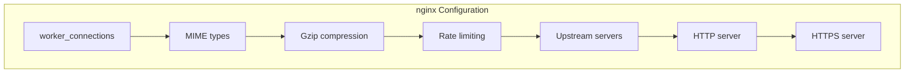
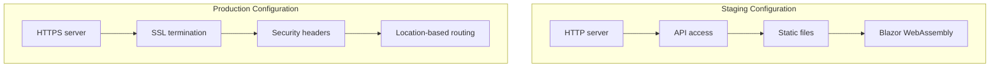

# nginx Setup

<cite>
**Referenced Files in This Document**   
- [nginx.conf](file://deploy/nginx/nginx.conf)
- [nginx-staging.conf](file://deploy/nginx/nginx-staging.conf)
- [nginx-staging-http.conf](file://deploy/nginx/nginx-staging-http.conf)
- [conf.d/locations.conf](file://deploy/nginx/conf.d/locations.conf)
</cite>

## Table of Contents
1. [Introduction](#introduction)
2. [Core Configuration Overview](#core-configuration-overview)
3. [Main nginx.conf Configuration](#main-nginxconf-configuration)
4. [Staging and Production Configurations](#staging-and-production-configurations)
5. [Location-Based Routing and Upstream Definitions](#location-based-routing-and-upstream-definitions)
6. [Performance Tuning Recommendations](#performance-tuning-recommendations)
7. [Common Issues and Troubleshooting](#common-issues-and-troubleshooting)
8. [Conclusion](#conclusion)

## Introduction
This document provides comprehensive documentation for the nginx reverse proxy setup in the InventoryCtrl_2 project. The nginx configuration serves as a critical component in the application architecture, acting as a reverse proxy and static file server for both the Blazor WebAssembly frontend and the API gateway. The setup enables SSL termination, HTTP/HTTPS redirection, and location-based routing to ensure secure and efficient communication between clients and backend services. This documentation details the configuration files, their roles, and the specific settings used to optimize performance and security across different environments.

**Section sources**
- [nginx.conf](file://deploy/nginx/nginx.conf#L1-L380)
- [nginx-staging.conf](file://deploy/nginx/nginx-staging.conf#L1-L507)

## Core Configuration Overview
The nginx configuration in InventoryCtrl_2 is designed to handle multiple environments, including production, staging, and development. The core configuration includes worker processes, MIME types, Gzip compression, and rate limiting. These settings are consistent across all configuration files to ensure uniform behavior. The configuration also defines upstream servers for the inventory API and web frontend, enabling efficient proxying of requests. Security headers are implemented to protect against common web vulnerabilities, and logging is configured to capture access and error information for monitoring and debugging purposes.

**Section sources**
- [nginx.conf](file://deploy/nginx/nginx.conf#L1-L59)
- [nginx-staging.conf](file://deploy/nginx/nginx-staging.conf#L1-L53)

## Main nginx.conf Configuration
The main nginx.conf file contains the foundational configuration for the nginx server. It defines the worker connections, MIME types, and Gzip compression settings. The Gzip compression is enabled for various content types, including text, JSON, and SVG, to reduce the size of transmitted data. Rate limiting is configured to prevent abuse of the API and web services. Upstream servers are defined for the inventory API and web frontend, allowing nginx to proxy requests to the appropriate backend services. The configuration also includes server blocks for HTTP and HTTPS, with SSL termination for secure communication.



**Diagram sources**
- [nginx.conf](file://deploy/nginx/nginx.conf#L1-L380)

**Section sources**
- [nginx.conf](file://deploy/nginx/nginx.conf#L1-L380)

## Staging and Production Configurations
The staging and production configurations are defined in separate files, nginx-staging.conf and nginx-staging-http.conf, to accommodate different deployment scenarios. The staging configuration allows direct HTTP access for development and testing, while the production configuration enforces HTTPS and includes additional security headers. SSL certificates are configured for different domains, including warehouse.cuby, staging.warehouse.cuby, and test.warehouse.cuby. The configurations also include server blocks for localhost and IP addresses, enabling access from various network interfaces.



**Diagram sources**
- [nginx-staging.conf](file://deploy/nginx/nginx-staging.conf#L1-L507)
- [nginx-staging-http.conf](file://deploy/nginx/nginx-staging-http.conf#L1-L180)

**Section sources**
- [nginx-staging.conf](file://deploy/nginx/nginx-staging.conf#L1-L507)
- [nginx-staging-http.conf](file://deploy/nginx/nginx-staging-http.conf#L1-L180)

## Location-Based Routing and Upstream Definitions
The conf.d/locations.conf file contains the location-based routing rules and upstream definitions for the nginx server. These rules define how requests are proxied to the backend services based on the URL path. The API routes are proxied to the inventory_api upstream, while the Blazor WebAssembly application and static files are served from the inventory_web upstream. The configuration also includes rules for handling WebSocket connections and CORS headers. The location blocks are designed to handle SPA routing, ensuring that requests for non-existent paths are redirected to the index.html file.

```mermaid
graph TB
subgraph "Location-Based Routing"
A[/api/] --> B[inventory_api]
C[/notificationHub] --> B
D[/] --> E[inventory_web]
F[/static files] --> E
end
```

**Diagram sources**
- [conf.d/locations.conf](file://deploy/nginx/conf.d/locations.conf#L1-L122)

**Section sources**
- [conf.d/locations.conf](file://deploy/nginx/conf.d/locations.conf#L1-L122)

## Performance Tuning Recommendations
To optimize the performance of the nginx server, several tuning recommendations can be applied. Keepalive settings should be configured to maintain persistent connections between nginx and the backend services, reducing the overhead of establishing new connections. Buffer sizes can be adjusted to handle large request and response bodies efficiently. Caching strategies should be implemented for static assets, with appropriate cache headers to ensure that clients and intermediate proxies can cache content effectively. Additionally, the Gzip compression level can be fine-tuned to balance compression ratio and CPU usage.

**Section sources**
- [nginx.conf](file://deploy/nginx/nginx.conf#L23-L28)
- [nginx-staging.conf](file://deploy/nginx/nginx-staging.conf#L23-L28)

## Common Issues and Troubleshooting
Common issues with the nginx setup include 502 Bad Gateway errors, misrouted requests, and static file loading failures. 502 errors typically occur when the backend services are unreachable or unresponsive, and can be resolved by checking the health of the upstream servers. Misrouted requests may be caused by incorrect location blocks or server names, and should be verified against the configuration files. Static file loading failures can be addressed by ensuring that the correct MIME types are defined and that the cache headers are properly set. Logging and monitoring should be used to diagnose and resolve these issues promptly.

**Section sources**
- [nginx.conf](file://deploy/nginx/nginx.conf#L302-L332)
- [nginx-staging.conf](file://deploy/nginx/nginx-staging.conf#L422-L459)

## Conclusion
The nginx reverse proxy setup in InventoryCtrl_2 is a robust and flexible solution for serving the Blazor WebAssembly frontend and API gateway. The configuration files provide a clear separation of concerns, with distinct settings for different environments and deployment scenarios. By following the performance tuning recommendations and addressing common issues, the nginx server can deliver high performance and reliability. This documentation serves as a comprehensive guide for understanding and maintaining the nginx configuration in the InventoryCtrl_2 project.