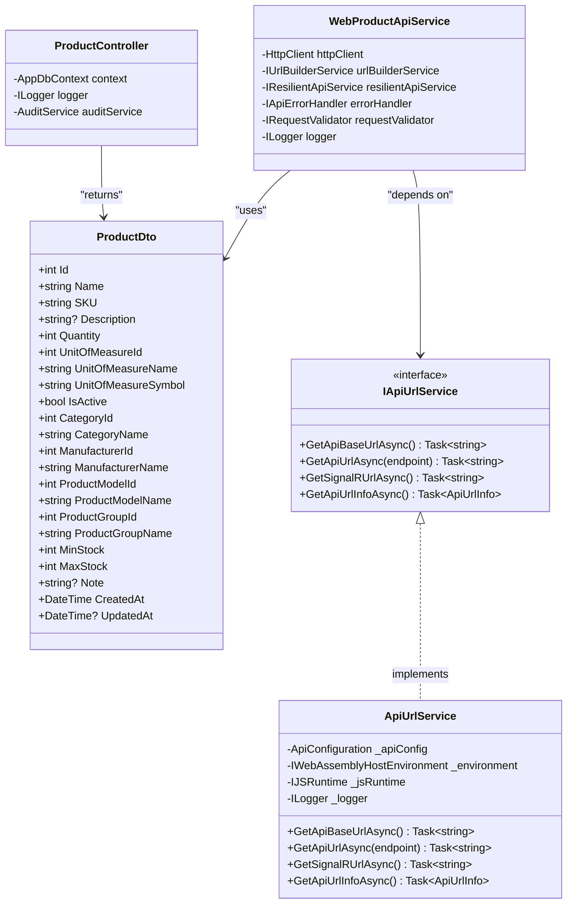
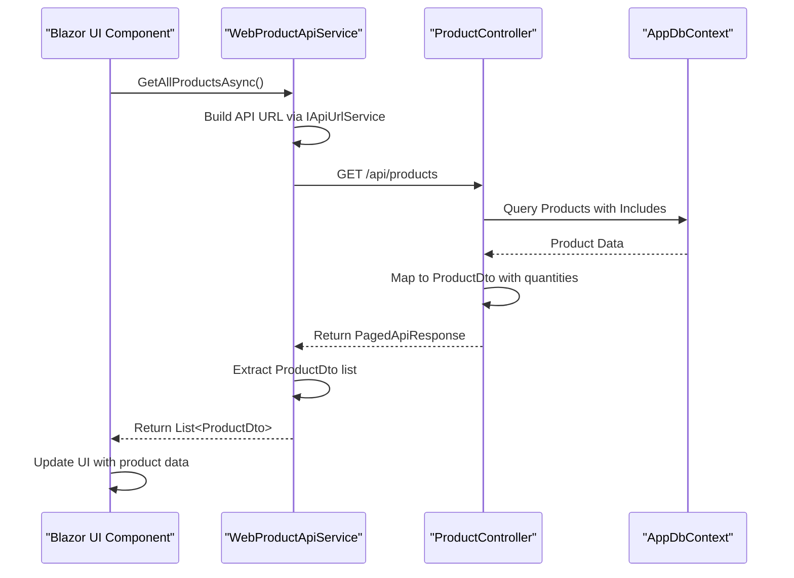

# Directory Structure Breakdown

<cite>
**Referenced Files in This Document**   
- [ProductController.cs](file://src/Inventory.API/Controllers/ProductController.cs)
- [WebProductApiService.cs](file://src/Inventory.Web.Client/Services/WebProductApiService.cs)
- [IApiUrlService.cs](file://src/Inventory.Shared/Interfaces/IApiUrlService.cs)
- [ApiUrlService.cs](file://src/Inventory.Web.Client/Services/ApiUrlService.cs)
- [ProductDto.cs](file://src/Inventory.Shared/DTOs/ProductDto.cs)
- [Product.cs](file://src/Inventory.Shared/Models/Product.cs)
</cite>

## Top-Level Directory Overview

The InventoryCtrl_2 repository follows a well-organized, modular structure that separates concerns across different functional areas. The top-level directories serve distinct purposes in the application lifecycle, from source code implementation to testing, deployment, and auxiliary tools.

### src/ - Core Application Source Code
The `src/` directory contains all primary application components, organized into specialized sub-projects that follow the .NET solution pattern. This directory houses the backend API, frontend web client, shared libraries, UI components, and static assets.

### test/ - Comprehensive Testing Suite
The `test/` directory contains a complete testing infrastructure with three distinct test types: unit tests for isolated logic validation, integration tests for component interaction verification, and component tests for frontend UI validation. Each test project corresponds to its implementation counterpart, ensuring comprehensive test coverage.

### deploy/ - Production Deployment Infrastructure
The `deploy/` directory contains all assets required for system deployment across different environments. This includes PowerShell deployment scripts for various deployment scenarios and nginx configuration files for web server setup, including staging and production configurations.

### scripts/ - Database and Utility Operations
The `scripts/` directory houses SQL scripts for database operations and PowerShell/Bash scripts for various utility functions. This includes database migration scripts, performance measurement queries, SSL certificate generation, and test execution utilities.

### AgentTools/ - System Maintenance Utilities
The `AgentTools/` directory contains specialized tools for system maintenance and patching operations. Currently, it includes a Python script for applying system patches, indicating a focus on automated system updates and maintenance.

## src/ Directory Organization

The `src/` directory is organized into five main components that represent the architectural layers of the application:

### Inventory.API - Backend REST API Service
This project implements the backend API service using ASP.NET Core. It follows a clean architecture pattern with well-defined folders for different concerns:

- **Controllers**: Contains REST API endpoints for product, category, manufacturer, and other inventory operations
- **Models**: Entity Framework Core models representing database entities
- **Services**: Business logic implementations for various domain operations
- **Validators**: Request validation logic using FluentValidation
- **Configuration**: Application configuration classes
- **Migrations**: Entity Framework database migration scripts
- **Extensions**: Service collection extensions for dependency injection

The API implements standard CRUD operations with proper error handling, authentication, and audit logging. For example, the `ProductController` handles product management operations with comprehensive validation and security checks.

**Section sources**
- [ProductController.cs](file://src/Inventory.API/Controllers/ProductController.cs#L13-L719)

### Inventory.Web.Client - Frontend Blazor Application
This project implements the frontend user interface using Blazor WebAssembly. It contains the client-side application that interacts with the backend API:

- **Services**: API client implementations that wrap HTTP calls to the backend
- **Configuration**: Client configuration for API endpoints and environment settings
- **Layout**: UI layout components like navigation menus
- **wwwroot**: Static web assets including the main HTML file

The client uses a service-oriented approach where each API controller has a corresponding client service that handles communication with the backend.

**Section sources**
- [WebProductApiService.cs](file://src/Inventory.Web.Client/Services/WebProductApiService.cs#L7-L86)

### Inventory.Shared - Cross-Platform Code Library
This critical component enables code sharing between frontend and backend by containing types that are used by both applications:

- **DTOs**: Data Transfer Objects used for API communication
- **Models**: Shared data models used across the application
- **Interfaces**: Service contracts that define API capabilities
- **Constants**: Shared constants like API endpoint definitions
- **Enums**: Shared enumeration types

This shared library eliminates code duplication and ensures consistency between client and server. For example, the `ProductDto` class is used by both the API controller for response serialization and the web client for deserialization.

**Section sources**
- [ProductDto.cs](file://src/Inventory.Shared/DTOs/ProductDto.cs#L0-L138)
- [Product.cs](file://src/Inventory.Shared/Models/Product.cs#L0-L27)

### Inventory.UI - UI Component Library
This project contains reusable UI components and styling that can be shared across different parts of the application. It includes CSS files for various UI elements like buttons, cards, forms, and navigation components, organized by functionality.

### Inventory.Web.Assets - Static Web Resources
This directory contains static web assets such as CSS stylesheets and JavaScript files that are used by the frontend application. The CSS files are organized into components and themes, supporting both light and dark mode interfaces.

## Code Reuse and Component Relationships

The directory structure facilitates effective code reuse through the `Inventory.Shared` library, which acts as the contract between frontend and backend. This design pattern ensures that both client and server agree on data structures and service interfaces.

### Shared Interfaces Pattern
The application uses a shared interfaces pattern where service contracts are defined in the shared library. For example, the `IApiUrlService` interface is defined in `Inventory.Shared` and implemented in both the client and server projects, ensuring consistent API URL resolution logic.

**Diagram sources**
- [IApiUrlService.cs](file://src/Inventory.Shared/Interfaces/IApiUrlService.cs#L2-L8)
- [ApiUrlService.cs](file://src/Inventory.Web.Client/Services/ApiUrlService.cs#L9-L357)
- [ProductController.cs](file://src/Inventory.API/Controllers/ProductController.cs#L13-L719)
- [WebProductApiService.cs](file://src/Inventory.Web.Client/Services/WebProductApiService.cs#L7-L86)
- [ProductDto.cs](file://src/Inventory.Shared/DTOs/ProductDto.cs#L0-L138)

### API Communication Flow
The application follows a clear request-response pattern between client and server. When a user interacts with the frontend, the following sequence occurs:

**Diagram sources**
- [WebProductApiService.cs](file://src/Inventory.Web.Client/Services/WebProductApiService.cs#L7-L86)
- [ProductController.cs](file://src/Inventory.API/Controllers/ProductController.cs#L13-L719)

## Navigation and Feature Location Guide

### Finding Specific Features
To locate functionality within the codebase, follow these patterns:

1. **API Endpoints**: Look in `src/Inventory.API/Controllers/` for controller classes named after the resource (e.g., `ProductController` for product-related endpoints)
2. **Frontend Components**: Check `src/Inventory.Web.Client/Services/` for API client services and `src/Inventory.UI/` for reusable UI components
3. **Data Models**: Find shared models in `src/Inventory.Shared/Models/` and API-specific DTOs in `src/Inventory.Shared/DTOs/`
4. **Validation Logic**: Examine `src/Inventory.API/Validators/` for request validation rules

### Adding New Features
When adding new functionality, follow the established patterns:

1. **New API Endpoint**: Create a new controller in `src/Inventory.API/Controllers/` and corresponding service in `src/Inventory.API/Services/`
2. **New Frontend Feature**: Add a new service in `src/Inventory.Web.Client/Services/` that implements the appropriate interface from `Inventory.Shared/Interfaces/`
3. **New Shared Type**: Add new models or DTOs to `src/Inventory.Shared/` to ensure both client and server have access
4. **Database Changes**: Use Entity Framework migrations in `src/Inventory.API/Migrations/` for schema modifications

### Modifying Existing Functionality
When modifying existing features, consider the impact across layers:

1. **API Changes**: Update the controller, ensure corresponding DTOs in `Inventory.Shared` are modified if needed, and update client services
2. **UI Changes**: Modify components in `src/Inventory.UI/` or `src/Inventory.Web.Client/` and ensure styling in `src/Inventory.Web.Assets/` is updated
3. **Shared Logic**: Update interfaces in `Inventory.Shared/Interfaces/` and ensure all implementations are updated accordingly

The directory structure supports this workflow by keeping related components physically close while maintaining clear separation of concerns through project boundaries.