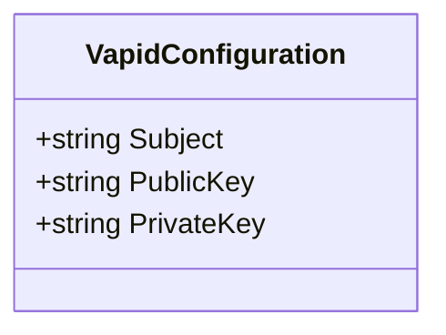
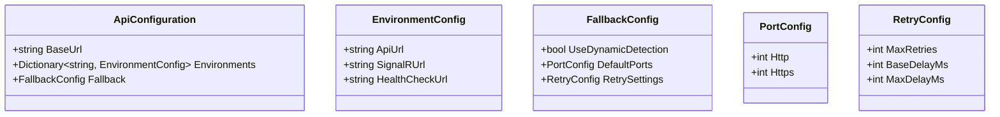
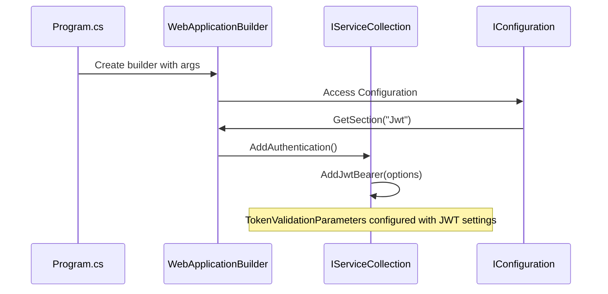
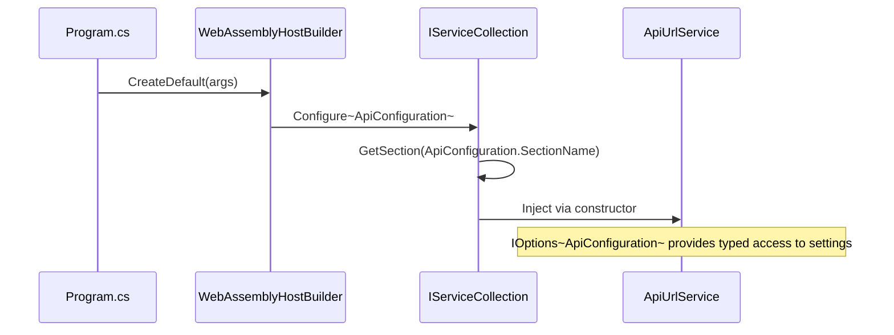
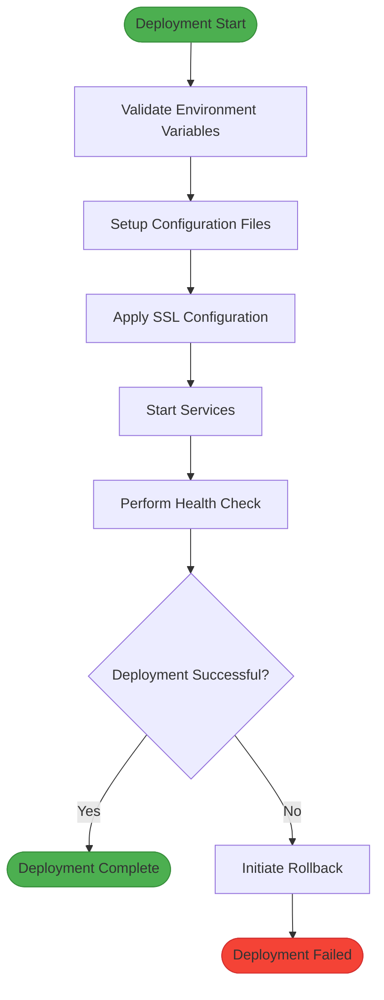

# Environment Configuration

<cite>
**Referenced Files in This Document**   
- [appsettings.json](file://src/Inventory.API/appsettings.json)
- [appsettings.Development.json](file://src/Inventory.API/appsettings.Development.json)
- [appsettings.Production.json](file://src/Inventory.API/appsettings.Production.json)
- [appsettings.json](file://src/Inventory.Web.Client/appsettings.json)
- [appsettings.Staging.json](file://src/Inventory.Web.Client/appsettings.Staging.json)
- [appsettings.Test.json](file://src/Inventory.Web.Client/appsettings.Test.json)
- [VapidConfiguration.cs](file://src/Inventory.API/Configuration/VapidConfiguration.cs)
- [ApiConfiguration.cs](file://src/Inventory.Web.Client/Configuration/ApiConfiguration.cs)
- [Program.cs](file://src/Inventory.API/Program.cs)
- [Program.cs](file://src/Inventory.Web.Client/Program.cs)
- [ApiUrlService.cs](file://src/Inventory.Web.Client/Services/ApiUrlService.cs)
- [TokenRefreshService.cs](file://src/Inventory.Web.Client/Services/TokenRefreshService.cs)
- [ServiceCollectionExtensions.cs](file://src/Inventory.API/Extensions/ServiceCollectionExtensions.cs)
- [deploy.ps1](file://deploy/deploy.ps1)
- [deploy-staging.ps1](file://deploy/deploy-staging.ps1)
- [deploy-production.ps1](file://deploy/deploy-production.ps1)
</cite>

## Table of Contents
1. [Introduction](#introduction)
2. [Configuration File Structure](#configuration-file-structure)
3. [API Configuration](#api-configuration)
4. [Web Client Configuration](#web-client-configuration)
5. [Options Pattern and Service Injection](#options-pattern-and-service-injection)
6. [Environment-Specific Overrides](#environment-specific-overrides)
7. [PowerShell Deployment Automation](#powershell-deployment-automation)
8. [Practical Configuration Examples](#practical-configuration-examples)
9. [Security Considerations](#security-considerations)
10. [Troubleshooting Configuration Issues](#troubleshooting-configuration-issues)
11. [Best Practices](#best-practices)

## Introduction
The InventoryCtrl_2 application employs a robust configuration system using JSON-based configuration files and PowerShell automation scripts to manage environment-specific settings across development, staging, production, and testing environments. This document details the configuration architecture, focusing on how settings are structured, injected into services, and managed through deployment automation. The system follows ASP.NET Core's configuration model with environment-specific overrides and the options pattern for type-safe configuration access.

## Configuration File Structure
The application uses hierarchical JSON configuration files following ASP.NET Core conventions. Each project (API and Web.Client) contains a base `appsettings.json` file with default values, supplemented by environment-specific files that override settings based on the current environment.

The configuration system prioritizes values in the following order:
1. Base `appsettings.json`
2. Environment-specific `appsettings.{Environment}.json`
3. Environment variables
4. Command-line arguments

This layered approach enables consistent defaults while allowing environment-specific customization without code changes.

**Section sources**
- [appsettings.json](file://src/Inventory.API/appsettings.json)
- [appsettings.json](file://src/Inventory.Web.Client/appsettings.json)

## API Configuration
The Inventory.API project contains comprehensive configuration settings for database connectivity, JWT authentication, CORS policies, logging, and SSL management.

### Database Connection Settings
Database connections are configured through the `ConnectionStrings` section, using PostgreSQL with Npgsql. The default connection string includes placeholders for sensitive data that should be overridden via environment variables in non-development environments.

```json
"ConnectionStrings": {
    "DefaultConnection": "Host=localhost;Port=5432;Database=inventorydb;Username=postgres;Password=__SET_IN_ENV__"
}
```

### JWT Authentication Configuration
The `Jwt` section defines token generation parameters including key, issuer, audience, and expiration times. The JWT key must be provided via environment variables in non-development environments for security.

```json
"Jwt": {
    "Key": "__SET_IN_ENV__",
    "Issuer": "InventoryServer",
    "Audience": "InventoryClient",
    "ExpireMinutes": 15,
    "RefreshTokenExpireDays": 7
}
```

### CORS Configuration
The `Cors` section configures cross-origin resource sharing policies, with different settings for development and production environments. The API supports configuration via environment variables for allowed origins.

### Serilog Configuration
Logging is configured through the `Serilog` section, with different minimum levels for development and production environments. The configuration supports both console and file-based logging with daily rolling files.

### Vapid Notifications
Web push notifications are configured through the `VapidConfiguration` class, which defines subject, public key, and private key properties for VAPID (Voluntary Application Server Identification) protocol.



**Diagram sources**
- [VapidConfiguration.cs](file://src/Inventory.API/Configuration/VapidConfiguration.cs)

**Section sources**
- [appsettings.json](file://src/Inventory.API/appsettings.json)
- [Program.cs](file://src/Inventory.API/Program.cs)

## Web Client Configuration
The Inventory.Web.Client project contains configuration settings specific to the Blazor WebAssembly frontend, focusing on API connectivity, token management, and fallback strategies.

### API Endpoint Configuration
The `ApiSettings` section defines base URLs and environment-specific endpoints for API, SignalR, and health check services. The configuration supports multiple environments with fallback mechanisms for dynamic detection.

```json
"ApiSettings": {
    "BaseUrl": "/api",
    "Environments": {
        "Development": {
            "ApiUrl": "/api",
            "SignalRUrl": "/notificationHub",
            "HealthCheckUrl": "/api/health"
        }
    }
}
```

### Token Management Configuration
The `TokenSettings` section configures token refresh behavior including refresh thresholds, retry policies, and timeout settings to ensure seamless user experience during token renewal.

```json
"TokenSettings": {
    "RefreshThresholdMinutes": 5,
    "MaxRefreshRetries": 3,
    "RefreshRetryDelayMs": 1000,
    "RefreshTimeoutMs": 10000,
    "EnableAutoRefresh": true,
    "EnableLogging": true
}
```



**Diagram sources**
- [ApiConfiguration.cs](file://src/Inventory.Web.Client/Configuration/ApiConfiguration.cs)

**Section sources**
- [appsettings.json](file://src/Inventory.Web.Client/appsettings.json)
- [ApiConfiguration.cs](file://src/Inventory.Web.Client/Configuration/ApiConfiguration.cs)

## Options Pattern and Service Injection
The application uses the ASP.NET Core options pattern to inject configuration values into services in a type-safe manner.

### API Configuration Injection
In the API project, configuration values are injected using `IConfiguration.GetSection()` and bound to strongly-typed classes. The JWT settings are specifically validated in non-development environments to ensure security.



**Diagram sources**
- [Program.cs](file://src/Inventory.API/Program.cs)

### Web Client Configuration Injection
The Web.Client uses `IOptions<T>` pattern to inject configuration into services. The `ApiConfiguration` and `TokenConfiguration` classes are registered in `Program.cs` and injected into services like `ApiUrlService` and `TokenRefreshService`.



**Diagram sources**
- [Program.cs](file://src/Inventory.Web.Client/Program.cs)
- [ApiUrlService.cs](file://src/Inventory.Web.Client/Services/ApiUrlService.cs)

**Section sources**
- [Program.cs](file://src/Inventory.API/Program.cs)
- [Program.cs](file://src/Inventory.Web.Client/Program.cs)
- [ApiUrlService.cs](file://src/Inventory.Web.Client/Services/ApiUrlService.cs)
- [TokenRefreshService.cs](file://src/Inventory.Web.Client/Services/TokenRefreshService.cs)

## Environment-Specific Overrides
The application supports environment-specific configuration through dedicated JSON files that override base settings.

### API Environment Overrides
- **Development**: Uses default Serilog level of "Information" with verbose logging
- **Production**: Restricts Serilog level to "Warning" and removes additional CORS origins
- **Staging**: Inherits production settings with specific staging configurations

```json
// appsettings.Production.json
{
    "Cors": {
        "UseNginxProxy": true,
        "AllowExternalAccess": false,
        "AllowAnyOrigin": false,
        "AdditionalOrigins": []
    },
    "Serilog": {
        "MinimumLevel": {
            "Default": "Warning"
        }
    }
}
```

### Web Client Environment Overrides
- **Staging**: Configures specific API endpoints for staging environment
- **Test**: Defines external URLs for test environment integration
- **Production**: Uses default production endpoints

```json
// appsettings.Staging.json
{
    "ApiSettings": {
        "Environments": {
            "Staging": {
                "ApiUrl": "/api",
                "SignalRUrl": "/notificationHub",
                "HealthCheckUrl": "/health"
            }
        }
    }
}
```

**Section sources**
- [appsettings.Development.json](file://src/Inventory.API/appsettings.Development.json)
- [appsettings.Production.json](file://src/Inventory.API/appsettings.Production.json)
- [appsettings.Staging.json](file://src/Inventory.Web.Client/appsettings.Staging.json)
- [appsettings.Test.json](file://src/Inventory.Web.Client/appsettings.Test.json)

## PowerShell Deployment Automation
The deployment directory contains PowerShell scripts that automate environment setup and configuration injection.

### Deployment Script Hierarchy
- **deploy.ps1**: Base deployment script with common functionality
- **deploy-staging.ps1**: Staging-specific deployment with staging configurations
- **deploy-production.ps1**: Production deployment with security-hardened settings
- **deploy-all.ps1**: Orchestrates deployment across all environments
- **quick-deploy.ps1**: Rapid deployment script for development environments

### Configuration Injection Process
The deployment scripts handle:
- Environment variable setup
- Configuration file generation
- SSL certificate management
- Service startup and health checks
- Rollback procedures for failed deployments



**Diagram sources**
- [deploy.ps1](file://deploy/deploy.ps1)
- [deploy-staging.ps1](file://deploy/deploy-staging.ps1)
- [deploy-production.ps1](file://deploy/deploy-production.ps1)

**Section sources**
- [deploy.ps1](file://deploy/deploy.ps1)
- [deploy-staging.ps1](file://deploy/deploy-staging.ps1)
- [deploy-production.ps1](file://deploy/deploy-production.ps1)

## Practical Configuration Examples
### Configuring a New Environment
To add a new environment (e.g., "UAT"):
1. Create `appsettings.UAT.json` in both API and Web.Client projects
2. Define environment-specific settings
3. Update deployment scripts to include UAT deployment
4. Add environment variables to deployment pipeline

### Managing Secrets
Sensitive configuration data should be managed through:
- Environment variables for production secrets
- Azure Key