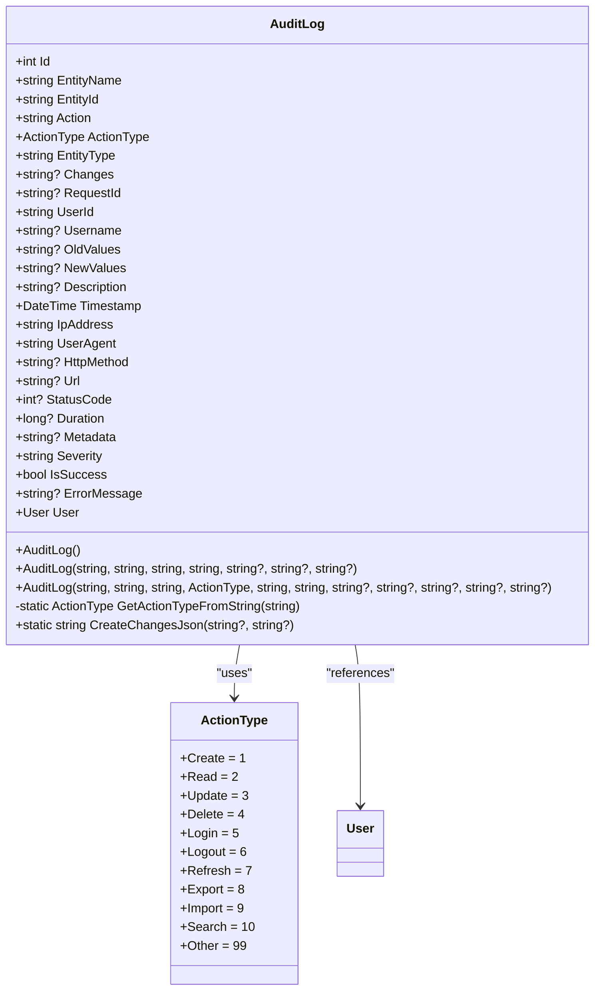
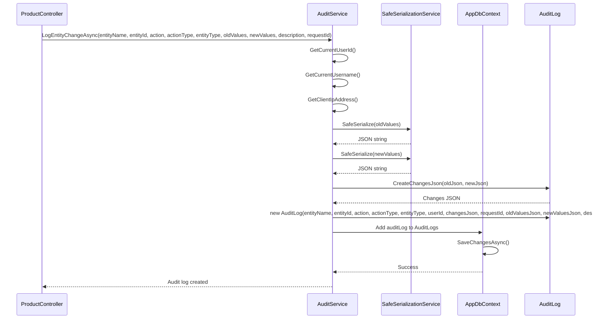
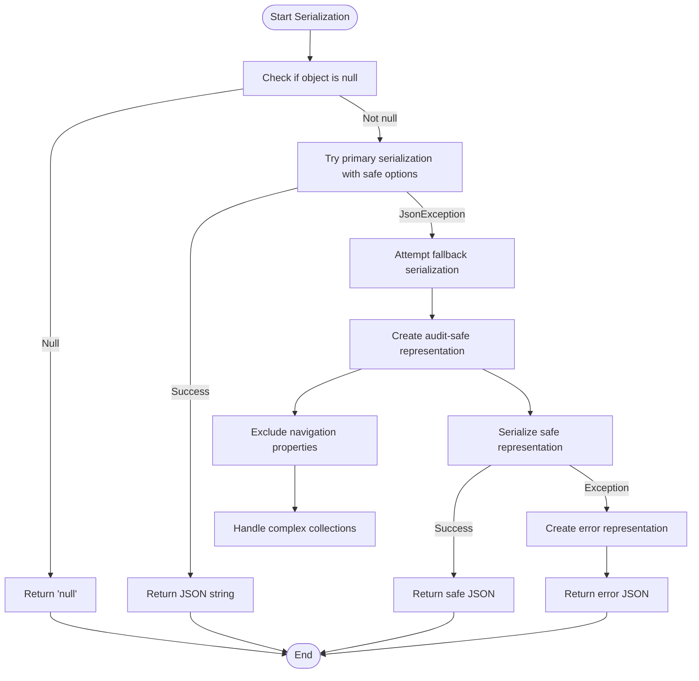
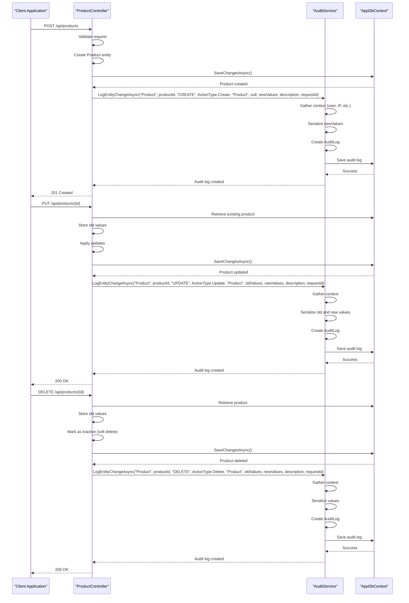

# Audit Logging

<cite>
**Referenced Files in This Document**   
- [AuditService.cs](file://src/Inventory.API/Services/AuditService.cs)
- [AuditLog.cs](file://src/Inventory.API/Models/AuditLog.cs)
- [ProductController.cs](file://src/Inventory.API/Controllers/ProductController.cs)
- [AuditController.cs](file://src/Inventory.API/Controllers/AuditController.cs)
- [ActionType.cs](file://src/Inventory.API/Enums/ActionType.cs)
- [SafeSerializationService.cs](file://src/Inventory.API/Services/SafeSerializationService.cs)
</cite>

## Table of Contents
1. [Introduction](#introduction)
2. [Domain Model](#domain-model)
3. [Audit Service Implementation](#audit-service-implementation)
4. [Entity Change Tracking](#entity-change-tracking)
5. [JSON Serialization of Changes](#json-serialization-of-changes)
6. [Integration with Controllers](#integration-with-controllers)
7. [Audit Data Retention](#audit-data-retention)
8. [Performance Considerations](#performance-considerations)
9. [Troubleshooting Guide](#troubleshooting-guide)
10. [Conclusion](#conclusion)

## Introduction

The Audit Logging feature in the Inventory Control system provides comprehensive tracking of all significant operations within the application. This documentation details the implementation of audit trail generation, focusing on the AuditService component responsible for capturing entity changes and user actions. The system is designed to maintain a complete history of CREATE, UPDATE, and DELETE operations across all entities, with special attention to security, performance, and data integrity.

The audit logging mechanism serves multiple purposes: compliance with regulatory requirements, security monitoring, troubleshooting operational issues, and providing transparency into system changes. The implementation follows a layered architecture with clear separation of concerns, where the AuditService acts as the central component coordinating audit log creation, storage, and retrieval.

This documentation will explore the domain model of AuditLog, the implementation details of entity change tracking, JSON serialization strategies for capturing old and new values, integration patterns with controllers, and solutions for managing audit data retention. The content is designed to be accessible to developers of all experience levels while providing sufficient technical depth for implementation and maintenance tasks.

## Domain Model

The AuditLog entity represents the core domain model for audit trail data, capturing comprehensive information about system operations. This model is designed to provide rich context for each audited action, enabling detailed analysis and reporting.



**Diagram sources**
- [AuditLog.cs](file://src/Inventory.API/Models/AuditLog.cs#L9-L253)
- [ActionType.cs](file://src/Inventory.API/Enums/ActionType.cs#L5-L61)

The AuditLog model contains several key fields that provide comprehensive context for each audited operation:

- **EntityName**: The name of the entity being audited (e.g., "Product", "User", "Category")
- **EntityId**: The unique identifier of the specific entity instance
- **Action**: The action performed (CREATE, UPDATE, DELETE, LOGIN, etc.)
- **ActionType**: An enum categorizing the action type for better filtering and analysis
- **EntityType**: The type of entity being audited (e.g., "Product", "User", "Category")
- **Changes**: Detailed changes in JSON format containing before/after values
- **RequestId**: Request ID for tracing related operations across microservices
- **UserId**: The ID of the user who performed the action
- **Username**: The username for easier identification
- **OldValues**: The state of the entity before changes (JSON format)
- **NewValues**: The state of the entity after changes (JSON format)
- **Description**: Additional contextual information about the action
- **Timestamp**: When the action occurred
- **IpAddress**: Client IP address for security monitoring
- **UserAgent**: Client user agent string
- **HttpMethod**: HTTP method used (GET, POST, PUT, DELETE, etc.)
- **Url**: The endpoint accessed
- **StatusCode**: HTTP response status code
- **Duration**: Operation duration in milliseconds
- **Metadata**: Additional metadata in JSON format
- **Severity**: Severity level (INFO, WARNING, ERROR, CRITICAL)
- **IsSuccess**: Whether the action was successful
- **ErrorMessage**: Error message if the action failed

The model includes two constructors: a basic constructor for backward compatibility and an enhanced constructor with additional fields for more detailed audit information. The `GetActionTypeFromString` helper method automatically maps string actions to their corresponding ActionType enum values, while `CreateChangesJson` generates a standardized JSON representation of changes with timestamps.

**Section sources**
- [AuditLog.cs](file://src/Inventory.API/Models/AuditLog.cs#L9-L253)

## Audit Service Implementation

The AuditService is the central component responsible for managing audit logs, providing a comprehensive API for logging various types of actions and retrieving audit data. The service is designed with dependency injection, receiving its dependencies through constructor injection.

```mermaid
classDiagram
class AuditService {
-AppDbContext _context
-IHttpContextAccessor _httpContextAccessor
-ILogger<AuditService> _logger
-SafeSerializationService _safeSerializer
+LogEntityChangeAsync(string, string, string, ActionType, string, object?, object?, string?, string?, string, bool, string?)
+LogEntityChangeAsync(string, string, string, object?, object?, string?, string, bool, string?)
+LogUserActionAsync(string, string?, string?, string?, object?, string, bool, string?)
+LogHttpRequestAsync(string, string, int, long, string?, bool, string?)
+LogDetailedChangeAsync(string, string, string, ActionType, string, object?, string?, string?, string, bool, string?)
+GetAuditLogsAsync(string?, string?, ActionType?, string?, string?, DateTime?, DateTime?, string?, string?, int, int)
+GetAuditLogsAsync(string?, string?, string?, DateTime?, DateTime?, string?, int, int)
+GetEntityAuditLogsAsync(string, string)
+GetUserAuditLogsAsync(string, int)
+CleanupOldLogsAsync(int)
-string GetCurrentUserId()
-string? GetCurrentUsername()
-string GetClientIpAddress()
-Task<string?> VerifyAndGetUserIdAsync(string)
}
AuditService --> AppDbContext : "uses"
AuditService --> IHttpContextAccessor : "uses"
AuditService --> ILogger<AuditService> : "uses"
AuditService --> SafeSerializationService : "uses"
AuditService --> AuditLog : "creates"
```

**Diagram sources**
- [AuditService.cs](file://src/Inventory.API/Services/AuditService.cs#L12-L604)

The AuditService implements several key methods for different audit scenarios:

- **LogEntityChangeAsync**: The primary method for logging entity changes, available in two overloads for backward compatibility
- **LogUserActionAsync**: For logging user actions that may not be tied to a specific entity
- **LogHttpRequestAsync**: For logging HTTP request details including performance metrics
- **LogDetailedChangeAsync**: For logging changes with detailed change tracking
- **GetAuditLogsAsync**: For retrieving audit logs with comprehensive filtering and pagination
- **GetEntityAuditLogsAsync**: For retrieving logs specific to a particular entity
- **GetUserAuditLogsAsync**: For retrieving logs specific to a particular user
- **CleanupOldLogsAsync**: For managing audit data retention by removing old logs

The service automatically captures contextual information from the HTTP context, including user identity, IP address, user agent, HTTP method, URL, and status code. It also handles user verification to ensure accurate user identification in audit logs, even when user IDs might be inconsistent between authentication tokens and the database.

**Section sources**
- [AuditService.cs](file://src/Inventory.API/Services/AuditService.cs#L12-L604)

## Entity Change Tracking

Entity change tracking is implemented through the `LogEntityChangeAsync` method in AuditService, which captures both the old and new states of entities when modifications occur. This tracking mechanism provides a complete audit trail of all changes to critical business entities.



**Diagram sources**
- [AuditService.cs](file://src/Inventory.API/Services/AuditService.cs#L38-L150)
- [SafeSerializationService.cs](file://src/Inventory.API/Services/SafeSerializationService.cs#L32-L60)
- [AuditLog.cs](file://src/Inventory.API/Models/AuditLog.cs#L233-L253)

The entity change tracking process follows these steps:

1. **Context Gathering**: The service retrieves the current user's ID and username from the authentication context, along with the client's IP address and user agent information.

2. **User Verification**: Before creating the audit log, the service verifies that the user exists in the database and obtains the correct user ID, handling cases where the authentication token might contain outdated information.

3. **Value Serialization**: Both old and new values are serialized to JSON using the SafeSerializationService, which handles complex object graphs and prevents circular reference issues.

4. **Changes JSON Creation**: The `CreateChangesJson` static method in AuditLog creates a standardized JSON structure containing both old and new values along with a timestamp of when the change occurred.

5. **Audit Log Creation**: A new AuditLog instance is created with all relevant information, including entity details, user information, change data, and contextual HTTP information.

6. **Persistence**: The audit log is added to the database context and saved asynchronously.

The implementation includes safeguards to prevent audit logging for unauthenticated users and handles exceptions gracefully to ensure that audit logging failures don't disrupt the primary business operation.

**Section sources**
- [AuditService.cs](file://src/Inventory.API/Services/AuditService.cs#L38-L150)
- [AuditLog.cs](file://src/Inventory.API/Models/AuditLog.cs#L233-L253)

## JSON Serialization of Changes

The JSON serialization of old and new values is a critical aspect of the audit logging system, ensuring that entity state changes are captured accurately and safely. This process uses the SafeSerializationService to handle complex object graphs and prevent common serialization issues.



**Diagram sources**
- [SafeSerializationService.cs](file://src/Inventory.API/Services/SafeSerializationService.cs#L32-L60)
- [SafeSerializationService.cs](file://src/Inventory.API/Services/SafeSerializationService.cs#L100-L180)

The serialization process is implemented in the SafeSerializationService class, which provides the `SafeSerialize` method. This method follows a multi-tiered approach to ensure reliable serialization:

1. **Primary Serialization**: Attempts to serialize the object using configured safe JSON options that ignore circular references, limit depth, and handle null values appropriately.

2. **Fallback Serialization**: If primary serialization fails (typically due to JsonException), the service creates an audit-safe representation by excluding navigation properties and complex collections that might cause circular references.

3. **Error Handling**: If both primary and fallback serialization fail, the service creates an error representation that captures the type and error message, ensuring that some information is preserved even when complete serialization isn't possible.

The `CreateAuditSafeRepresentation` method specifically handles Entity Framework entities by:
- Excluding properties with JsonIgnore attributes
- Skipping navigation properties that could cause circular references
- Handling complex collection types that might serialize poorly
- Catching exceptions when accessing problematic properties

For the audit logging system, this means that even when entities have complex relationships or problematic properties, the system can still capture a meaningful representation of the changes without failing.

**Section sources**
- [SafeSerializationService.cs](file://src/Inventory.API/Services/SafeSerializationService.cs#L32-L60)
- [SafeSerializationService.cs](file://src/Inventory.API/Services/SafeSerializationService.cs#L100-L180)

## Integration with Controllers

The audit logging system is integrated with controllers through direct service injection and method calls, with the ProductController serving as a prime example of this integration pattern. Controllers use the AuditService to log CREATE, UPDATE, and DELETE operations on entities.



**Diagram sources**
- [ProductController.cs](file://src/Inventory.API/Controllers/ProductController.cs#L250-L350)
- [ProductController.cs](file://src/Inventory.API/Controllers/ProductController.cs#L351-L450)
- [ProductController.cs](file://src/Inventory.API/Controllers/ProductController.cs#L451-L550)
- [AuditService.cs](file://src/Inventory.API/Services/AuditService.cs#L38-L150)

The integration pattern follows these principles:

1. **Service Injection**: The AuditService is injected into controllers through constructor dependency injection, making it available for use in all controller methods.

2. **Operation Timing**: Audit logging occurs after the primary business operation has succeeded, ensuring that only successful operations are logged.

3. **Context Preservation**: The requestId is preserved from the HTTP context to maintain traceability across related operations.

4. **Value Capture**: For UPDATE and DELETE operations, the old values are captured before the operation, while new values are captured after the operation.

5. **Enhanced Details**: The logging includes not just the action type but also detailed descriptions and relevant metadata to provide context.

The ProductController demonstrates this integration by logging product creation, updates, and deletions. When creating a product, it logs the new values of all relevant properties. When updating a product, it captures both the old and new values to show exactly what changed. When deleting a product (implemented as a soft delete