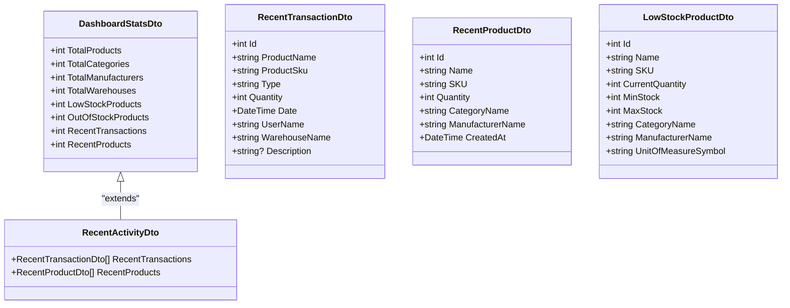
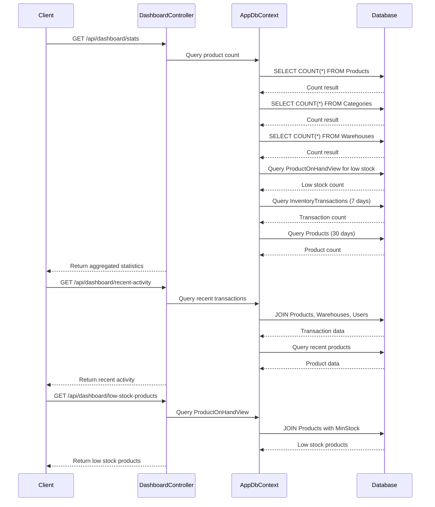
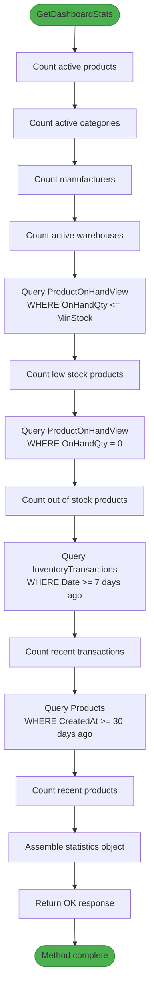
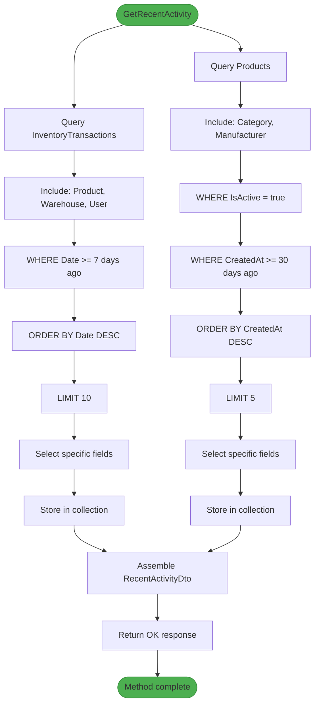
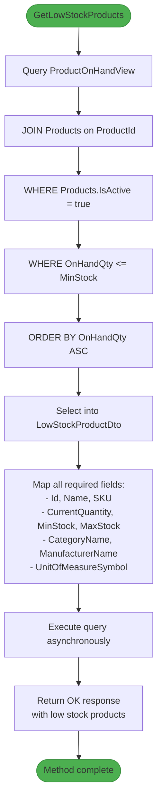

# Dashboard Analytics

<cite>
**Referenced Files in This Document**   
- [DashboardController.cs](file://src/Inventory.API/Controllers/DashboardController.cs)
- [DashboardDto.cs](file://src/Inventory.Shared/DTOs/DashboardDto.cs)
- [AppDbContext.cs](file://src/Inventory.API/Models/AppDbContext.cs)
- [Product.cs](file://src/Inventory.API/Models/Product.cs)
- [InventoryTransaction.cs](file://src/Inventory.API/Models/InventoryTransaction.cs)
- [ProductViews.cs](file://src/Inventory.API/Models/ProductViews.cs)
- [DashboardControllerIntegrationTests.cs](file://test/Inventory.IntegrationTests/Controllers/DashboardControllerIntegrationTests.cs)
</cite>

## Table of Contents
1. [Introduction](#introduction)
2. [Dashboard Data Model](#dashboard-data-model)
3. [Dashboard Controller Implementation](#dashboard-controller-implementation)
4. [Statistical Calculations](#statistical-calculations)
5. [Recent Activity Tracking](#recent-activity-tracking)
6. [Low Stock Monitoring](#low-stock-monitoring)
7. [Performance Optimization](#performance-optimization)
8. [Error Handling](#error-handling)
9. [Integration Testing](#integration-testing)
10. [Common Issues and Solutions](#common-issues-and-solutions)

## Introduction
The Dashboard Analytics feature provides a comprehensive overview of inventory system metrics, offering real-time insights into product inventory, warehouse operations, and recent system activity. This document details the implementation of the dashboard data aggregation system, focusing on the DashboardController and its supporting components. The system delivers key performance indicators through optimized database queries and provides actionable insights for inventory management decisions.

## Dashboard Data Model

The dashboard data model is defined by the DashboardStatsDto class, which encapsulates key inventory metrics for display in the user interface. The model includes both aggregate statistics and detailed lists for recent activity monitoring.

**Diagram sources**
- [DashboardDto.cs](file://src/Inventory.Shared/DTOs/DashboardDto.cs#L3-L56)

**Section sources**
- [DashboardDto.cs](file://src/Inventory.Shared/DTOs/DashboardDto.cs#L3-L56)

## Dashboard Controller Implementation

The DashboardController serves as the API endpoint for retrieving dashboard statistics and recent activity data. It implements three primary endpoints that aggregate data from multiple database tables and views to provide a comprehensive system overview.

**Diagram sources**
- [DashboardController.cs](file://src/Inventory.API/Controllers/DashboardController.cs#L12-L227)

**Section sources**
- [DashboardController.cs](file://src/Inventory.API/Controllers/DashboardController.cs#L12-L227)

## Statistical Calculations

The dashboard performs several statistical calculations to provide meaningful inventory metrics. These calculations are implemented as asynchronous database queries to ensure non-blocking operations and optimal performance.

### Key Metrics Calculation
The GetDashboardStats method calculates the following metrics:
- **TotalProducts**: Count of active products in the system
- **TotalCategories**: Count of active product categories
- **TotalManufacturers**: Total count of manufacturers
- **TotalWarehouses**: Count of active warehouses
- **LowStockProducts**: Products where current quantity is at or below minimum stock level
- **OutOfStockProducts**: Products with zero inventory
- **RecentTransactions**: Transactions from the past 7 days
- **RecentProducts**: Products created in the past 30 days

The implementation uses direct queries against the ProductOnHandView database view to ensure accurate inventory counts, avoiding potential discrepancies from cached or derived values.

**Diagram sources**
- [DashboardController.cs](file://src/Inventory.API/Controllers/DashboardController.cs#L15-L94)

**Section sources**
- [DashboardController.cs](file://src/Inventory.API/Controllers/DashboardController.cs#L15-L94)
- [AppDbContext.cs](file://src/Inventory.API/Models/AppDbContext.cs#L200-L200)
- [ProductViews.cs](file://src/Inventory.API/Models/ProductViews.cs#L10-L14)

## Recent Activity Tracking

The dashboard provides real-time visibility into recent system activity through two integrated data streams: recent transactions and recently created products. This feature enables users to monitor system usage and track inventory movements.

### Recent Transactions
The GetRecentActivity endpoint retrieves the 10 most recent inventory transactions, including:
- Transaction type (Income, Outcome, Install, Pending)
- Product details (name, SKU)
- Quantity involved
- Timestamp of transaction
- User who performed the action
- Warehouse location
- Optional description

### Recent Products
The endpoint also retrieves the 5 most recently created products, showing:
- Product name and SKU
- Category and manufacturer
- Creation timestamp

The implementation uses Entity Framework's Include method to eagerly load related entities (Product, Warehouse, User, Category, Manufacturer) in a single query, reducing database round trips and improving performance.

**Diagram sources**
- [DashboardController.cs](file://src/Inventory.API/Controllers/DashboardController.cs#L96-L174)
- [DashboardDto.cs](file://src/Inventory.Shared/DTOs/DashboardDto.cs#L20-L35)

**Section sources**
- [DashboardController.cs](file://src/Inventory.API/Controllers/DashboardController.cs#L96-L174)
- [DashboardDto.cs](file://src/Inventory.Shared/DTOs/DashboardDto.cs#L20-L35)
- [InventoryTransaction.cs](file://src/Inventory.API/Models/InventoryTransaction.cs#L12-L38)
- [Product.cs](file://src/Inventory.API/Models/Product.cs#L4-L35)

## Low Stock Monitoring

The low stock monitoring feature identifies products that require replenishment by comparing current inventory levels against predefined minimum thresholds. This proactive alerting system helps prevent stockouts and ensures inventory availability.

### Implementation Details
The GetLowStockProducts endpoint performs the following operations:
1. Joins the ProductOnHandView with the Products table
2. Filters for active products where current quantity is less than or equal to minimum stock
3. Orders results by current quantity (ascending)
4. Maps results to LowStockProductDto objects
5. Returns the complete list of low stock products

The query leverages the ProductOnHandView database view, which maintains real-time inventory counts by aggregating transaction data. This approach ensures data accuracy without requiring manual quantity updates.

**Diagram sources**
- [DashboardController.cs](file://src/Inventory.API/Controllers/DashboardController.cs#L176-L227)
- [DashboardDto.cs](file://src/Inventory.Shared/DTOs/DashboardDto.cs#L37-L55)
- [ProductViews.cs](file