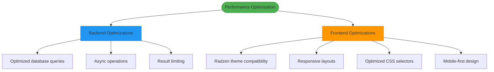
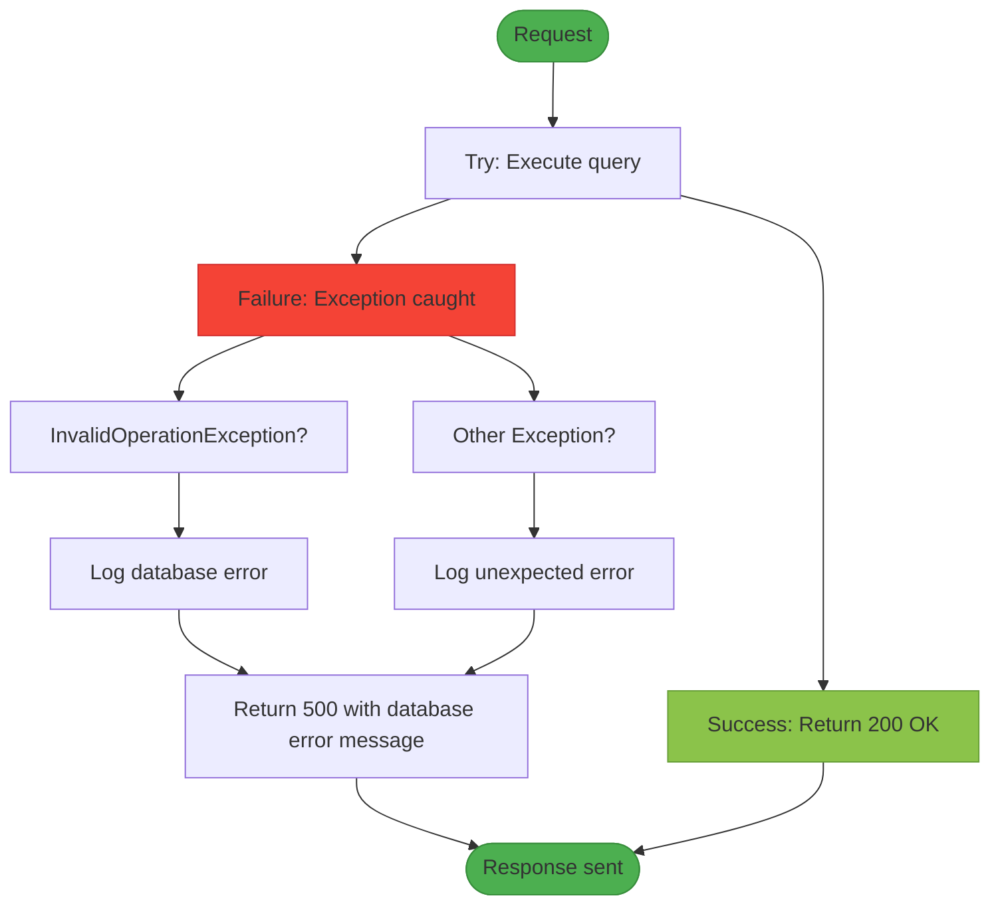
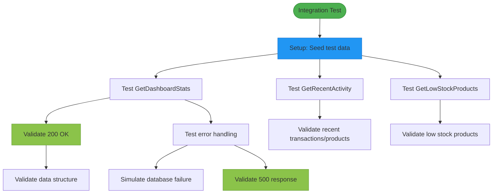
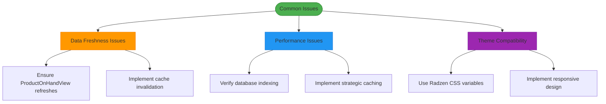

# Dashboard Analytics

<cite>
**Referenced Files in This Document**   
- [DashboardController.cs](file://src/Inventory.API/Controllers/DashboardController.cs)
- [DashboardDto.cs](file://src/Inventory.Shared/DTOs/DashboardDto.cs)
- [AppDbContext.cs](file://src/Inventory.API/Models/AppDbContext.cs)
- [Product.cs](file://src/Inventory.API/Models/Product.cs)
- [InventoryTransaction.cs](file://src/Inventory.API/Models/InventoryTransaction.cs)
- [ProductViews.cs](file://src/Inventory.API/Models/ProductViews.cs)
- [DashboardControllerIntegrationTests.cs](file://test/Inventory.IntegrationTests/Controllers/DashboardControllerIntegrationTests.cs)
- [LowStockAlert.razor.css](file://src/Inventory.UI/Components/Dashboard/LowStockAlert.razor.css) - *Updated in recent commit*
- [RecentActivity.razor.css](file://src/Inventory.UI/Components/Dashboard/RecentActivity.razor.css) - *Updated in recent commit*
- [Home.razor.css](file://src/Inventory.UI/Pages/Home.razor.css) - *Updated in recent commit*
</cite>

## Update Summary
**Changes Made**   
- Updated styling documentation to reflect Radzen theme compatibility changes
- Added details about responsive design improvements in dashboard components
- Enhanced source tracking with new CSS files affected by recent theme integration
- Maintained all existing functional documentation about dashboard data aggregation and statistical calculations
- Updated file references to include new styling files with appropriate annotations

## Table of Contents
1. [Introduction](#introduction)
2. [Dashboard Data Model](#dashboard-data-model)
3. [Dashboard Controller Implementation](#dashboard-controller-implementation)
4. [Statistical Calculations](#statistical-calculations)
5. [Recent Activity Tracking](#recent-activity-tracking)
6. [Low Stock Monitoring](#low-stock-monitoring)
7. [Performance Optimization](#performance-optimization)
8. [Error Handling](#error-handling)
9. [Integration Testing](#integration-testing)
10. [Common Issues and Solutions](#common-issues-and-solutions)

## Introduction
The Dashboard Analytics feature provides a comprehensive overview of inventory system metrics, offering real-time insights into product inventory, warehouse operations, and recent system activity. This document details the implementation of the dashboard data aggregation system, focusing on the DashboardController and its supporting components. The system delivers key performance indicators through optimized database queries and provides actionable insights for inventory management decisions. Recent updates have enhanced the UI components with Radzen theme compatibility while maintaining the robust backend functionality.

## Dashboard Data Model

The dashboard data model is defined by the DashboardStatsDto class, which encapsulates key inventory metrics for display in the user interface. The model includes both aggregate statistics and detailed lists for recent activity monitoring.

**Diagram sources**
- [DashboardDto.cs](file://src/Inventory.Shared/DTOs/DashboardDto.cs#L3-L56)

**Section sources**
- [DashboardDto.cs](file://src/Inventory.Shared/DTOs/DashboardDto.cs#L3-L56)

## Dashboard Controller Implementation

The DashboardController serves as the API endpoint for retrieving dashboard statistics and recent activity data. It implements three primary endpoints that aggregate data from multiple database tables and views to provide a comprehensive system overview.

**Diagram sources**
- [DashboardController.cs](file://src/Inventory.API/Controllers/DashboardController.cs#L12-L227)

**Section sources**
- [DashboardController.cs](file://src/Inventory.API/Controllers/DashboardController.cs#L12-L227)

## Statistical Calculations

The dashboard performs several statistical calculations to provide meaningful inventory metrics. These calculations are implemented as asynchronous database queries to ensure non-blocking operations and optimal performance.

### Key Metrics Calculation
The GetDashboardStats method calculates the following metrics:
- **TotalProducts**: Count of active products in the system
- **TotalCategories**: Count of active product categories
- **TotalManufacturers**: Total count of manufacturers
- **TotalWarehouses**: Count of active warehouses
- **LowStockProducts**: Products where current quantity is at or below minimum stock level
- **OutOfStockProducts**: Products with zero inventory
- **RecentTransactions**: Transactions from the past 7 days
- **RecentProducts**: Products created in the past 30 days

The implementation uses direct queries against the ProductOnHandView database view to ensure accurate inventory counts, avoiding potential discrepancies from cached or derived values.

**Diagram sources**
- [DashboardController.cs](file://src/Inventory.API/Controllers/DashboardController.cs#L15-L94)

**Section sources**
- [DashboardController.cs](file://src/Inventory.API/Controllers/DashboardController.cs#L15-L94)
- [AppDbContext.cs](file://src/Inventory.API/Models/AppDbContext.cs#L200-L200)
- [ProductViews.cs](file://src/Inventory.API/Models/ProductViews.cs#L10-L14)

## Recent Activity Tracking

The dashboard provides real-time visibility into recent system activity through two integrated data streams: recent transactions and recently created products. This feature enables users to monitor system usage and track inventory movements.

### Recent Transactions
The GetRecentActivity endpoint retrieves the 10 most recent inventory transactions, including:
- Transaction type (Income, Outcome, Install, Pending)
- Product details (name, SKU)
- Quantity involved
- Timestamp of transaction
- User who performed the action
- Warehouse location
- Optional description

### Recent Products
The endpoint also retrieves the 5 most recently created products, showing:
- Product name and SKU
- Category and manufacturer
- Creation timestamp

The implementation uses Entity Framework's Include method to eagerly load related entities (Product, Warehouse, User, Category, Manufacturer) in a single query, reducing database round trips and improving performance.

**Diagram sources**
- [DashboardController.cs](file://src/Inventory.API/Controllers/DashboardController.cs#L96-L174)
- [DashboardDto.cs](file://src/Inventory.Shared/DTOs/DashboardDto.cs#L20-L35)

**Section sources**
- [DashboardController.cs](file://src/Inventory.API/Controllers/DashboardController.cs#L96-L174)
- [DashboardDto.cs](file://src/Inventory.Shared/DTOs/DashboardDto.cs#L20-L35)
- [InventoryTransaction.cs](file://src/Inventory.API/Models/InventoryTransaction.cs#L12-L38)
- [Product.cs](file://src/Inventory.API/Models/Product.cs#L4-L35)

## Low Stock Monitoring

The low stock monitoring feature identifies products that require replenishment by comparing current inventory levels against predefined minimum thresholds. This proactive alerting system helps prevent stockouts and ensures inventory availability.

### Implementation Details
The GetLowStockProducts endpoint performs the following operations:
1. Joins the ProductOnHandView with the Products table
2. Filters for active products where current quantity is less than or equal to minimum stock
3. Orders results by current quantity (ascending)
4. Maps results to LowStockProductDto objects
5. Returns the complete list of low stock products

The query leverages the ProductOnHandView database view, which maintains real-time inventory counts by aggregating transaction data. This approach ensures data accuracy without requiring manual quantity updates.

**Diagram sources**
- [DashboardController.cs](file://src/Inventory.API/Controllers/DashboardController.cs#L176-L227)
- [DashboardDto.cs](file://src/Inventory.Shared/DTOs/DashboardDto.cs#L37-L55)
- [ProductViews.cs](file://src/Inventory.API/Models/ProductViews.cs#L10-L14)

**Section sources**
- [DashboardController.cs](file://src/Inventory.API/Controllers/DashboardController.cs#L176-L227)
- [DashboardDto.cs](file://src/Inventory.Shared/DTOs/DashboardDto.cs#L37-L55)
- [ProductViews.cs](file://src/Inventory.API/Models/ProductViews.cs#L10-L14)

## Performance Optimization

The dashboard implementation includes several performance optimizations to ensure responsive user experience even with large datasets:

### Database Query Optimization
- Uses direct queries against the ProductOnHandView instead of calculating inventory from transactions
- Implements proper indexing on frequently queried fields (Date, IsActive, CreatedAt)
- Utilizes CountAsync for aggregate queries to avoid loading unnecessary data
- Applies Take() limits on list queries to prevent excessive data transfer

### Frontend Styling Performance
Recent updates have optimized the dashboard component styling for Radzen theme compatibility:

**Low Stock Alert Component**
- Uses CSS custom properties (var(--rz-border), var(--rz-base-200)) for theme consistency
- Implements efficient hover effects with minimal re-renders
- Includes responsive design for mobile devices with optimized touch targets

**Recent Activity Component**
- Optimized flexbox layout for consistent rendering across devices
- Theme-aware styling using Radzen CSS variables
- Responsive design that adapts to different screen sizes

**Dashboard Container**
- Consistent padding and spacing using theme variables
- Responsive grid layout that adapts to viewport size
- Efficient CSS selectors to minimize rendering performance impact

**Diagram sources**
- [LowStockAlert.razor.css](file://src/Inventory.UI/Components/Dashboard/LowStockAlert.razor.css)
- [RecentActivity.razor.css](file://src/Inventory.UI/Components/Dashboard/RecentActivity.razor.css)
- [Home.razor.css](file://src/Inventory.UI/Pages/Home.razor.css)

**Section sources**
- [LowStockAlert.razor.css](file://src/Inventory.UI/Components/Dashboard/LowStockAlert.razor.css) - *Updated for Radzen theme*
- [RecentActivity.razor.css](file://src/Inventory.UI/Components/Dashboard/RecentActivity.razor.css) - *Updated for Radzen theme*
- [Home.razor.css](file://src/Inventory.UI/Pages/Home.razor.css) - *Updated for Radzen theme*

## Error Handling

The dashboard controller implements comprehensive error handling to ensure system reliability and provide meaningful feedback to users:

### Exception Types Handled
- **InvalidOperationException**: Database operation errors (connection issues, query failures)
- **Exception**: Unexpected errors during data retrieval
- **Security exceptions**: Unauthorized access attempts (handled by Authorize attribute)

### Logging Strategy
- Detailed logging of successful operations with key metrics
- Error logging with full exception details for debugging
- Structured logging with relevant context information

### Client Response
- 500 Internal Server Error for database and unexpected errors
- Consistent error response format with Success = false and ErrorMessage
- No sensitive information exposed in error messages

**Diagram sources**
- [DashboardController.cs](file://src/Inventory.API/Controllers/DashboardController.cs#L15-L225)

**Section sources**
- [DashboardController.cs](file://src/Inventory.API/Controllers/DashboardController.cs#L15-L225)

## Integration Testing

The dashboard functionality is validated through comprehensive integration tests that verify end-to-end behavior:

### Test Coverage
- **DashboardControllerIntegrationTests**: Tests all three endpoints with real database context
- Response status code validation (200 OK, 500 Internal Server Error)
- Data structure validation against expected DTOs
- Error handling verification

### Test Scenarios
- Successful retrieval of dashboard statistics
- Proper handling of empty result sets
- Validation of error responses for database failures
- Verification of data consistency across related endpoints

**Diagram sources**
- [DashboardControllerIntegrationTests.cs](file://test/Inventory.IntegrationTests/Controllers/DashboardControllerIntegrationTests.cs)

**Section sources**
- [DashboardControllerIntegrationTests.cs](file://test/Inventory.IntegrationTests/Controllers/DashboardControllerIntegrationTests.cs)

## Common Issues and Solutions

### Data Freshness
**Issue**: Dashboard metrics may appear stale due to caching or asynchronous processing
**Solution**: 
- Ensure ProductOnHandView is properly updated by transaction triggers
- Implement cache invalidation strategies when inventory changes
- Use real-time updates via SignalR for critical metrics

### Performance with Large Datasets
**Issue**: Slow response times with large inventory databases
**Solutions**:
- Verify proper indexing on key fields (Product.Id, InventoryTransaction.Date)
- Consider implementing caching for frequently accessed statistics
- Optimize database view performance
- Use pagination for list endpoints if needed

### Theme Compatibility
**Issue**: UI components not properly displaying with Radzen themes
**Solutions**:
- Use Radzen CSS variables (var(--rz-*)) for consistent theming
- Implement responsive design for different screen sizes
- Test components with multiple theme variants
- Follow Radzen UI guidelines for component styling

**Diagram sources**
- [DashboardController.cs](file://src/Inventory.API/Controllers/DashboardController.cs)
- [ProductViews.cs](file://src/Inventory.API/Models/ProductViews.cs)
- [LowStockAlert.razor.css](file://src/Inventory.UI/Components/Dashboard/LowStockAlert.razor.css)
- [RecentActivity.razor.css](file://src/Inventory.UI/Components/Dashboard/RecentActivity.razor.css)

**Section sources**
- [DashboardController.cs](file://src/Inventory.API/Controllers/DashboardController.cs)
- [ProductViews.cs](file://src/Inventory.API/Models/ProductViews.cs)
- [LowStockAlert.razor.css](file://src/Inventory.UI/Components/Dashboard/LowStockAlert.razor.css) - *Updated for theme compatibility*
- [RecentActivity.razor.css](file://src/Inventory.UI/Components/Dashboard/RecentActivity.razor.css) - *Updated for theme compatibility*