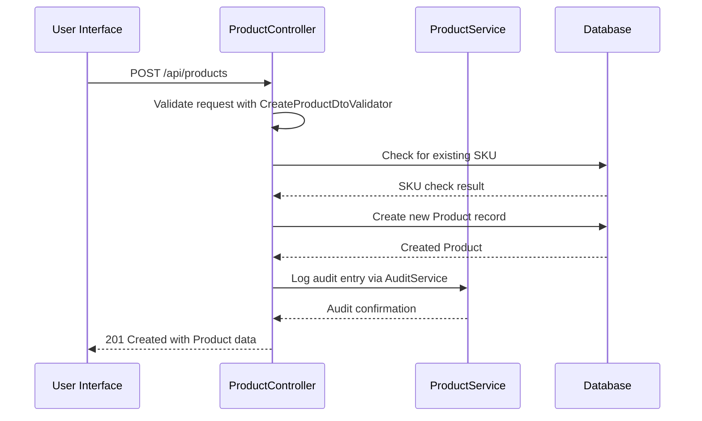
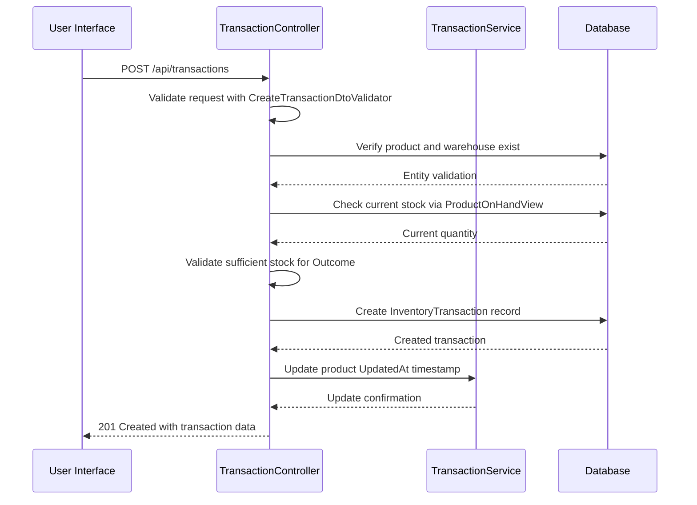
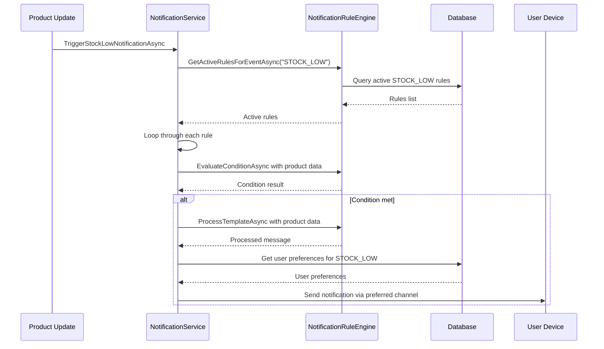
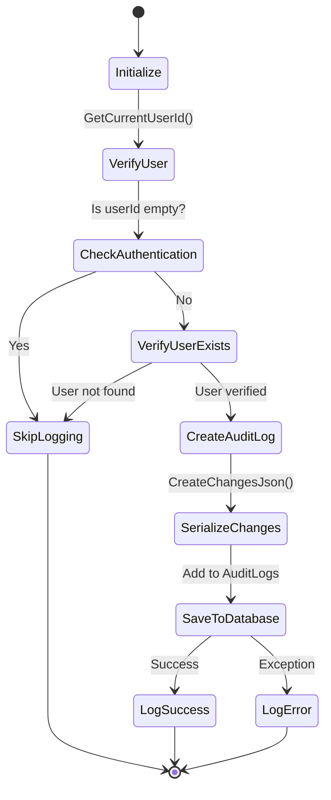
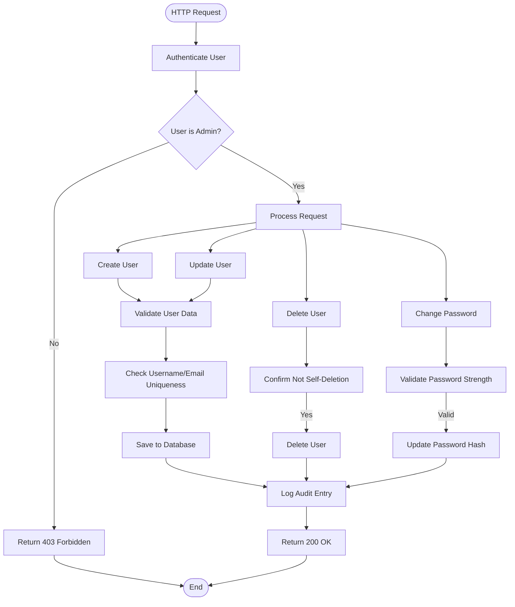
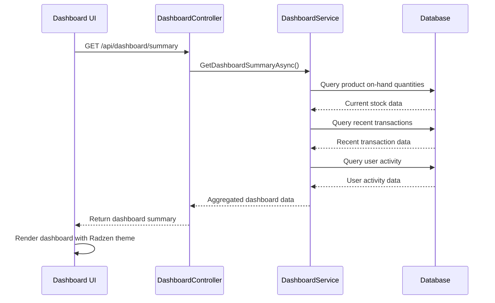

# Feature-Specific Technical Design

<cite>
**Referenced Files in This Document**   
- [ProductController.cs](file://src/Inventory.API/Controllers/ProductController.cs)
- [TransactionController.cs](file://src/Inventory.API/Controllers/TransactionController.cs)
- [NotificationRuleEngine.cs](file://src/Inventory.API/Services/NotificationRuleEngine.cs)
- [AuditService.cs](file://src/Inventory.API/Services/AuditService.cs)
- [UserController.cs](file://src/Inventory.API/Controllers/UserController.cs)
- [DashboardController.cs](file://src/Inventory.API/Controllers/DashboardController.cs)
- [Product.cs](file://src/Inventory.API/Models/Product.cs)
- [InventoryTransaction.cs](file://src/Inventory.API/Models/InventoryTransaction.cs)
- [CreateProductDtoValidator.cs](file://src/Inventory.API/Validators/CreateProductDtoValidator.cs)
- [CreateTransactionDtoValidator.cs](file://src/Inventory.API/Validators/CreateTransactionDtoValidator.cs)
- [ThemeService.cs](file://src/Inventory.Web.Client/Services/ThemeService.cs) - *Updated in recent commit*
- [app.css](file://src/Inventory.Web.Assets/wwwroot/css/app.css) - *Updated in recent commit*
- [LowStockAlert.razor.css](file://src/Inventory.UI/Components/Dashboard/LowStockAlert.razor.css) - *Updated in recent commit*
</cite>

## Update Summary
**Changes Made**   
- Updated documentation to reflect implementation of Radzen theme support and CSS modernization
- Removed references to obsolete compact UI styles
- Added documentation for theme management service and available themes
- Updated UI integration points to reflect new styling approach
- Removed outdated information about compact UI implementation

## Table of Contents
1. [Product Management](#product-management)
2. [Inventory Transactions](#inventory-transactions)
3. [Real-time Notifications](#real-time-notifications)
4. [Audit Logging](#audit-logging)
5. [User Management](#user-management)
6. [Dashboard Analytics](#dashboard-analytics)

## Product Management

The Product Management feature provides comprehensive CRUD operations for product entities with robust validation, access control, and audit capabilities. The domain model centers around the `Product` entity which contains essential attributes such as name, SKU, description, category, manufacturer, unit of measure, and stock thresholds (MinStock and MaxStock). Notably, the direct quantity field has been removed in favor of a computed `CurrentQuantity` property derived from the `ProductOnHandView`, ensuring data consistency across the system.

The service layer implementation is exposed through the `ProductController` which handles HTTP requests for product operations. Key business rules include: only administrators can create inactive products, SKUs must be unique across the system, and non-admin users can only view active products by default. The validation requirements are enforced through the `CreateProductDtoValidator` and `UpdateProductDtoValidator` which ensure data integrity with rules such as name length (2-200 characters), SKU format (uppercase letters, numbers, hyphens, and underscores), and stock threshold validation (MaxStock >= MinStock).

API endpoints follow REST conventions with GET /api/products for retrieval (supporting pagination, filtering by category/manufacturer, and search), POST /api/products for creation, PUT /api/products/{id} for updates, and DELETE /api/products/{id} for soft deletion (setting IsActive to false). The UI integration points include product listing, creation forms, and editing interfaces that consume these endpoints through the shared service layer.

Edge cases are carefully handled, such as preventing SKU duplication during creation and restricting IsActive modifications to administrators only. The soft delete approach preserves historical data while removing products from active views. Performance considerations include efficient database queries with proper indexing on frequently searched fields (name, SKU) and the use of Include statements to eagerly load related entities (category, manufacturer, unit ofMeasure) in a single database round-trip.

**Section sources**
- [ProductController.cs](file://src/Inventory.API/Controllers/ProductController.cs#L13-L719)
- [Product.cs](file://src/Inventory.API/Models/Product.cs#L4-L35)
- [CreateProductDtoValidator.cs](file://src/Inventory.API/Validators/CreateProductDtoValidator.cs#L1-L63)

## Inventory Transactions

The Inventory Transactions feature manages all movements of products within the warehouse system through various transaction types: Income, Outcome, Install, and Pending. The domain model is built around the `InventoryTransaction` entity which captures essential details including product reference, warehouse, transaction type, quantity, date, user, location, and optional description. The `TransactionType` enum ensures type safety and proper categorization of transaction activities.

The service layer implementation in `TransactionController` enforces critical business rules, most notably stock validation for Outcome transactions. Before creating an outcome transaction, the system queries the `ProductOnHandView` to verify sufficient stock availability, preventing negative inventory balances. This validation occurs at the API level, providing immediate feedback to users. Additional business rules include mandatory product and warehouse references, date validation (cannot be in the future), and proper user association.

API endpoints include GET /api/transactions for retrieval (with filtering by product, warehouse, date range, and transaction type), POST /api/transactions for creation, and GET /api/transactions/product/{productId} for retrieving transaction history by product. The UI integration points include transaction entry forms, transaction history views, and inventory adjustment interfaces that leverage these endpoints.

Edge cases such as insufficient stock for outcome transactions are handled gracefully with descriptive error messages indicating current and requested quantities. Performance considerations include indexing on frequently queried fields (ProductId, WarehouseId, Date) and efficient pagination implementation to handle large transaction volumes. The system also handles the computed nature of product quantities by relying on the `ProductOnHandView` rather than maintaining a denormalized quantity field on the Product entity.

**Section sources**
- [TransactionController.cs](file://src/Inventory.API/Controllers/TransactionController.cs#L9-L372)
- [InventoryTransaction.cs](file://src/Inventory.API/Models/InventoryTransaction.cs#L12-L38)
- [CreateTransactionDtoValidator.cs](file://src/Inventory.API/Validators/CreateTransactionDtoValidator.cs#L1-L41)

## Real-time Notifications

The Real-time Notifications feature provides an event-driven notification system that alerts users to important inventory events through multiple channels. The architecture centers around the `NotificationRuleEngine` which evaluates conditions and processes templates for various event types including STOCK_LOW, STOCK_OUT, and transaction events. The engine supports complex condition evaluation with operators like ==, !=, >, >=, <, <=, contains, startsWith, and endsWith, allowing for sophisticated notification rules.

The service layer implementation includes the `NotificationRuleEngine` class which provides methods for retrieving active rules, evaluating conditions, processing templates with data binding, and determining user preferences. The `NotificationService` acts as the facade, exposing methods like `TriggerStockLowNotificationAsync` and `TriggerStockOutNotificationAsync` that are called from various parts of the system. Notification templates use placeholder syntax ({{PropertyPath}}) for dynamic content insertion from the event data.

API endpoints for notification management include GET /api/notifications/rules for retrieving rules, POST /api/notifications/rules for creating rules, PUT /api/notifications/rules/{id} for updating rules, and DELETE /api/notifications/rules/{id} for removing rules. The UI integration points include notification rule management interfaces, user notification preferences, and real-time notification displays using SignalR.

Edge cases include handling missing properties in template data (replaced with [N/A]) and failed condition evaluations (resulting in false). Performance considerations include caching frequently accessed rules and efficient database queries with proper indexing on rule activation status and event types. The system also handles error scenarios gracefully, logging failures without interrupting the primary business flow.

**Section sources**
- [NotificationRuleEngine.cs](file://src/Inventory.API/Services/NotificationRuleEngine.cs#L10-L271)
- [ProductController.cs](file://src/Inventory.API/Controllers/ProductController.cs#L13-L719)

## Audit Logging

The Audit Logging feature provides comprehensive tracking of all significant system activities for security, compliance, and troubleshooting purposes. The domain model is centered around the `AuditLog` entity which captures detailed information about each audited event including entity name, entity ID, action performed, action type, user information, timestamp, IP address, user agent, and before/after state changes. The `AuditService` implements multiple methods for different logging scenarios, including `LogEntityChangeAsync` for CRUD operations and `LogHttpRequestAsync` for API request monitoring.

The service layer implementation in `AuditService` ensures that all audit entries are properly contextualized with the current HTTP request information, including user identity, IP address (handling X-Forwarded-For headers), and request metadata. The service also handles backward compatibility by supporting both enum-based and string-based action types, automatically mapping string actions to the appropriate `ActionType` enum value. Sensitive data is protected through the use of `SafeSerializationService` which sanitizes potentially problematic objects before serialization.

API endpoints for audit access include GET /api/audit for retrieving logs with filtering capabilities, GET /api/audit/entity/{entityType}/{entityId} for entity-specific logs, and GET /api/audit/user/{userId} for user-specific logs. The UI integration points include audit log viewers, entity history tabs, and compliance reporting interfaces that consume these endpoints.

Edge cases include handling missing user authentication (skipping audit logging), database connectivity issues (graceful degradation with error logging), and user ID resolution (verifying user existence and handling username-based lookups). Performance considerations include efficient indexing on frequently queried fields (EntityName, Action, UserId, Timestamp) and pagination support for large log volumes. The system also includes a cleanup mechanism (`CleanupOldLogsAsync`) that automatically removes logs older than a configurable retention period (default 90 days).

**Section sources**
- [AuditService.cs](file://src/Inventory.API/Services/AuditService.cs#L12-L604)
- [ProductController.cs](file://src/Inventory.API/Controllers/ProductController.cs#L13-L719)

## User Management

The User Management feature provides administrative capabilities for managing system users, including creation, modification, deletion, and role assignment. The domain model is based on the `User` entity which extends the Identity framework with additional properties such as role, creation timestamp, and update timestamp. The system uses ASP.NET Core Identity for authentication and authorization, with roles (Admin, Manager, User) controlling access to various features.

The service layer implementation in `UserController` exposes administrative endpoints that are restricted to users with the Admin role. Key business rules include preventing users from deleting their own accounts, ensuring username and email uniqueness, and proper role assignment during user creation. The system also supports password management through the `ChangePassword` endpoint, allowing administrators to reset user passwords.

API endpoints include GET /api/user for retrieving users (with search and role filtering), POST /api/user for creating users, PUT /api/user/{id} for updating users, DELETE /api/user/{id} for removing users, and POST /api/user/{id}/change-password for password resets. The UI integration points include user management dashboards, user creation forms, and user editing interfaces that consume these endpoints.

Edge cases include handling concurrent user modifications, preventing self-deletion, and managing role transitions. Performance considerations include efficient database queries with proper indexing on username and email fields, and the use of pagination for user listing endpoints. The system also provides an export capability (GET /api/user/export) that generates CSV files of user data for reporting and backup purposes.

**Section sources**
- [UserController.cs](file://src/Inventory.API/Controllers/UserController.cs#L15-L432)
- [User.cs](file://src/Inventory.API/Models/User.cs#L8-L42)
- [AuthController.cs](file://src/Inventory.API/Controllers/AuthController.cs#L22-L189)

## Dashboard Analytics

The Dashboard Analytics feature provides real-time insights into inventory status, recent activities, and key performance indicators. The architecture has been updated to implement Radzen theme support with modern CSS styling, replacing the obsolete compact UI styles. The domain model includes various DTOs for dashboard data such as stock levels, transaction volumes, and user activity metrics.

The service layer implementation in `DashboardController` retrieves aggregated data from multiple sources including product on-hand quantities, recent transactions, and user activity logs. The controller methods are optimized for performance with efficient database queries and appropriate indexing on frequently accessed fields. Business rules include role-based access control where only authorized users can view certain dashboard components.

API endpoints include GET /api/dashboard/summary for overall system status, GET /api/dashboard/low-stock for products below minimum threshold, GET /api/dashboard/recent-activity for recent transactions and user actions, and GET /api/dashboard/stats for key performance metrics. The UI integration points include the main dashboard view, low stock alerts, recent activity panels, and statistical widgets that consume these endpoints.

The styling has been modernized with the implementation of Radzen themes, providing a consistent and professional appearance across the application. The `ThemeService` manages theme selection and persistence, supporting multiple themes including Material Design, Standard, Humanistic, and Software themes in both light and dark variants. The service detects system preferences for dark mode and automatically applies the appropriate theme variant.

**Section sources**
- [DashboardController.cs](file://src/Inventory.API/Controllers/DashboardController.cs#L12-L288)
- [ThemeService.cs](file://src/Inventory.Web.Client/Services/ThemeService.cs#L11-L191)
- [app.css](file://src/Inventory.Web.Assets/wwwroot/css/app.css)
- [LowStockAlert.razor.css](file://src/Inventory.UI/Components/Dashboard/LowStockAlert.razor.css)