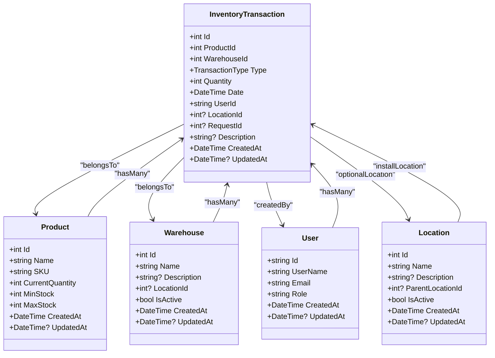
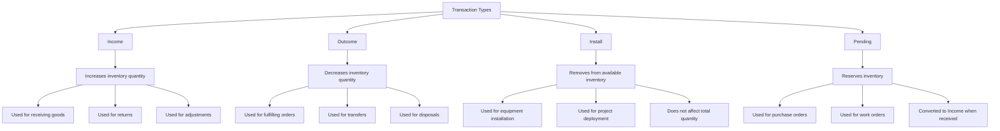
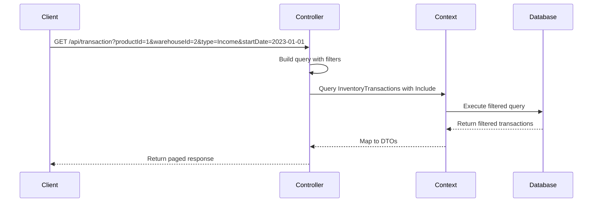

# Inventory Transactions

<cite>
**Referenced Files in This Document**   
- [TransactionController.cs](file://src/Inventory.API/Controllers/TransactionController.cs)
- [InventoryTransaction.cs](file://src/Inventory.API/Models/InventoryTransaction.cs)
- [CreateTransactionDtoValidator.cs](file://src/Inventory.API/Validators/CreateTransactionDtoValidator.cs)
- [AppDbContext.cs](file://src/Inventory.API/Models/AppDbContext.cs)
- [AuditService.cs](file://src/Inventory.API/Services/AuditService.cs)
- [TransactionDto.cs](file://src/Inventory.Shared/DTOs/TransactionDto.cs)
- [ProductViews.cs](file://src/Inventory.API/Models/ProductViews.cs)
</cite>

## Table of Contents
1. [Introduction](#introduction)
2. [Domain Model Relationships](#domain-model-relationships)
3. [Transaction Types and Business Significance](#transaction-types-and-business-significance)
4. [Transaction Filtering Implementation](#transaction-filtering-implementation)
5. [Transaction Creation Flow](#transaction-creation-flow)
6. [Quantity Validation and Negative Quantity Handling](#quantity-validation-and-negative-quantity-handling)
7. [Audit Logging Integration](#audit-logging-integration)
8. [Common Issues and Solutions](#common-issues-and-solutions)
9. [Conclusion](#conclusion)

## Introduction

The Inventory Transactions feature provides a comprehensive system for tracking all movements of products within the inventory management system. This document details the implementation of transaction handling in the TransactionController, including filtering capabilities, domain model relationships, transaction types, creation flow, validation rules, and audit logging integration. The system is designed to maintain accurate inventory levels while providing a complete audit trail of all changes.

**Section sources**
- [TransactionController.cs](file://src/Inventory.API/Controllers/TransactionController.cs#L9-L369)
- [InventoryTransaction.cs](file://src/Inventory.API/Models/InventoryTransaction.cs#L12-L38)

## Domain Model Relationships

The inventory transaction system is built around a core set of domain models that represent the key entities in the inventory management process. These models are interconnected through well-defined relationships that ensure data consistency and provide rich contextual information.



**Diagram sources**
- [InventoryTransaction.cs](file://src/Inventory.API/Models/InventoryTransaction.cs#L12-L38)
- [Product.cs](file://src/Inventory.API/Models/Product.cs#L4-L35)
- [Warehouse.cs](file://src/Inventory.API/Models/Warehouse.cs#L2-L14)
- [User.cs](file://src/Inventory.API/Models/User.cs#L2-L11)
- [Location.cs](file://src/Inventory.API/Models/Location.cs#L2-L14)

The core relationship is between `InventoryTransaction` and `Product`, where each transaction represents a change in the quantity of a specific product. The `Product` entity no longer maintains a direct quantity field; instead, the current quantity is computed from the sum of all related transactions through the `ProductOnHandView`. This approach ensures data consistency and prevents discrepancies between the product's quantity and the transaction history.

Each transaction is associated with a `Warehouse` where the inventory movement occurs, a `User` who created the transaction, and optionally a `Location` within the warehouse. The `Location` can represent specific storage areas, bins, or zones within a warehouse, providing granular tracking of inventory movements.

**Section sources**
- [InventoryTransaction.cs](file://src/Inventory.API/Models/InventoryTransaction.cs#L12-L38)
- [Product.cs](file://src/Inventory.API/Models/Product.cs#L4-L35)
- [Warehouse.cs](file://src/Inventory.API/Models/Warehouse.cs#L2-L14)
- [User.cs](file://src/Inventory.API/Models/User.cs#L2-L11)
- [Location.cs](file://src/Inventory.API/Models/Location.cs#L2-L14)

## Transaction Types and Business Significance

The system supports four distinct transaction types, each serving a specific business purpose in the inventory management workflow:



**Diagram sources**
- [InventoryTransaction.cs](file://src/Inventory.API/Models/InventoryTransaction.cs#L4-L10)
- [TransactionController.cs](file://src/Inventory.API/Controllers/TransactionController.cs#L283-L314)

### Income Transactions
Income transactions represent an increase in inventory quantity. These are used when receiving goods from suppliers, returning items to inventory, or making positive adjustments to inventory levels. When an Income transaction is created, the product's current quantity is increased by the transaction amount.

### Outcome Transactions
Outcome transactions represent a decrease in inventory quantity. These are used when fulfilling customer orders, transferring items between warehouses, or disposing of damaged goods. The system validates that sufficient stock is available before allowing an Outcome transaction to prevent negative inventory levels.

### Install Transactions
Install transactions represent items that have been deployed or installed in the field and are no longer part of the available inventory. Unlike Outcome transactions, Install transactions do not reduce the total quantity of the product but instead move it to a different state (installed). This allows organizations to track both available inventory and installed base separately.

### Pending Transactions
Pending transactions represent inventory that has been ordered but not yet received. These transactions reserve the quantity in the system and are typically created when a purchase order is issued. When the goods are received, the Pending transaction is converted to an Income transaction through the request fulfillment process.

**Section sources**
- [InventoryTransaction.cs](file://src/Inventory.API/Models/InventoryTransaction.cs#L4-L10)
- [TransactionController.cs](file://src/Inventory.API/Controllers/TransactionController.cs#L283-L314)
- [CreateTransactionDtoValidator.cs](file://src/Inventory.API/Validators/CreateTransactionDtoValidator.cs#L18-L25)

## Transaction Filtering Implementation

The TransactionController provides comprehensive filtering capabilities that allow users to retrieve transactions based on multiple criteria. The implementation uses Entity Framework's query composition to build efficient database queries that filter transactions by product, warehouse, type, and date range.



**Diagram sources**
- [TransactionController.cs](file://src/Inventory.API/Controllers/TransactionController.cs#L14-L112)
- [AppDbContext.cs](file://src/Inventory.API/Models/AppDbContext.cs#L186)

The filtering implementation follows these key steps:

1. **Query Initialization**: The method starts by creating a queryable collection of inventory transactions with related entities (Product, Warehouse, User, Location) included to avoid N+1 query problems.

2. **Filter Application**: Each filter parameter is evaluated, and corresponding WHERE clauses are added to the query only if the parameter has a value. This ensures that the database query is optimized and only includes necessary filters.

3. **Type Conversion**: For the transaction type filter, the string parameter is parsed to the `TransactionType` enum before being used in the query, ensuring type safety and preventing injection attacks.

4. **Date Range Handling**: Start and end date filters are applied using greater-than-or-equal and less-than-or-equal comparisons to include transactions on the boundary dates.

5. **Pagination**: After filtering, the query applies pagination using Skip and Take operations to return only the requested page of results.

6. **Response Formatting**: The filtered transactions are projected into DTOs containing both transaction data and related entity information (product name, warehouse name, etc.) for efficient client-side display.

The implementation also includes proper error handling with detailed logging to assist with troubleshooting and monitoring.

**Section sources**
- [TransactionController.cs](file://src/Inventory.API/Controllers/TransactionController.cs#L14-L112)
- [TransactionDto.cs](file://src/Inventory.Shared/DTOs/TransactionDto.cs#L1-L57)

## Transaction Creation Flow

The transaction creation process follows a well-defined flow that ensures data integrity and business rule enforcement. The process begins with a POST request to the CreateTransaction endpoint and proceeds through several validation and processing steps.

```mermaid
flowchart TD
    A[Create Transaction Request] --> B[Model Validation]
    B --> C{Valid?}
    C -->|No| D[Return 40