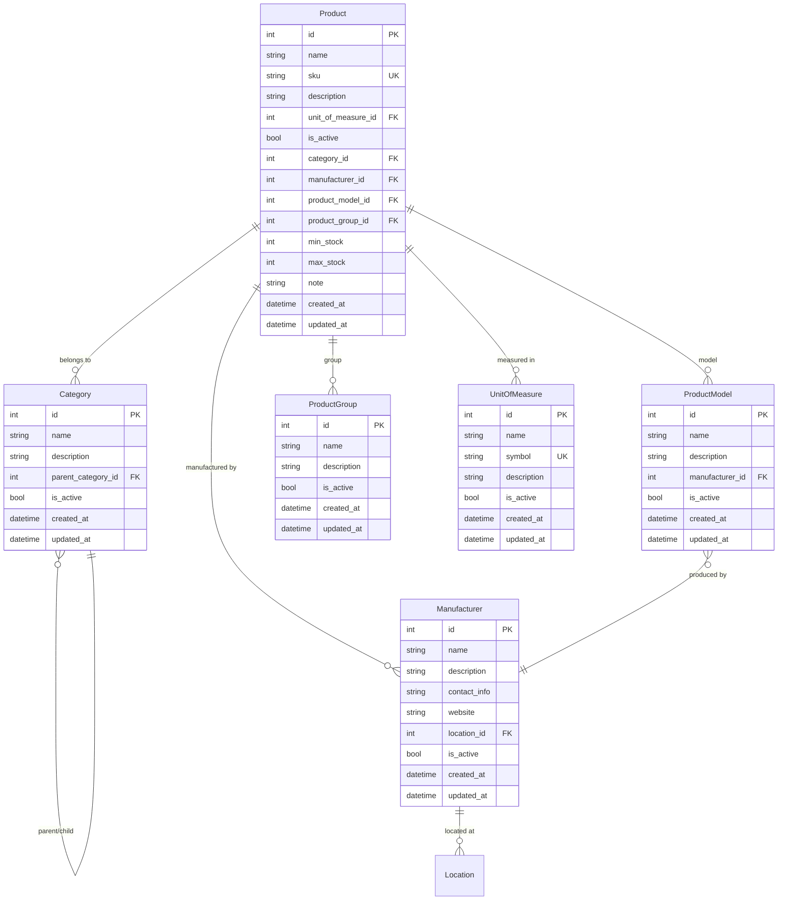
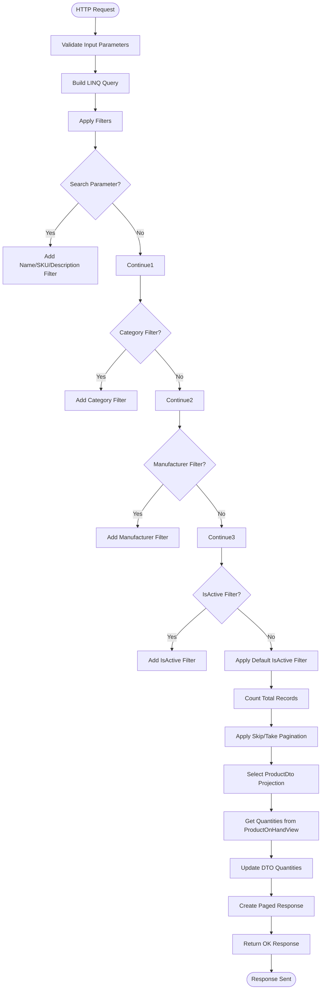
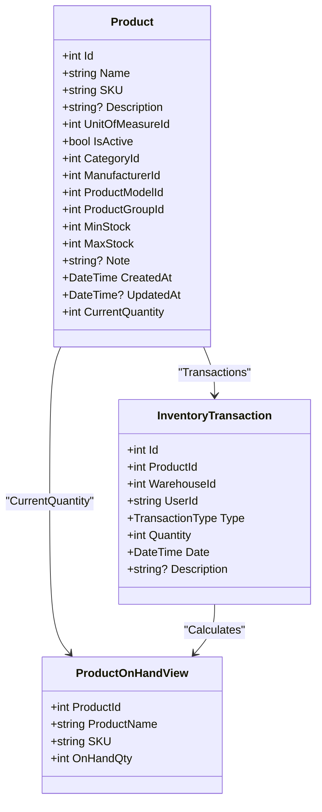
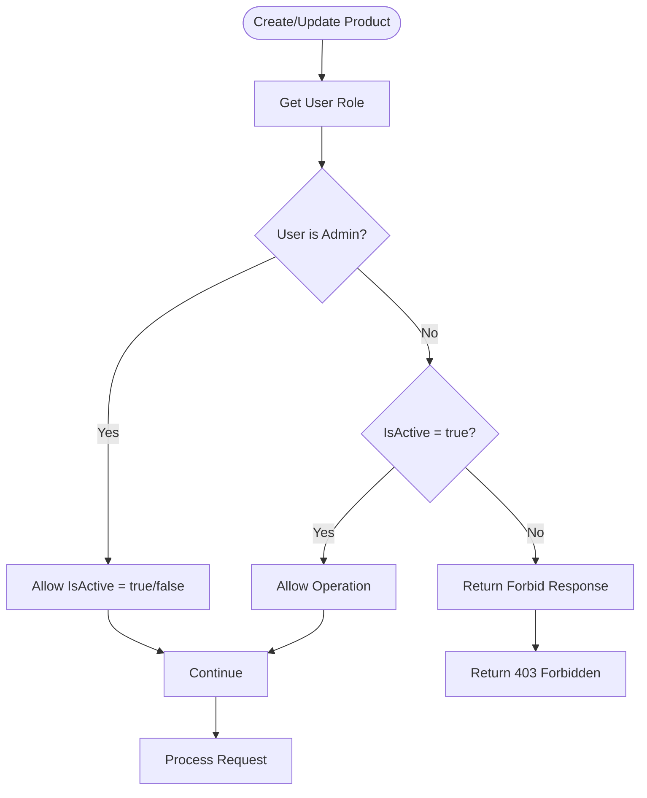
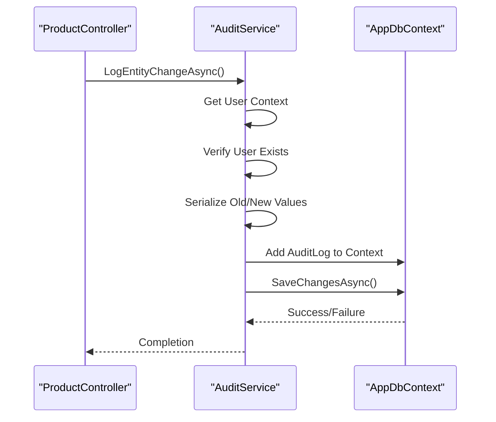

# Product Management

<cite>
**Referenced Files in This Document**   
- [ProductController.cs](file://src/Inventory.API/Controllers/ProductController.cs)
- [Product.cs](file://src/Inventory.API/Models/Product.cs)
- [ProductViews.cs](file://src/Inventory.API/Models/ProductViews.cs)
- [AuditService.cs](file://src/Inventory.API/Services/AuditService.cs)
- [CreateProductDtoValidator.cs](file://src/Inventory.API/Validators/CreateProductDtoValidator.cs)
- [UpdateProductDtoValidator.cs](file://src/Inventory.API/Validators/UpdateProductDtoValidator.cs)
- [AppDbContext.cs](file://src/Inventory.API/Models/AppDbContext.cs)
- [ProductDto.cs](file://src/Inventory.Shared/DTOs/ProductDto.cs)
</cite>

## Table of Contents
1. [Introduction](#introduction)
2. [Domain Model Relationships](#domain-model-relationships)
3. [CRUD Operations Implementation](#crud-operations-implementation)
4. [Pagination and Filtering](#pagination-and-filtering)
5. [Soft Delete Mechanism](#soft-delete-mechanism)
6. [Computed CurrentQuantity and ProductOnHandView](#computed-currentquantity-and-productonhandview)
7. [SKU Uniqueness Validation](#sku-uniqueness-validation)
8. [Role-Based IsActive Field Control](#role-based-isactive-field-control)
9. [Audit Logging with AuditService](#audit-logging-with-auditservice)
10. [Concurrent Updates and Data Consistency](#concurrent-updates-and-data-consistency)
11. [Product Search Performance](#product-search-performance)
12. [Conclusion](#conclusion)

## Introduction
The Product Management feature provides comprehensive functionality for managing inventory products within the system. This document details the implementation of CRUD operations in the ProductController, including pagination, filtering, and soft delete mechanisms. It explains the domain model relationships between Product, Category, Manufacturer, and UnitOfMeasure entities, and describes the use of the computed CurrentQuantity property integrated with the ProductOnHandView for real-time stock level tracking. The implementation includes robust validation, role-based access control, audit logging, and performance optimizations to ensure data integrity and system reliability.

## Domain Model Relationships
The product management system implements a normalized relational model with well-defined relationships between core entities. The Product entity serves as the central domain object, establishing relationships with Category, Manufacturer, ProductModel, ProductGroup, and UnitOfMeasure through foreign key associations.



**Diagram sources**
- [Product.cs](file://src/Inventory.API/Models/Product.cs#L4-L35)
- [Category.cs](file://src/Inventory.API/Models/Category.cs#L2-L14)
- [Manufacturer.cs](file://src/Inventory.API/Models/Manufacturer.cs#L2-L19)
- [ProductModel.cs](file://src/Inventory.API/Models/ProductModel.cs#L0-L12)
- [ProductGroup.cs](file://src/Inventory.API/Models/ProductGroup.cs#L0-L12)
- [UnitOfMeasure.cs](file://src/Inventory.API/Models/UnitOfMeasure.cs#L5-L27)

**Section sources**
- [Product.cs](file://src/Inventory.API/Models/Product.cs#L4-L35)
- [AppDbContext.cs](file://src/Inventory.API/Models/AppDbContext.cs#L1524-L1558)

## CRUD Operations Implementation
The ProductController implements standard CRUD operations through RESTful endpoints that follow HTTP conventions. Each operation includes comprehensive error handling, validation, and business logic enforcement to maintain data integrity.

### Create Operation
The `CreateProduct` method handles product creation through a POST request to `/api/products`. It validates input data, checks for SKU uniqueness, enforces role-based IsActive field control, and creates audit logs. The method uses the CreateProductDto for input validation and returns the created product with all related entity information.

### Read Operations
The controller provides multiple read endpoints:
- `GetProducts`: Retrieves a paginated list of products with filtering capabilities
- `GetProduct`: Retrieves a specific product by ID
- `GetProductBySku`: Retrieves a product by its SKU code

### Update Operation
The `UpdateProduct` method handles product updates through a PUT request to `/api/products/{id}`. It validates input, checks user permissions for IsActive field modification, stores old values for audit purposes, and updates the product record with new values.

### Delete Operation
The `DeleteProduct` method implements soft deletion through an HTTP DELETE request. Instead of removing the record from the database, it sets the IsActive field to false, preserving historical data while removing the product from active listings.

**Section sources**
- [ProductController.cs](file://src/Inventory.API/Controllers/ProductController.cs#L13-L719)

## Pagination and Filtering
The product listing endpoint implements robust pagination and filtering capabilities to handle large datasets efficiently. The `GetProducts` method accepts query parameters for pagination (page, pageSize) and filtering (search, categoryId, manufacturerId, isActive).



**Diagram sources**
- [ProductController.cs](file://src/Inventory.API/Controllers/ProductController.cs#L36-L76)

**Section sources**
- [ProductController.cs](file://src/Inventory.API/Controllers/ProductController.cs#L13-L719)

## Soft Delete Mechanism
The system implements a soft delete mechanism for product records, which preserves data integrity while allowing products to be removed from active use. When a product is deleted, the `DeleteProduct` method sets the IsActive field to false instead of removing the record from the database.

This approach provides several benefits:
- Preserves historical transaction data and audit trails
- Maintains referential integrity with related entities
- Allows for potential restoration of accidentally deleted products
- Supports reporting on historical product data

The soft delete operation is restricted to users with the "Admin" role through the `[Authorize(Roles = "Admin")]` attribute, ensuring that only authorized personnel can perform this action.

**Section sources**
- [ProductController.cs](file://src/Inventory.API/Controllers/ProductController.cs#L588-L659)

## Computed CurrentQuantity and ProductOnHandView
The system replaces the direct Quantity field in the Product entity with a computed CurrentQuantity property to ensure data consistency. This property is populated from the ProductOnHandView, a database view that calculates real-time stock levels based on inventory transactions.



**Diagram sources**
- [Product.cs](file://src/Inventory.API/Models/Product.cs#L4-L35)
- [ProductViews.cs](file://src/Inventory.API/Models/ProductViews.cs#L12-L18)
- [ProductController.cs](file://src/Inventory.API/Controllers/ProductController.cs#L135-L173)

**Section sources**
- [Product.cs](file://src/Inventory.API/Models/Product.cs#L4-L35)
- [ProductViews.cs](file://src/Inventory.API/Models/ProductViews.cs#L12-L18)
- [ProductController.cs](file://src/Inventory.API/Controllers/ProductController.cs#L13-L719)

## SKU Uniqueness Validation
The system enforces SKU uniqueness through both database constraints and application-level validation. The Product entity includes a database-level unique constraint on the SKU field, and the `CreateProduct` method performs an explicit check before creating a new product.

```mermaid
sequenceDiagram
participant Client as "Client App"
participant Controller as "ProductController"
participant Context as "AppDbContext"
Client->>Controller : POST /api/products
Controller->>Controller : Validate ModelState
alt Invalid Model
Controller-->>Client : 400 Bad Request
stop
end
Controller->>Controller : Check User Role
Controller->>Controller : Check SKU Exists
Controller->>Context : FirstOrDefaultAsync(p => p.SKU == request.SKU)
Context-->>Controller : Existing Product or null
alt SKU Exists
Controller-->>Client : 400 Bad Request
stop
end
Controller->>Context : Add Product to Context
Controller->>Context : SaveChangesAsync()
Context-->>Controller : Success
Controller->>Controller : Log Audit Entry
Controller-->>Client : 201 Created
```

**Diagram sources**
- [ProductController.cs](file://src/Inventory.API/Controllers/ProductController.cs#L303-L336)
- [AppDbContext.cs](file://src/Inventory.API/Models/AppDbContext.cs#L340-L380)

**Section sources**
- [ProductController.cs](file://src/Inventory.API/Controllers/ProductController.cs#L13-L719)
- [CreateProductDtoValidator.cs](file://src/Inventory.API/Validators/CreateProductDtoValidator.cs#L8-L62)

## Role-Based IsActive Field Control
The system implements role-based access control for the IsActive field, allowing only administrators to create inactive products or modify the IsActive status of existing products. This ensures that product availability is managed appropriately based on user permissions.



**Diagram sources**
- [ProductController.cs](file://src/Inventory.API/Controllers/ProductController.cs#L267-L305)
- [ProductController.cs](file://src/Inventory.API/Controllers/ProductController.cs#L454-L485)

**Section sources**
- [ProductController.cs](file://src/Inventory.API/Controllers/ProductController.cs#L13-L719)

## Audit Logging with AuditService
All product operations are logged through the AuditService, which records detailed information about entity changes for compliance, debugging, and security purposes. The service captures old and new values, user information, timestamps, and contextual data for each operation.



**Diagram sources**
- [ProductController.cs](file://src/Inventory.API/Controllers/ProductController.cs#L332-L365)
- [AuditService.cs](file://src/Inventory.API/Services/AuditService.cs#L12-L604)

**Section sources**
- [ProductController.cs](file://src/Inventory.API/Controllers/ProductController.cs#L13-L719)
- [AuditService.cs](file://src/Inventory.API/Services/AuditService.cs#L12-L604)

## Concurrent Updates and Data Consistency
The system addresses concurrent update scenarios through database transactions and optimistic concurrency control. While the current implementation relies on database-level consistency, potential race conditions in stock adjustments are mitigated through the use of transaction records rather than direct quantity updates.

For high-concurrency scenarios, the system could be enhanced with:
- Database row versioning for optimistic concurrency
- Distributed locking mechanisms for critical operations
- Queue-based processing for stock adjustments
- Conflict resolution strategies for concurrent edits

The use of the ProductOnHandView ensures that quantity calculations are always consistent with the transaction history, preventing data duplication and synchronization issues that could arise from maintaining a separate Quantity field.

**Section sources**
- [ProductController.cs](file://src/Inventory.API/Controllers/ProductController.cs#L659-L726)
- [Product.cs](file://src/Inventory.API/Models/Product.cs#L4-L35)

## Product Search Performance
The product search functionality is optimized for performance through strategic indexing and query optimization. The system includes database indexes on key search fields to ensure fast query execution even with large datasets.

Critical performance indexes include:
- Products: CategoryId, ManufacturerId, ProductGroupId, ProductModelId, UnitOfMeasureId
- InventoryTransactions: ProductId, Date, UserId
- Products: SKU (unique index)

The search implementation uses efficient LINQ queries with proper filtering and projection to minimize database load. The use of `AsQueryable()` allows for query composition and optimization by the Entity Framework provider, while the `Select` projection ensures only necessary data is retrieved from the database.

For large datasets, the pagination mechanism limits result sets and provides efficient navigation through the data. The system also implements rate limiting through the `[EnableRateLimiting("ApiPolicy")]` attribute to prevent abuse and ensure fair resource usage.

**Section sources**
- [ProductController.cs](file://src/Inventory.API/Controllers/ProductController.cs#L36-L76)
- [AppDbContext.cs](file://src/Inventory.API/Models/AppDbContext.cs#L340-L380)

## Conclusion
The Product Management feature provides a robust, scalable solution for managing inventory products with comprehensive CRUD operations, advanced filtering, and data integrity safeguards. The implementation leverages modern software engineering practices including domain-driven design, separation of concerns, and performance optimization. Key features such as the computed CurrentQuantity property, role-based access control, and comprehensive audit logging ensure that the system is both secure and maintainable. The architecture supports future enhancements while meeting current business requirements for inventory management.