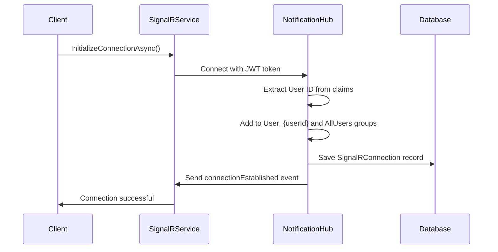
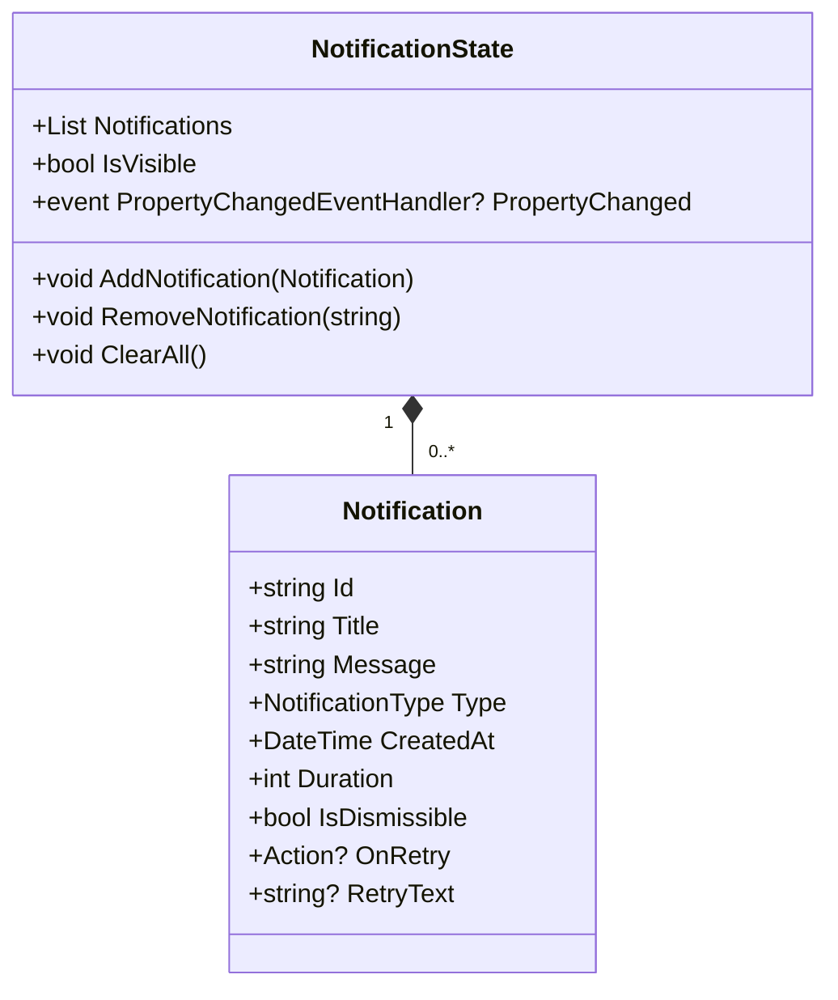
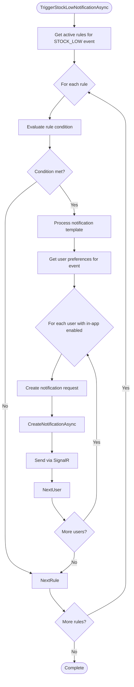
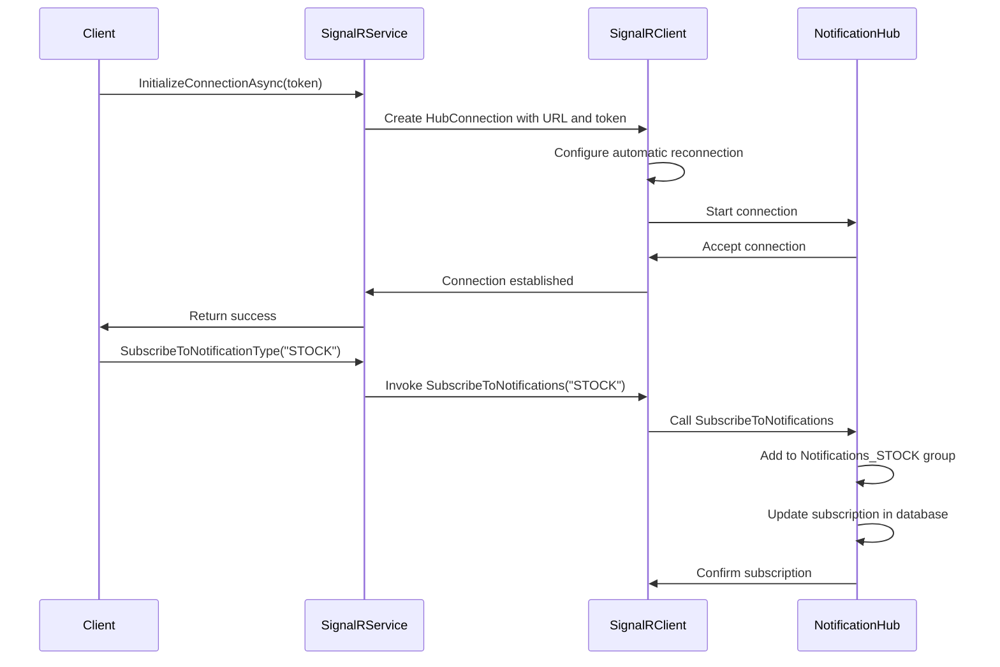

# Real-time Notifications

<cite>
**Referenced Files in This Document**   
- [NotificationHub.cs](file://src/Inventory.API/Hubs/NotificationHub.cs)
- [NotificationState.cs](file://src/Inventory.Shared/Models/NotificationState.cs)
- [NotificationService.cs](file://src/Inventory.API/Services/NotificationService.cs)
- [SignalRConnection.cs](file://src/Inventory.API/Models/SignalRConnection.cs)
- [INotificationService.cs](file://src/Inventory.Shared/Interfaces/INotificationService.cs)
- [ISignalRNotificationService.cs](file://src/Inventory.Shared/Interfaces/ISignalRNotificationService.cs)
- [SignalRService.cs](file://src/Inventory.Web.Client/Services/SignalRService.cs)
- [SignalRNotificationService.cs](file://src/Inventory.API/Services/SignalRNotificationService.cs)
- [NotificationController.cs](file://src/Inventory.API/Controllers/NotificationController.cs)
</cite>

## Table of Contents
1. [Introduction](#introduction)
2. [Architecture Overview](#architecture-overview)
3. [Core Components](#core-components)
4. [Connection Management](#connection-management)
5. [Notification Domain Model](#notification-domain-model)
6. [Service Layer Implementation](#service-layer-implementation)
7. [Client-Side Subscription Patterns](#client-side-subscription-patterns)
8. [Common Issues and Solutions](#common-issues-and-solutions)
9. [Conclusion](#conclusion)

## Introduction

The Real-time Notifications feature in the Inventory Control system provides immediate updates to users about critical events such as low stock levels, system alerts, and transaction activities. Built on Microsoft's SignalR technology, this system enables bidirectional communication between the server and connected clients, ensuring that users receive timely information without the need for constant page refreshes. The implementation follows a comprehensive pattern that addresses connection management, message broadcasting, user preferences, and delivery guarantees.

This documentation provides a detailed explanation of the SignalR-based real-time communication system, focusing on the NotificationHub implementation, the Notification domain model, and the NotificationService that orchestrates notification triggers. The content is designed to be accessible to developers of all experience levels, offering both high-level architectural understanding and specific implementation details.

## Architecture Overview

The real-time notification system follows a client-server architecture with SignalR as the communication backbone. The server-side implementation centers around the NotificationHub, which manages client connections and message distribution, while the client-side SignalRService handles connection lifecycle and event subscription.

```mermaid
graph TB
subgraph "Client-Side"
Client[Web Browser]
SignalRClient["SignalR JavaScript Client"]
SignalRService["SignalRService"]
NotificationState["NotificationState"]
end
subgraph "Server-Side"
NotificationHub["NotificationHub"]
SignalRNotificationService["SignalRNotificationService"]
NotificationService["NotificationService"]
AppDbContext["AppDbContext"]
Database[(Database)]
end
Client --> SignalRClient
SignalRClient --> SignalRService
SignalRService --> NotificationState
SignalRService --> SignalRClient
SignalRClient < --> NotificationHub
NotificationHub --> SignalRNotificationService
SignalRNotificationService --> NotificationHub
NotificationService --> SignalRNotificationService
NotificationService --> AppDbContext
AppDbContext --> Database
```

**Diagram sources**
- [NotificationHub.cs](file://src/Inventory.API/Hubs/NotificationHub.cs)
- [SignalRService.cs](file://src/Inventory.Web.Client/Services/SignalRService.cs)
- [NotificationService.cs](file://src/Inventory.API/Services/NotificationService.cs)
- [SignalRNotificationService.cs](file://src/Inventory.API/Services/SignalRNotificationService.cs)

**Section sources**
- [NotificationHub.cs](file://src/Inventory.API/Hubs/NotificationHub.cs)
- [SignalRService.cs](file://src/Inventory.Web.Client/Services/SignalRService.cs)

## Core Components

The real-time notification system comprises several key components that work together to deliver timely updates to users. The NotificationHub serves as the central communication point, managing client connections and message broadcasting. The SignalRNotificationService acts as a bridge between business logic and the SignalR infrastructure, while the NotificationService contains the business rules for when and how notifications should be triggered.

The system also includes a persistent storage mechanism for connection tracking through the SignalRConnection entity, ensuring that connection state can be maintained across application restarts. Client-side components like the SignalRService and NotificationState provide a clean abstraction for consuming real-time updates within the web application.

**Section sources**
- [NotificationHub.cs](file://src/Inventory.API/Hubs/NotificationHub.cs)
- [SignalRNotificationService.cs](file://src/Inventory.API/Services/SignalRNotificationService.cs)
- [NotificationService.cs](file://src/Inventory.API/Services/NotificationService.cs)
- [SignalRConnection.cs](file://src/Inventory.API/Models/SignalRConnection.cs)

## Connection Management

The connection management system in the NotificationHub handles the complete lifecycle of client connections, from establishment to termination. When a client connects, the OnConnectedAsync method is invoked, which performs several critical operations: it extracts the user ID from authentication claims, adds the connection to user-specific and global groups, saves connection details to the database, and notifies the client of successful connection establishment.



**Diagram sources**
- [NotificationHub.cs](file://src/Inventory.API/Hubs/NotificationHub.cs#L27-L68)
- [SignalRService.cs](file://src/Inventory.Web.Client/Services/SignalRService.cs#L30-L58)

**Section sources**
- [NotificationHub.cs](file://src/Inventory.API/Hubs/NotificationHub.cs#L27-L133)
- [SignalRService.cs](file://src/Inventory.Web.Client/Services/SignalRService.cs#L30-L58)

When a client disconnects, the OnDisconnectedAsync method is called, which removes the connection from the in-memory dictionary, marks the database record as inactive, and logs the disconnection event. The system also includes a cleanup mechanism that periodically removes inactive connections from the database to prevent storage bloat.

The implementation includes robust error handling to ensure that connection issues are properly logged and do not disrupt the overall system stability. Automatic reconnection is supported on the client side through the WithAutomaticReconnect configuration, which attempts to reconnect with increasing delays (2s, 10s, 30s) when the connection is lost.

## Notification Domain Model

The Notification domain model defines the structure and behavior of notification entities within the system. The core Notification class contains essential properties that determine how notifications are displayed and interacted with by users. Each notification has a unique identifier, title, message content, type classification, creation timestamp, display duration, and dismissibility flag.



**Diagram sources**
- [NotificationState.cs](file://src/Inventory.Shared/Models/NotificationState.cs#L62-L73)
- [NotificationState.cs](file://src/Inventory.Shared/Models/NotificationState.cs#L4-L58)

**Section sources**
- [NotificationState.cs](file://src/Inventory.Shared/Models/NotificationState.cs#L4-L73)

The Duration property specifies how long (in milliseconds) a notification should remain visible before automatically disappearing, with a default value of 5000ms (5 seconds). The IsDismissible flag determines whether users can manually close the notification before this duration expires. Additional properties like OnRetry and RetryText support interactive notifications that allow users to retry failed operations directly from the notification interface.

The NotificationState class implements the INotifyPropertyChanged interface to support data binding in the Blazor UI framework, ensuring that the user interface automatically updates when notifications are added, removed, or modified. This class maintains a collection of active notifications and provides methods to manipulate this collection while properly raising property change events.

## Service Layer Implementation

The NotificationService implementation provides the business logic for triggering and managing notifications within the system. This service acts as the primary interface between application events and the real-time notification infrastructure, coordinating with the SignalRNotificationService to deliver messages to connected clients.

The TriggerStockLowNotificationAsync method demonstrates a key use case for the notification system, automatically generating alerts when product inventory falls below predefined thresholds. This method follows a rule-based approach, evaluating active notification rules against the current product state and sending targeted notifications to users who have enabled stock alerts in their preferences.



**Diagram sources**
- [NotificationService.cs](file://src/Inventory.API/Services/NotificationService.cs#L580-L630)

**Section sources**
- [NotificationService.cs](file://src/Inventory.API/Services/NotificationService.cs#L580-L630)
- [ISignalRNotificationService.cs](file://src/Inventory.Shared/Interfaces/ISignalRNotificationService.cs)

The service also implements system notifications through methods like TriggerSystemNotificationAsync, which broadcasts important messages to all connected users. This is particularly useful for administrative announcements, maintenance alerts, or critical system events that require immediate attention from the entire user base.

All notification operations are wrapped in comprehensive error handling and logging to ensure system reliability and provide visibility into notification delivery success or failure. The service integrates with the application's dependency injection system, receiving required dependencies like the database context, logger, rule engine, and SignalR notification service through constructor injection.

## Client-Side Subscription Patterns

The client-side implementation of the notification system follows a clean service-oriented pattern, with the SignalRService providing a simplified interface for managing SignalR connections and subscriptions. Clients initialize the connection by calling InitializeConnectionAsync with a valid JWT access token, which is then used for authentication with the server.



**Diagram sources**
- [SignalRService.cs](file://src/Inventory.Web.Client/Services/SignalRService.cs#L30-L108)
- [NotificationHub.cs](file://src/Inventory.API/Hubs/NotificationHub.cs#L134-L170)

**Section sources**
- [SignalRService.cs](file://src/Inventory.Web.Client/Services/SignalRService.cs#L30-L108)

Clients can subscribe to specific notification types by calling SubscribeToNotificationTypeAsync with the desired notification category (e.g., "STOCK", "TRANSACTION", "SYSTEM"). This creates a corresponding group on the server (prefixed with "Notifications_") and ensures that the client receives only the notifications they are interested in, reducing unnecessary network traffic.

The implementation includes proper disposal handling through the DisconnectAsync method, which cleanly terminates the connection and releases resources when the user navigates away or logs out. Event handlers for reconnection and disconnection are also implemented to provide visibility into the connection state and enable appropriate user interface updates.

## Common Issues and Solutions

The real-time notification system addresses several common challenges in distributed applications, particularly around connection persistence and delivery guarantees. One key issue is ensuring that notifications are not lost when users are temporarily disconnected. The system partially addresses this through the database persistence of SignalRConnection records, which maintain connection state even after disconnection.

The implementation includes several mechanisms to improve reliability:
- Automatic reconnection with exponential backoff on the client side
- Database persistence of connection metadata and subscription preferences
- Comprehensive logging of connection and notification events
- Graceful error handling that prevents connection failures from cascading

For critical notifications that must be delivered even if the user is offline, the system relies on the combination of real-time delivery for connected users and traditional polling mechanisms for retrieving historical notifications through the NotificationController API. This hybrid approach ensures that users eventually receive important alerts, even if they were not connected at the exact moment of the triggering event.

The NotificationHub includes a static CleanupInactiveConnections method that can be scheduled to run periodically, removing connection records that have been inactive for more than 24 hours. This prevents the database from accumulating stale connection data while maintaining recent connection history for auditing and analytics purposes.

## Conclusion

The Real-time Notifications feature provides a robust and scalable solution for delivering timely updates to users in the Inventory Control system. By leveraging SignalR's real-time communication capabilities, the implementation enables immediate notification delivery without the inefficiencies of constant polling. The architecture separates concerns effectively, with clear boundaries between connection management, message broadcasting, and business logic triggering.

The system demonstrates best practices in real-time application development, including proper connection lifecycle management, efficient message routing through groups, persistent state tracking, and comprehensive error handling. The client-server contract is well-defined, making it easy for developers to extend the system with new notification types or modify existing behavior.

For future improvements, consideration could be given to implementing message queuing for guaranteed delivery, adding support for multiple transport protocols beyond WebSockets, and enhancing the notification persistence model to ensure that no critical alerts are lost during extended outages.