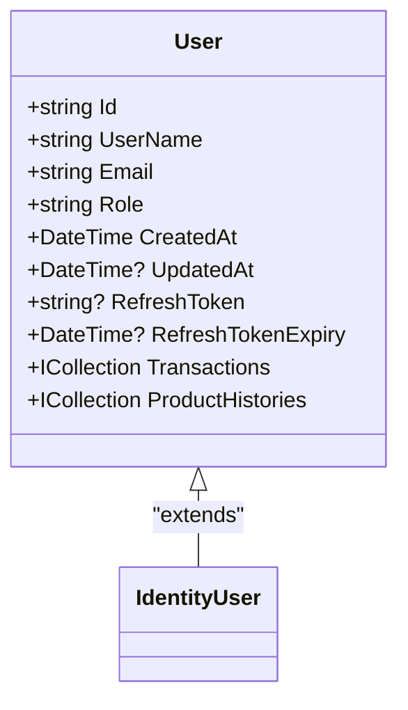
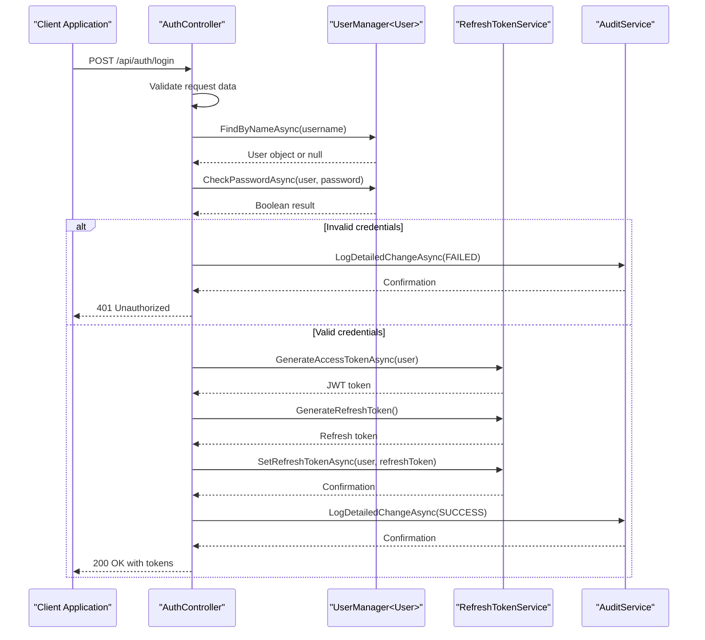
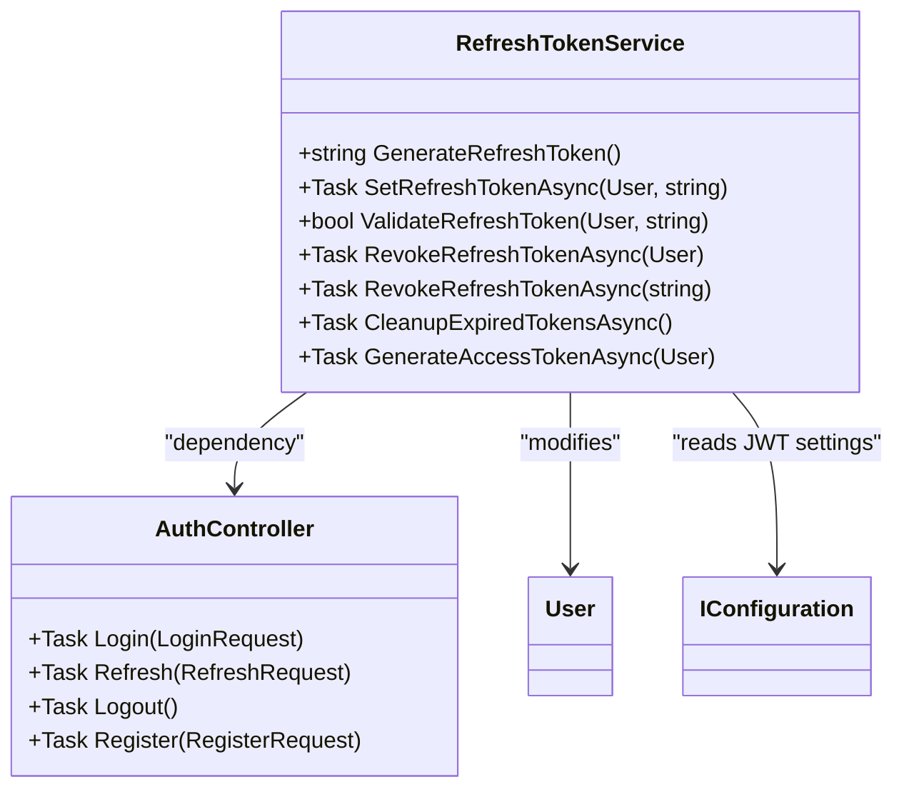
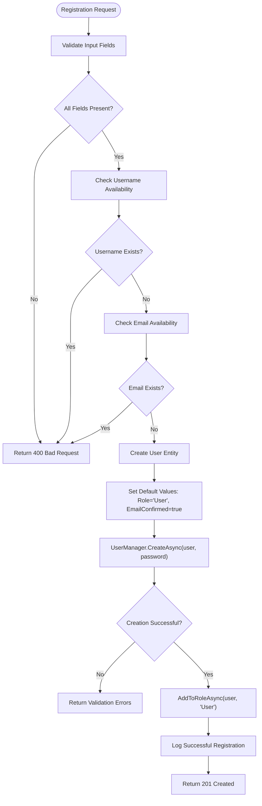
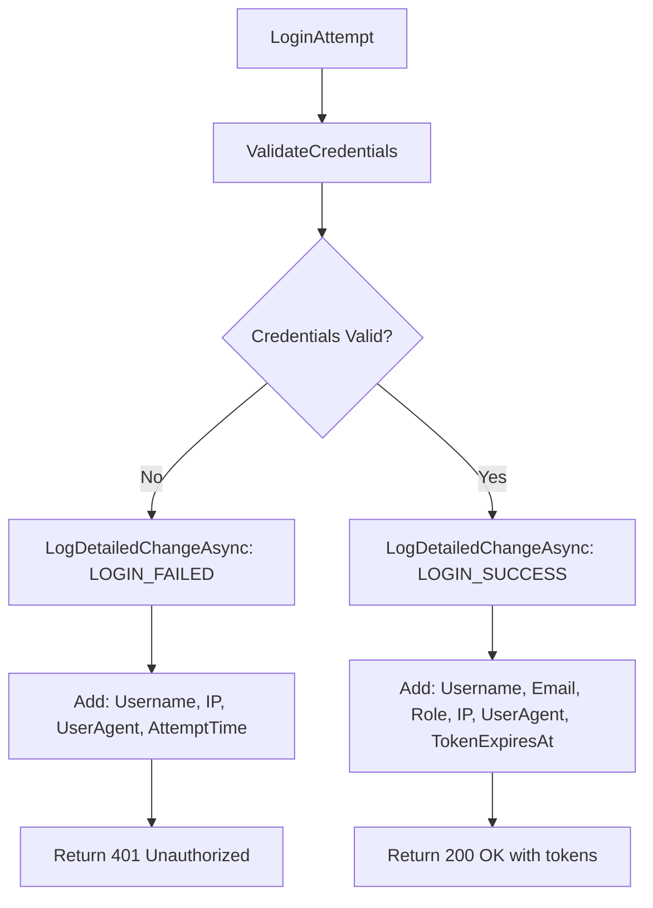

# User Management

<cite>
**Referenced Files in This Document**   
- [AuthController.cs](file://src/Inventory.API/Controllers/AuthController.cs)
- [User.cs](file://src/Inventory.API/Models/User.cs)
- [RefreshTokenService.cs](file://src/Inventory.API/Services/RefreshTokenService.cs)
- [AuthDto.cs](file://src/Inventory.Shared/DTOs/AuthDto.cs)
</cite>

## Table of Contents
1. [Introduction](#introduction)
2. [User Domain Model](#user-domain-model)
3. [Authentication Implementation](#authentication-implementation)
4. [Token Management System](#token-management-system)
5. [Registration Process](#registration-process)
6. [Security Considerations](#security-considerations)
7. [Error Handling and Logging](#error-handling-and-logging)
8. [API Endpoints](#api-endpoints)
9. [Conclusion](#conclusion)

## Introduction

The User Management system in the Inventory Control application provides comprehensive authentication and authorization capabilities through a secure JWT-based implementation. This document details the architecture and implementation of user authentication, focusing on the AuthController, User domain model, and token management services. The system supports login, registration, token refresh, and logout operations while maintaining robust security practices and detailed audit logging.

**Section sources**
- [AuthController.cs](file://src/Inventory.API/Controllers/AuthController.cs#L17-L296)
- [User.cs](file://src/Inventory.API/Models/User.cs#L2-L11)

## User Domain Model

The User entity serves as the core domain model for user management, extending the ASP.NET Identity User class with additional properties specific to the application's requirements. The model includes essential user information and token management fields that support the authentication workflow.



**Diagram sources**
- [User.cs](file://src/Inventory.API/Models/User.cs#L2-L11)

The User model includes several key properties:
- **Role**: Stores the user's role for authorization purposes, with role-based access control implemented throughout the system
- **RefreshToken**: Stores the current refresh token for the user, enabling token refresh without requiring re-authentication
- **RefreshTokenExpiry**: Tracks when the refresh token expires, preventing the use of stale tokens
- **CreatedAt/UpdatedAt**: Audit timestamps for user account lifecycle tracking

The model also establishes relationships with other entities through navigation properties, including transaction history and product history, enabling comprehensive audit trails.

**Section sources**
- [User.cs](file://src/Inventory.API/Models/User.cs#L2-L11)

## Authentication Implementation

The authentication process is implemented in the AuthController, which handles user login through a secure JWT token generation workflow. The controller follows a structured approach to validate credentials and generate appropriate tokens.



**Diagram sources**
- [AuthController.cs](file://src/Inventory.API/Controllers/AuthController.cs#L45-L155)
- [RefreshTokenService.cs](file://src/Inventory.API/Services/RefreshTokenService.cs#L75-L172)

The login process includes comprehensive validation and security logging:
- Input validation ensures both username and password are provided
- User lookup by username using ASP.NET Identity's UserManager
- Secure password verification using the built-in password hashing system
- Detailed audit logging for both successful and failed login attempts
- Rate limiting applied to prevent brute force attacks

**Section sources**
- [AuthController.cs](file://src/Inventory.API/Controllers/AuthController.cs#L45-L155)

## Token Management System

The token management system is implemented through the RefreshTokenService, which handles both JWT access token generation and refresh token management. This separation of concerns allows for secure token operations while maintaining clean code organization.



**Diagram sources**
- [RefreshTokenService.cs](file://src/Inventory.API/Services/RefreshTokenService.cs#L13-L172)
- [AuthController.cs](file://src/Inventory.API/Controllers/AuthController.cs#L17-L296)

The RefreshTokenService provides several key methods:
- **GenerateAccessTokenAsync**: Creates JWT tokens with appropriate claims including user ID, name, email, and roles
- **GenerateRefreshToken**: Creates cryptographically secure refresh tokens using RandomNumberGenerator
- **ValidateRefreshToken**: Checks both token value and expiration against the user's stored values
- **SetRefreshTokenAsync**: Updates the user record with new refresh token and expiry
- **RevokeRefreshTokenAsync**: Clears refresh token data during logout
- **CleanupExpiredTokensAsync**: Background method to remove expired tokens

The service uses configuration values from appsettings.json for token expiration (Jwt:ExpireMinutes) and refresh token duration (Jwt:RefreshTokenExpireDays), allowing easy adjustment without code changes.

**Section sources**
- [RefreshTokenService.cs](file://src/Inventory.API/Services/RefreshTokenService.cs#L13-L172)

## Registration Process

The user registration process creates new user accounts with appropriate validation and security measures. The implementation ensures data integrity and prevents common security issues like duplicate usernames or emails.



**Diagram sources**
- [AuthController.cs](file://src/Inventory.API/Controllers/AuthController.cs#L230-L296)

The registration flow includes:
- Comprehensive validation of username, email, and password
- Checks for existing usernames and email addresses
- Automatic email confirmation for simplified user experience
- Default role assignment (User role)
- Integration with ASP.NET Identity for secure password hashing
- Detailed logging of registration attempts

**Section sources**
- [AuthController.cs](file://src/Inventory.API/Controllers/AuthController.cs#L230-L296)

## Security Considerations

The authentication system implements multiple security measures to protect user accounts and prevent common vulnerabilities:

- **Password Security**: Uses ASP.NET Identity's built-in password hashing with PBKDF2, eliminating the need for custom hashing implementation
- **Rate Limiting**: Applies rate limiting policy ("AuthPolicy") to authentication endpoints to prevent brute force attacks
- **Token Expiration**: Implements short-lived access tokens (configurable via Jwt:ExpireMinutes) and longer-lived refresh tokens (Jwt:RefreshTokenExpireDays)
- **Refresh Token Validation**: Validates both token value and expiration time, with automatic revocation on use
- **Audit Logging**: Comprehensive logging of all authentication events with detailed context including IP address and user agent
- **Input Validation**: Uses data annotations for server-side validation of all input parameters

The system also handles token refresh securely by generating a new refresh token on each refresh operation, implementing a rolling refresh token strategy that enhances security by invalidating previous tokens.

**Section sources**
- [AuthController.cs](file://src/Inventory.API/Controllers/AuthController.cs#L17-L296)
- [RefreshTokenService.cs](file://src/Inventory.API/Services/RefreshTokenService.cs#L13-L172)

## Error Handling and Logging

The authentication system implements robust error handling and comprehensive logging to support both security monitoring and troubleshooting. All authentication operations are logged with detailed context to facilitate audit and forensic analysis.



**Diagram sources**
- [AuthController.cs](file://src/Inventory.API/Controllers/AuthController.cs#L45-L155)

The system uses a structured logging approach with Serilog, capturing:
- All login attempts (successful and failed)
- Registration attempts
- Token refresh operations
- Logout events
- Client IP addresses and user agent strings
- Request identifiers for correlation across logs

Error responses use the ApiResponse pattern to provide consistent error formatting while avoiding information leakage.

**Section sources**
- [AuthController.cs](file://src/Inventory.API/Controllers/AuthController.cs#L45-L155)
- [AuthDto.cs](file://src/Inventory.Shared/DTOs/AuthDto.cs#L68-L115)

## API Endpoints

The authentication system exposes several REST endpoints for user management operations:

```mermaid
graph TD
A[Authentication Endpoints] --> B[POST /api/auth/login]
A --> C[POST /api/auth/refresh]
A --> D[POST /api/auth/logout]
A --> E[POST /api/auth/register]
B --> F[Request: LoginRequest]
B --> G[Response: ApiResponse<LoginResult>]
B --> H[Status: 200, 400, 401]
C --> I[Request: RefreshRequest]
C --> J[Response: ApiResponse<LoginResult>]
C --> K[Status: 200, 400, 401]
D --> L[Request: None (uses auth header)]
D --> M[Response: ApiResponse<object>]
D --> N[Status: 200, 401]
E --> O[Request: RegisterRequest]
E --> P[Response: ApiResponse<object>]
E --> Q[Status: 201, 400]
```

**Diagram sources**
- [AuthController.cs](file://src/Inventory.API/Controllers/AuthController.cs#L17-L296)
- [AuthDto.cs](file://src/Inventory.Shared/DTOs/AuthDto.cs#L4-L32)

The endpoints use consistent response patterns through the ApiResponse<T> class, which includes:
- Success