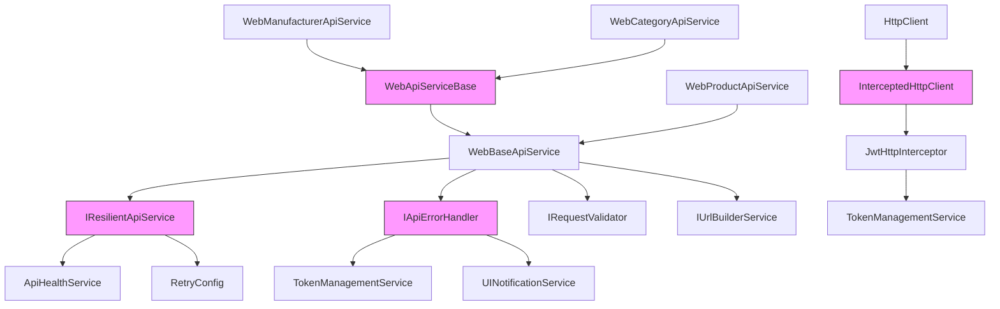
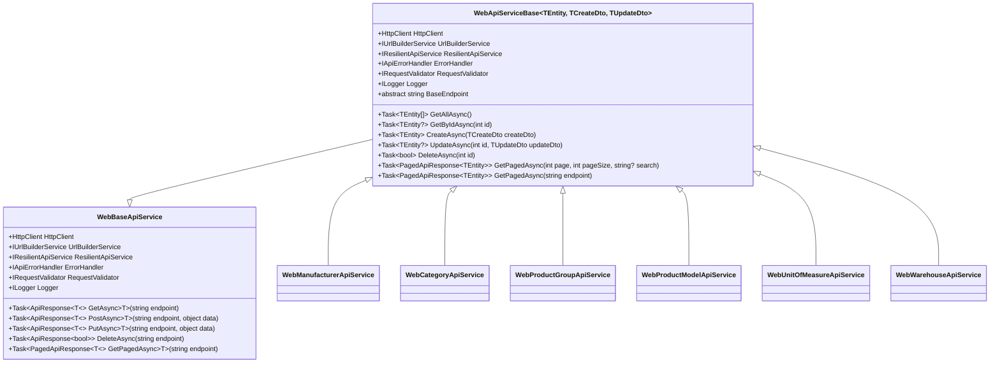
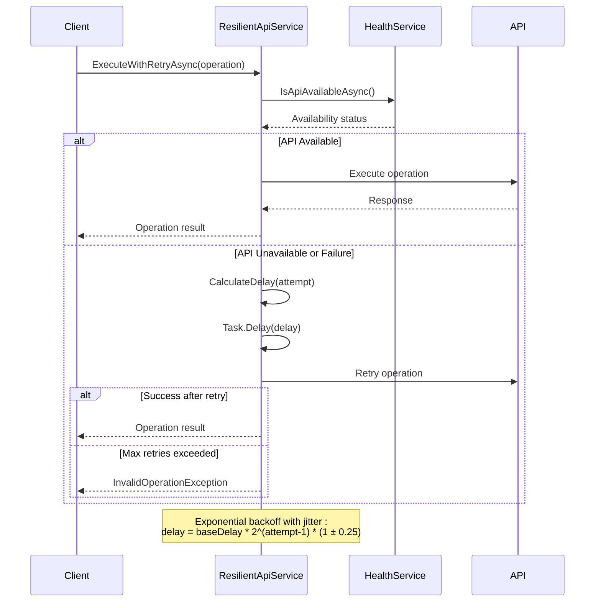
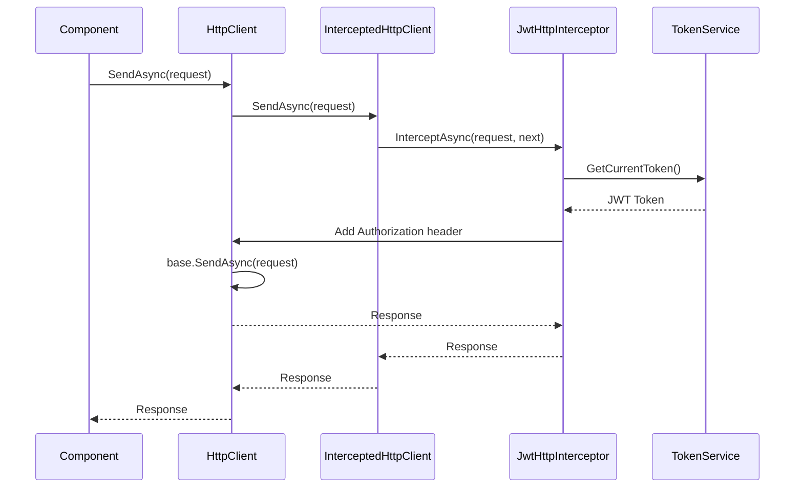
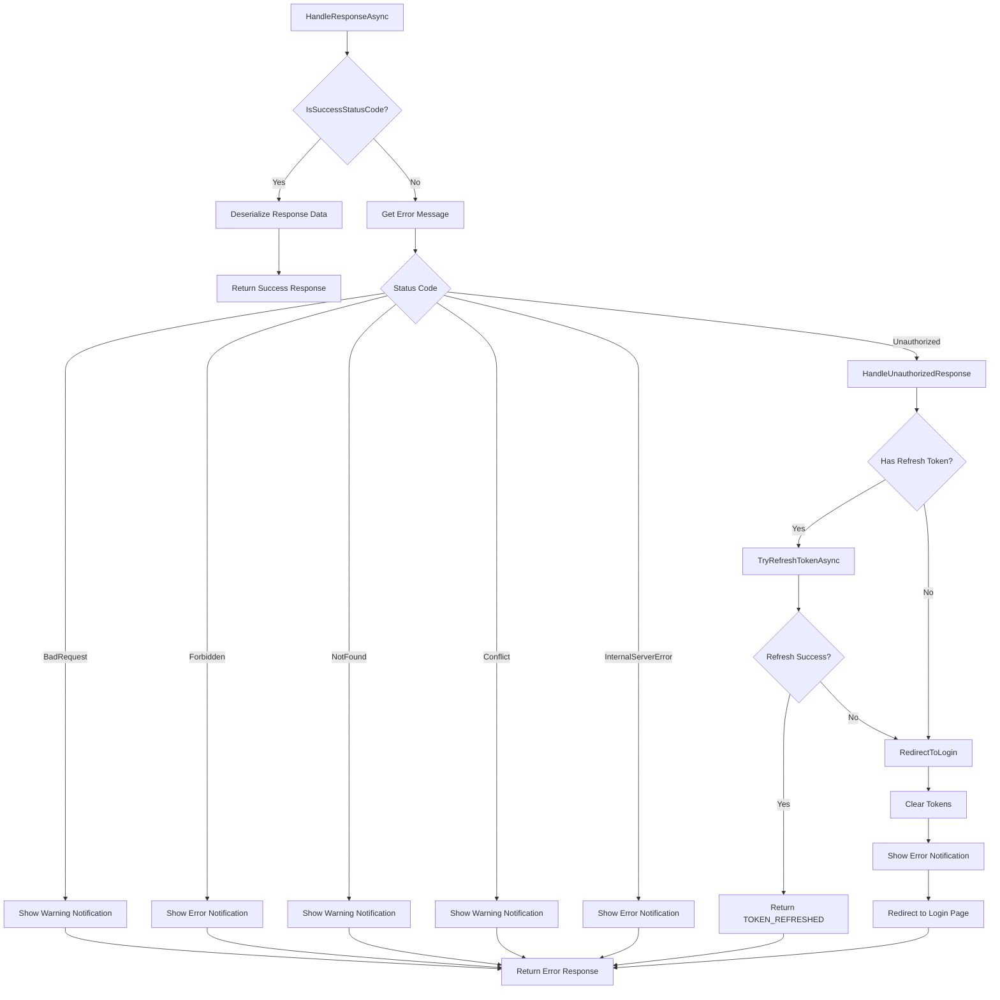
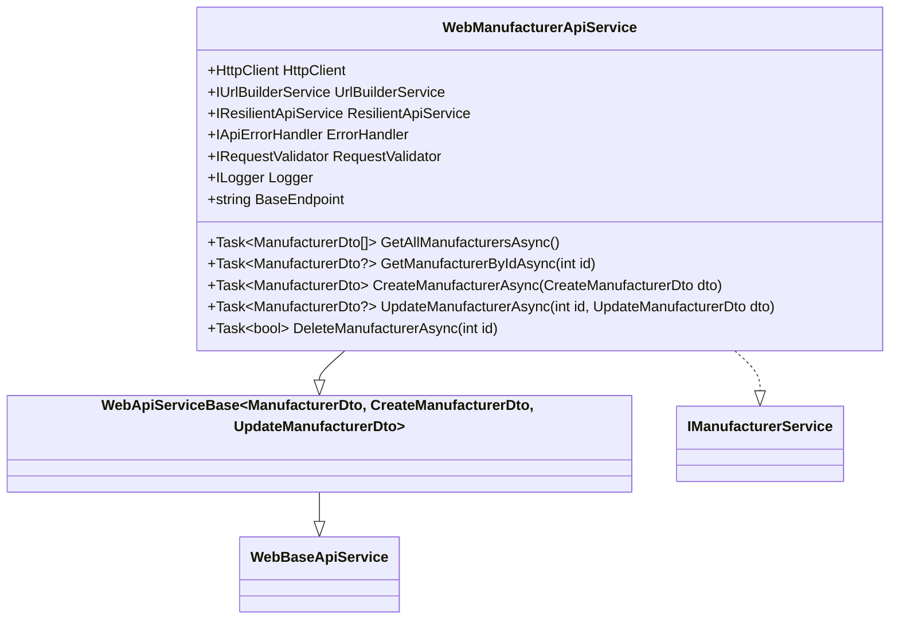
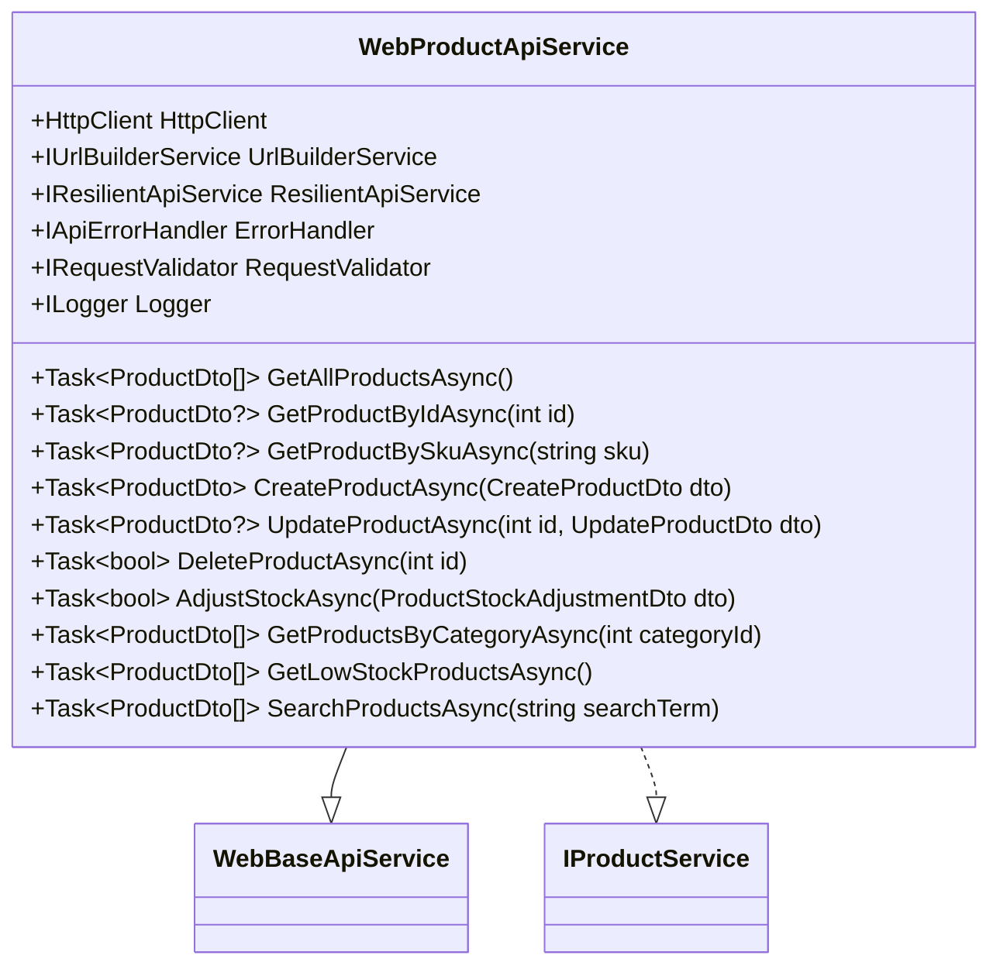

# API Clients

<cite>
**Referenced Files in This Document**   
- [WebApiServiceBase.cs](file://src/Inventory.Web.Client/Services/WebApiServiceBase.cs)
- [ResilientApiService.cs](file://src/Inventory.Web.Client/Services/ResilientApiService.cs)
- [InterceptedHttpClient.cs](file://src/Inventory.Web.Client/Services/InterceptedHttpClient.cs)
- [JwtHttpInterceptor.cs](file://src/Inventory.Web.Client/Services/JwtHttpInterceptor.cs)
- [ApiErrorHandler.cs](file://src/Inventory.Web.Client/Services/ApiErrorHandler.cs)
- [WebManufacturerApiService.cs](file://src/Inventory.Web.Client/Services/WebManufacturerApiService.cs)
- [WebProductApiService.cs](file://src/Inventory.Web.Client/Services/WebProductApiService.cs)
- [Program.cs](file://src/Inventory.Web.Client/Program.cs)
</cite>

## Table of Contents
1. [Introduction](#introduction)
2. [Core Architecture Overview](#core-architecture-overview)
3. [WebApiServiceBase: Generic Entity Service Implementation](#webapiservicebase-generic-entity-service-implementation)
4. [ResilientApiService: Fault Tolerance and Retry Logic](#resilientapiservice-fault-tolerance-and-retry-logic)
5. [InterceptedHttpClient and JwtHttpInterceptor: Authentication Management](#interceptedhttpclient-and-jwthttpinterceptor-authentication-management)
6. [ApiErrorHandler: Centralized Error Handling](#apierrorhandler-centralized-error-handling)
7. [Service Implementation Examples](#service-implementation-examples)
8. [Configuration and Dependency Injection](#configuration-and-dependency-injection)
9. [Performance and Debugging Considerations](#performance-and-debugging-considerations)
10. [Conclusion](#conclusion)

## Introduction
The API client architecture in InventoryCtrl_2 provides a robust, type-safe, and resilient communication layer between the Blazor WebAssembly frontend and the backend API. This documentation details the implementation of key components that enable efficient, secure, and fault-tolerant API interactions. The architecture emphasizes code reuse through generic base classes, implements comprehensive error handling and retry mechanisms, and ensures secure authentication through JWT token management. The design supports CRUD operations, pagination, and type safety across all entity services while providing extensibility for custom business logic.

## Core Architecture Overview

**Diagram sources**
- [WebApiServiceBase.cs](file://src/Inventory.Web.Client/Services/WebApiServiceBase.cs)
- [ResilientApiService.cs](file://src/Inventory.Web.Client/Services/ResilientApiService.cs)
- [InterceptedHttpClient.cs](file://src/Inventory.Web.Client/Services/InterceptedHttpClient.cs)
- [JwtHttpInterceptor.cs](file://src/Inventory.Web.Client/Services/JwtHttpInterceptor.cs)
- [ApiErrorHandler.cs](file://src/Inventory.Web.Client/Services/ApiErrorHandler.cs)

**Section sources**
- [WebApiServiceBase.cs](file://src/Inventory.Web.Client/Services/WebApiServiceBase.cs)
- [ResilientApiService.cs](file://src/Inventory.Web.Client/Services/ResilientApiService.cs)
- [InterceptedHttpClient.cs](file://src/Inventory.Web.Client/Services/InterceptedHttpClient.cs)
- [JwtHttpInterceptor.cs](file://src/Inventory.Web.Client/Services/JwtHttpInterceptor.cs)
- [ApiErrorHandler.cs](file://src/Inventory.Web.Client/Services/ApiErrorHandler.cs)

## WebApiServiceBase: Generic Entity Service Implementation

The `WebApiServiceBase` class serves as a generic foundation for all entity-specific API services, providing standardized CRUD operations and pagination functionality. This implementation ensures type safety through generic parameters and promotes code reuse across different entity types.

**Diagram sources**
- [WebApiServiceBase.cs](file://src/Inventory.Web.Client/Services/WebApiServiceBase.cs)

**Section sources**
- [WebApiServiceBase.cs](file://src/Inventory.Web.Client/Services/WebApiServiceBase.cs)

## ResilientApiService: Fault Tolerance and Retry Logic

The `ResilientApiService` implements a comprehensive fault tolerance strategy with exponential backoff and jitter for retry operations. It integrates API health checks before execution and provides configurable retry parameters through the application configuration system.

**Diagram sources**
- [ResilientApiService.cs](file://src/Inventory.Web.Client/Services/ResilientApiService.cs)

**Section sources**
- [ResilientApiService.cs](file://src/Inventory.Web.Client/Services/ResilientApiService.cs)

## InterceptedHttpClient and JwtHttpInterceptor: Authentication Management

The authentication infrastructure uses a decorator pattern with `InterceptedHttpClient` wrapping the standard `HttpClient` and delegating to `JwtHttpInterceptor` for JWT token injection and request interception. This ensures that all outgoing requests automatically include the appropriate authentication headers.

**Diagram sources**
- [InterceptedHttpClient.cs](file://src/Inventory.Web.Client/Services/InterceptedHttpClient.cs)
- [JwtHttpInterceptor.cs](file://src/Inventory.Web.Client/Services/JwtHttpInterceptor.cs)

**Section sources**
- [InterceptedHttpClient.cs](file://src/Inventory.Web.Client/Services/InterceptedHttpClient.cs)
- [JwtHttpInterceptor.cs](file://src/Inventory.Web.Client/Services/JwtHttpInterceptor.cs)

## ApiErrorHandler: Centralized Error Handling

The `ApiErrorHandler` provides centralized error handling for API responses, with specialized processing for different HTTP status codes and exception types. It handles authentication errors by attempting token refresh and manages user notifications through the `UINotificationService`.

**Diagram sources**
- [ApiErrorHandler.cs](file://src/Inventory.Web.Client/Services/ApiErrorHandler.cs)

**Section sources**
- [ApiErrorHandler.cs](file://src/Inventory.Web.Client/Services/ApiErrorHandler.cs)

## Service Implementation Examples

### WebManufacturerApiService Implementation
The `WebManufacturerApiService` demonstrates how to extend `WebApiServiceBase` for a specific entity type, implementing the `IManufacturerService` interface while inheriting all CRUD operations.

**Diagram sources**
- [WebManufacturerApiService.cs](file://src/Inventory.Web.Client/Services/WebManufacturerApiService.cs)

**Section sources**
- [WebManufacturerApiService.cs](file://src/Inventory.Web.Client/Services/WebManufacturerApiService.cs)

### WebProductApiService Implementation
The `WebProductApiService` extends `WebBaseApiService` directly for more complex operations that go beyond standard CRUD, demonstrating custom endpoint handling and specialized business logic.

**Diagram sources**
- [WebProductApiService.cs](file://src/Inventory.Web.Client/Services/WebProductApiService.cs)

**Section sources**
- [WebProductApiService.cs](file://src/Inventory.Web.Client/Services/WebProductApi