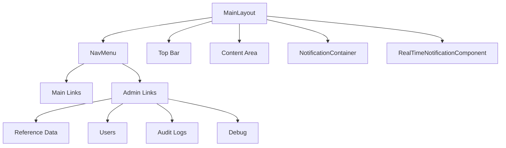
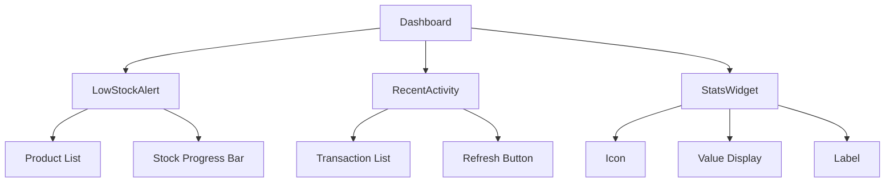
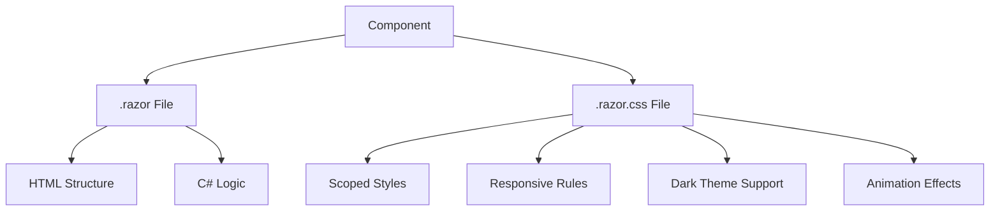

# Component Tree

<cite>
**Referenced Files in This Document**   
- [MainLayout.razor](file://src/Inventory.Web.Client/Layout/MainLayout.razor)
- [NavMenu.razor](file://src/Inventory.Web.Client/Layout/NavMenu.razor)
- [LowStockAlert.razor](file://src/Inventory.UI/Components/Dashboard/LowStockAlert.razor)
- [RecentActivity.razor](file://src/Inventory.UI/Components/Dashboard/RecentActivity.razor)
- [StatsWidget.razor](file://src/Inventory.UI/Components/Dashboard/StatsWidget.razor)
- [MainLayout.razor.css](file://src/Inventory.Web.Client/Layout/MainLayout.razor.css)
- [NavMenu.razor.css](file://src/Inventory.Web.Client/Layout/NavMenu.razor.css)
- [LowStockAlert.razor.css](file://src/Inventory.UI/Components/Dashboard/LowStockAlert.razor.css)
- [RecentActivity.razor.css](file://src/Inventory.UI/Components/Dashboard/RecentActivity.razor.css)
- [StatsWidget.razor.css](file://src/Inventory.UI/Components/Dashboard/StatsWidget.razor.css)
</cite>

## Table of Contents
1. [Introduction](#introduction)
2. [Layout Components](#layout-components)
3. [Dashboard Widgets](#dashboard-widgets)
4. [Component Composition and Parameters](#component-composition-and-parameters)
5. [Styling and CSS Encapsulation](#styling-and-css-encapsulation)
6. [Event Handling and Conditional Rendering](#event-handling-and-conditional-rendering)
7. [Component Lifecycle Management](#component-lifecycle-management)
8. [Best Practices for Component Development](#best-practices-for-component-development)

## Introduction
This document provides a comprehensive overview of the Blazor component tree in the InventoryCtrl_2 application. It details the hierarchical structure of UI components, focusing on the root layout components (MainLayout and NavMenu) and key dashboard widgets (LowStockAlert, RecentActivity, and StatsWidget). The documentation covers component composition, styling strategies using scoped CSS, parameter usage, event handling, and lifecycle management. This guide serves as a reference for developers working on or extending the frontend interface of the application.

## Layout Components

The frontend architecture of InventoryCtrl_2 is built around two primary layout components: `MainLayout` and `NavMenu`. These components establish the foundational structure and navigation framework for the entire application.

`MainLayout` serves as the root layout component, defining the overall shell of the application. It includes a responsive sidebar, a main content area, and global UI elements such as notifications and real-time updates. The layout manages the sidebar expansion state and provides a consistent container for all authenticated views. It uses Radzen UI components to create a modern, responsive interface with proper spacing and visual hierarchy.

`NavMenu` implements the application's navigation system, rendering a dynamic sidebar menu with links to core features such as Home, Catalog, Warehouses, Requests, and Reports. It includes role-based authorization logic, conditionally displaying administrative sections only to users with the "Admin" role. The component handles logout functionality and integrates with authentication services to manage user sessions.

**Diagram sources**
- [MainLayout.razor](file://src/Inventory.Web.Client/Layout/MainLayout.razor#L1-L75)
- [NavMenu.razor](file://src/Inventory.Web.Client/Layout/NavMenu.razor#L1-L108)

**Section sources**
- [MainLayout.razor](file://src/Inventory.Web.Client/Layout/MainLayout.razor#L1-L75)
- [NavMenu.razor](file://src/Inventory.Web.Client/Layout/NavMenu.razor#L1-L108)

## Dashboard Widgets

The dashboard functionality in InventoryCtrl_2 is composed of three primary widget components: `LowStockAlert`, `RecentActivity`, and `StatsWidget`. These components provide key insights into inventory status and system activity.

`LowStockAlert` displays products that have fallen below their minimum stock threshold. It fetches data from the `IDashboardService` and presents a list of low-stock items with visual indicators showing current quantity relative to minimum levels. When no items are below threshold, it shows a success message indicating all products are within acceptable ranges.

`RecentActivity` presents a timeline of recent inventory transactions, including income, outcome, and installation events. It supports manual refresh and displays transaction details such as product name, quantity, user, warehouse, and timestamp. The component uses color-coded badges and icons to differentiate transaction types.

`StatsWidget` is a reusable component for displaying key performance indicators with a consistent visual style. It accepts parameters for label, value, icon, and color theme, making it suitable for various dashboard metrics.

**Diagram sources**
- [LowStockAlert.razor](file://src/Inventory.UI/Components/Dashboard/LowStockAlert.razor#L1-L101)
- [RecentActivity.razor](file://src/Inventory.UI/Components/Dashboard/RecentActivity.razor#L1-L136)
- [StatsWidget.razor](file://src/Inventory.UI/Components/Dashboard/StatsWidget.razor#L1-L33)

**Section sources**
- [LowStockAlert.razor](file://src/Inventory.UI/Components/Dashboard/LowStockAlert.razor#L1-L101)
- [RecentActivity.razor](file://src/Inventory.UI/Components/Dashboard/RecentActivity.razor#L1-L136)
- [StatsWidget.razor](file://src/Inventory.UI/Components/Dashboard/StatsWidget.razor#L1-L33)

## Component Composition and Parameters

Components in InventoryCtrl_2 follow a hierarchical composition pattern where complex UI elements are built from simpler, reusable parts. The `StatsWidget` exemplifies this approach with its parameter-driven design.

The `StatsWidget` component accepts several parameters to customize its appearance and content:
- `Label`: Text description of the metric
- `Value`: Numeric value to display
- `SubLabel`: Optional secondary text
- `Icon`: Material icon identifier
- `CardClass`: Color theme (primary, success, warning, danger, info)

This parameterization allows the same component to be reused across different dashboard contexts while maintaining visual consistency. Other components like `LowStockAlert` and `RecentActivity` also use dependency injection to access services (`IDashboardService`), enabling separation of concerns between UI presentation and data retrieval.

**Section sources**
- [StatsWidget.razor](file://src/Inventory.UI/Components/Dashboard/StatsWidget.razor#L1-L33)
- [LowStockAlert.razor](file://src/Inventory.UI/Components/Dashboard/LowStockAlert.razor#L1-L101)
- [RecentActivity.razor](file://src/Inventory.UI/Components/Dashboard/RecentActivity.razor#L1-L136)

## Styling and CSS Encapsulation

The application implements scoped styling using Blazor's built-in CSS isolation feature, where each `.razor` component has a corresponding `.razor.css` file. This ensures style encapsulation and prevents unintended style leakage between components.

Each component's CSS file uses a modular approach with semantic class names and responsive design principles. The styles leverage CSS custom properties (variables) from the Radzen framework, ensuring consistency with the overall theme. Media queries are used to adjust layouts for mobile devices, with reduced padding, font sizes, and simplified layouts at smaller breakpoints.

Dark theme support is implemented through `[data-bs-theme="dark"]` attribute selectors, allowing components to adapt their appearance based on the active theme. The styling strategy emphasizes accessibility with proper color contrast and hover states that provide visual feedback.

**Diagram sources**
- [MainLayout.razor.css](file://src/Inventory.Web.Client/Layout/MainLayout.razor.css#L1-L171)
- [NavMenu.razor.css](file://src/Inventory.Web.Client/Layout/NavMenu.razor.css#L1-L88)
- [StatsWidget.razor.css](file://src/Inventory.UI/Components/Dashboard/StatsWidget.razor.css#L1-L102)

**Section sources**
- [MainLayout.razor.css](file://src/Inventory.Web.Client/Layout/MainLayout.razor.css#L1-L171)
- [NavMenu.razor.css](file://src/Inventory.Web.Client/Layout/NavMenu.razor.css#L1-L88)
- [LowStockAlert.razor.css](file://src/Inventory.UI/Components/Dashboard/LowStockAlert.razor.css#L1-L65)
- [RecentActivity.razor.css](file://src/Inventory.UI/Components/Dashboard/RecentActivity.razor.css#L1-L104)
- [StatsWidget.razor.css](file://src/Inventory.UI/Components/Dashboard/StatsWidget.razor.css#L1-L102)

## Event Handling and Conditional Rendering

Components implement event handling for user interactions such as sidebar toggling, navigation, and data refresh operations. The `NavMenu` component handles logout events, while `RecentActivity` supports manual refresh through a dedicated button.

Conditional rendering is extensively used to manage UI state. The `LowStockAlert` component conditionally displays either a list of low-stock products or a success message based on data availability. Similarly, `RecentActivity` shows either transaction data or a placeholder when no records exist.

Loading states are managed through busy indicators that display during data retrieval operations. Each component maintains an `isLoading` flag that controls the visibility of loading spinners, providing visual feedback during asynchronous operations.

**Section sources**
- [MainLayout.razor](file://src/Inventory.Web.Client/Layout/MainLayout.razor#L1-L75)
- [NavMenu.razor](file://src/Inventory.Web.Client/Layout/NavMenu.razor#L1-L108)
- [LowStockAlert.razor](file://src/Inventory.UI/Components/Dashboard/LowStockAlert.razor#L1-L101)
- [RecentActivity.razor](file://src/Inventory.UI/Components/Dashboard/RecentActivity.razor#L1-L136)

## Component Lifecycle Management

All components follow Blazor's lifecycle pattern, utilizing `OnInitializedAsync` for data loading operations. This ensures that data is fetched when the component is first rendered, providing up-to-date information to users.

The `LowStockAlert` and `RecentActivity` components implement proper error handling in their data loading methods, logging exceptions without crashing the UI.