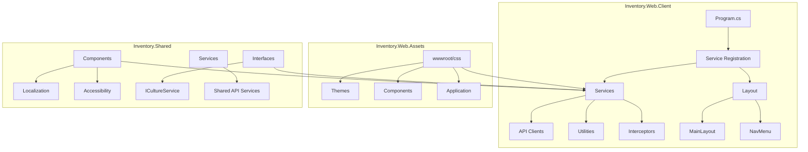
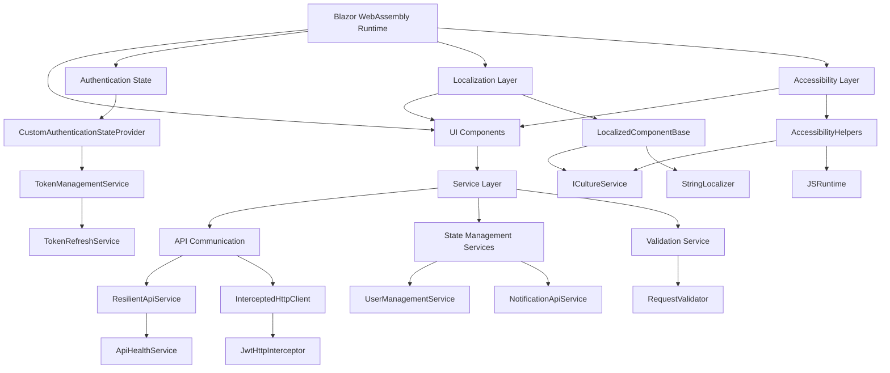
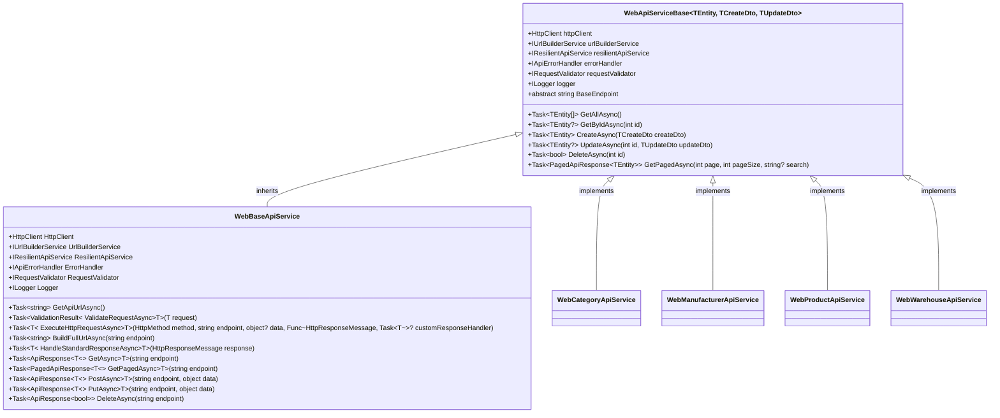
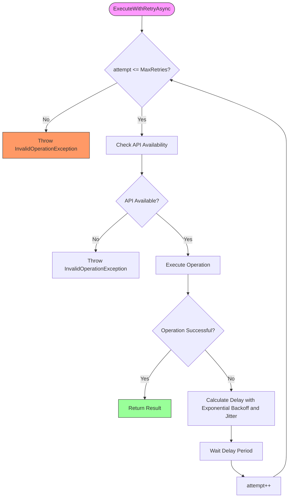
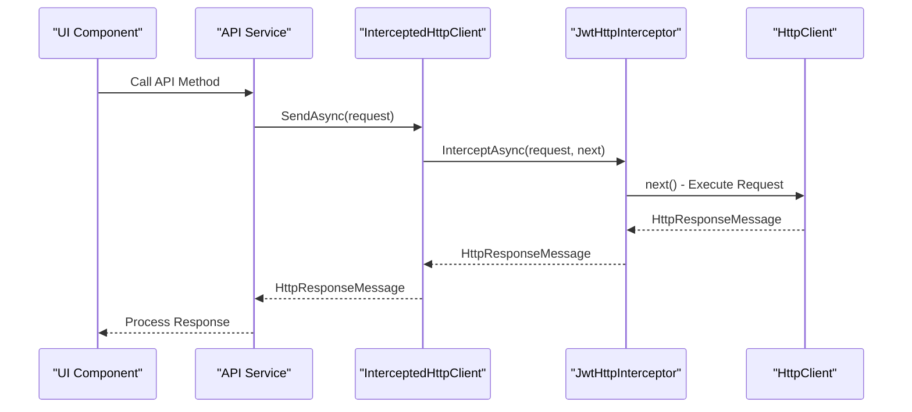
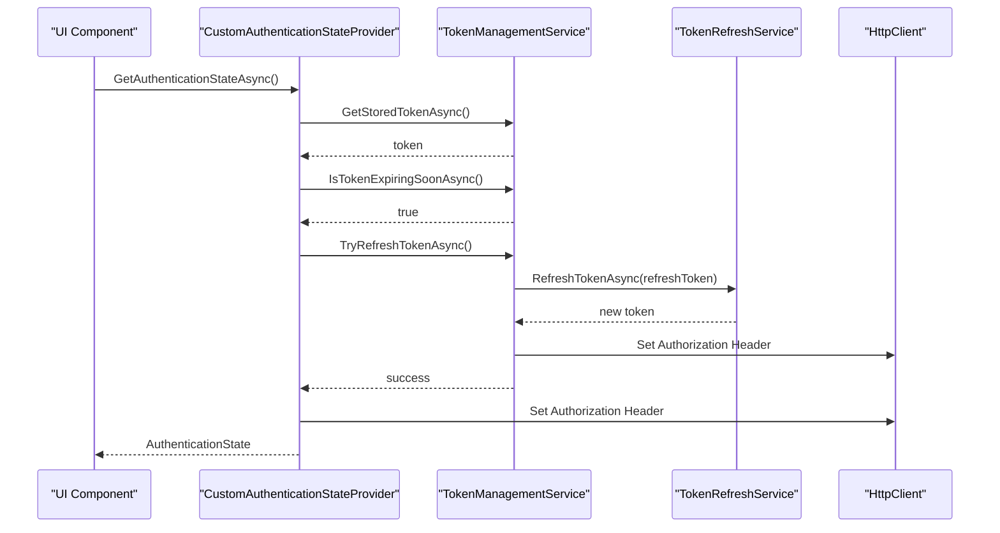
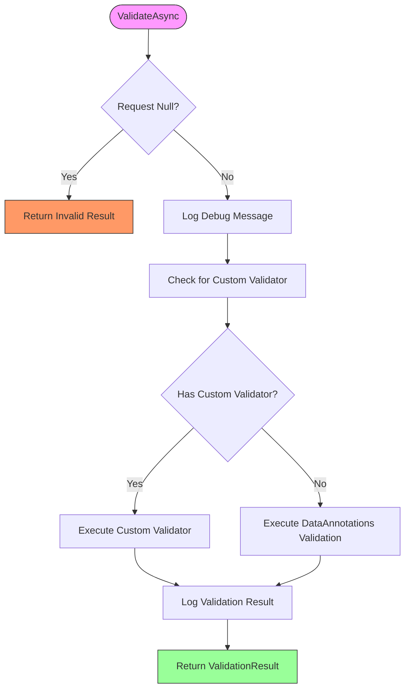
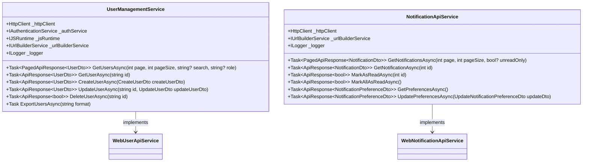
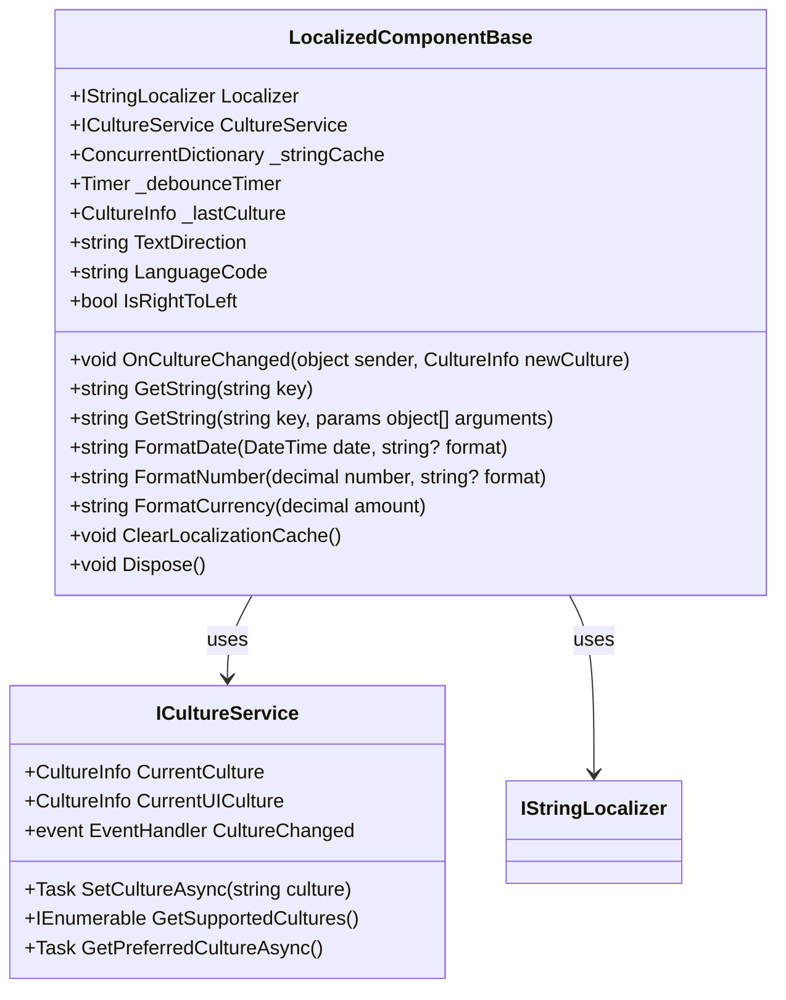
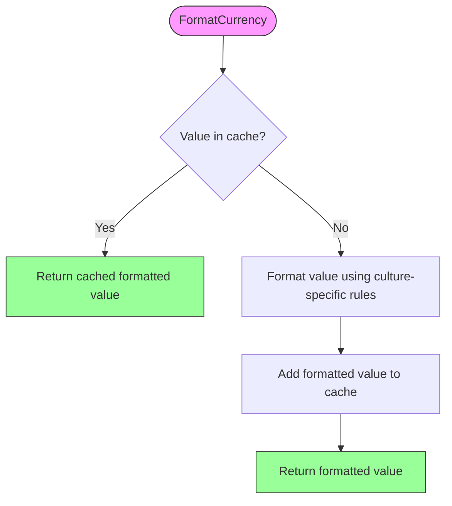

# Frontend Architecture

<cite>
**Referenced Files in This Document**   
- [WebApiServiceBase.cs](file://src/Inventory.Web.Client/Services/WebApiServiceBase.cs)
- [ResilientApiService.cs](file://src/Inventory.Web.Client/Services/ResilientApiService.cs)
- [InterceptedHttpClient.cs](file://src/Inventory.Web.Client/Services/InterceptedHttpClient.cs)
- [CustomAuthenticationStateProvider.cs](file://src/Inventory.Web.Client/CustomAuthenticationStateProvider.cs)
- [RequestValidator.cs](file://src/Inventory.Web.Client/Services/RequestValidator.cs)
- [UserManagementService.cs](file://src/Inventory.Web.Client/Services/UserManagementService.cs)
- [NotificationApiService.cs](file://src/Inventory.Shared/Services/NotificationApiService.cs)
- [LoggingService.cs](file://src/Inventory.Shared/Services/LoggingService.cs)
- [WebBaseApiService.cs](file://src/Inventory.Web.Client/Services/WebBaseApiService.cs)
- [ApiErrorHandler.cs](file://src/Inventory.Web.Client/Services/ApiErrorHandler.cs)
- [TokenManagementService.cs](file://src/Inventory.Web.Client/Services/TokenManagementService.cs)
- [TokenRefreshService.cs](file://src/Inventory.Web.Client/Services/TokenRefreshService.cs)
- [JwtHttpInterceptor.cs](file://src/Inventory.Web.Client/Services/JwtHttpInterceptor.cs)
- [Program.cs](file://src/Inventory.Web.Client/Program.cs)
- [MainLayout.razor.css](file://src/Inventory.Web.Client/Layout/MainLayout.razor.css)
- [NavMenu.razor.css](file://src/Inventory.Web.Client/Layout/NavMenu.razor.css)
- [app.css](file://src/Inventory.Web.Assets/wwwroot/css/app.css)
- [light.css](file://src/Inventory.Web.Assets/wwwroot/css/themes/light.css)
- [dark.css](file://src/Inventory.Web.Assets/wwwroot/css/themes/dark.css)
- [LocalizedComponentBase.cs](file://src/Inventory.Shared/Components/LocalizedComponentBase.cs) - *Updated in recent commit*
- [AccessibilityHelpers.razor](file://src/Inventory.Shared/Components/AccessibilityHelpers.razor) - *Added in recent commit*
- [ICultureService.cs](file://src/Inventory.Shared/Interfaces/ICultureService.cs) - *Updated in recent commit*
- [LowStockAlert.razor.css](file://src/Inventory.UI/Components/Dashboard/LowStockAlert.razor.css) - *Updated in recent commit*
</cite>

## Update Summary
**Changes Made**   
- Added comprehensive localization infrastructure section covering the new LocalizedComponentBase implementation
- Added accessibility architecture section detailing the AccessibilityHelpers component and ARIA implementation
- Updated core components section to include new localization and accessibility services
- Enhanced architecture overview diagram to show localization and accessibility layers
- Updated project structure to reflect new component organization
- Added new section on internationalization and accessibility best practices

## Table of Contents
1. [Introduction](#introduction)
2. [Project Structure](#project-structure)
3. [Core Components](#core-components)
4. [Architecture Overview](#architecture-overview)
5. [Detailed Component Analysis](#detailed-component-analysis)
6. [Localization and Internationalization](#localization-and-internationalization)
7. [Accessibility Architecture](#accessibility-architecture)
8. [Dependency Analysis](#dependency-analysis)
9. [Performance Considerations](#performance-considerations)
10. [Troubleshooting Guide](#troubleshooting-guide)
11. [Conclusion](#conclusion)

## Introduction
This document provides comprehensive architectural documentation for the frontend implementation of InventoryCtrl_2, a Blazor WebAssembly application. The system follows a component-based UI design with robust integration to backend services through API clients. The architecture emphasizes resilience, security, maintainability, accessibility, and internationalization through layered service abstractions, centralized error handling, and JWT-based authentication. The frontend leverages Blazor's component model for UI development, implements comprehensive state management through service classes, and uses a modular approach to HTTP communication with automatic token refresh and retry mechanisms. Recent updates have significantly enhanced the localization infrastructure and accessibility features, making the application fully accessible and available in multiple languages.

## Project Structure
The frontend architecture is organized into several key directories within the Inventory.Web.Client project. The Services directory contains API clients and utility services, while Layout components define the application's structural UI elements. The application uses a separate Web.Assets project for shared CSS resources and themes. The Program.cs file configures dependency injection and service registration, establishing the foundation for the application's modular architecture. The Inventory.Shared project now contains critical cross-cutting components for localization and accessibility that are used throughout the application.



**Diagram sources**
- [Program.cs](file://src/Inventory.Web.Client/Program.cs)
- [MainLayout.razor.css](file://src/Inventory.Web.Client/Layout/MainLayout.razor.css)
- [app.css](file://src/Inventory.Web.Assets/wwwroot/css/app.css)
- [LocalizedComponentBase.cs](file://src/Inventory.Shared/Components/LocalizedComponentBase.cs)
- [AccessibilityHelpers.razor](file://src/Inventory.Shared/Components/AccessibilityHelpers.razor)

**Section sources**
- [Program.cs](file://src/Inventory.Web.Client/Program.cs)
- [MainLayout.razor.css](file://src/Inventory.Web.Client/Layout/MainLayout.razor.css)
- [app.css](file://src/Inventory.Web.Assets/wwwroot/css/app.css)
- [LocalizedComponentBase.cs](file://src/Inventory.Shared/Components/LocalizedComponentBase.cs)
- [AccessibilityHelpers.razor](file://src/Inventory.Shared/Components/AccessibilityHelpers.razor)

## Core Components
The frontend architecture is built around several core components that provide the foundation for API communication, authentication, state management, localization, and accessibility. The WebApiServiceBase class implements a generic CRUD pattern for entity operations, while ResilientApiService provides retry mechanisms for unreliable network conditions. The InterceptedHttpClient enables request interception for authentication header management, and CustomAuthenticationStateProvider handles user authentication state across the application. RequestValidator ensures data integrity through validation rules, and specialized services like UserManagementService and NotificationApiService provide domain-specific functionality. The newly enhanced localization infrastructure centers around LocalizedComponentBase, which provides automatic culture-aware rendering and string localization with caching. The AccessibilityHelpers component implements comprehensive ARIA support and screen reader announcements for improved accessibility.

**Section sources**
- [WebApiServiceBase.cs](file://src/Inventory.Web.Client/Services/WebApiServiceBase.cs)
- [ResilientApiService.cs](file://src/Inventory.Web.Client/Services/ResilientApiService.cs)
- [InterceptedHttpClient.cs](file://src/Inventory.Web.Client/Services/InterceptedHttpClient.cs)
- [CustomAuthenticationStateProvider.cs](file://src/Inventory.Web.Client/CustomAuthenticationStateProvider.cs)
- [RequestValidator.cs](file://src/Inventory.Web.Client/Services/RequestValidator.cs)
- [LocalizedComponentBase.cs](file://src/Inventory.Shared/Components/LocalizedComponentBase.cs)
- [AccessibilityHelpers.razor](file://src/Inventory.Shared/Components/AccessibilityHelpers.razor)
- [ICultureService.cs](file://src/Inventory.Shared/Interfaces/ICultureService.cs)

## Architecture Overview
The frontend architecture follows a layered approach with clear separation of concerns. At the foundation is the Blazor WebAssembly runtime, which hosts the application and provides component rendering. Above this layer, service classes handle business logic and API communication, while components manage UI presentation and user interaction. The architecture implements a dependency injection pattern for service resolution, with services registered in Program.cs. HTTP requests flow through a chain of responsibility that includes validation, retry logic, authentication header injection, and error handling. The state management approach combines Blazor's built-in authentication state with custom services that maintain application-specific state. The localization layer, built on LocalizedComponentBase, automatically handles culture changes and provides cached string localization. The accessibility layer, implemented through AccessibilityHelpers, ensures the application is fully accessible with proper ARIA attributes and screen reader support.



**Diagram sources**
- [WebApiServiceBase.cs](file://src/Inventory.Web.Client/Services/WebApiServiceBase.cs)
- [ResilientApiService.cs](file://src/Inventory.Web.Client/Services/ResilientApiService.cs)
- [InterceptedHttpClient.cs](file://src/Inventory.Web.Client/Services/InterceptedHttpClient.cs)
- [CustomAuthenticationStateProvider.cs](file://src/Inventory.Web.Client/CustomAuthenticationStateProvider.cs)
- [RequestValidator.cs](file://src/Inventory.Web.Client/Services/RequestValidator.cs)
- [UserManagementService.cs](file://src/Inventory.Web.Client/Services/UserManagementService.cs)
- [NotificationApiService.cs](file://src/Inventory.Shared/Services/NotificationApiService.cs)
- [TokenManagementService.cs](file://src/Inventory.Web.Client/Services/TokenManagementService.cs)
- [TokenRefreshService.cs](file://src/Inventory.Web.Client/Services/TokenRefreshService.cs)
- [LocalizedComponentBase.cs](file://src/Inventory.Shared/Components/LocalizedComponentBase.cs)
- [ICultureService.cs](file://src/Inventory.Shared/Interfaces/ICultureService.cs)
- [AccessibilityHelpers.razor](file://src/Inventory.Shared/Components/AccessibilityHelpers.razor)

## Detailed Component Analysis

### WebApiServiceBase Analysis
The WebApiServiceBase class provides a generic implementation of CRUD operations for entity types, serving as a base for specific API service implementations. It follows the repository pattern, abstracting HTTP communication details from consuming components. The class uses type parameters to ensure type safety across operations and implements common functionality like pagination and error handling. Derived classes only need to specify the base endpoint and can immediately use all CRUD methods.



**Diagram sources**
- [WebApiServiceBase.cs](file://src/Inventory.Web.Client/Services/WebApiServiceBase.cs)
- [WebBaseApiService.cs](file://src/Inventory.Web.Client/Services/WebBaseApiService.cs)

**Section sources**
- [WebApiServiceBase.cs](file://src/Inventory.Web.Client/Services/WebApiServiceBase.cs)
- [WebBaseApiService.cs](file://src/Inventory.Web.Client/Services/WebBaseApiService.cs)

### ResilientApiService Analysis
The ResilientApiService implements a retry pattern with exponential backoff and jitter to handle transient failures in API communication. It integrates with the ApiHealthService to check API availability before making requests, preventing unnecessary calls during service outages. The service uses configurable retry settings, allowing adjustment of maximum retries, base delay, and maximum delay. The implementation includes logging at various levels to aid in troubleshooting and monitoring of retry behavior.



**Diagram sources**
- [ResilientApiService.cs](file://src/Inventory.Web.Client/Services/ResilientApiService.cs)

**Section sources**
- [ResilientApiService.cs](file://src/Inventory.Web.Client/Services/ResilientApiService.cs)

### InterceptedHttpClient Analysis
The InterceptedHttpClient extends the standard HttpClient to support request interception through the IHttpInterceptor interface. This allows cross-cutting concerns like authentication header injection to be implemented without modifying individual service calls. The implementation uses a functional approach, passing the next delegate to allow chain-of-responsibility pattern implementation. This design enables multiple interceptors to be composed together, though the current implementation uses a single JwtHttpInterceptor for authentication purposes.



**Diagram sources**
- [InterceptedHttpClient.cs](file://src/Inventory.Web.Client/Services/InterceptedHttpClient.cs)
- [JwtHttpInterceptor.cs](file://src/Inventory.Web.Client/Services/JwtHttpInterceptor.cs)

**Section sources**
- [InterceptedHttpClient.cs](file://src/Inventory.Web.Client/Services/InterceptedHttpClient.cs)
- [JwtHttpInterceptor.cs](file://src/Inventory.Web.Client/Services/JwtHttpInterceptor.cs)

### Authentication State Management
The authentication architecture centers around the CustomAuthenticationStateProvider, which extends Blazor's built-in AuthenticationStateProvider. It integrates with TokenManagementService to handle JWT token storage, refresh, and expiration checking. The implementation automatically checks for token expiration before each authentication state request and attempts silent refresh when necessary. This ensures users maintain their session without manual re-authentication while maintaining security through timely token renewal.



**Diagram sources**
- [CustomAuthenticationStateProvider.cs](file://src/Inventory.Web.Client/CustomAuthenticationStateProvider.cs)
- [TokenManagementService.cs](file://src/Inventory.Web.Client/Services/TokenManagementService.cs)
- [TokenRefreshService.cs](file://src/Inventory.Web.Client/Services/TokenRefreshService.cs)

**Section sources**
- [CustomAuthenticationStateProvider.cs](file://src/Inventory.Web.Client/CustomAuthenticationStateProvider.cs)
- [TokenManagementService.cs](file://src/Inventory.Web.Client/Services/TokenManagementService.cs)
- [TokenRefreshService.cs](file://src/Inventory.Web.Client/Services/TokenRefreshService.cs)

### Request Validation Analysis
The RequestValidator service provides a flexible validation framework that supports both DataAnnotations and custom validation logic. It maintains a dictionary of registered validators for different request types, allowing domain-specific validation rules to be injected. The implementation includes comprehensive logging to track validation attempts and results. For types without custom validators, it falls back to reflection-based validation using DataAnnotations attributes, providing a consistent validation experience across the application.



**Diagram sources**
- [RequestValidator.cs](file://src/Inventory.Web.Client/Services/RequestValidator.cs)

**Section sources**
- [RequestValidator.cs](file://src/Inventory.Web.Client/Services/RequestValidator.cs)

### State Management Services
State management in the application is handled through specialized service classes that encapsulate domain-specific state and business logic. The UserManagementService provides CRUD operations for user entities with additional functionality like export capabilities. The NotificationApiService handles notification-related operations with methods for retrieval, marking as read, and preference management. These services follow a consistent pattern of using HttpClient for communication, with error handling and logging integrated throughout.



**Diagram sources**
- [UserManagementService.cs](file://src/Inventory.Web.Client/Services/UserManagementService.cs)
- [NotificationApiService.cs](file://src/Inventory.Shared/Services/NotificationApiService.cs)

**Section sources**
- [UserManagementService.cs](file://src/Inventory.Web.Client/Services/UserManagementService.cs)
- [NotificationApiService.cs](file://src/Inventory.Shared/Services/NotificationApiService.cs)

## Localization and Internationalization
The localization architecture has been significantly enhanced with the introduction of a comprehensive infrastructure that supports multiple languages and cultural formats. The core of this system is the LocalizedComponentBase class, which serves as the foundation for all localized components in the application. This abstract base class provides automatic culture change detection, string localization with caching, and cultural formatting for dates, numbers, and currency.

### LocalizedComponentBase Implementation
The LocalizedComponentBase class extends Blazor's ComponentBase and implements IDisposable to properly manage subscriptions. It uses dependency injection to access IStringLocalizer for resource lookup and ICultureService for culture management. The implementation includes several key features:

- **Automatic Culture Change Detection**: Subscribes to the CultureChanged event from ICultureService to automatically detect when the application culture changes.
- **Debounced Re-rendering**: Uses a timer-based debounce mechanism to prevent excessive re-renders during rapid culture switches, improving performance.
- **String Caching**: Maintains a ConcurrentDictionary to cache localized strings, reducing repeated lookups for the same key and culture combination.
- **Cultural Formatting**: Provides methods for formatting dates, numbers, and currency according to the current culture with built-in caching.
- **Text Direction Support**: Automatically detects and provides the correct text direction (LTR/RTL) based on the current culture.



**Diagram sources**
- [LocalizedComponentBase.cs](file://src/Inventory.Shared/Components/LocalizedComponentBase.cs)
- [ICultureService.cs](file://src/Inventory.Shared/Interfaces/ICultureService.cs)

**Section sources**
- [LocalizedComponentBase.cs](file://src/Inventory.Shared/Components/LocalizedComponentBase.cs)
- [ICultureService.cs](file://src/Inventory.Shared/Interfaces/ICultureService.cs)

### Cultural Format Handling
The localization system provides comprehensive support for cultural formatting of various data types. The FormatDate, FormatNumber, and FormatCurrency methods automatically use the current culture's formatting rules, ensuring that dates, numbers, and monetary values are displayed correctly for the user's locale. Each method includes caching to improve performance by avoiding repeated formatting operations for the same values.



**Diagram sources**
- [LocalizedComponentBase.cs](file://src/Inventory.Shared/Components/LocalizedComponentBase.cs)

**Section sources**
- [LocalizedComponentBase.cs](file://src/Inventory.Shared/Components/LocalizedComponentBase.cs)

## Accessibility Architecture
The application's accessibility architecture has been enhanced with the introduction of the AccessibilityHelpers component, which provides comprehensive support for users with disabilities. This component implements ARIA (Accessible Rich Internet Applications) standards and ensures that the application is fully navigable and understandable by screen readers and other assistive technologies.

### AccessibilityHelpers Implementation
The AccessibilityHelpers component is a Razor component that provides various accessibility features through its code-behind methods and rendered HTML elements. Key features include:

- **Language and Direction Attributes**: Automatically sets the correct lang and dir attributes based on the current culture, helping screen readers pronounce content correctly.
- **ARIA Live Regions**: Implements polite and assertive live regions for dynamic content updates, allowing screen readers to announce important changes without interrupting the user.
- **Keyboard Navigation Hints**: Provides culture-specific keyboard navigation instructions to help users understand how to navigate the application.
- **Screen Reader Announcements**: Offers methods to programmatically announce messages to screen readers, such as loading states and validation errors.

```mermaid
classDiagram
    class AccessibilityHelpers {
        +ICultureService CultureService
        +IJSRuntime JSRuntime
        +string GetLangAttribute()
        +string GetDirAttribute()
        +string GetLanguageSelectorAriaLabel()
        +string GetLanguageChangeAnnouncement(string newLanguage)
        +string