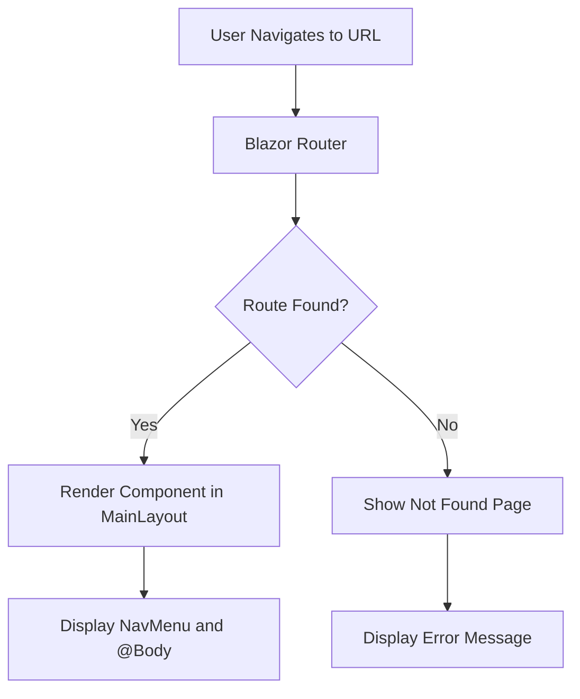
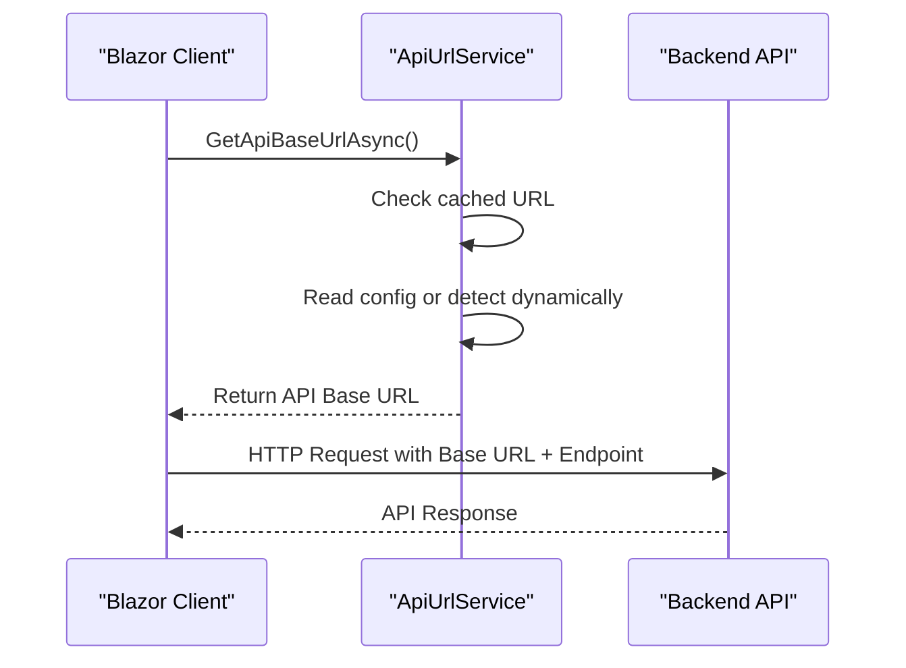

# Routing Structure

<cite>
**Referenced Files in This Document**   
- [App.razor](file://src/Inventory.Web.Client/App.razor)
- [MainLayout.razor](file://src/Inventory.Web.Client/Layout/MainLayout.razor)
- [NavMenu.razor](file://src/Inventory.Web.Client/Layout/NavMenu.razor)
- [Home.razor](file://src/Inventory.UI/Pages/Home.razor)
- [ApiUrlService.cs](file://src/Inventory.Web.Client/Services/ApiUrlService.cs)
- [Program.cs](file://src/Inventory.Web.Client/Program.cs)
- [CustomAuthenticationStateProvider.cs](file://src/Inventory.Web.Client/CustomAuthenticationStateProvider.cs)
</cite>

## Table of Contents
1. [Introduction](#introduction)
2. [Route Definition with @page Directive](#route-definition-with-page-directive)
3. [Router and Layout Integration](#router-and-layout-integration)
4. [Navigation Handling via NavMenu](#navigation-handling-via-navmenu)
5. [Frontend-Backend API Endpoint Relationship](#frontend-backend-api-endpoint-relationship)
6. [Route Parameter Handling and Guarding](#route-parameter-handling-and-guarding)
7. [SEO Considerations for Client-Side Routing](#seo-considerations-for-client-side-routing)
8. [Extending Routes and Organizing Hierarchies](#extending-routes-and-organizing-hierarchies)

## Introduction
The Blazor WebAssembly frontend in InventoryCtrl_2 utilizes a client-side routing system to enable navigation between different views without full page reloads. This document details how routes are defined using the `@page` directive in Razor components, how the Router integrates with MainLayout for consistent UI presentation, and how navigation events are processed through NavMenu. It also covers the relationship between frontend routes and backend API endpoints, particularly through the `ApiUrlService`, and outlines best practices for route parameters, authentication-based route guarding, and SEO in a single-page application context.

**Section sources**
- [App.razor](file://src/Inventory.Web.Client/App.razor)
- [MainLayout.razor](file://src/Inventory.Web.Client/Layout/MainLayout.razor)

## Route Definition with @page Directive
Routes in the Blazor WebAssembly application are defined using the `@page` directive within Razor component files. Each component specifies its route as a string, enabling the Blazor Router to map URLs to specific UI components. For example, the Home page is defined with `@page "/"`, making it accessible at the root URL. Other pages such as `/products`, `/warehouses`, and `/requests` follow the same pattern, allowing modular and intuitive navigation.

The `@page` directive supports route parameters, enabling dynamic routing. For instance, a route like `@page "/products/{id}"` allows the component to receive the `id` parameter from the URL, which can then be used to fetch and display specific product data. These parameters are automatically bound to component properties using the `[Parameter]` attribute.

**Section sources**
- [Home.razor](file://src/Inventory.UI/Pages/Home.razor)
- [AddProduct.razor](file://src/Inventory.UI/Pages/AddProduct.razor)

## Router and Layout Integration
The Blazor `Router` component, defined in `App.razor`, is responsible for handling navigation and rendering the appropriate component based on the current URL. It uses the `Found` and `NotFound` cases to either render the matched component within a layout (typically `MainLayout`) or display a "Not Found" message.

The `MainLayout.razor` provides a consistent application shell, including the sidebar, top navigation bar, and content area. It uses the `@Body` directive to inject the current page content. The layout also includes authorization logic via `AuthorizeView`, which conditionally renders content based on the user's authentication state. When a user is authenticated, the full layout with navigation is displayed; otherwise, they are redirected to the login page.

**Diagram sources**
- [App.razor](file://src/Inventory.Web.Client/App.razor)
- [MainLayout.razor](file://src/Inventory.Web.Client/Layout/MainLayout.razor)

**Section sources**
- [App.razor](file://src/Inventory.Web.Client/App.razor)
- [MainLayout.razor](file://src/Inventory.Web.Client/Layout/MainLayout.razor)

## Navigation Handling via NavMenu
Navigation is managed through the `NavMenu.razor` component, which renders a sidebar with links to various application sections. Each `NavLink` is configured with a `href` attribute corresponding to a route defined via `@page`. The `Match` parameter determines how strictly the route must match the current URL (e.g., `NavLinkMatch.All` for exact match, `NavLinkMatch.Prefix` for partial match).

The `NavMenu` also supports role-based visibility. For example, administrative links such as "Reference Data" and "Users" are wrapped in an `AuthorizeView` with the `Admin` role, ensuring they are only visible to users with appropriate permissions. Logout functionality is handled directly in the component, clearing authentication tokens and redirecting to the login page.

**Section sources**
- [NavMenu.razor](file://src/Inventory.Web.Client/Layout/NavMenu.razor)

## Frontend-Backend API Endpoint Relationship
Frontend routes are decoupled from backend API endpoints, with communication handled through HTTP clients configured in the Blazor application. The `ApiUrlService` is responsible for resolving the base URL of the backend API, using environment-specific configurations or dynamic detection based on the client's origin. This service ensures that API calls are directed to the correct backend instance, whether in development, staging, or production.

The `ApiUrlService` caches resolved URLs for performance and supports fallback mechanisms when configuration is missing. It also handles SignalR hub URLs, enabling real-time communication for features like notifications. This abstraction allows the frontend to remain agnostic of deployment-specific details while maintaining reliable connectivity to backend services.

**Diagram sources**
- [ApiUrlService.cs](file://src/Inventory.Web.Client/Services/ApiUrlService.cs)

**Section sources**
- [ApiUrlService.cs](file://src/Inventory.Web.Client/Services/ApiUrlService.cs)
- [Program.cs](file://src/Inventory.Web.Client/Program.cs)

## Route Parameter Handling and Guarding
Route parameters are handled through Blazor's built-in parameter binding, allowing components to receive values directly from the URL. These parameters can be optional or required, and their values are accessible within the component's code-behind via properties marked with `[Parameter]`.

Route guarding is implemented using the `Authorize` attribute and `AuthorizeView` component. Pages that require authentication are annotated with `@attribute [Authorize]`, preventing unauthenticated users from accessing them. Additionally, role-based access control is enforced using `AuthorizeView Roles="Admin"`, which conditionally renders content based on the user's roles. The `CustomAuthenticationStateProvider` enhances this by integrating token management and automatic refresh, ensuring that user sessions remain valid during navigation.

**Section sources**
- [Home.razor](file://src/Inventory.UI/Pages/Home.razor)
- [CustomAuthenticationStateProvider.cs](file://src/Inventory.Web.Client/CustomAuthenticationStateProvider.cs)

## SEO Considerations for Client-Side Routing
As a client-side rendered application, InventoryCtrl_2 faces inherent SEO challenges due to the lack of server-rendered HTML. To mitigate this, the application uses the `PageTitle` component to dynamically update the document title for each route, improving recognition by search engines. However, full SEO optimization would require implementing prerendering or server-side rendering (SSR) using Blazor Server or hosting the app behind a static site generator that can crawl and index client-side routes.

Additionally, the application could benefit from structured data markup (e.g., JSON-LD) to provide search engines with metadata about key pages, even if the content is loaded dynamically.

**Section sources**
- [Home.razor](file://src/Inventory.UI/Pages/Home.razor)

## Extending Routes and Organizing Hierarchies
New routes can be added by creating Razor components with the appropriate `@page` directive and placing them in the `Pages` directory. For hierarchical organization, subdirectories can be used (e.g., `Admin/ReferenceData.razor` with `@page "/admin/reference-data"`). This promotes modularity and makes route management scalable.

To maintain consistency, route paths should follow a clear naming convention, typically using kebab-case for multi-word segments. Grouping related routes under common prefixes (e.g., `/admin`, `/reports`) helps structure the navigation menu and improves user experience. Future extensions should also consider lazy loading assemblies for large feature modules to optimize initial load time.

**Section sources**
- [NavMenu.razor](file://src/Inventory.Web.Client/Layout/NavMenu.razor)
- [Admin/ReferenceDataManagement.razor](file://src/Inventory.UI/Pages/Admin/ReferenceDataManagement.razor)