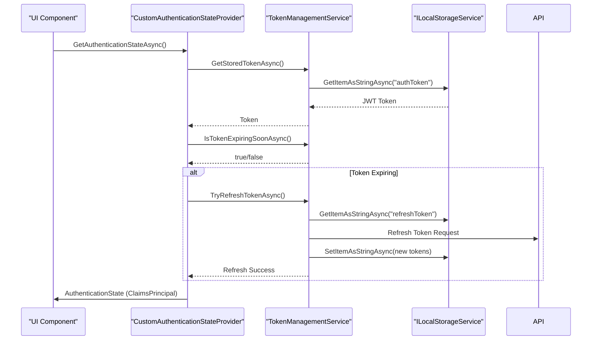
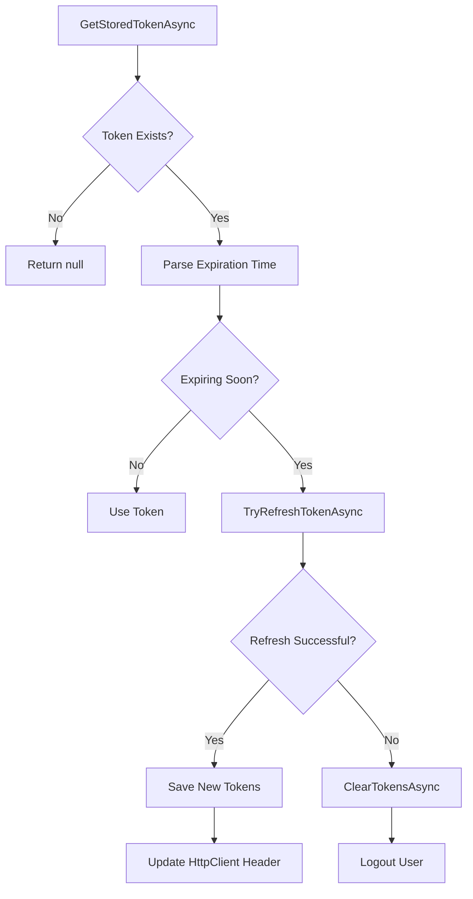
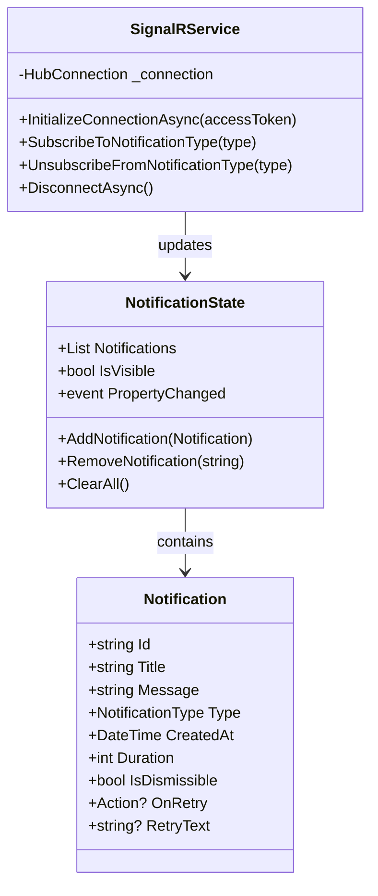
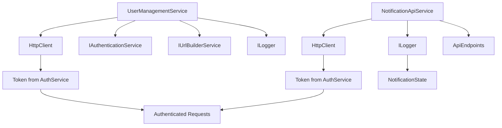

# State Management

<cite>
**Referenced Files in This Document**   
- [CustomAuthenticationStateProvider.cs](file://src/Inventory.Web.Client/CustomAuthenticationStateProvider.cs)
- [TokenManagementService.cs](file://src/Inventory.Web.Client/Services/TokenManagementService.cs)
- [TokenConfiguration.cs](file://src/Inventory.Web.Client/Configuration/TokenConfiguration.cs)
- [NotificationState.cs](file://src/Inventory.Shared/Models/NotificationState.cs)
- [SignalRService.cs](file://src/Inventory.Web.Client/Services/SignalRService.cs)
- [UserManagementService.cs](file://src/Inventory.Web.Client/Services/UserManagementService.cs)
- [NotificationApiService.cs](file://src/Inventory.Shared/Services/NotificationApiService.cs)
- [Program.cs](file://src/Inventory.Web.Client/Program.cs)
</cite>

## Table of Contents
1. [Introduction](#introduction)
2. [Authentication State Management](#authentication-state-management)
3. [JWT Token Handling and Refresh Mechanism](#jwt-token-handling-and-refresh-mechanism)
4. [Real-Time Notification State](#real-time-notification-state)
5. [Service Integration and State Propagation](#service-integration-and-state-propagation)
6. [State Synchronization Between UI and Backend](#state-synchronization-between-ui-and-backend)
7. [Error Handling During State Updates](#error-handling-during-state-updates)
8. [Loading, Success, and Error State Management](#loading-success-and-error-state-management)
9. [Best Practices for Memory Management and Reactive Updates](#best-practices-for-memory-management-and-reactive-updates)
10. [Conclusion](#conclusion)

## Introduction
This document provides a comprehensive overview of the state management system in the InventoryCtrl_2 frontend application. It details how application state is managed through service-based dependency injection, focusing on authentication state, user session management, and real-time notification handling. The integration between Blazor's `AuthenticationStateProvider` and JWT token handling via `TokenManagementService` is explained, along with how services like `NotificationApiService` and `UserManagementService` maintain and propagate state across components. Best practices for avoiding memory leaks and ensuring reactive updates are also covered.

## Authentication State Management

The frontend implements a custom authentication state provider that extends Blazor’s `AuthenticationStateProvider` to manage user authentication state. The `CustomAuthenticationStateProvider` class is responsible for retrieving and validating JWT tokens, parsing user claims, and notifying components of authentication state changes.

It integrates with `TokenManagementService` to securely store and retrieve tokens from local storage, automatically handling token expiration and refresh logic. When a user logs in, the `MarkUserAsAuthenticatedAsync` method is called to update the authentication state and notify all listening components. Similarly, `MarkUserAsLoggedOutAsync` clears tokens and resets the state.

**Diagram sources**
- [CustomAuthenticationStateProvider.cs](file://src/Inventory.Web.Client/CustomAuthenticationStateProvider.cs#L15-L142)
- [TokenManagementService.cs](file://src/Inventory.Web.Client/Services/TokenManagementService.cs#L18-L292)

**Section sources**
- [CustomAuthenticationStateProvider.cs](file://src/Inventory.Web.Client/CustomAuthenticationStateProvider.cs#L15-L142)

## JWT Token Handling and Refresh Mechanism

JWT token handling is centralized in the `TokenManagementService`, which manages access and refresh tokens using `Blazored.LocalStorage`. The service checks token expiration based on a configurable threshold (default: 5 minutes) defined in `TokenConfiguration`. If a token is about to expire, it initiates a refresh using `ITokenRefreshService`.

To prevent race conditions during concurrent refresh attempts, a `SemaphoreSlim` ensures only one refresh operation runs at a time. Failed refresh attempts trigger automatic logout by clearing stored tokens. The service also updates the `HttpClient`'s `Authorization` header with the current bearer token, ensuring all outgoing requests are properly authenticated.

**Diagram sources**
- [TokenManagementService.cs](file://src/Inventory.Web.Client/Services/TokenManagementService.cs#L18-L292)
- [TokenConfiguration.cs](file://src/Inventory.Web.Client/Configuration/TokenConfiguration.cs#L1-L40)

**Section sources**
- [TokenManagementService.cs](file://src/Inventory.Web.Client/Services/TokenManagementService.cs#L18-L292)

## Real-Time Notification State

The notification system uses a reactive state model based on `INotifyPropertyChanged`. The `NotificationState` class maintains a list of active notifications and exposes `IsVisible` and `Notifications` properties that trigger change notifications when updated.

Notifications are added via `AddNotification`, which automatically sets `IsVisible = true`. Removing or clearing notifications updates visibility accordingly. This state is consumed by UI components to dynamically render toast messages.

SignalR integration enables real-time push notifications. The `SignalRService` establishes a persistent connection to the backend hub, allowing the server to push new notifications directly to the client. Upon receiving a notification, the frontend updates the `NotificationState`, triggering immediate UI updates.

**Diagram sources**
- [NotificationState.cs](file://src/Inventory.Shared/Models/NotificationState.cs#L4-L60)
- [SignalRService.cs](file://src/Inventory.Web.Client/Services/SignalRService.cs#L7-L108)

**Section sources**
- [NotificationState.cs](file://src/Inventory.Shared/Models/NotificationState.cs#L4-L60)

## Service Integration and State Propagation

State propagation is achieved through dependency-injected services registered in `Program.cs`. Key services like `UserManagementService` and `NotificationApiService` are registered as scoped instances, ensuring consistent state across components within a user session.

`UserManagementService` uses `IAuthenticationService` to retrieve the current JWT token and includes it in API requests. It handles serialization, error logging, and response deserialization, propagating user data state across the application.

`NotificationApiService` inherits from `BaseApiService`, providing standardized HTTP operations with built-in error handling and logging. It communicates with the backend API to fetch, create, and manage notifications, keeping the local `NotificationState` synchronized.

**Diagram sources**
- [UserManagementService.cs](file://src/Inventory.Web.Client/Services/UserManagementService.cs#L9-L294)
- [NotificationApiService.cs](file://src/Inventory.Shared/Services/NotificationApiService.cs#L8-L94)

**Section sources**
- [UserManagementService.cs](file://src/Inventory.Web.Client/Services/UserManagementService.cs#L9-L294)

## State Synchronization Between UI and Backend

State synchronization occurs through REST API calls orchestrated by service classes. When a user action requires state change (e.g., updating a user), `UserManagementService` sends a PUT request to the backend. Upon success, the updated data is returned and can be used to update local state.

For real-time updates, SignalR pushes changes from the server to all connected clients. For example, when a new inventory alert is generated, the backend broadcasts it via `NotificationHub`, which the frontend receives and adds to `NotificationState`.

The `InterceptedHttpClient` with `JwtHttpInterceptor` ensures all HTTP requests include valid authentication tokens, while `ResilientApiService` handles transient failures with retry policies, maintaining state consistency even under network instability.

**Section sources**
- [UserManagementService.cs](file://src/Inventory.Web.Client/Services/UserManagementService.cs#L9-L294)
- [SignalRService.cs](file://src/Inventory.Web.Client/Services/SignalRService.cs#L7-L108)

## Error Handling During State Updates

Error handling is implemented at multiple levels. Service methods wrap API calls in try-catch blocks, logging exceptions and returning null or error responses. The `ApiErrorHandler` service standardizes error responses across the application.

When token refresh fails, `TokenManagementService` clears all tokens and triggers logout. Network errors during API calls are handled with retry logic via `ResilientApiService`, configured with exponential backoff.

UI components display user-friendly error messages through the notification system, while detailed logs are captured for debugging. The `ValidationService` ensures input validity before state mutations, preventing invalid state transitions.

**Section sources**
- [TokenManagementService.cs](file://src/Inventory.Web.Client/Services/TokenManagementService.cs#L18-L292)
- [UserManagementService.cs](file://src/Inventory.Web.Client/Services/UserManagementService.cs#L9-L294)

## Loading, Success, and Error State Management

Components manage loading, success, and error states through observable patterns. While waiting for API responses, components display loading spinners. Upon success, they update their state and may show confirmation notifications. On error, they present appropriate feedback.

The `NotificationService` centralizes success and error messaging, allowing consistent user experience. For example, after a successful user update, a success toast is shown; on failure, an error notification appears with optional retry action.

State transitions are reactive: changes to `NotificationState` automatically trigger UI updates due to property change notifications, ensuring immediate visual feedback.

**Section sources**
- [NotificationState.cs](file://src/Inventory.Shared/Models/NotificationState.cs#L4-L60)
- [UserManagementService.cs](file://src/Inventory.Web.Client/Services/UserManagementService.cs#L9-L294)

## Best Practices for Memory Management and Reactive Updates

To prevent memory leaks:
- `SignalRService` properly disposes the `HubConnection` in `DisconnectAsync`
- `TokenManagementService` disposes `SemaphoreSlim` in `Dispose`
- Services are registered as scoped, not singleton, to avoid retaining component references

Reactive updates are ensured by:
- Implementing `INotifyPropertyChanged` in `NotificationState`
- Using `NotifyAuthenticationStateChanged` in authentication provider
- Leveraging Blazor’s built-in state management patterns

The use of `async/await` throughout prevents blocking, and proper exception handling avoids unobserved task exceptions. Dependency injection ensures services are properly lifecycle-managed by the framework.

**Section sources**
- [SignalRService.cs](file://src/Inventory.Web.Client/Services/SignalRService.cs#L7-L108)
- [TokenManagementService.cs](file://src/Inventory.Web.Client/Services/TokenManagementService.cs#L18-L292)

## Conclusion

The InventoryCtrl_2 frontend employs a robust, service-oriented state management architecture. Authentication state is securely managed through JWT tokens with automatic refresh, while real-time notifications are handled via SignalR and reactive state objects. Services propagate state changes consistently across components, with comprehensive error handling and user feedback mechanisms. By following Blazor best practices and implementing proper disposal patterns, the system maintains performance and prevents memory leaks, delivering a responsive and reliable user experience.