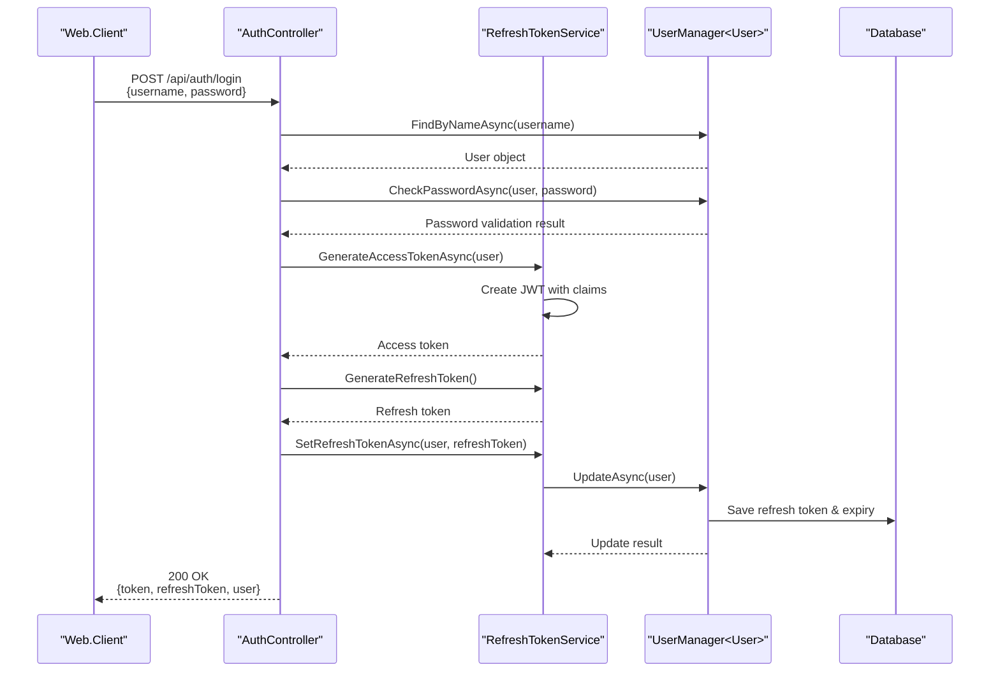
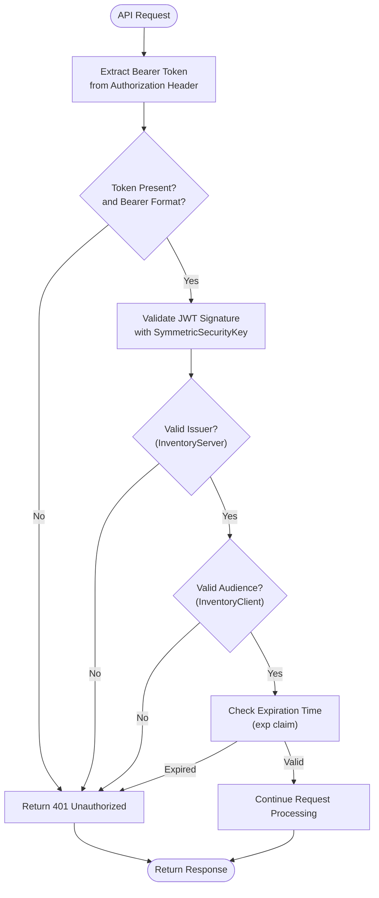
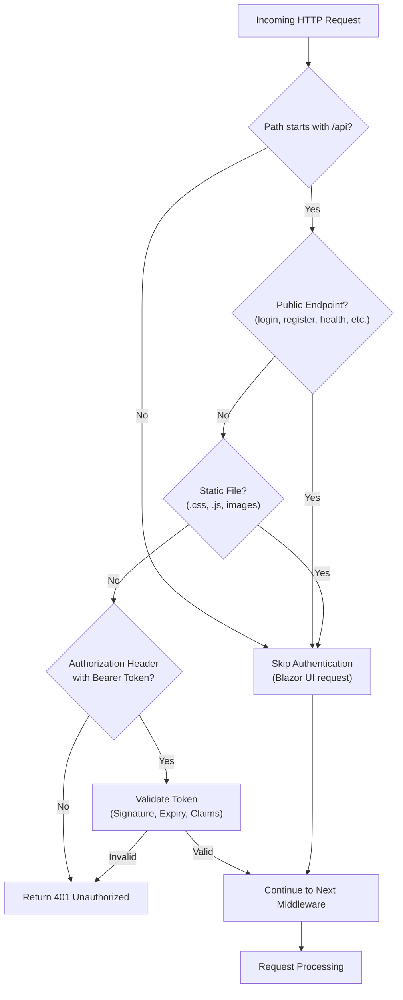
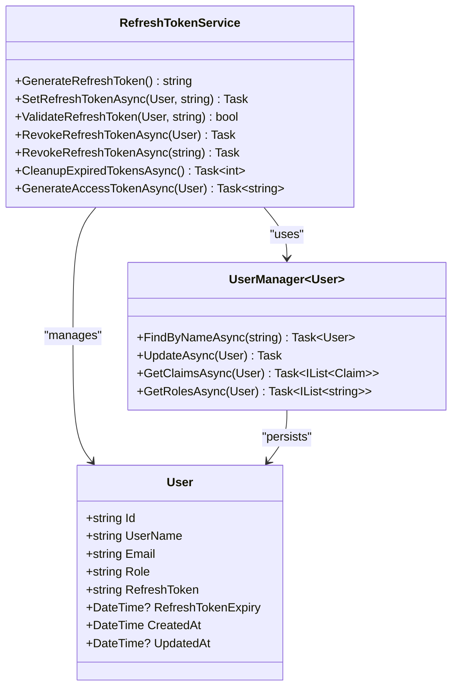
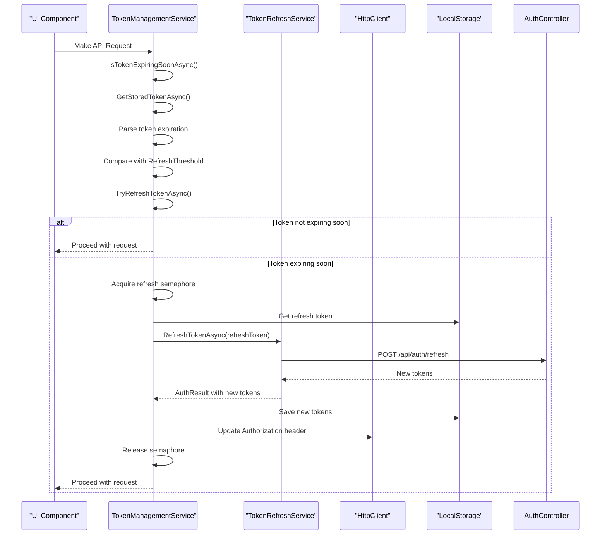

# Authentication

<cite>
**Referenced Files in This Document**  
- [AuthenticationMiddleware.cs](file://src/Inventory.API/Middleware/AuthenticationMiddleware.cs)
- [AuthController.cs](file://src/Inventory.API/Controllers/AuthController.cs)
- [RefreshTokenService.cs](file://src/Inventory.API/Services/RefreshTokenService.cs)
- [TokenManagementService.cs](file://src/Inventory.Web.Client/Services/TokenManagementService.cs)
- [JwtHttpInterceptor.cs](file://src/Inventory.Web.Client/Services/JwtHttpInterceptor.cs)
- [appsettings.json](file://src/Inventory.API/appsettings.json)
- [TokenConfiguration.cs](file://src/Inventory.Web.Client/Configuration/TokenConfiguration.cs)
- [TokenRefreshService.cs](file://src/Inventory.Web.Client/Services/TokenRefreshService.cs)
- [AuthDto.cs](file://src/Inventory.Shared/DTOs/AuthDto.cs)
- [User.cs](file://src/Inventory.API/Models/User.cs)
</cite>

## Table of Contents
1. [Authentication Flow Overview](#authentication-flow-overview)
2. [JWT Token Generation and Validation](#jwt-token-generation-and-validation)
3. [Authentication Middleware](#authentication-middleware)
4. [Refresh Token Service](#refresh-token-service)
5. [Client-Side Token Management](#client-side-token-management)
6. [Login and Logout Workflows](#login-and-logout-workflows)
7. [Configuration Requirements](#configuration-requirements)
8. [Security Considerations](#security-considerations)

## Authentication Flow Overview

The InventoryCtrl_2 system implements a secure JWT-based authentication mechanism with refresh token rotation to maintain user sessions while minimizing security risks. The authentication architecture follows a standard pattern where users authenticate with credentials to obtain a short-lived access token and a long-lived refresh token. The access token is used for API authorization, while the refresh token enables silent renewal of access tokens without requiring re-authentication.

This system integrates with ASP.NET Core Identity for user management and leverages rate limiting to protect against brute force attacks. The authentication flow is designed to be stateless on the server side while maintaining security through token expiration policies, refresh token revocation, and secure storage practices.

**Diagram sources**  
- [AuthController.cs](file://src/Inventory.API/Controllers/AuthController.cs#L17-L296)
- [RefreshTokenService.cs](file://src/Inventory.API/Services/RefreshTokenService.cs#L13-L172)
- [User.cs](file://src/Inventory.API/Models/User.cs#L2-L11)

**Section sources**  
- [AuthController.cs](file://src/Inventory.API/Controllers/AuthController.cs#L17-L296)
- [RefreshTokenService.cs](file://src/Inventory.API/Services/RefreshTokenService.cs#L13-L172)

## JWT Token Generation and Validation

The system uses JSON Web Tokens (JWT) for stateless authentication, with tokens containing user claims and expiration information. The `RefreshTokenService` class is responsible for generating JWT access tokens that include essential user information such as user ID, username, email, roles, and other claims from ASP.NET Core Identity.

Access tokens are configured to expire after a short duration (default 15 minutes) as specified in the `appsettings.json` configuration. This short lifespan reduces the window of opportunity for token misuse if compromised. The token generation process includes standard JWT claims like `sub` (subject), `jti` (JWT ID), and `exp` (expiration) along with custom claims for user roles and identity.

Token validation occurs in the `AuthenticationMiddleware`, which intercepts incoming API requests and verifies the Bearer token's authenticity, signature, issuer, audience, and expiration status. The validation process uses `TokenValidationParameters` to enforce security policies and ensure tokens are properly signed with the server's secret key.

**Diagram sources**  
- [AuthenticationMiddleware.cs](file://src/Inventory.API/Middleware/AuthenticationMiddleware.cs#L7-L166)
- [RefreshTokenService.cs](file://src/Inventory.API/Services/RefreshTokenService.cs#L13-L172)

**Section sources**  
- [AuthenticationMiddleware.cs](file://src/Inventory.API/Middleware/AuthenticationMiddleware.cs#L7-L166)
- [RefreshTokenService.cs](file://src/Inventory.API/Services/RefreshTokenService.cs#L13-L172)

## Authentication Middleware

The `AuthenticationMiddleware` intercepts all incoming HTTP requests to the API endpoints and enforces authentication requirements. This middleware is configured to skip authentication for non-API routes (serving the Blazor UI), public endpoints, and static files, ensuring that only protected API resources require valid tokens.

The middleware implements a comprehensive validation process that checks for the presence of a Bearer token in the Authorization header and validates its integrity using the JWT configuration settings. Public endpoints such as `/api/auth/login`, `/api/auth/register`, `/api/health`, and Swagger documentation are exempt from authentication requirements to allow unauthenticated access to essential services.

When authentication fails, the middleware returns a standardized 401 Unauthorized response with a JSON payload containing error details. The middleware also includes comprehensive logging to track authentication attempts, successes, and failures, which integrates with the system's audit logging functionality for security monitoring.

**Diagram sources**  
- [AuthenticationMiddleware.cs](file://src/Inventory.API/Middleware/AuthenticationMiddleware.cs#L7-L166)

**Section sources**  
- [AuthenticationMiddleware.cs](file://src/Inventory.API/Middleware/AuthenticationMiddleware.cs#L7-L166)

## Refresh Token Service

The `RefreshTokenService` manages the lifecycle of refresh tokens, which are used to obtain new access tokens without requiring users to re-authenticate. This service implements token rotation by generating a new refresh token each time an access token is refreshed, enhancing security by invalidating previous refresh tokens.

Refresh tokens are stored in the database as part of the User entity, with each token associated with an expiration timestamp (default 7 days). The service provides methods to generate cryptographically secure refresh tokens using `RandomNumberGenerator`, validate tokens against stored values, and revoke tokens upon logout or when compromised.

The service includes a cleanup mechanism (`CleanupExpiredTokensAsync`) that removes expired refresh tokens from the database, helping to maintain data integrity and reduce storage overhead. This cleanup can be run periodically as a maintenance task to ensure the refresh token store remains efficient.

**Diagram sources**  
- [RefreshTokenService.cs](file://src/Inventory.API/Services/RefreshTokenService.cs#L13-L172)
- [User.cs](file://src/Inventory.API/Models/User.cs#L2-L11)

**Section sources**  
- [RefreshTokenService.cs](file://src/Inventory.API/Services/RefreshTokenService.cs#L13-L172)

## Client-Side Token Management

On the client side, the `TokenManagementService` in Web.Client handles the storage, retrieval, and automatic refresh of authentication tokens. Tokens are securely stored in the browser's local storage using `Blazored.LocalStorage`, with access token and refresh token kept in separate entries for better management.

The service implements a proactive token refresh strategy, checking if the access token is nearing expiration (configurable threshold, default 5 minutes) and automatically initiating a refresh request before the token expires. This prevents API calls from failing due to expired tokens and provides a seamless user experience.

To prevent race conditions during token refresh, the service uses a `SemaphoreSlim` to ensure only one refresh operation occurs at a time, even when multiple API requests are made simultaneously. The refresh process includes retry logic with configurable attempts and delays to handle transient network issues.

**Diagram sources**  
- [TokenManagementService.cs](file://src/Inventory.Web.Client/Services/TokenManagementService.cs#L18-L292)
- [TokenRefreshService.cs](file://src/Inventory.Web.Client/Services/TokenRefreshService.cs#L1-L93)
- [JwtHttpInterceptor.cs](file://src/Inventory.Web.Client/Services/JwtHttpInterceptor.cs#L10-L38)

**Section sources**  
- [TokenManagementService.cs](file://src/Inventory.Web.Client/Services/TokenManagementService.cs#L18-L292)
- [TokenRefreshService.cs](file://src/Inventory.Web.Client/Services/TokenRefreshService.cs#L1-L93)

## Login and Logout Workflows

The authentication system provides RESTful endpoints for user login, token refresh, and logout operations. The login workflow begins with a POST request to `/api/auth/login` containing username and password credentials. The `AuthController` validates these credentials against ASP.NET Core Identity, logs the attempt for audit purposes, and returns a response containing both access and refresh tokens upon successful authentication.

The token refresh workflow allows clients to obtain a new access token by presenting a valid refresh token to the `/api/auth/refresh` endpoint. This process generates a new access token with a fresh expiration time and issues a new refresh token, implementing token rotation for enhanced security.

The logout workflow at `/api/auth/logout` invalidates the user's refresh token by removing it from the database, effectively preventing future token refresh operations. This endpoint requires authentication, ensuring only the legitimate user can revoke their session.

```mermaid
flowchart TD
subgraph Login
A[Client] --> |POST /api/auth/login| B[AuthController]
B --> C{Validate Credentials}
C --> |Invalid| D[Return 401 Unauthorized]
C --> |Valid| E[Generate Access Token]
E --> F[Generate Refresh Token]
F --> G[Store Refresh Token in DB]
G --> H[Return Tokens to Client]
end
subgraph Refresh
I[Client] --> |POST /api/auth/refresh| J[AuthController]
J --> K{Validate Refresh Token}
K --> |Invalid| L[Return 401 Unauthorized]
K --> |Valid| M[Generate New Access Token]
M --> N[Generate New Refresh Token]
N --> O[Update Refresh Token in DB]
O --> P[Return New Tokens]
end
subgraph Logout
Q[Client] --> |POST /api/auth/logout| R[AuthController]
R --> S{Authenticate Request}
S --> |Invalid| T[Return 401 Unauthorized]
S --> |Valid| U[Revoke Refresh Token]
U --> V[Remove from DB]
V --> W[Return Success]
end
```

**Diagram sources**  
- [AuthController.cs](file://src/Inventory.API/Controllers/AuthController.cs#L17-L296)
- [RefreshTokenService.cs](file://src/Inventory.API/Services/RefreshTokenService.cs#L13-L172)

**Section sources**  
- [AuthController.cs](file://src/Inventory.API/Controllers/AuthController.cs#L17-L296)

## Configuration Requirements

The authentication system requires specific configuration settings in `appsettings.json` to function correctly. The JWT configuration section must include the secret key, issuer, audience, access token expiration time, and refresh token expiration days.

On the client side, `TokenConfiguration` provides settings for token management behavior, including the refresh threshold, retry policies, and logging options. These configurations allow the system to be tuned for different deployment environments and security requirements.

The following table summarizes the key configuration settings:

| Configuration File | Setting | Description | Default Value | Required |
|-------------------|-------|-------------|---------------|----------|
| appsettings.json | Jwt:Key | Secret key for signing JWT tokens | __SET_IN_ENV__ | Yes |
| appsettings.json | Jwt:Issuer | Token issuer identifier | InventoryServer | Yes |
| appsettings.json | Jwt:Audience | Token audience identifier | InventoryClient | Yes |
| appsettings.json | Jwt:ExpireMinutes | Access token expiration in minutes | 15 | Yes |
| appsettings.json | Jwt:RefreshTokenExpireDays | Refresh token expiration in days | 7 | Yes |
| TokenConfiguration.cs | RefreshThresholdMinutes | Minutes before expiration to refresh | 5 | No |
| TokenConfiguration.cs | MaxRefreshRetries | Maximum retry attempts for refresh | 3 | No |
| TokenConfiguration.cs | RefreshRetryDelayMs | Delay between refresh attempts (ms) | 1000 | No |
| TokenConfiguration.cs | EnableAutoRefresh | Enable automatic token refresh | true | No |

**Section sources**  
- [appsettings.json](file://src/Inventory.API/appsettings.json)
- [TokenConfiguration.cs](file://src/Inventory.Web.Client/Configuration/TokenConfiguration.cs)

## Security Considerations

The authentication system implements multiple security measures to protect against common threats. Rate limiting is applied to authentication endpoints using the "AuthPolicy" to prevent brute force attacks by limiting the number of login attempts from a single IP address within a time window.

Token leakage is mitigated through short access token lifespans and refresh token rotation. The system does not store refresh tokens in plaintext but keeps them in the database with no additional encryption, relying on database security measures. Future enhancements could include refresh token hashing or additional encryption.

The client-side implementation follows secure practices by storing tokens in local storage rather than cookies, preventing CSRF attacks while acknowledging the XSS vulnerability trade-off. The `JwtHttpInterceptor` ensures tokens are only sent to authorized endpoints and handles authentication errors gracefully.

Audit logging is integrated throughout the authentication flow, recording successful and failed login attempts with contextual information including IP address, user agent, and timestamps. This provides valuable data for security monitoring and incident response.

Additional security recommendations include:
- Implementing multi-factor authentication for privileged accounts
- Adding refresh token revocation on password change
- Implementing device-based refresh tokens with limited concurrent sessions
- Adding IP address binding to refresh tokens
- Implementing token binding to prevent replay attacks

**Section sources**  
- [AuthenticationMiddleware.cs](file://src/Inventory.API/Middleware/AuthenticationMiddleware.cs#L7-L166)
- [AuthController.cs](file://src/Inventory.API/Controllers/AuthController.cs#L17-L296)
- [RefreshTokenService.cs](file://src/Inventory.API/Services/RefreshTokenService.cs#L13-L172)