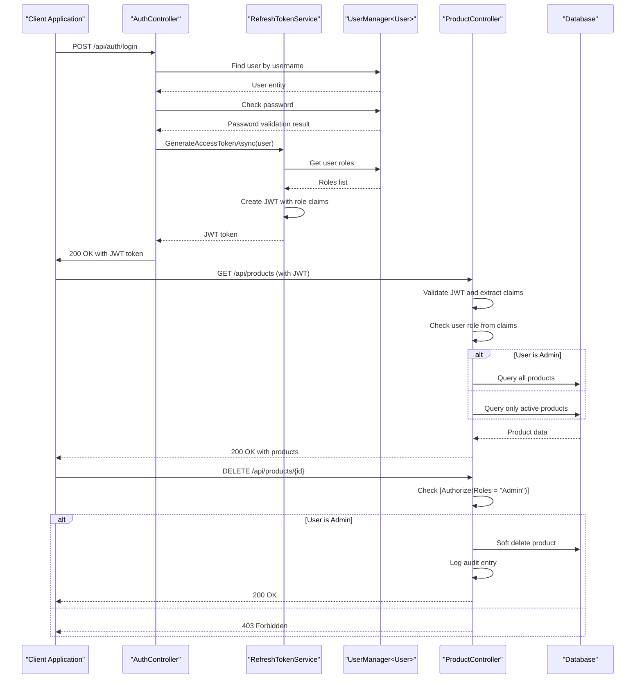

# Authorization

<cite>
**Referenced Files in This Document**   
- [AuthController.cs](file://src/Inventory.API/Controllers/AuthController.cs)
- [RefreshTokenService.cs](file://src/Inventory.API/Services/RefreshTokenService.cs)
- [ProductController.cs](file://src/Inventory.API/Controllers/ProductController.cs)
- [UserController.cs](file://src/Inventory.API/Controllers/UserController.cs)
- [User.cs](file://src/Inventory.API/Models/User.cs)
- [Product.cs](file://src/Inventory.API/Models/Product.cs)
</cite>

## Table of Contents
1. [Introduction](#introduction)
2. [Role Implementation Overview](#role-implementation-overview)
3. [Role Assignment and Management](#role-assignment-and-management)
4. [JWT Token Generation with Role Claims](#jwt-token-generation-with-role-claims)
5. [API Controller Authorization](#api-controller-authorization)
6. [Role-Based Access Control in Controllers](#role-based-access-control-in-controllers)
7. [Authorization Flow Diagram](#authorization-flow-diagram)
8. [Adding and Modifying Roles](#adding-and-modifying-roles)
9. [Testing Authorization Scenarios](#testing-authorization-scenarios)
10. [Common Issues and Troubleshooting](#common-issues-and-troubleshooting)
11. [Role Check Implementation in Services](#role-check-implementation-in-services)
12. [Conclusion](#conclusion)

## Introduction

The InventoryCtrl_2 application implements a robust role-based authorization system using ASP.NET Core Identity and JWT (JSON Web Tokens) with claims-based authentication. This system enforces access control across the API surface, ensuring that users can only perform actions appropriate to their assigned roles. The authorization framework supports three primary roles: Admin, Manager, and User, each with distinct permissions and access levels to system resources.

The implementation follows a claims-based approach where user roles are embedded as claims within JWT tokens during authentication. These tokens are then validated on subsequent requests to determine whether a user has the necessary permissions to access specific endpoints. The system leverages ASP.NET Core's built-in `[Authorize]` attribute with role specifications to declaratively enforce access control at the controller and action levels.

This document provides a comprehensive analysis of the role-based authorization implementation, covering the technical details of role assignment, token generation, access enforcement, and common operational considerations.

**Section sources**
- [AuthController.cs](file://src/Inventory.API/Controllers/AuthController.cs#L17-L296)
- [RefreshTokenService.cs](file://src/Inventory.API/Services/RefreshTokenService.cs#L13-L172)

## Role Implementation Overview

The role-based authorization system in InventoryCtrl_2 is built on ASP.NET Core Identity, which provides the foundation for user management and role-based access control. The system defines three primary roles: Admin, Manager, and User, each representing different levels of access and responsibility within the inventory management application.

The `User` model extends the base `IdentityUser<string>` class and includes a `Role` property that stores the primary role assignment for each user. This property is used in conjunction with ASP.NET Core Identity's role management system to maintain both a primary role designation and a collection of role claims that are embedded in JWT tokens.

Role enforcement is implemented through a combination of declarative attributes and programmatic checks. The `[Authorize(Roles = ...)]` attribute is applied to controller actions to restrict access to specific roles, while additional business logic within controller methods performs fine-grained permission checks based on the user's role.

The system also implements role-based filtering of data, where non-admin users automatically have filters applied to their queries. For example, when retrieving products, non-admin users only see active products by default, while admins can view all products regardless of status.

**Section sources**
- [User.cs](file://src/Inventory.API/Models/User.cs#L4-L4)
- [ProductController.cs](file://src/Inventory.API/Controllers/ProductController.cs#L13-L719)

## Role Assignment and Management

Role assignment in InventoryCtrl_2 occurs at two key points: during user registration and through administrative user management. When a new user registers through the `AuthController.Register` method, they are automatically assigned the "User" role by default. This default role assignment ensures that new users have appropriate baseline permissions without requiring administrative intervention.

```csharp
var user = new Inventory.API.Models.User
{
    Id = Guid.NewGuid().ToString(),
    UserName = request.Username,
    Email = request.Email,
    EmailConfirmed = true,
    Role = "User", // Default role assignment
    CreatedAt = DateTime.UtcNow
};

// Assign role to user
await userManager.AddToRoleAsync(user, "User");
```

Administrative users with the "Admin" role can manage user roles through the `UserController`, which provides endpoints for creating, updating, and managing users. The `UpdateUser` and `CreateUser` methods in the `UserController` allow administrators to assign any role to users, including "Admin", "Manager", or "User".

When a user's role is updated, the system performs the following operations:
1. Removes the user from all current roles using `RemoveFromRolesAsync`
2. Adds the user to the new specified role using `AddToRoleAsync`
3. Updates the user's `Role` property in the database
4. Logs the role change in the audit system

The role management system also includes validation to prevent privilege escalation attacks, such as preventing users from deleting their own accounts or changing their own roles.

**Section sources**
- [AuthController.cs](file://src/Inventory.API/Controllers/AuthController.cs#L245-L296)
- [UserController.cs](file://src/Inventory.API/Controllers/UserController.cs#L12-L534)

## JWT Token Generation with Role Claims

The role-based authorization system embeds user roles in JWT tokens through the `GenerateAccessTokenAsync` method in the `RefreshTokenService` class. This method is responsible for creating JWT access tokens that contain the necessary claims for authentication and authorization.

When generating a token, the service retrieves the user's roles from ASP.NET Core Identity using `userManager.GetRolesAsync(user)` and adds each role as a `ClaimTypes.Role` claim to the token's payload. This ensures that the user's role information is available for authorization decisions on subsequent requests without requiring database queries.

```csharp
public async Task<string> GenerateAccessTokenAsync(User user)
{
    var userClaims = await _userManager.GetClaimsAsync(user);
    var roles = await _userManager.GetRolesAsync(user);

    var claims = new List<Claim>
    {
        new(JwtRegisteredClaimNames.Sub, user.Id),
        new(ClaimTypes.NameIdentifier, user.Id),
        new(ClaimTypes.Name, user.UserName ?? string.Empty),
        new(JwtRegisteredClaimNames.Jti, Guid.NewGuid().ToString()),
        new(JwtRegisteredClaimNames.Email, user.Email ?? string.Empty)
    };

    claims.AddRange(userClaims);
    claims.AddRange(roles.Select(role => new Claim(ClaimTypes.Role, role)));

    // Token creation logic...
}
```

The token generation process also includes standard JWT claims such as the subject (user ID), name identifier, user name, JWT ID (for replay protection), and email. The inclusion of role claims in the token enables efficient authorization decisions, as the API can validate a user's permissions by examining the token's claims without additional database queries.

The system also handles role claims on the client side, where the `CustomAuthenticationStateProvider` parses the JWT token and extracts role claims, supporting both single role strings and role arrays in the token payload.

**Section sources**
- [RefreshTokenService.cs](file://src/Inventory.API/Services/RefreshTokenService.cs#L141-L171)
- [CustomAuthenticationStateProvider.cs](file://src/Inventory.Web.Client/CustomAuthenticationStateProvider.cs#L86-L118)

## API Controller Authorization

The InventoryCtrl_2 application implements role-based authorization at the API controller level using ASP.NET Core's `[Authorize]` attribute. This attribute is applied to controllers and specific actions to enforce access control based on user roles.

The base authorization is applied at the controller level, where most controllers are decorated with the `[Authorize]` attribute without specific roles, requiring users to be authenticated but allowing access to multiple roles. More restrictive role-based authorization is then applied to specific actions using the `[Authorize(Roles = ...)]` syntax.

For example, in the `ProductController`, the `DeleteProduct` action is restricted to users with the "Admin" role:

```csharp
[HttpDelete("{id}")]
[Authorize(Roles = "Admin")]
public async Task<IActionResult> DeleteProduct(int id)
{
    // Implementation...
}
```

The system also implements programmatic authorization checks within controller actions for more complex scenarios. For instance, when creating or updating products, the system checks whether the user has permission to set or modify the `IsActive` status:

```csharp
// Check if user has permission to set IsActive
var userRole = User.FindFirst(ClaimTypes.Role)?.Value;
if (userRole != "Admin" && request.IsActive != true)
{
    return Forbid("Only administrators can create inactive products");
}
```

This hybrid approach of declarative and programmatic authorization provides flexibility in enforcing access control, allowing for both simple role-based restrictions and more complex business logic-based permission checks.

**Section sources**
- [ProductController.cs](file://src/Inventory.API/Controllers/ProductController.cs#L13-L719)
- [UserController.cs](file://src/Inventory.API/Controllers/UserController.cs#L12-L534)

## Role-Based Access Control in Controllers

The role-based access control implementation in InventoryCtrl_2 is demonstrated through specific examples in the `ProductController` and `UserController`. These controllers showcase how different roles have varying levels of access to system functionality.

In the `ProductController`, role-based permissions are implemented as follows:
- **Admin**: Full access to all product operations, including creating inactive products, modifying the `IsActive` status, and deleting products
- **Manager**: Can view, create, update, and adjust stock for products, but cannot create inactive products or delete products
- **User**: Can view products and adjust stock, but cannot create, update, or delete products

The `UserController` demonstrates administrative role-based access, where only users with the "Admin" role can:
- View all users
- Create new users
- Update user information and roles
- Delete users
- Change user passwords
- Export user data

Regular users can only access their own user information through the `GetUserInfo` endpoint, which does not have role restrictions but only returns information about the authenticated user.

The system also implements role-based data filtering, where non-admin users automatically have filters applied to their queries. For example, when retrieving products, non-admin users only see active products by default:

```csharp
if (isActive.HasValue)
{
    query = query.Where(p => p.IsActive == isActive.Value);
}
else
{
    // By default, show only active products for non-admin users
    var userRole = User.FindFirst(ClaimTypes.Role)?.Value;
    if (userRole != "Admin")
    {
        query = query.Where(p => p.IsActive);
    }
}
```

This approach ensures that users only see data appropriate to their role without requiring separate endpoints for different user types.

**Section sources**
- [ProductController.cs](file://src/Inventory.API/Controllers/ProductController.cs#L13-L719)
- [UserController.cs](file://src/Inventory.API/Controllers/UserController.cs#L12-L534)

## Authorization Flow Diagram



**Diagram sources**
- [AuthController.cs](file://src/Inventory.API/Controllers/AuthController.cs#L17-L296)
- [RefreshTokenService.cs](file://src/Inventory.API/Services/RefreshTokenService.cs#L141-L171)
- [ProductController.cs](file://src/Inventory.API/Controllers/ProductController.cs#L13-L719)

## Adding and Modifying Roles

While the current implementation supports the Admin, Manager, and User roles, the system can be extended to support additional roles. To add new roles, administrators can use the existing user management endpoints in the `UserController` to assign new role names to users.

To modify role permissions, developers need to update the authorization logic in the relevant controllers. For example, to grant the "Manager" role permission to delete products, the `[Authorize(Roles = "Admin")]` attribute on the `DeleteProduct` action in the `ProductController` would need to be modified:

```csharp
[HttpDelete("{id}")]
[Authorize(Roles = "Admin,Manager")]
public async Task<IActionResult> DeleteProduct(int id)
{
    // Implementation...
}
```

Alternatively, more granular permission control can be implemented using policy-based authorization, where specific policies are defined in the `Program.cs` file and referenced by name in controller actions. This approach provides greater flexibility in defining complex authorization rules that can combine multiple requirements.

When modifying role permissions, it's important to consider the principle of least privilege and ensure that role changes are properly logged in the audit system. The existing audit logging infrastructure automatically records user management operations, including role changes, providing an audit trail for security reviews.

**Section sources**
- [ProductController.cs](file://src/Inventory.API/Controllers/ProductController.cs#L13-L719)
- [UserController.cs](file://src/Inventory.API/Controllers/UserController.cs#L12-L534)

## Testing Authorization Scenarios

The InventoryCtrl_2 application includes unit tests in the `Inventory.UnitTests` project that verify the correct behavior of role-based authorization. These tests validate that users with appropriate roles can access protected endpoints while users with insufficient permissions receive appropriate error responses.

To test authorization scenarios, developers can use the following approach:
1. Create test users with specific roles using the `TestUsers` class in the test project
2. Authenticate as the test user to obtain a JWT token with the appropriate role claims
3. Make requests to protected endpoints and verify the response status code
4. Validate that the expected data is returned or that appropriate error messages are provided

The test suite includes specific tests for role-based access in controllers, such as `ProductControllerRoleTests`, which verify that:
- Admin users can perform all product operations
- Non-admin users cannot delete products
- Only admins can create inactive products
- Role-based filtering is applied correctly to queries

When adding new authorization rules, corresponding tests should be added to ensure that the security controls work as intended and to prevent regression in future updates.

**Section sources**
- [ProductController.cs](file://src/Inventory.API/Controllers/ProductController.cs#L13-L719)
- [UserController.cs](file://src/Inventory.API/Controllers/UserController.cs#L12-L534)

## Common Issues and Troubleshooting

Several common issues can arise with the role-based authorization system in InventoryCtrl_2:

**Role claim missing in token**: This occurs when a user's roles are not properly synchronized between the `User.Role` property and the ASP.NET Core Identity role system. To resolve this, ensure that `userManager.AddToRoleAsync()` is called whenever a user's role is assigned or changed.

**Incorrect role assignment**: This can happen when the `Role` property in the `User` model becomes out of sync with the actual roles assigned through ASP.NET Core Identity. The system should always use `userManager.GetRolesAsync()` to determine a user's roles rather than relying solely on the `Role` property.

**Elevation of privilege vulnerabilities**: These can occur if programmatic authorization checks are not properly implemented. For example, in the `ProductController`, the check for modifying `IsActive` status must be performed for both create and update operations to prevent non-admin users from creating inactive products.

**Token expiration issues**: Since role information is embedded in JWT tokens, changes to a user's roles will not take effect until the user obtains a new token. This can be addressed by implementing token refresh mechanisms or by shortening token expiration times.

To troubleshoot authorization issues, developers should:
1. Verify the JWT token contents using a tool like jwt.io to ensure role claims are present
2. Check the audit logs for user management operations to verify role assignments
3. Review the controller logic for both declarative and programmatic authorization checks
4. Test with different user roles to ensure the expected behavior

**Section sources**
- [AuthController.cs](file://src/Inventory.API/Controllers/AuthController.cs#L17-L296)
- [RefreshTokenService.cs](file://src/Inventory.API/Services/RefreshTokenService.cs#L141-L171)
- [ProductController.cs](file://src/Inventory.API/Controllers/ProductController.cs#L13-L719)

## Role Check Implementation in Services

Role checks are implemented not only in controllers but also in services where business logic requires role-based decision making. The system uses the `User.FindFirst(ClaimTypes.Role)` method to retrieve the user's role from the current authentication context.

In the `ProductController`, role checks are used to enforce business rules such as:
- Only admins can create inactive products
- Only admins can modify the `IsActive` status of existing products
- Non-admin users only see active products by default

These checks are performed programmatically within controller actions, allowing for fine-grained control over authorization decisions. The pattern follows a consistent approach:

```csharp
var userRole = User.FindFirst(ClaimTypes.Role)?.Value;
if (userRole != "Admin" && request.IsActive != true)
{
    return Forbid("Only administrators can create inactive products");
}
```

This implementation ensures that authorization decisions are made close to the business logic they protect, making the security controls more maintainable and easier to understand. The use of clear error messages also helps administrators diagnose authorization issues when they occur.

**Section sources**
- [ProductController.cs](file://src/Inventory.API/Controllers/ProductController.cs#L13-L719)
- [UserController.cs](file://src/Inventory.API/Controllers/UserController.cs#L12-L534)

## Conclusion

The role-based authorization system in InventoryCtrl_2 provides a comprehensive security framework that effectively controls access to application resources based on user roles. By leveraging ASP.NET Core Identity and JWT claims, the system implements a scalable and maintainable approach to authorization that balances security with usability.

The implementation successfully enforces the principle of least privilege through a combination of declarative attributes and programmatic checks, ensuring that users can only perform actions appropriate to their roles. The integration with audit logging provides visibility into authorization decisions and user management operations, supporting security monitoring and compliance requirements.

Key strengths of the implementation include:
- Clear separation of concerns between authentication and authorization
- Consistent use of role claims in JWT tokens
- Comprehensive coverage of role-based access control across the API surface
- Integration with audit logging for security monitoring
- Flexible design that allows for extension to support additional roles and permissions

The system could be further enhanced by implementing policy-based authorization for more complex scenarios and by adding role hierarchy support if needed. However, the current implementation provides a solid foundation for secure access control in the inventory management application.