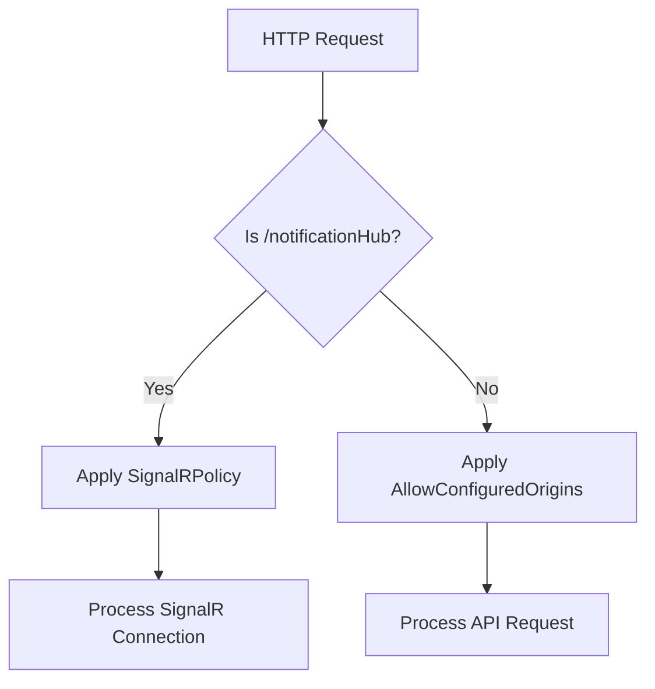
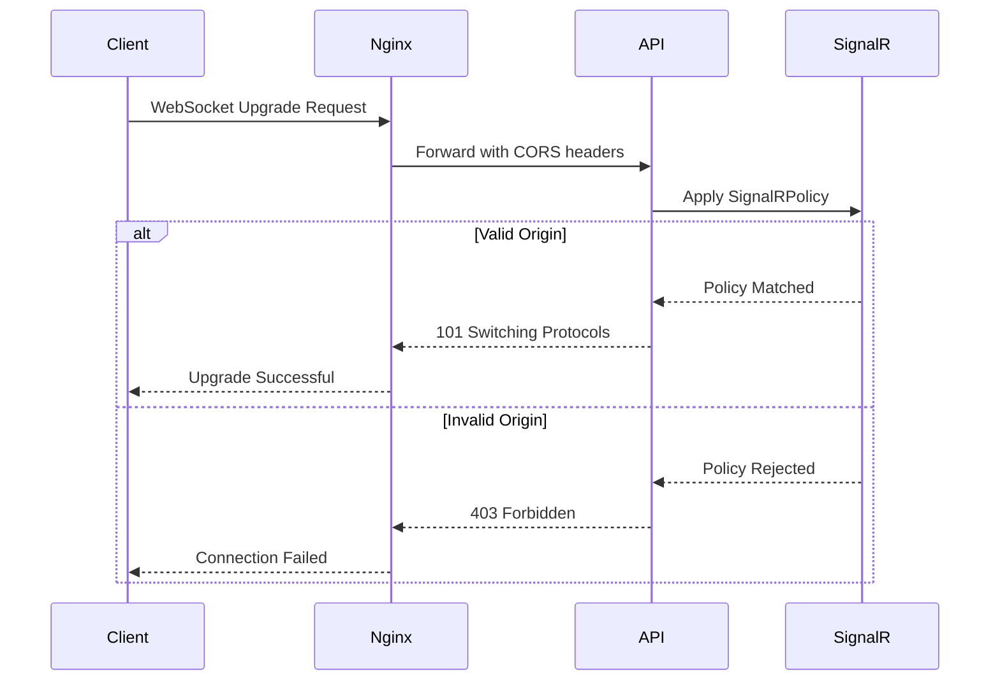
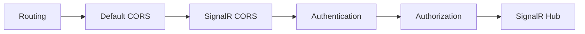
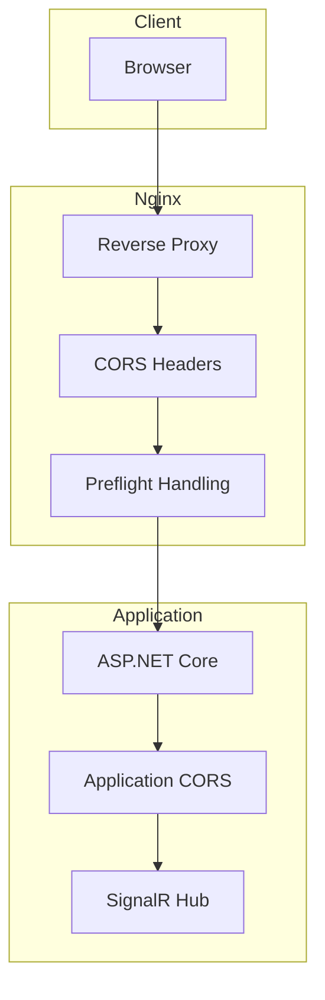

# CORS Policy

<cite>
**Referenced Files in This Document**   
- [Program.cs](file://src/Inventory.API/Program.cs)
- [ServiceCollectionExtensions.cs](file://src/Inventory.API/Extensions/ServiceCollectionExtensions.cs)
- [locations.conf](file://deploy/nginx/conf.d/locations.conf)
- [appsettings.Production.json](file://src/Inventory.API/appsettings.Production.json)
</cite>

## Table of Contents
1. [Introduction](#introduction)
2. [CORS Policies in InventoryCtrl_2](#cors-policies-in-inventoryctrl_2)
3. [Default CORS Policy Configuration](#default-cors-policy-configuration)
4. [SignalRPolicy for WebSocket Connections](#signalrpolicy-for-websocket-connections)
5. [Middleware Order and Execution Flow](#middleware-order-and-execution-flow)
6. [nginx Reverse Proxy CORS Configuration](#nginx-reverse-proxy-cors-configuration)
7. [Production Security Best Practices](#production-security-best-practices)
8. [Common CORS Errors and Troubleshooting](#common-cors-errors-and-troubleshooting)
9. [CORS and Authentication Headers](#cors-and-authentication-headers)
10. [Conclusion](#conclusion)

## Introduction
Cross-Origin Resource Sharing (CORS) is a critical security mechanism that enables controlled access to resources across different domains. In the InventoryCtrl_2 application, CORS is configured at both the application level using ASP.NET Core middleware and at the infrastructure level via nginx reverse proxy. This document details the implementation of two distinct CORS policies: a default policy for general API access and a specialized 'SignalRPolicy' for WebSocket-based SignalR hub connections. It also covers configuration precedence, security implications, and troubleshooting strategies for cross-origin requests.

**Section sources**
- [Program.cs](file://src/Inventory.API/Program.cs#L1-L50)

## CORS Policies in InventoryCtrl_2
The InventoryCtrl_2 application implements two separate CORS policies to handle different types of client requests. The first is a general-purpose policy named "AllowConfiguredOrigins" applied to all API endpoints, while the second is a specialized policy called "SignalRPolicy" specifically designed for SignalR WebSocket connections. These policies are defined in the application's startup configuration and are applied in sequence during the HTTP request pipeline processing. The dual-policy approach allows for fine-grained control over cross-origin access, with the SignalR policy providing the necessary credentials support required for authenticated real-time communication.

**Diagram sources**
- [Program.cs](file://src/Inventory.API/Program.cs#L158-L219)
- [ServiceCollectionExtensions.cs](file://src/Inventory.API/Extensions/ServiceCollectionExtensions.cs#L5-L33)

**Section sources**
- [Program.cs](file://src/Inventory.API/Program.cs#L158-L219)
- [ServiceCollectionExtensions.cs](file://src/Inventory.API/Extensions/ServiceCollectionExtensions.cs#L5-L33)

## Default CORS Policy Configuration
The default CORS policy, named "AllowConfiguredOrigins", is configured through the `AddCorsConfiguration` extension method in `ServiceCollectionExtensions.cs`. This policy reads allowed origins from the `CORS_ALLOWED_ORIGINS` environment variable, which should contain a comma-separated list of trusted domains. When this environment variable is not set, the policy defaults to allowing connections from common localhost URLs used during development, including various ports and protocols. The policy permits any HTTP headers and methods while explicitly allowing credentials, which is essential for authenticated requests. This configuration ensures that during development, frontend applications running on standard ports can communicate with the API without CORS restrictions.

**Section sources**
- [ServiceCollectionExtensions.cs](file://src/Inventory.API/Extensions/ServiceCollectionExtensions.cs#L5-L33)

## SignalRPolicy for WebSocket Connections
The 'SignalRPolicy' is specifically designed to support WebSocket connections for the SignalR notification hub. Defined in `Program.cs`, this policy follows the same origin configuration logic as the default policy, reading from the `CORS_ALLOWED_ORIGINS` environment variable with the same localhost fallbacks. However, it is explicitly applied only to the `/notificationHub` endpoint. The policy configuration includes `AllowCredentials()` which is required for SignalR connections that need to pass authentication tokens. This policy allows any headers and methods, accommodating the WebSocket handshake process and subsequent message exchanges. The explicit policy application ensures that only trusted origins can establish real-time connections with the server.

**Diagram sources**
- [Program.cs](file://src/Inventory.API/Program.cs#L184-L219)
- [locations.conf](file://deploy/nginx/conf.d/locations.conf#L28-L64)

**Section sources**
- [Program.cs](file://src/Inventory.API/Program.cs#L184-L219)

## Middleware Order and Execution Flow
The order of middleware execution in the HTTP request pipeline is crucial for proper CORS handling. In `Program.cs`, the CORS middleware is applied after routing (`app.UseRouting()`) but before authentication (`app.UseAuthentication()`). The default CORS policy is applied globally using `app.ConfigureCors()`, while the SignalR-specific policy is applied immediately afterward with `app.UseCors("SignalRPolicy")`. This sequence ensures that the routing system first determines the request destination, allowing the appropriate CORS policy to be applied before authentication checks occur. For SignalR hub connections, this order enables the WebSocket handshake to properly validate origin credentials before establishing the authenticated connection.

**Diagram sources**
- [Program.cs](file://src/Inventory.API/Program.cs#L412-L415)

**Section sources**
- [Program.cs](file://src/Inventory.API/Program.cs#L412-L415)

## nginx Reverse Proxy CORS Configuration
The nginx reverse proxy provides an additional layer of CORS enforcement through the `locations.conf` configuration file. For API routes under `/api/`, nginx adds CORS headers including `Access-Control-Allow-Origin` with the dynamic `$http_origin` value, supporting all standard HTTP methods. The configuration includes explicit handling of preflight OPTIONS requests, returning appropriate CORS headers with a 204 No Content response. For the SignalR hub at `/notificationHub`, similar CORS headers are applied with WebSocket-specific proxy settings. The nginx-level CORS configuration acts as a first line of defense, potentially overriding or supplementing the application-level CORS policies depending on deployment configuration.

**Diagram sources**
- [locations.conf](file://deploy/nginx/conf.d/locations.conf#L0-L64)

**Section sources**
- [locations.conf](file://deploy/nginx/conf.d/locations.conf#L0-L64)

## Production Security Best Practices
In production environments, CORS configuration must prioritize security while maintaining functionality. The `appsettings.Production.json` file indicates that the application is configured to use the nginx proxy for CORS handling (`UseNginxProxy: true`), which suggests that infrastructure-level CORS controls should be the primary enforcement mechanism. Wildcard origins (`*`) must be avoided, especially when `AllowCredentials` is enabled, as this would create a serious security vulnerability. Instead, specific trusted domains should be listed in the `CORS_ALLOWED_ORIGINS` environment variable. The configuration should also ensure that `Access-Control-Allow-Credentials` is only sent when absolutely necessary, particularly for SignalR connections that require authenticated sessions.

**Section sources**
- [appsettings.Production.json](file://src/Inventory.API/appsettings.Production.json#L1-L17)

## Common CORS Errors and Troubleshooting
Common CORS issues in InventoryCtrl_2 typically manifest as blocked cross-origin requests with specific error messages in browser developer tools. Preflight requests may fail when the OPTIONS method is not properly handled, resulting in 403 or 405 errors. The nginx configuration explicitly handles preflight requests with appropriate CORS headers and a 204 response. Another common issue occurs when credentials are required but not properly allowed in the CORS policy, leading to authentication failures in SignalR connections. Troubleshooting should begin by verifying the `CORS_ALLOWED_ORIGINS` environment variable, checking both application and nginx logs, and confirming that the request origin matches exactly with configured allowed origins (including protocol and port). Browser developer tools can be used to inspect preflight request headers and identify policy mismatches.

**Section sources**
- [locations.conf](file://deploy/nginx/conf.d/locations.conf#L0-L64)
- [Program.cs](file://src/Inventory.API/Program.cs#L184-L219)

## CORS and Authentication Headers
The interaction between CORS and authentication is critical for secure application operation. When `AllowCredentials` is enabled in both the application-level CORS policies and nginx configuration, browsers are permitted to include authentication information such as cookies and authorization headers in cross-origin requests. For JWT-based authentication used in InventoryCtrl_2, this allows the Authorization header with Bearer tokens to be sent with API requests. The SignalR configuration in `Program.cs` includes special event handlers that extract JWT tokens from both the Authorization header and query string parameters, ensuring authentication works correctly through the CORS-enabled WebSocket connection. However, this capability requires careful configuration to prevent CSRF vulnerabilities, particularly by ensuring that credentials are only accepted from trusted, explicitly allowed origins.

**Section sources**
- [Program.cs](file://src/Inventory.API/Program.cs#L158-L187)

## Conclusion
The CORS configuration in InventoryCtrl_2 implements a comprehensive, multi-layered approach to cross-origin resource sharing that balances security and functionality. By defining separate policies for general API access and SignalR WebSocket connections, the application can provide appropriate access controls for different types of client interactions. The combination of application-level middleware and nginx reverse proxy configuration creates redundant security layers that can be tuned based on deployment environment. Proper configuration of allowed origins, careful management of credentials, and correct middleware ordering are essential for ensuring that cross-origin requests work reliably while maintaining application security. Regular review of CORS settings, particularly in production environments, is recommended to prevent security vulnerabilities while supporting legitimate client applications.