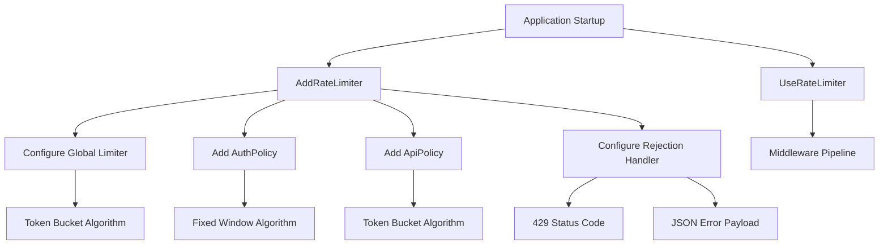
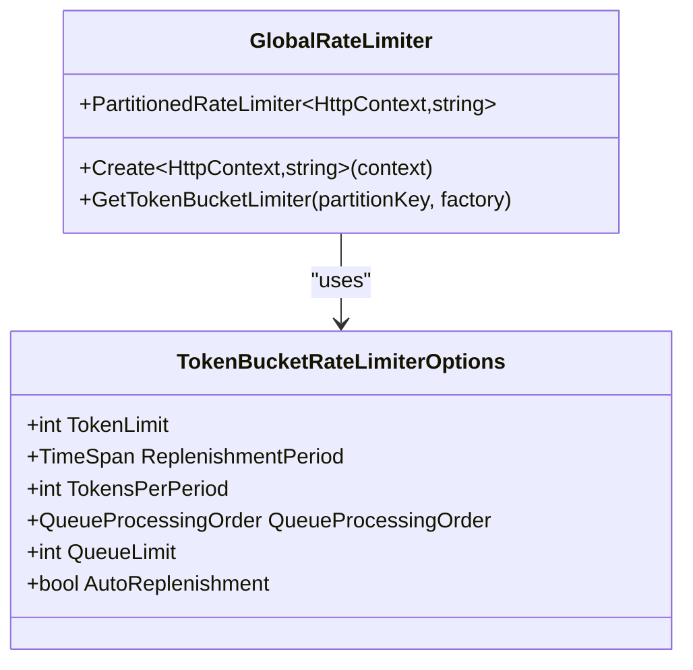
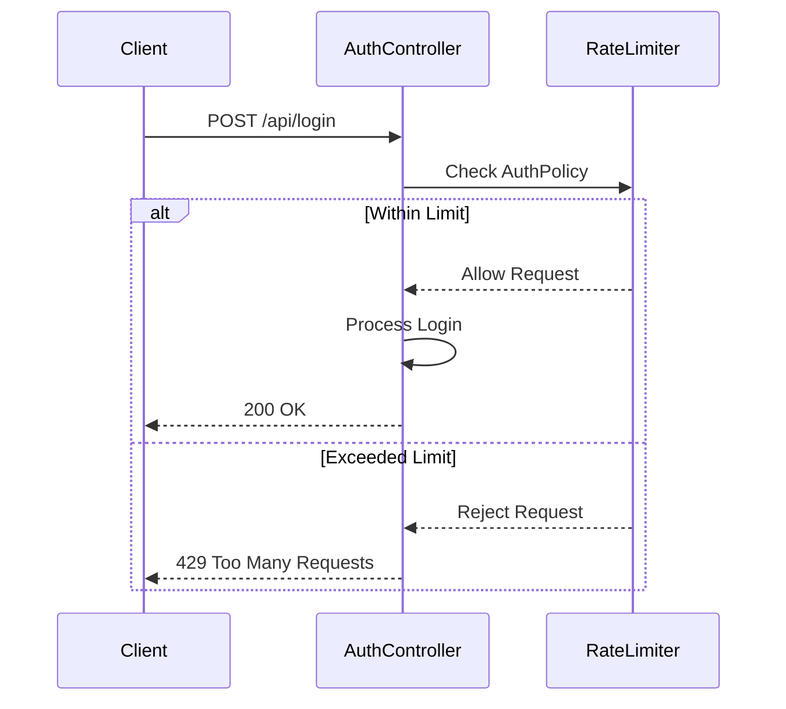
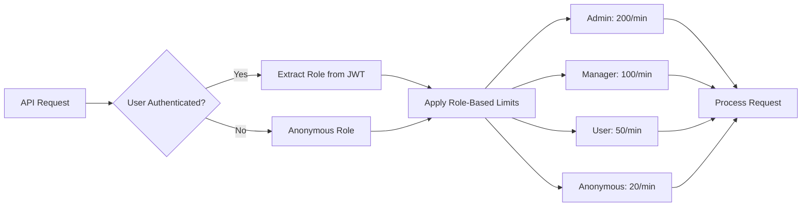
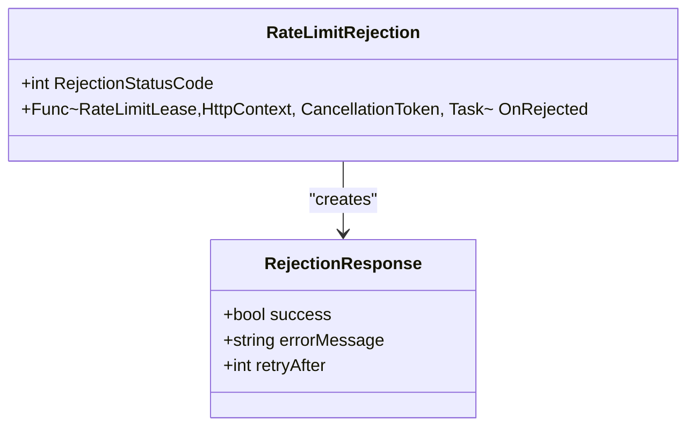
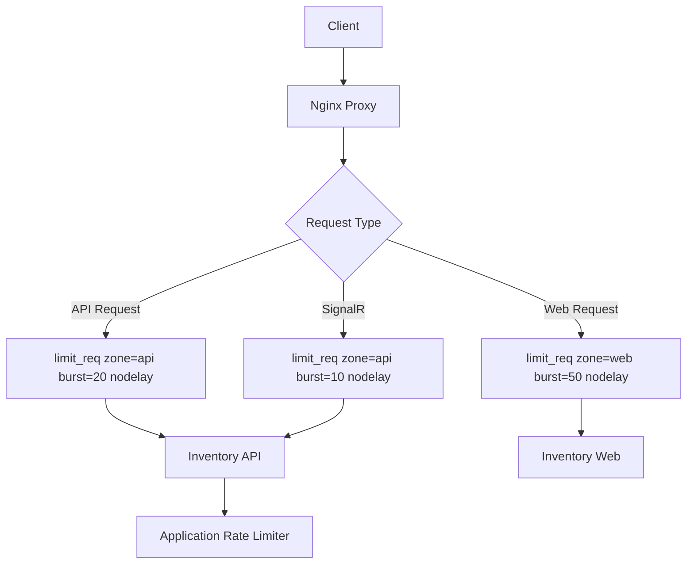

# Rate Limiting

<cite>
**Referenced Files in This Document**   
- [Program.cs](file://src/Inventory.API/Program.cs)
- [locations.conf](file://deploy/nginx/conf.d/locations.conf)
- [AuthController.cs](file://src/Inventory.API/Controllers/AuthController.cs)
- [appsettings.json](file://src/Inventory.API/appsettings.json)
- [appsettings.Production.json](file://src/Inventory.API/appsettings.Production.json)
</cite>

## Table of Contents
1. [Introduction](#introduction)
2. [Rate Limiter Configuration](#rate-limiter-configuration)
3. [Global Rate Limiting Policy](#global-rate-limiting-policy)
4. [Authentication Policy](#authentication-policy)
5. [API Protection Policy](#api-protection-policy)
6. [Rejection Response Format](#rejection-response-format)
7. [Nginx Integration](#nginx-integration)
8. [Configuration Options](#configuration-options)
9. [Rate-Limited Scenarios](#rate-limited-scenarios)
10. [Client-Side Handling](#client-side-handling)
11. [Performance Implications](#performance-implications)

## Introduction
The InventoryCtrl_2 application implements a comprehensive rate limiting strategy using ASP.NET Core's RateLimiter middleware to protect against abuse and ensure system stability. The implementation combines application-level rate limiting with infrastructure-level protection through nginx, creating a multi-layered defense system. This document details the configuration, policies, and integration points for the rate limiting implementation across the application.

**Section sources**
- [Program.cs](file://src/Inventory.API/Program.cs#L252-L418)
- [locations.conf](file://deploy/nginx/conf.d/locations.conf#L1-L122)

## Rate Limiter Configuration
The rate limiting system is configured in the application's startup process within Program.cs. The ASP.NET Core RateLimiter middleware is added to the service collection with multiple policies that address different security and performance requirements. The configuration establishes global limits, endpoint-specific policies, and custom rejection handling to provide a comprehensive protection strategy.



**Diagram sources**
- [Program.cs](file://src/Inventory.API/Program.cs#L252-L386)

**Section sources**
- [Program.cs](file://src/Inventory.API/Program.cs#L252-L386)

## Global Rate Limiting Policy
The application implements a global rate limiting policy that partitions request limits based on user roles. This role-based approach ensures that different user types have appropriate access levels while protecting system resources. The policy uses the token bucket algorithm with replenishment every minute, allowing for burst handling within defined limits.



**Diagram sources**
- [Program.cs](file://src/Inventory.API/Program.cs#L283-L314)

**Section sources**
- [Program.cs](file://src/Inventory.API/Program.cs#L283-L314)

### Role-Based Limits
The global rate limiter applies different limits based on user roles extracted from JWT claims:

- **Admin**: 1,000 requests per minute
- **Manager**: 500 requests per minute  
- **User**: 100 requests per minute
- **Anonymous**: 50 requests per minute

Each role has a token bucket with the token limit and replenishment rate set to the same value, effectively creating a fixed limit per minute. The configuration includes a queue limit of 10 requests with oldest-first processing order, allowing for temporary bursts while maintaining overall rate control.

## Authentication Policy
The 'AuthPolicy' specifically protects authentication endpoints against brute force attacks using a fixed window algorithm. This policy is applied to login and registration endpoints to prevent credential stuffing and account enumeration attacks.



**Diagram sources**
- [Program.cs](file://src/Inventory.API/Program.cs#L315-L330)
- [AuthController.cs](file://src/Inventory.API/Controllers/AuthController.cs#L32-L34)

**Section sources**
- [Program.cs](file://src/Inventory.API/Program.cs#L315-L330)
- [AuthController.cs](file://src/Inventory.API/Controllers/AuthController.cs#L32-L132)

### Fixed Window Configuration
The authentication policy uses the following parameters:

- **Permit Limit**: 5 attempts per window
- **Window Duration**: 15 minutes
- **Queue Limit**: 2 requests
- **Partition Key**: Client IP address

The policy partitions limits by the client's remote IP address rather than user identity, preventing attackers from cycling through different usernames. This approach effectively mitigates brute force attacks while allowing legitimate users reasonable retry opportunities.

## API Protection Policy
The 'ApiPolicy' provides general API protection with role-based token bucket limits that are more restrictive than the global policy. This policy is designed to protect specific high-value endpoints while allowing the global policy to handle general API traffic.



**Diagram sources**
- [Program.cs](file://src/Inventory.API/Program.cs#L331-L350)

**Section sources**
- [Program.cs](file://src/Inventory.API/Program.cs#L331-L350)

### Policy Application
The ApiPolicy applies the following limits:

- **Admin**: 200 requests per minute
- **Manager**: 100 requests per minute
- **User**: 50 requests per minute
- **Anonymous**: 20 requests per minute

With a queue limit of 5 requests and oldest-first processing order, this policy provides a balance between protecting API resources and accommodating legitimate usage patterns. The more restrictive limits compared to the global policy suggest this is intended for specific high-value endpoints.

## Rejection Response Format
When a client exceeds rate limits, the system returns a standardized rejection response with appropriate HTTP status codes and JSON payload. This consistent format enables client applications to handle rate limiting scenarios predictably.



**Diagram sources**
- [Program.cs](file://src/Inventory.API/Program.cs#L351-L386)

**Section sources**
- [Program.cs](file://src/Inventory.API/Program.cs#L351-L386)

### Response Details
The rejection response includes:

- **HTTP Status Code**: 429 Too Many Requests
- **Content Type**: application/json
- **JSON Payload**:
  - `success`: false
  - `errorMessage`: "Rate limit exceeded. Please try again later."
  - `retryAfter`: 60 (seconds)

The rejection handler is configured globally and applies to all rate limiting policies, ensuring consistent client experience across different rate limiting scenarios.

## Nginx Integration
The application integrates with nginx at the infrastructure level to provide an additional layer of rate limiting protection. This multi-layered approach ensures protection even if the application-level rate limiting is bypassed.



**Diagram sources**
- [locations.conf](file://deploy/nginx/conf.d/locations.conf#L1-L45)
- [Program.cs](file://src/Inventory.API/Program.cs#L418)

**Section sources**
- [locations.conf](file://deploy/nginx/conf.d/locations.conf#L1-L45)

### Nginx Configuration
The nginx configuration in locations.conf defines rate limiting at the reverse proxy level:

- **API Routes**: `limit_req zone=api burst=20 nodelay`
- **SignalR Hub**: `limit_req zone=api burst=10 nodelay`
- **Web Requests**: `limit_req zone=web burst=50 nodelay`

This infrastructure-level protection complements the application-level rate limiting by providing an additional barrier against abuse. The burst parameter allows for temporary traffic spikes while maintaining overall rate control.

## Configuration Options
The rate limiting system provides several configuration options that can be adjusted based on deployment requirements and performance characteristics.

### Queue Overflow Handling
The system handles queue overflow through the following configuration:

- **Queue Processing Order**: OldestFirst for all policies
- **Queue Limit**: 10 for global policy, 5 for ApiPolicy, 2 for AuthPolicy
- **Rejection Behavior**: Immediate rejection when queue is full

The oldest-first processing order ensures that requests are handled in the order they were received, preventing starvation of earlier requests.

### Logging Configuration
Rate limiting events are integrated with the application's logging system through Serilog. While specific rate limiting logs are not explicitly configured, the global Serilog configuration in appsettings.json controls the logging level:

```json
"Serilog": {
    "MinimumLevel": {
        "Default": "Information",
        "Override": {
            "Microsoft": "Warning",
            "Microsoft.AspNetCore": "Warning",
            "System": "Warning"
        }
    }
}
```

In production environments, the logging level is reduced to "Warning" to minimize log volume while still capturing critical events.

**Section sources**
- [appsettings.json](file://src/Inventory.API/appsettings.json#L50-L74)
- [appsettings.Production.json](file://src/Inventory.API/appsettings.Production.json#L8-L17)

## Rate-Limited Scenarios
Several scenarios trigger rate limiting in the application, each with specific implications for users and system behavior.

### Authentication Attempts
When a client exceeds the 5-attempt limit within 15 minutes for login endpoints:

1. Subsequent login requests receive 429 responses
2. The client must wait for the current window to expire
3. The counter resets automatically at the end of the 15-minute window

This protects against brute force attacks while allowing legitimate users to retry after a reasonable waiting period.

### API Usage Exceeding Limits
When users exceed their role-based API limits:

1. Additional requests within the same minute receive 429 responses
2. Queued requests are processed as tokens are replenished
3. After one minute, the token bucket is fully replenished

High-privileged users (Admin, Manager) have higher limits, reflecting their expected usage patterns.

**Section sources**
- [Program.cs](file://src/Inventory.API/Program.cs#L283-L350)

## Client-Side Handling
Client applications should implement appropriate handling for 429 responses to provide a good user experience.

### Retry Logic
Clients should:

1. Parse the JSON response to extract error information
2. Implement exponential backoff with jitter
3. Display user-friendly messages explaining the rate limit
4. Provide estimated time until retry is possible

Since the retryAfter value is hardcoded to 60 seconds, clients can use this information to guide user interactions.

### User Experience
When rate limits are exceeded, applications should:

- Display clear error messages
- Disable retry buttons temporarily
- Show countdown timers for retry availability
- Offer alternative actions when possible

This approach maintains application usability while respecting rate limiting constraints.

**Section sources**
- [Program.cs](file://src/Inventory.API/Program.cs#L360-L370)

## Performance Implications
The rate limiting implementation has several performance implications that should be considered in production deployments.

### Memory Usage
The partitioned rate limiter maintains state for each partition (user role or IP address), which consumes memory proportional to the number of active partitions. With role-based partitioning, memory usage is relatively predictable and scales with user activity.

### CPU Overhead
Each request incurs CPU overhead for:
- Extracting user role from JWT claims
- Checking rate limit state
- Updating rate limit counters
- Serializing rejection responses

The overhead is minimal for allowed requests but increases slightly for rejected requests due to response serialization.

### Tuning Recommendations
To optimize performance:

1. Monitor memory usage under peak load
2. Adjust queue limits based on observed burst patterns
3. Consider increasing token limits for high-activity endpoints
4. Ensure proper indexing of JWT claim extraction
5. Monitor rejection rates to identify legitimate users being blocked

The combination of application-level and nginx-level rate limiting provides defense in depth, but careful tuning is required to balance security and performance.

**Section sources**
- [Program.cs](file://src/Inventory.API/Program.cs#L252-L386)
- [locations.conf](file://deploy/nginx/conf.d/locations.conf#L1-L45)