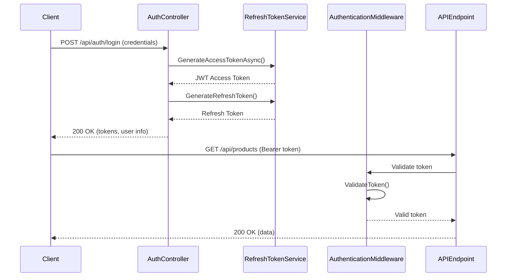
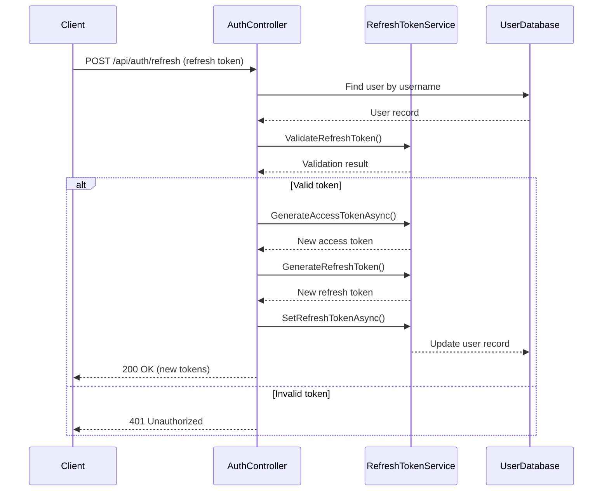
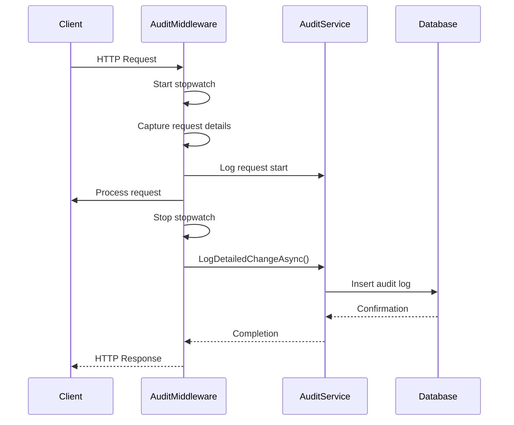
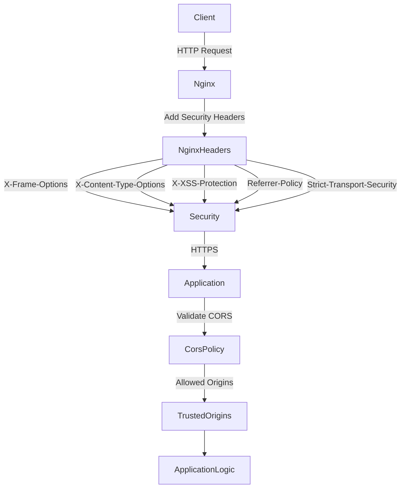

# Security Considerations

<cite>
**Referenced Files in This Document**   
- [AuthenticationMiddleware.cs](file://src/Inventory.API/Middleware/AuthenticationMiddleware.cs)
- [AuthController.cs](file://src/Inventory.API/Controllers/AuthController.cs)
- [RefreshTokenService.cs](file://src/Inventory.API/Services/RefreshTokenService.cs)
- [AuditMiddleware.cs](file://src/Inventory.API/Middleware/AuditMiddleware.cs)
- [AuditService.cs](file://src/Inventory.API/Services/AuditService.cs)
- [ServiceCollectionExtensions.cs](file://src/Inventory.API/Extensions/ServiceCollectionExtensions.cs)
- [Program.cs](file://src/Inventory.API/Program.cs)
- [nginx-staging.conf](file://deploy/nginx/nginx-staging.conf)
- [appsettings.Production.json](file://src/Inventory.API/appsettings.Production.json)
</cite>

## Table of Contents
1. [Authentication and Authorization](#authentication-and-authorization)
2. [Token Management](#token-management)
3. [Audit Logging](#audit-logging)
4. [Security Headers and HTTPS](#security-headers-and-https)
5. [Input Validation and Vulnerability Protection](#input-validation-and-vulnerability-protection)
6. [Secure Deployment Practices](#secure-deployment-practices)
7. [Compliance and Data Protection](#compliance-and-data-protection)

## Authentication and Authorization

The InventoryCtrl_2 system implements JWT-based authentication with role-based authorization using Admin, Manager, and User roles. The authentication flow begins with the `AuthController` which handles user login requests by validating credentials against the database using ASP.NET Identity. Upon successful authentication, a JWT access token and refresh token are generated and returned to the client. The system uses the `AuthenticationMiddleware` to validate JWT tokens on incoming requests, checking for valid signatures, expiration, and proper issuer/audience claims. Public endpoints such as login, registration, and health checks are excluded from authentication requirements.

Role-based authorization is enforced through policy-based access control, where Admin users have full system access, Managers have access to inventory management functions, and Users have limited read-only access. The authorization policies are configured in the `Program.cs` file and applied to controller actions using the `[Authorize(Roles = "RoleName")]` attribute. The JWT tokens contain role claims that are validated during the authentication process, ensuring that users can only access resources appropriate to their assigned roles.

**Diagram sources**
- [AuthController.cs](file://src/Inventory.API/Controllers/AuthController.cs#L17-L296)
- [RefreshTokenService.cs](file://src/Inventory.API/Services/RefreshTokenService.cs#L13-L172)
- [AuthenticationMiddleware.cs](file://src/Inventory.API/Middleware/AuthenticationMiddleware.cs#L7-L166)

**Section sources**
- [AuthController.cs](file://src/Inventory.API/Controllers/AuthController.cs#L17-L296)
- [AuthenticationMiddleware.cs](file://src/Inventory.API/Middleware/AuthenticationMiddleware.cs#L7-L166)
- [Program.cs](file://src/Inventory.API/Program.cs#L158-L187)

## Token Management

Token management in InventoryCtrl_2 is handled by the `RefreshTokenService` which implements a secure refresh token mechanism to maintain user sessions without requiring frequent re-authentication. The service generates cryptographically secure refresh tokens using `RandomNumberGenerator` and stores them in the database with expiration timestamps. Access tokens have a short lifespan of 15 minutes by default, while refresh tokens are valid for 7 days, configurable through the `Jwt:RefreshTokenExpireDays` setting.

The token refresh flow allows clients to obtain new access tokens by presenting a valid refresh token to the `/api/auth/refresh` endpoint. The system validates that the refresh token matches the stored token for the user and has not expired before issuing a new access token and rotating the refresh token. This rotation mechanism ensures that each refresh token can only be used once, preventing replay attacks. The `RefreshTokenService` also provides methods for revoking refresh tokens during logout and cleaning up expired tokens through periodic maintenance tasks.

**Diagram sources**
- [RefreshTokenService.cs](file://src/Inventory.API/Services/RefreshTokenService.cs#L13-L172)
- [AuthController.cs](file://src/Inventory.API/Controllers/AuthController.cs#L144-L196)

**Section sources**
- [RefreshTokenService.cs](file://src/Inventory.API/Services/RefreshTokenService.cs#L13-L172)
- [AuthController.cs](file://src/Inventory.API/Controllers/AuthController.cs#L144-L196)

## Audit Logging

The system implements comprehensive audit logging through the `AuditMiddleware` and `AuditService` components, which automatically capture detailed information about user actions and system events. The `AuditMiddleware` intercepts HTTP requests and responses, capturing metadata such as request method, URL, duration, status code, user agent, IP address, and request headers. This information is logged to the database through the `AuditService`, which stores audit entries with timestamps, severity levels, and structured metadata for analysis.

Audit logs are categorized by entity type (e.g., User, Product, Warehouse) and action type (Create, Read, Update, Delete, Login, Logout) to facilitate filtering and reporting. The system generates audit entries for authentication events, including successful and failed login attempts, token refresh operations, and logout actions. The `AuditController` provides API endpoints for retrieving audit logs with filtering options by date range, user ID, entity type, and severity level. Additionally, the system includes a cleanup mechanism that automatically removes audit logs older than 90 days to manage storage requirements while maintaining compliance with retention policies.

**Diagram sources**
- [AuditMiddleware.cs](file://src/Inventory.API/Middleware/AuditMiddleware.cs#L9-L211)
- [AuditService.cs](file://src/Inventory.API/Services/AuditService.cs#L22-L605)

**Section sources**
- [AuditMiddleware.cs](file://src/Inventory.API/Middleware/AuditMiddleware.cs#L9-L211)
- [AuditService.cs](file://src/Inventory.API/Services/AuditService.cs#L22-L605)
- [AuditController.cs](file://src/Inventory.API/Controllers/AuditController.cs#L33-L63)

## Security Headers and HTTPS

InventoryCtrl_2 implements robust security headers and HTTPS enforcement through nginx configuration and application settings. The nginx configuration files (`nginx.conf`, `nginx-staging.conf`) include security headers such as `X-Frame-Options: SAMEORIGIN` to prevent clickjacking, `X-Content-Type-Options: nosniff` to block MIME type sniffing, `X-XSS-Protection: 1; mode=block` to enable XSS filtering, and `Referrer-Policy: strict-origin-when-cross-origin` to control referrer information. The `Strict-Transport-Security` header is configured with a max-age of 31536000 seconds (1 year) including subdomains to enforce HTTPS access.

HTTPS is enforced through the application's `Program.cs` file, which calls `app.UseHttpsRedirection()` to redirect HTTP requests to HTTPS, except in testing environments. The system supports SSL termination at the nginx proxy level, with certificates configured for multiple domains and IP addresses. The CORS policy is configured to allow specific origins while preventing unauthorized cross-origin requests, with credentials support enabled for trusted domains. The production configuration (`appsettings.Production.json`) disables external access and any-origin policies to minimize attack surface in production environments.

**Diagram sources**
- [nginx-staging.conf](file://deploy/nginx/nginx-staging.conf#L422-L459)
- [Program.cs](file://src/Inventory.API/Program.cs#L387-L400)
- [appsettings.Production.json](file://src/Inventory.API/appsettings.Production.json#L1-L17)

**Section sources**
- [nginx-staging.conf](file://deploy/nginx/nginx-staging.conf#L422-L459)
- [Program.cs](file://src/Inventory.API/Program.cs#L387-L400)
- [appsettings.Production.json](file://src/Inventory.API/appsettings.Production.json#L1-L17)
- [ServiceCollectionExtensions.cs](file://src/Inventory.API/Extensions/ServiceCollectionExtensions.cs#L0-L33)

## Input Validation and Vulnerability Protection

The system implements comprehensive input validation and protection against common web vulnerabilities through multiple layers of defense. Input validation is performed using FluentValidation with validators defined for all API request models such as `CreateCategoryDtoValidator`, `CreateManufacturerDtoValidator`, and `LoginRequestValidator`. These validators enforce business rules, data types, and constraints at the API boundary, preventing malformed or malicious data from entering the system.

The application is protected against Cross-Site Request Forgery (CSRF) through the use of anti-forgery tokens and proper CORS configuration that restricts cross-origin requests to trusted domains. Cross-Site Scripting (XSS) protection is implemented through output encoding, content security policies, and the X-XSS-Protection header. The system also implements rate limiting through the `RateLimiter` middleware to prevent brute force attacks on authentication endpoints, with different limits for anonymous users (5 attempts per 15 minutes) and authenticated users based on their roles.

Additional security measures include password complexity requirements enforced by ASP.NET Identity (minimum 6 characters with digits and mixed case), secure token storage with refresh token rotation, and protection against enumeration attacks by providing generic error messages for authentication failures. The system logs all failed login attempts with IP address and timestamp information for security monitoring and incident response.

**Section sources**
- [LoginRequestValidator.cs](file://src/Inventory.API/Validators/LoginRequestValidator.cs#L1-L20)
- [ServiceCollectionExtensions.cs](file://src/Inventory.API/Extensions/ServiceCollectionExtensions.cs#L62-L81)
- [Program.cs](file://src/Inventory.API/Program.cs#L297-L332)

## Secure Deployment Practices

Secure deployment practices for InventoryCtrl_2 are implemented through automated deployment scripts and infrastructure-as-code configuration. The deployment process is managed by PowerShell scripts (`deploy-with-ssl.ps1`, `deploy-production.ps1`) that configure the environment, generate SSL certificates, and start Docker containers with proper security settings. The system uses environment variables for sensitive configuration such as JWT keys, database connection strings, and CORS policies, preventing secrets from being hardcoded in source code.

The Docker deployment configuration (`docker-compose.yml`, `docker-compose.ssl.yml`) isolates services in containers with minimal privileges and restricted network access. SSL certificates are generated and managed through automated scripts (`generate-ssl.ps1`, `generate-ssl-linux.sh`) that create self-signed certificates for development and staging environments or integrate with Let's Encrypt for production. The nginx configuration terminates SSL connections and forwards requests to the backend API over HTTPS, ensuring end-to-end encryption.

Secret management is implemented through environment variables and configuration files that are excluded from version control. The system follows the principle of least privilege, with database users having only the permissions required for their role. Regular security audits are facilitated by the audit logging system and deployment scripts that include health checks and SSL validation to ensure the system is properly secured after deployment.

**Section sources**
- [deploy-with-ssl.ps1](file://deploy/deploy-with-ssl.ps1#L102-L127)
- [docker-compose.ssl.yml](file://docker-compose.ssl.yml#L1-L50)
- [generate-ssl.ps1](file://scripts/generate-ssl.ps1#L1-L30)

## Compliance and Data Protection

InventoryCtrl_2 addresses compliance and data protection requirements through comprehensive audit logging, secure data handling, and privacy-preserving practices. The audit logging system captures detailed records of all user actions, authentication