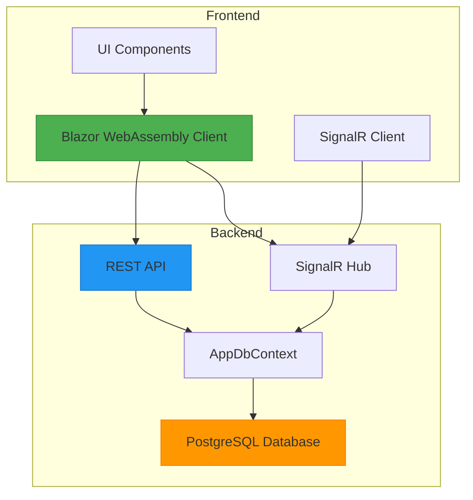
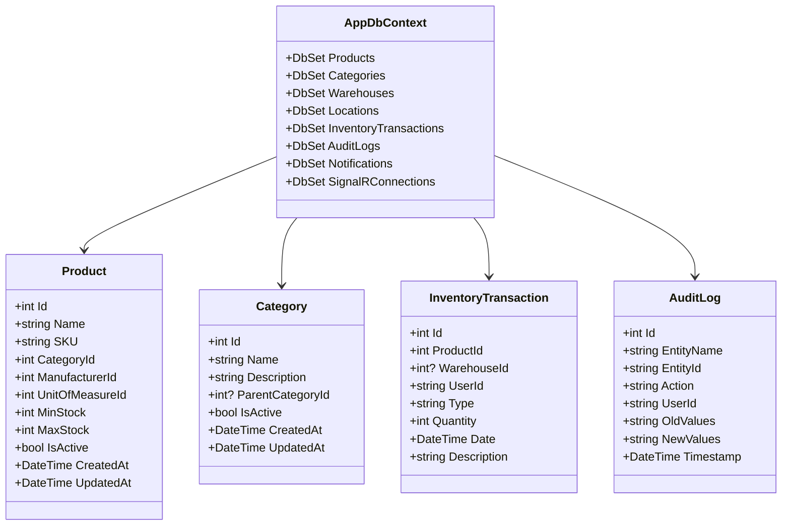
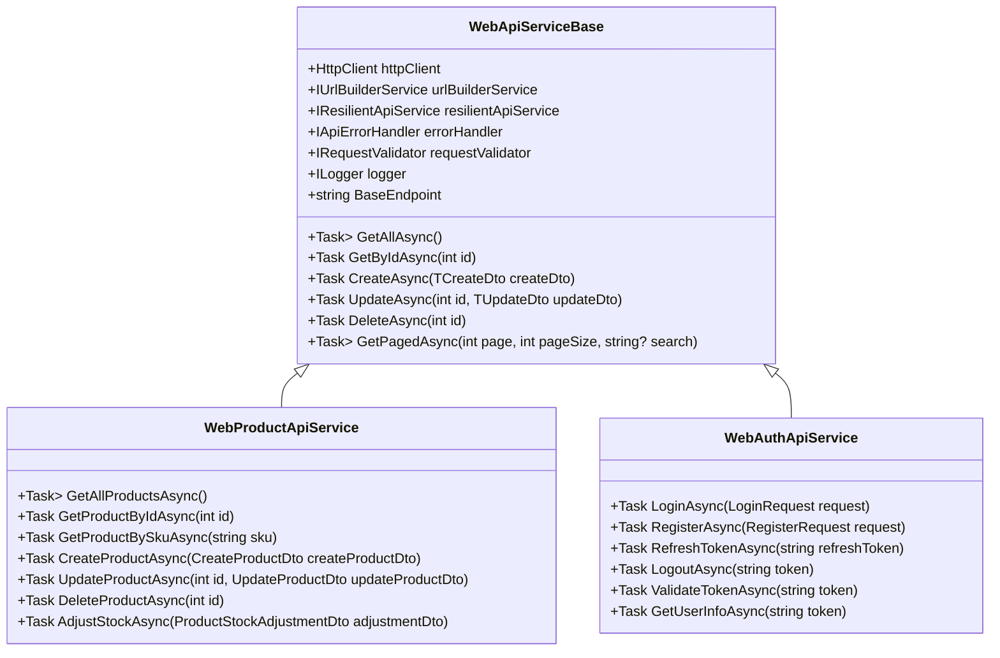
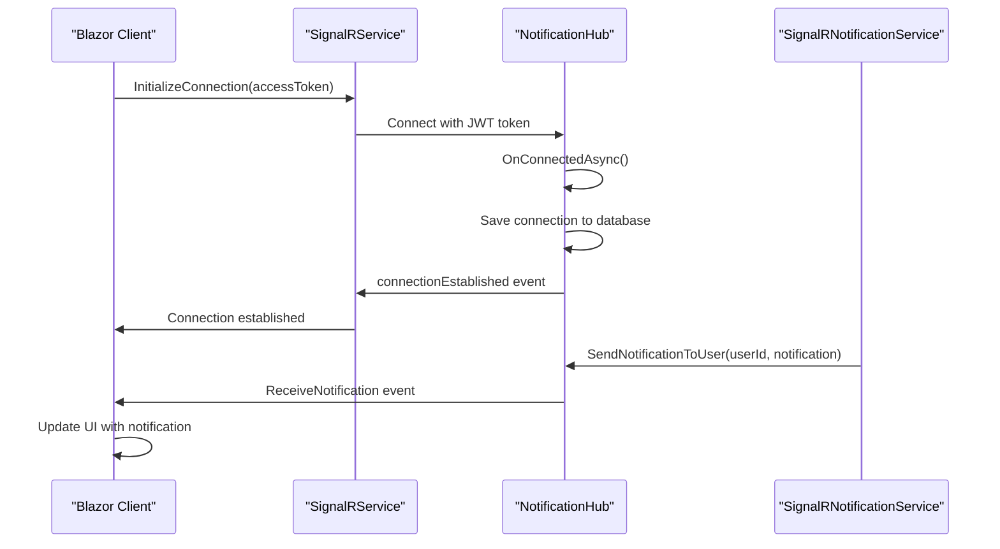

# System Overview

<cite>
**Referenced Files in This Document**   
- [AppDbContext.cs](file://src/Inventory.API/Models/AppDbContext.cs)
- [SignalRNotificationService.cs](file://src/Inventory.API/Services/SignalRNotificationService.cs)
- [WebApiServiceBase.cs](file://src/Inventory.Web.Client/Services/WebApiServiceBase.cs)
- [Program.cs](file://src/Inventory.API/Program.cs)
- [Program.cs](file://src/Inventory.Web.Client/Program.cs)
- [ApiEndpoints.cs](file://src/Inventory.Shared/Constants/ApiEndpoints.cs)
- [NotificationHub.cs](file://src/Inventory.API/Hubs/NotificationHub.cs)
- [SignalRConnection.cs](file://src/Inventory.API/Models/SignalRConnection.cs)
- [SignalRService.cs](file://src/Inventory.Web.Client/Services/SignalRService.cs)
- [ProductController.cs](file://src/Inventory.API/Controllers/ProductController.cs)
- [WebProductApiService.cs](file://src/Inventory.Web.Client/Services/WebProductApiService.cs)
- [WebAuthApiService.cs](file://src/Inventory.Web.Client/Services/WebAuthApiService.cs)
</cite>

## Table of Contents
1. [Introduction](#introduction)
2. [Architecture Overview](#architecture-overview)
3. [Core Components](#core-components)
4. [Component Interactions](#component-interactions)
5. [Key Features](#key-features)
6. [Workflow Examples](#workflow-examples)
7. [Conclusion](#conclusion)

## Introduction

InventoryCtrl_2 is a full-stack inventory management solution built with ASP.NET Core 8.0 and Blazor WebAssembly. The system provides comprehensive inventory control with real-time capabilities through SignalR, offering features such as product management, transaction tracking, audit logging, and role-based access control. This document provides a comprehensive overview of the system's architecture, components, and functionality, serving as a reference for both beginners and experienced developers working with the codebase.

**Section sources**
- [README.md](file://README.md#L0-L26)

## Architecture Overview

The InventoryCtrl_2 system follows a clean architecture pattern with distinct frontend, backend, and shared components. The backend is implemented as an ASP.NET Core 8.0 Web API, while the frontend uses Blazor WebAssembly for a rich, interactive user experience. The two layers communicate through RESTful API endpoints, with real-time updates facilitated by SignalR.

**Diagram sources**
- [Program.cs](file://src/Inventory.API/Program.cs#L1-L450)
- [Program.cs](file://src/Inventory.Web.Client/Program.cs#L1-L147)

**Section sources**
- [README.md](file://README.md#L28-L62)

## Core Components

The system consists of several core components that work together to provide inventory management functionality. The backend API handles data persistence and business logic, while the Blazor WebAssembly client provides the user interface. Shared libraries contain common models and services used by both frontend and backend.

### Backend API

The backend API is implemented as an ASP.NET Core 8.0 application with controllers for managing inventory data. The `AppDbContext` class serves as the primary data access layer, managing connections to the PostgreSQL database and providing strongly-typed access to entities such as products, categories, and transactions.

**Diagram sources**
- [AppDbContext.cs](file://src/Inventory.API/Models/AppDbContext.cs#L9-L204)

**Section sources**
- [AppDbContext.cs](file://src/Inventory.API/Models/AppDbContext.cs#L9-L204)

### Frontend Client

The frontend is built with Blazor WebAssembly, providing a responsive and interactive user interface. The client communicates with the backend API through HTTP requests and receives real-time updates via SignalR. The `WebApiServiceBase` class provides a foundation for API services, handling common operations like GET, POST, PUT, and DELETE.

**Diagram sources**
- [WebApiServiceBase.cs](file://src/Inventory.Web.Client/Services/WebApiServiceBase.cs#L12-L102)
- [WebProductApiService.cs](file://src/Inventory.Web.Client/Services/WebProductApiService.cs#L7-L86)
- [WebAuthApiService.cs](file://src/Inventory.Web.Client/Services/WebAuthApiService.cs#L7-L117)

**Section sources**
- [WebApiServiceBase.cs](file://src/Inventory.Web.Client/Services/WebApiServiceBase.cs#L12-L102)

### Shared Components

The shared library contains common models, interfaces, and constants used by both frontend and backend. The `ApiEndpoints` class defines all API endpoints, ensuring consistency across the application. This shared approach reduces duplication and makes it easier to maintain the codebase.

**Section sources**
- [ApiEndpoints.cs](file://src/Inventory.Shared/Constants/ApiEndpoints.cs#L0-L101)

## Component Interactions

The components of InventoryCtrl_2 interact through well-defined interfaces and protocols. The Blazor UI communicates with the REST API for data retrieval and modification, while real-time updates are handled through SignalR. This section details the key interaction patterns in the system.

### REST API Communication

The frontend client communicates with the backend API through RESTful endpoints defined in the `ApiEndpoints` class. Each API service in the frontend extends the `WebApiServiceBase` class, which provides standardized methods for CRUD operations. When a user performs an action in the UI, the corresponding service method is called, which in turn makes an HTTP request to the appropriate API endpoint.

**Section sources**
- [ApiEndpoints.cs](file://src/Inventory.Shared/Constants/ApiEndpoints.cs#L0-L101)

### Real-time Updates with SignalR

SignalR enables real-time communication between the server and clients, allowing for instant updates to the user interface without requiring page refreshes. The system uses a `NotificationHub` to manage connections and broadcast messages to clients. When significant events occur on the server (such as inventory adjustments or system notifications), the `SignalRNotificationService` sends messages to connected clients.

**Diagram sources**
- [NotificationHub.cs](file://src/Inventory.API/Hubs/NotificationHub.cs#L10-L321)
- [SignalRService.cs](file://src/Inventory.Web.Client/Services/SignalRService.cs#L0-L108)

**Section sources**
- [SignalRNotificationService.cs](file://src/Inventory.API/Services/SignalRNotificationService.cs#L7-L190)

### Authentication and Authorization

The system implements JWT-based authentication with role-based authorization. Users authenticate through the `/auth/login` endpoint, receiving a JWT token that is used for subsequent requests. The token contains claims about the user's identity and role, which are used by the API to enforce access control. The frontend stores the token and includes it in the Authorization header of API requests.

**Section sources**
- [WebAuthApiService.cs](file://src/Inventory.Web.Client/Services/WebAuthApiService.cs#L7-L117)

## Key Features

InventoryCtrl_2 provides several key features that enable effective inventory management. These features are implemented through a combination of backend services, database models, and frontend components.

### Product Management

The system provides comprehensive product management capabilities, allowing users to create, read, update, and delete products. Each product has attributes such as name, SKU, description, category, manufacturer, and stock thresholds. The `ProductController` handles API requests for product operations, while the `WebProductApiService` provides the frontend interface.

**Section sources**
- [ProductController.cs](file://src/Inventory.API/Controllers/ProductController.cs#L0-L727)

### Transaction Tracking

Inventory transactions are tracked through the `InventoryTransaction` entity, which records each movement of inventory (in, out, adjustment). The system maintains accurate inventory levels by processing these transactions and updating the corresponding product quantities. The `ProductOnHandView` database view provides the current on-hand quantity for each product.

**Section sources**
- [AppDbContext.cs](file://src/Inventory.API/Models/AppDbContext.cs#L9-L204)

### Audit Logging

All significant actions in the system are logged through the audit logging mechanism. The `AuditMiddleware` captures requests and responses, while the `AuditService` stores detailed information about entity changes. Each audit log entry includes the entity name, action performed, user ID, old and new values, and a timestamp, providing a complete history of changes.

**Section sources**
- [AppDbContext.cs](file://src/Inventory.API/Models/AppDbContext.cs#L9-L204)

### Role-based Access Control

The system implements role-based access control with three primary roles: Admin, Manager, and User. Each role has different permissions for accessing and modifying data. For example, only Admin users can create inactive products or modify the IsActive status of existing products. The authorization is enforced through the `[Authorize]` and `[Authorize(Roles = "...")]` attributes on API controllers.

**Section sources**
- [ProductController.cs](file://src/Inventory.API/Controllers/ProductController.cs#L0-L727)

## Workflow Examples

This section illustrates common workflows in the InventoryCtrl_2 system, showing how the components work together to accomplish specific tasks.

### User Login

The user login workflow begins when a user enters their credentials in the login form. The frontend calls the `LoginAsync` method of the `WebAuthApiService`, which sends a POST request to the `/auth/login` endpoint. The backend validates the credentials and returns a JWT token if successful. The frontend stores the token and uses it for subsequent API requests.

**Section sources**
- [WebAuthApiService.cs](file://src/Inventory.Web.Client/Services/WebAuthApiService.cs#L7-L117)

### Inventory Adjustment

When a user needs to adjust inventory levels, they navigate to the product management interface and select the "Adjust Stock" option. The frontend displays a form where the user enters the adjustment quantity and reason. When submitted, the `AdjustStockAsync` method of the `WebProductApiService` is called, which sends a POST request to the `/products/{id}/stock/adjust` endpoint. The backend creates an `InventoryTransaction` record and updates the product's quantity through the database view.

**Section sources**
- [ProductController.cs](file://src/Inventory.API/Controllers/ProductController.cs#L0-L727)

### Dashboard Monitoring

The dashboard provides real-time monitoring of inventory status, including low stock alerts and recent activity. The frontend periodically polls the `/dashboard/stats` and `/dashboard/recent-activity` endpoints to update the displayed information. Additionally, the dashboard subscribes to real-time notifications through SignalR, receiving instant updates when inventory levels change or new transactions occur.

**Section sources**
- [ApiEndpoints.cs](file://src/Inventory.Shared/Constants/ApiEndpoints.cs#L0-L101)

## Conclusion

InventoryCtrl_2 is a robust inventory management solution that combines the power of ASP.NET Core 8.0 with the interactivity of Blazor WebAssembly. The system's clean architecture, comprehensive feature set, and real-time capabilities make it well-suited for managing inventory in various business contexts. By understanding the relationships between components and the flow of data through the system, developers can effectively maintain and extend the application to meet evolving business needs.