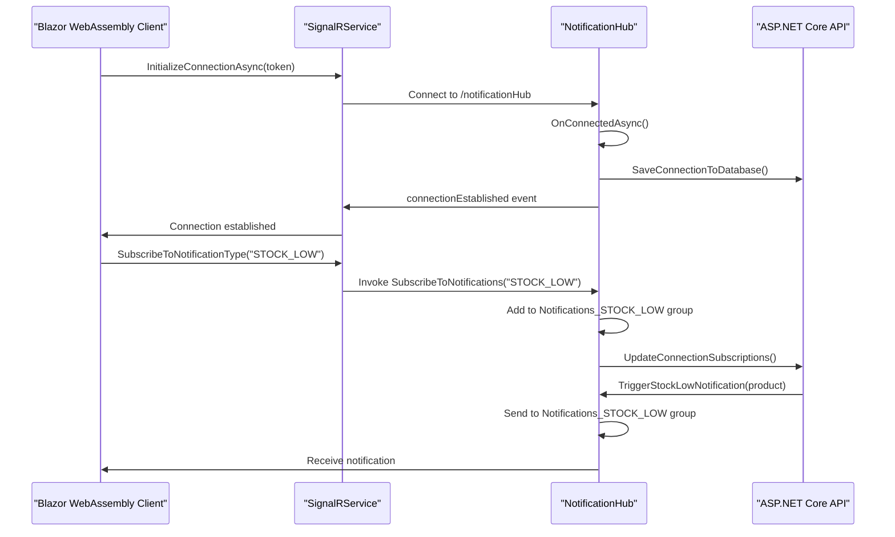

# Technology Stack

<cite>
**Referenced Files in This Document**   
- [Program.cs](file://src/Inventory.API/Program.cs)
- [AppDbContext.cs](file://src/Inventory.API/Models/AppDbContext.cs)
- [NotificationHub.cs](file://src/Inventory.API/Hubs/NotificationHub.cs)
- [SignalRService.cs](file://src/Inventory.Web.Client/Services/SignalRService.cs)
- [ApiUrlService.cs](file://src/Inventory.Web.Client/Services/ApiUrlService.cs)
- [LoginRequestValidator.cs](file://src/Inventory.API/Validators/LoginRequestValidator.cs)
- [ServiceCollectionExtensions.cs](file://src/Inventory.API/Extensions/ServiceCollectionExtensions.cs)
- [NotificationService.cs](file://src/Inventory.Shared/Services/NotificationService.cs)
</cite>

## Table of Contents
1. [Backend Services with ASP.NET Core 8.0](#backend-services-with-aspnet-core-80)
2. [Frontend UI with Blazor WebAssembly](#frontend-ui-with-blazor-webassembly)
3. [Data Access with Entity Framework Core](#data-access-with-entity-framework-core)
4. [Database Backend with PostgreSQL](#database-backend-with-postgresql)
5. [Real-Time Communication with SignalR](#real-time-communication-with-signalr)
6. [Authentication with JWT](#authentication-with-jwt)
7. [Structured Logging with Serilog](#structured-logging-with-serilog)
8. [Input Validation with FluentValidation](#input-validation-with-fluentvalidation)
9. [UI Components with Radzen](#ui-components-with-radzen)
10. [Integration Patterns and Service Registration](#integration-patterns-and-service-registration)
11. [Performance and Scalability Considerations](#performance-and-scalability-considerations)
12. [Extensibility and Component Replacement](#extensibility-and-component-replacement)

## Backend Services with ASP.NET Core 8.0

The backend of InventoryCtrl_2 is built on ASP.NET Core 8.0, providing a high-performance, cross-platform framework for developing modern web APIs. The application follows a layered architecture with controllers, services, and data access components. The `Program.cs` file in the `Inventory.API` project serves as the entry point and configuration hub, where services are registered in the dependency injection (DI) container and the middleware pipeline is configured. Key features include minimal API configuration, built-in support for JSON serialization with `System.Text.Json`, and integration with Swagger/OpenAPI for API documentation and testing.

The middleware pipeline includes CORS configuration, authentication, authorization, rate limiting, and custom middleware for global exception handling and audit logging. The application is configured to serve static files and Blazor WebAssembly assets, enabling seamless integration between the backend and frontend. Environment-specific configurations are managed through `appsettings.json` files, with support for development, staging, and production environments.

**Section sources**
- [Program.cs](file://src/Inventory.API/Program.cs#L1-L450)

## Frontend UI with Blazor WebAssembly

The frontend of InventoryCtrl_2 is implemented using Blazor WebAssembly, allowing for rich, interactive user interfaces to be built with C# and .NET instead of JavaScript. The `Inventory.Web.Client` project contains the Blazor components, pages, and services that make up the user interface. Blazor WebAssembly runs directly in the browser via WebAssembly, enabling client-side interactivity without the need for additional JavaScript frameworks.

The frontend communicates with the backend API through HTTP requests and SignalR for real-time updates. Services such as `WebApiServiceBase` and its derivatives handle API calls, while `SignalRService` manages the WebSocket connection for real-time notifications. The UI is structured using Razor components, with CSS files in the `Inventory.Web.Assets\wwwroot` directory providing styling. The application uses Radzen UI components to create a consistent and professional user experience.

**Section sources**
- [Program.cs](file://src/Inventory.Web.Client/Program.cs#L1-L147)

## Data Access with Entity Framework Core

Entity Framework Core (EF Core) is used as the ORM for data access in InventoryCtrl_2. The `AppDbContext` class in the `Inventory.API.Models` namespace inherits from `IdentityDbContext` and defines `DbSet` properties for each entity in the application, including `Product`, `Category`, `Warehouse`, and `User`. EF Core is configured to use PostgreSQL as the database provider, with connection strings managed through configuration files.

The `OnModelCreating` method in `AppDbContext` contains fluent API configurations for entity relationships, property constraints, and database-specific settings. For example, the `ProductTag` entity has a many-to-many relationship with `Product`, configured using the `UsingEntity` method to specify the join table. Indexes are defined for performance-critical fields, and keyless entity types are used to map database views such as `vw_product_pending` and `vw_product_on_hand`.

**Section sources**
- [AppDbContext.cs](file://src/Inventory.API/Models/AppDbContext.cs#L9-L204)

## Database Backend with PostgreSQL

PostgreSQL is the chosen database backend for InventoryCtrl_2, providing a robust, scalable, and feature-rich relational database system. The database schema is managed through EF Core migrations, with the initial migration located in the `Migrations` folder of the `Inventory.API` project. The schema includes tables for inventory management, user authentication, audit logging, and notifications, with foreign key constraints and indexes to ensure data integrity and query performance.

The `AppDbContext` is configured to use Npgsql, the PostgreSQL provider for EF Core, with connection strings retrieved from configuration. The database is initialized using the `DbInitializer` class, which seeds reference data and ensures the database is in a consistent state on application startup. SQL scripts in the `scripts/sql` directory are used for database maintenance tasks such as applying indexes and reconciling quantities.

**Section sources**
- [AppDbContext.cs](file://src/Inventory.API/Models/AppDbContext.cs#L9-L204)

## Real-Time Communication with SignalR

SignalR is used to enable real-time communication between the server and clients in InventoryCtrl_2. The `NotificationHub` class in the `Inventory.API.Hubs` namespace defines a SignalR hub that clients can connect to for receiving real-time notifications. The hub is configured to use WebSockets as the transport, with automatic reconnection and detailed error logging enabled in development.

Clients connect to the hub using the `/notificationHub` endpoint, with JWT tokens used for authentication. The `SignalRService` in the `Inventory.Web.Client.Services` namespace manages the client-side connection, handling initialization, subscription to notification types, and disconnection. The hub maintains a dictionary of user connections and supports group messaging, allowing notifications to be sent to specific users or groups.

**Diagram sources**
- [NotificationHub.cs](file://src/Inventory.API/Hubs/NotificationHub.cs#L10-L321)
- [SignalRService.cs](file://src/Inventory.Web.Client/Services/SignalRService.cs#L7-L108)

**Section sources**
- [NotificationHub.cs](file://src/Inventory.API/Hubs/NotificationHub.cs#L10-L321)
- [SignalRService.cs](file://src/Inventory.Web.Client/Services/SignalRService.cs#L7-L108)

## Authentication with JWT

JSON Web Tokens (JWT) are used for authentication in InventoryCtrl_2, providing a stateless and secure mechanism for user authentication. The JWT configuration is defined in the `appsettings.json` file, with the issuer, audience, and signing key specified. The `Program.cs` file configures JWT authentication using the `AddJwtBearer` method, with token validation parameters that ensure the token is valid, not expired, and signed with the correct key.

The `AuthenticationMiddleware` and `AuthController` handle the authentication process, with the controller responsible for issuing tokens upon successful login. The `LoginRequestValidator` class uses FluentValidation to validate the login request, ensuring the username and password meet the required criteria. JWT tokens are included in the `Authorization` header of HTTP requests, with the `JwtHttpInterceptor` in the frontend adding the token to outgoing requests.

**Section sources**
- [Program.cs](file://src/Inventory.API/Program.cs#L1-L450)
- [LoginRequestValidator.cs](file://src/Inventory.API/Validators/LoginRequestValidator.cs#L8-L30)

## Structured Logging with Serilog

Serilog is used for structured logging in InventoryCtrl_2, providing detailed and searchable logs that can be easily integrated with logging platforms. The `Program.cs` file configures Serilog to read settings from the configuration file, with log output directed to the console, file, and other sinks as specified. The logging configuration includes enrichers for contextual information such as the user ID and request ID.

Log messages are written using the `ILogger` interface, with different log levels (Information, Warning, Error, etc.) used to categorize the severity of the message. The `GlobalExceptionMiddleware` captures unhandled exceptions and logs them with full stack traces, aiding in debugging and monitoring. Serilog's structured data format allows for efficient querying and analysis of log data.

**Section sources**
- [Program.cs](file://src/Inventory.API/Program.cs#L1-L450)

## Input Validation with FluentValidation

FluentValidation is used for input validation in InventoryCtrl_2, providing a fluent API for defining validation rules for data models. Validators are defined for DTOs such as `LoginRequest`, `CreateProductDto`, and `UpdateCategoryDto`, with rules for required fields, length constraints, and regular expression patterns. The `LoginRequestValidator` class, for example, ensures the username is between 3 and 50 characters and contains only letters, numbers, and underscores.

Validators are registered in the DI container using the `AddValidatorsFromAssemblyContaining` method in `Program.cs`, making them available for automatic validation of API requests. Validation results are returned to the client with detailed error messages, improving the user experience by providing clear feedback on invalid input.

**Section sources**
- [LoginRequestValidator.cs](file://src/Inventory.API/Validators/LoginRequestValidator.cs#L8-L30)

## UI Components with Radzen

Radzen UI components are used to build the frontend of InventoryCtrl_2, providing a library of pre-built, customizable components for creating modern web applications. The `Inventory.Web.Client` project references the Radzen.Blazor package, with components such as `RadzenButton`, `RadzenGrid`, and `RadzenTextBox` used throughout the application. The `Program.cs` file registers Radzen services using `AddRadzenComponents`, making the components available for use in Razor files.

The Radzen components are styled using CSS files in the `Inventory.Web.Assets\wwwroot` directory, with themes for light and dark modes. The components support data binding, event handling, and integration with Blazor's component model, enabling the creation of dynamic and responsive user interfaces. The use of Radzen reduces development time and ensures a consistent look and feel across the application.

**Section sources**
- [Program.cs](file://src/Inventory.Web.Client/Program.cs#L1-L147)

## Integration Patterns and Service Registration

The integration between the various technologies in InventoryCtrl_2 is managed through the DI container and configuration files. Services are registered in `Program.cs` using the `AddScoped`, `AddSingleton`, or `AddTransient` methods, with dependencies injected into constructors. The `ServiceCollectionExtensions` class provides extension methods for grouping related service registrations, such as `AddCorsConfiguration` and `AddNotificationServices`.

Configuration settings are injected into services using the options pattern, with classes such as `ApiConfiguration` and `TokenConfiguration` defining the structure of the configuration. The `ApiUrlService` uses the options pattern to retrieve API and SignalR URLs based on the current environment, enabling seamless switching between development, staging, and production environments.

**Section sources**
- [Program.cs](file://src/Inventory.API/Program.cs#L1-L450)
- [ServiceCollectionExtensions.cs](file://src/Inventory.API/Extensions/ServiceCollectionExtensions.cs#L1-L82)
- [ApiUrlService.cs](file://src/Inventory.Web.Client/Services/ApiUrlService.cs#L1-L357)

## Performance and Scalability Considerations

InventoryCtrl_2 is designed with performance and scalability in mind, using techniques such as rate limiting, caching, and efficient database queries. Rate limiting is implemented using the `AddRateLimiter` method in `Program.cs`, with different limits for anonymous, user, manager, and admin roles. The rate limiter uses a token bucket algorithm to control the number of requests per minute, preventing abuse and ensuring fair usage.

Database queries are optimized using indexes, with critical performance indexes applied to frequently queried fields. EF Core's change tracking and lazy loading features are used judiciously to minimize database round trips. The application is containerized using Docker, with `docker-compose.yml` files for different environments, enabling easy scaling and deployment.

**Section sources**
- [Program.cs](file://src/Inventory.API/Program.cs#L1-L450)

## Extensibility and Component Replacement

The architecture of InventoryCtrl_2 is designed to be extensible and modular, allowing components to be replaced or extended as needed. The use of interfaces and dependency injection makes it easy to swap implementations, such as replacing the PostgreSQL database with another provider or changing the logging framework. The `Inventory.Shared` project contains shared models, DTOs, and interfaces, decoupling the frontend and backend and enabling independent development.

New features can be added by creating new controllers, services, and components, with minimal changes to existing code. The use of configuration files and environment variables allows for runtime customization without recompilation. The application can be extended with additional authentication providers, notification channels, or UI components, making it adaptable to changing requirements.

