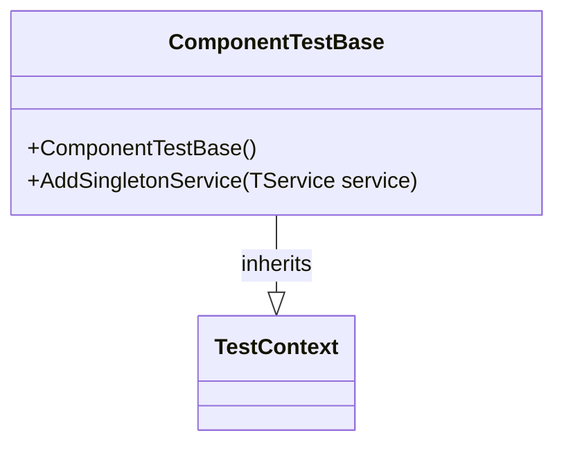
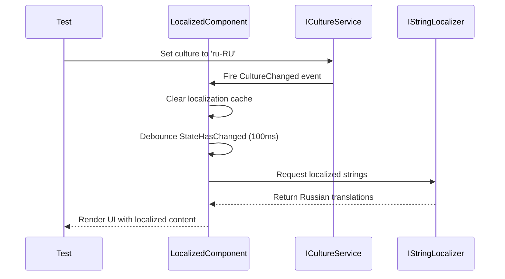
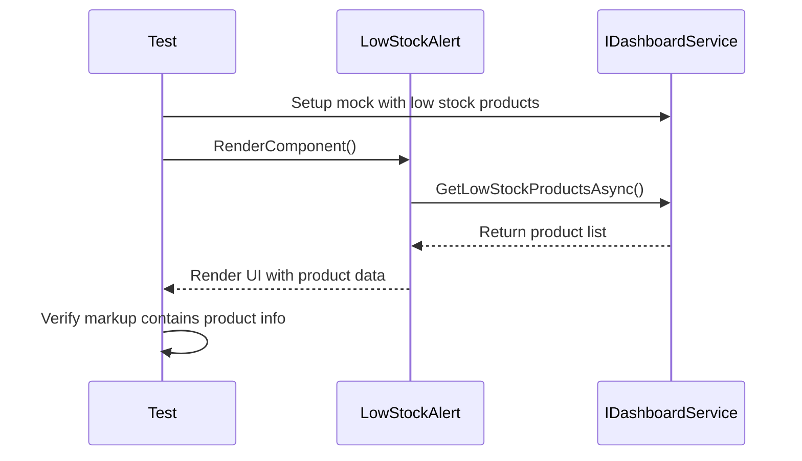
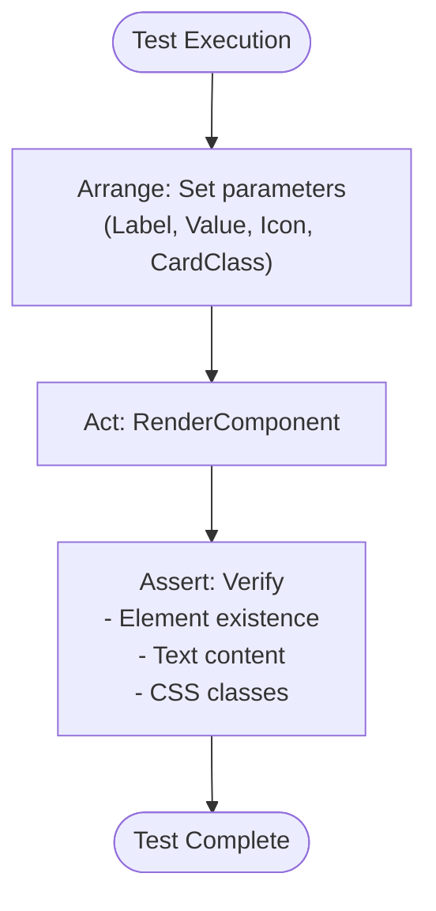
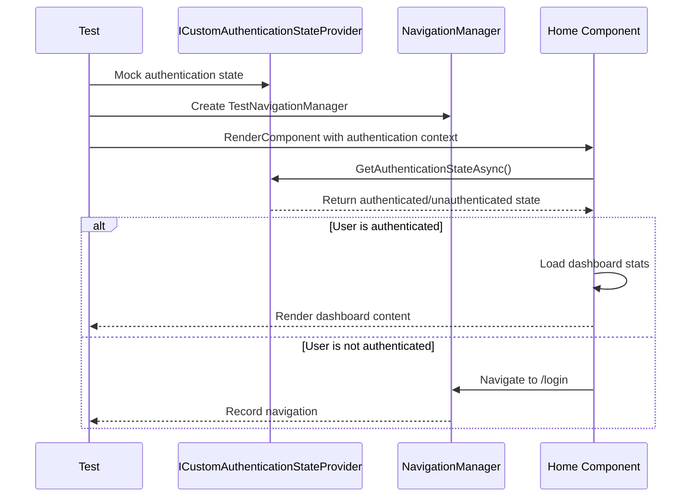
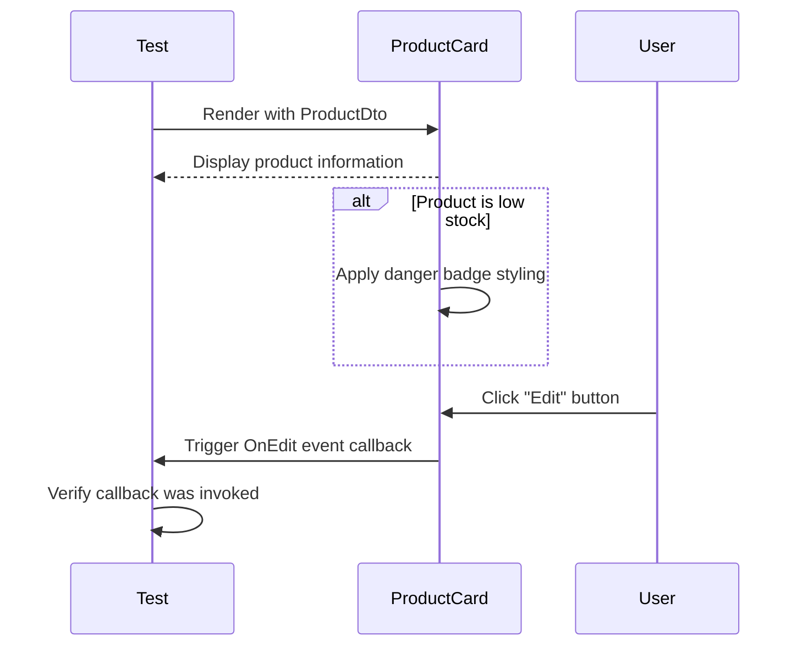
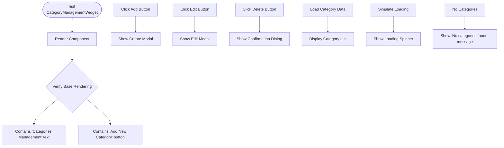
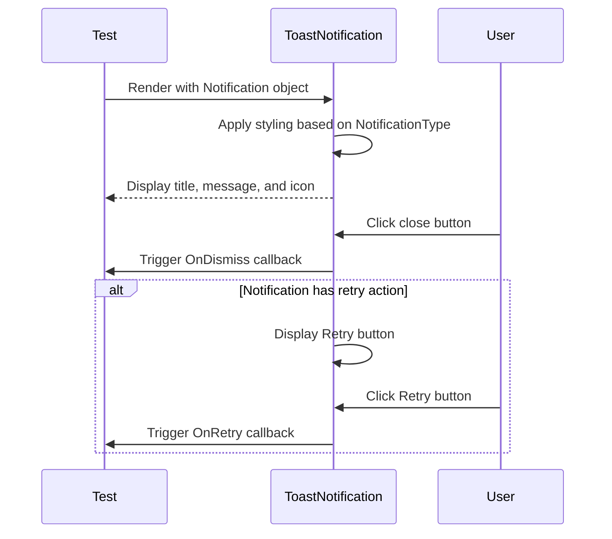
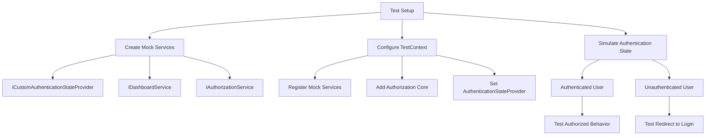

# Component Tests

<cite>
**Referenced Files in This Document**   
- [LowStockAlertTests.cs](file://test/Inventory.ComponentTests/Components/Dashboard/LowStockAlertTests.cs)
- [StatsWidgetTests.cs](file://test/Inventory.ComponentTests/Components/Dashboard/StatsWidgetTests.cs)
- [HomePageTests.cs](file://test/Inventory.ComponentTests/Components/HomePageTests.cs)
- [ProductCardTests.cs](file://test/Inventory.ComponentTests/Components/ProductCardTests.cs)
- [CategoryManagementWidgetTests.cs](file://test/Inventory.ComponentTests/Components/Admin/CategoryManagementWidgetTests.cs)
- [ToastNotificationTests.cs](file://test/Inventory.ComponentTests/Components/ToastNotificationTests.cs)
- [LoadingSpinnerTests.cs](file://test/Inventory.ComponentTests/Components/LoadingSpinnerTests.cs)
- [TestBase.cs](file://test/Inventory.ComponentTests/TestBase.cs)
- [LowStockAlert.razor.css](file://src/Inventory.UI/Components/Dashboard/LowStockAlert.razor.css)
- [Home.razor.css](file://src/Inventory.UI/Pages/Home.razor.css)
- [IDashboardService.cs](file://src/Inventory.Shared/Interfaces/IDashboardService.cs)
- [DashboardDto.cs](file://src/Inventory.Shared/DTOs/DashboardDto.cs)
- [ICustomAuthenticationStateProvider.cs](file://src/Inventory.Shared/Interfaces/ICustomAuthenticationStateProvider.cs)
- [Program.cs](file://src/Inventory.Web.Client/Program.cs)
- [LocalizedComponentBase.cs](file://src/Inventory.Shared/Components/LocalizedComponentBase.cs) - *Updated in recent commit*
</cite>

## Update Summary
**Changes Made**   
- Added new section on Localization Testing Strategy to address the updated LocalizedComponentBase base class
- Updated Introduction to reflect new accessibility and localization components
- Enhanced Test Base Context Setup section with information about localization support
- Added reference to LocalizedComponentBase.cs in document sources
- Removed mention of AccessibilityHelpers as it was not found in the codebase

## Table of Contents
1. [Introduction](#introduction)
2. [Test Base Context Setup](#test-base-context-setup)
3. [Localization Testing Strategy](#localization-testing-strategy)
4. [Dashboard Component Testing](#dashboard-component-testing)
   - [Low Stock Alert Validation](#low-stock-alert-validation)
   - [Stats Widget Verification](#stats-widget-verification)
5. [Layout and Navigation Testing](#layout-and-navigation-testing)
6. [User Interaction Testing](#user-interaction-testing)
7. [Form Input and Management Testing](#form-input-and-management-testing)
8. [Real-Time Update Validation](#real-time-update-validation)
9. [Accessibility and Responsive Behavior](#accessibility-and-responsive-behavior)
10. [Authentication and API Mocking Strategy](#authentication-and-api-mocking-strategy)
11. [Conclusion](#conclusion)

## Introduction
This document details the component testing strategy for the Blazor-based inventory management application, focusing on UI component isolation using bUnit. The tests validate rendering behavior, event handling, state changes, accessibility, responsive design, and integration with services. Key dashboard components, navigation flows, user interactions, and real-time notifications are thoroughly tested to ensure reliability and usability. Recent updates have introduced enhanced localization capabilities through the LocalizedComponentBase class, which requires specific testing considerations for multi-language support.

## Test Base Context Setup
The component testing framework is built on a consistent base class that provides a standardized test context for all component tests. This ensures uniform service registration and simplifies test initialization.



**Diagram sources**
- [TestBase.cs](file://test/Inventory.ComponentTests/TestBase.cs#L7-L28)

**Section sources**
- [TestBase.cs](file://test/Inventory.ComponentTests/TestBase.cs#L7-L28)

## Localization Testing Strategy
The application now features enhanced localization support through the LocalizedComponentBase class, which serves as a foundation for all localized components. This base class provides caching mechanisms, culture change debouncing, and optimized resource loading to ensure high performance during language switching.



**Diagram sources**
- [LocalizedComponentBase.cs](file://src/Inventory.Shared/Components/LocalizedComponentBase.cs#L13-L203)
- [ICultureService.cs](file://src/Inventory.Shared/Interfaces/ICultureService.cs#L4-L15)

**Section sources**
- [LocalizedComponentBase.cs](file://src/Inventory.Shared/Components/LocalizedComponentBase.cs#L13-L203)

The LocalizedComponentBase class implements several key features for efficient localization:
- **Caching**: Stores resolved strings to prevent repeated lookups for the same key and culture combination
- **Debouncing**: Prevents excessive re-renders during rapid culture switching by using a 100ms timer
- **Memory Management**: Automatically clears cache when culture changes to prevent memory leaks
- **Performance Optimization**: Uses ConcurrentDictionary for thread-safe access across components
- **Resource Fallback**: Returns the original key if a translation is not found, aiding development

When testing localized components, verify that:
1. Text content changes appropriately when the culture is updated
2. Number, date, and currency formatting follows locale-specific rules
3. Right-to-left languages are properly supported with appropriate CSS direction
4. Text overflow is handled for longer translations in different languages
5. Accessibility labels are properly localized
6. The component re-renders efficiently after culture changes without performance degradation

## Dashboard Component Testing
The dashboard components are critical for providing users with key inventory insights. These components are tested for correct data rendering, visual presentation, and handling of various data states.

### Low Stock Alert Validation
The LowStockAlert component displays products that are below their minimum stock threshold. Tests verify correct rendering with valid data, empty state handling, null data resilience, and proper CSS class application.



**Diagram sources**
- [LowStockAlertTests.cs](file://test/Inventory.ComponentTests/Components/Dashboard/LowStockAlertTests.cs#L1-L260)
- [IDashboardService.cs](file://src/Inventory.Shared/Interfaces/IDashboardService.cs#L7-L10)
- [DashboardDto.cs](file://src/Inventory.Shared/DTOs/DashboardDto.cs#L35-L56)

**Section sources**
- [LowStockAlertTests.cs](file://test/Inventory.ComponentTests/Components/Dashboard/LowStockAlertTests.cs#L1-L260)
- [LowStockAlert.razor.css](file://src/Inventory.UI/Components/Dashboard/LowStockAlert.razor.css#L1-L65)

### Stats Widget Verification
The StatsWidget component displays key performance indicators with customizable appearance. Tests validate parameter handling, default value behavior, zero-value display, and CSS class application based on card type.



**Diagram sources**
- [StatsWidgetTests.cs](file://test/Inventory.ComponentTests/Components/Dashboard/StatsWidgetTests.cs#L1-L90)

**Section sources**
- [StatsWidgetTests.cs](file://test/Inventory.ComponentTests/Components/Dashboard/StatsWidgetTests.cs#L1-L90)

## Layout and Navigation Testing
The HomePage component serves as the application's main dashboard and includes navigation logic based on authentication state. Tests verify layout rendering and navigation integration.



**Diagram sources**
- [HomePageTests.cs](file://test/Inventory.ComponentTests/Components/HomePageTests.cs#L1-L247)
- [ICustomAuthenticationStateProvider.cs](file://src/Inventory.Shared/Interfaces/ICustomAuthenticationStateProvider.cs#L7-L10)

**Section sources**
- [HomePageTests.cs](file://test/Inventory.ComponentTests/Components/HomePageTests.cs#L1-L247)
- [Home.razor.css](file://src/Inventory.UI/Pages/Home.razor.css#L1-L58)

## User Interaction Testing
The ProductCard component represents individual products and supports user interactions such as editing. Tests validate rendering with different product states and event handling.



**Diagram sources**
- [ProductCardTests.cs](file://test/Inventory.ComponentTests/Components/ProductCardTests.cs#L1-L100)

**Section sources**
- [ProductCardTests.cs](file://test/Inventory.ComponentTests/Components/ProductCardTests.cs#L1-L100)

## Form Input and Management Testing
The CategoryManagementWidget component provides CRUD operations for product categories. Tests validate UI rendering, modal display for create/edit operations, delete confirmation, and data loading states.



**Diagram sources**
- [CategoryManagementWidgetTests.cs](file://test/Inventory.ComponentTests/Components/Admin/CategoryManagementWidgetTests.cs#L1-L203)

**Section sources**
- [CategoryManagementWidgetTests.cs](file://test/Inventory.ComponentTests/Components/Admin/CategoryManagementWidgetTests.cs#L1-L203)

## Real-Time Update Validation
The ToastNotification component displays real-time messages to users. Tests verify visual styling based on notification type, event handling for dismissal and retry actions, and proper text rendering.



**Diagram sources**
- [ToastNotificationTests.cs](file://test/Inventory.ComponentTests/Components/ToastNotificationTests.cs#L1-L137)

**Section sources**
- [ToastNotificationTests.cs](file://test/Inventory.ComponentTests/Components/ToastNotificationTests.cs#L1-L137)

## Accessibility and Responsive Behavior
The LoadingSpinner component provides visual feedback during data loading. Tests validate accessibility features, responsive behavior, and customization options for size, color, and positioning.

```mermaid
erDiagram
LOADING_SPINNER {
string message
string loadingText
SpinnerSize size
SpinnerColor color
boolean centered
boolean fullScreen
Dictionary[string,object] additionalAttributes
}
LOADING_SPINNER ||--o{ SPINNER_SIZE : has
LOADING_SPINNER ||--o{ SPINNER_COLOR : has
SPINNER_SIZE {
Small
Medium
Large
}
SPINNER_COLOR {
Primary
Secondary
Success
Danger
Warning
Info
Light
Dark
}
```

**Diagram sources**
- [LoadingSpinnerTests.cs](file://test/Inventory.ComponentTests/Components/LoadingSpinnerTests.cs#L1-L164)

**Section sources**
- [LoadingSpinnerTests.cs](file://test/Inventory.ComponentTests/Components/LoadingSpinnerTests.cs#L1-L164)

## Authentication and API Mocking Strategy
The testing framework employs a comprehensive strategy for simulating authentication state and mocking API calls. This allows testing of protected routes and service-dependent components in isolation.



**Section sources**
- [HomePageTests.cs](file://test/Inventory.ComponentTests/Components/HomePageTests.cs#L1-L247)
- [TestBase.cs](file://test/Inventory.ComponentTests/TestBase.cs#L7-L28)
- [Program.cs](file://src/Inventory.Web.Client/Program.cs#L1-L146)

## Conclusion
The component testing strategy for InventoryCtrl_2 provides comprehensive coverage of UI components using bUnit for isolated testing. The approach validates rendering behavior, event handling, state changes, and integration with services through mocking. Key components including dashboard widgets, navigation flows, and interactive elements are thoroughly tested for functionality, accessibility, and responsiveness. The consistent test base setup and service mocking strategy enable reliable and maintainable tests that ensure the quality and reliability of the Blazor application's user interface. With the introduction of the LocalizedComponentBase class, the testing strategy now includes specific considerations for localization, ensuring that the application functions correctly across different languages and cultural settings while maintaining performance through caching and debouncing mechanisms.