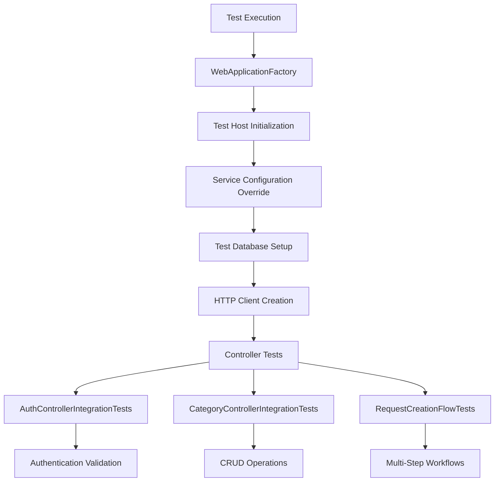
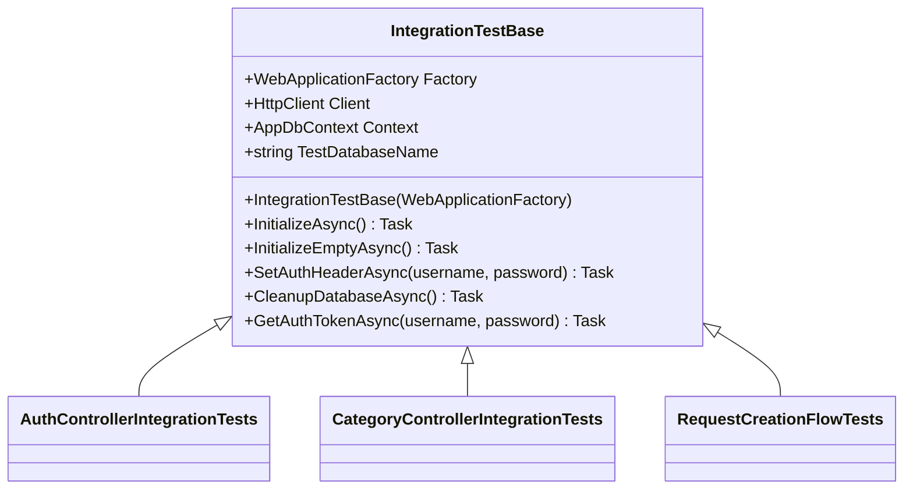
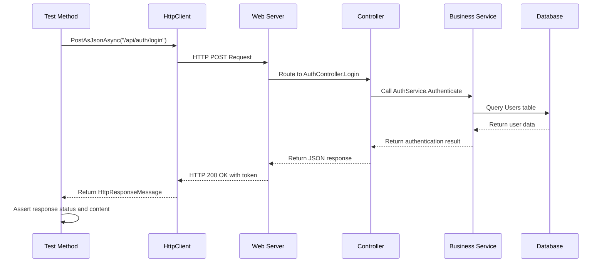
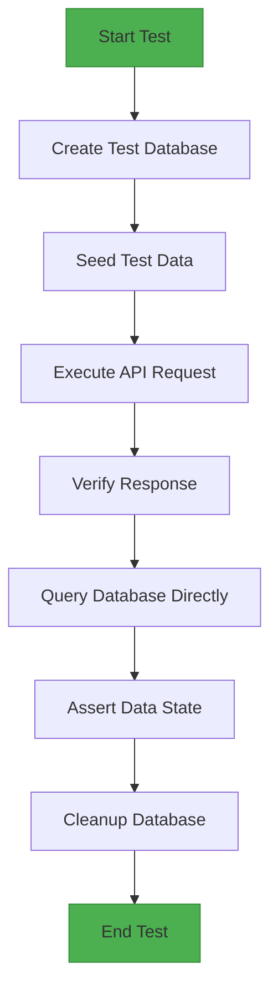
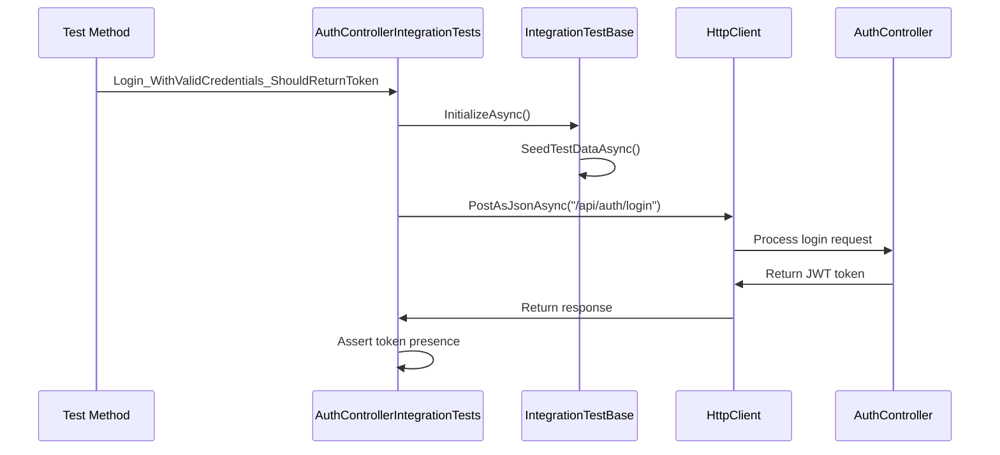
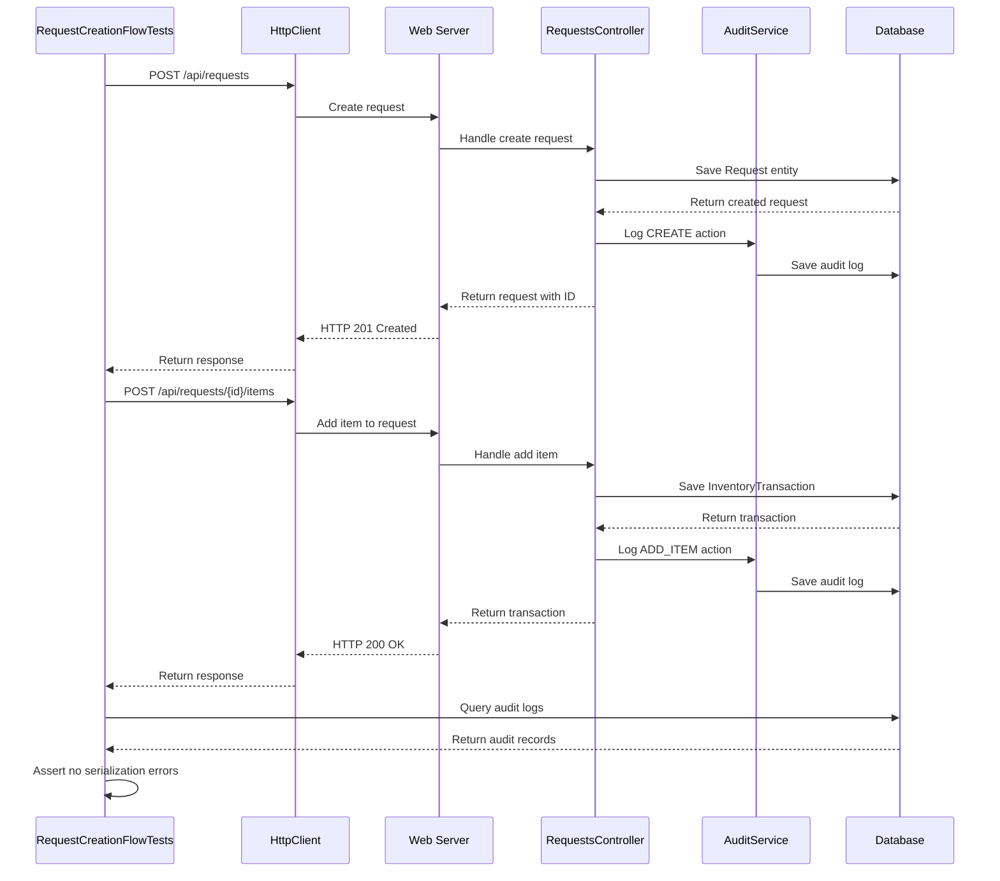
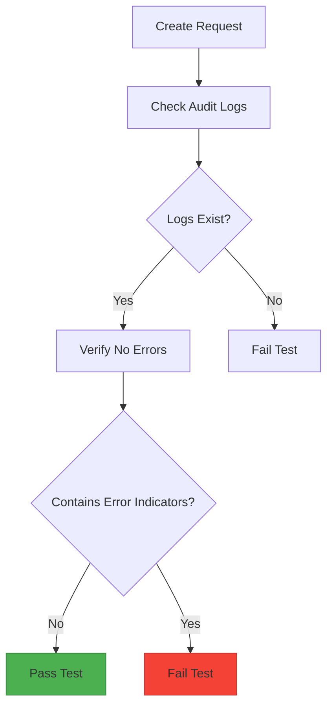

# Integration Tests

<cite>
**Referenced Files in This Document**  
- [AuthControllerIntegrationTests.cs](file://test/Inventory.IntegrationTests/Controllers/AuthControllerIntegrationTests.cs)
- [CategoryControllerIntegrationTests.cs](file://test/Inventory.IntegrationTests/Controllers/CategoryControllerIntegrationTests.cs)
- [RequestCreationFlowTests.cs](file://test/Inventory.IntegrationTests/RequestCreation/RequestCreationFlowTests.cs)
- [TestBase.cs](file://test/Inventory.IntegrationTests/TestBase.cs)
- [appsettings.Test.json](file://test/Inventory.IntegrationTests/appsettings.Test.json)
</cite>

## Table of Contents
1. [Introduction](#introduction)  
2. [Test Architecture Overview](#test-architecture-overview)  
3. [TestBase: Shared Test Fixture](#testbase-shared-test-fixture)  
4. [HTTP Endpoint Validation](#http-endpoint-validation)  
5. [Database Persistence Testing](#database-persistence-testing)  
6. [Authentication Integration](#authentication-integration)  
7. [Workflow Testing with RequestCreationFlowTests](#workflow-testing-with-requestcreationflowtests)  
8. [Configuration Management](#configuration-management)  
9. [Side Effect Assertions](#side-effect-assertions)  
10. [Test Isolation and Cleanup](#test-isolation-and-cleanup)  
11. [Performance Considerations](#performance-considerations)  
12. [Best Practices](#best-practices)

## Introduction

The integration testing layer of InventoryCtrl_2 ensures end-to-end validation of system behavior across HTTP endpoints, database persistence, and authentication mechanisms. These tests simulate real-world usage scenarios by exercising the complete request/response cycle through the API surface. The test suite leverages `WebApplicationFactory<Program>` to create a test host that mirrors production configuration while isolating test data through dedicated test databases. This document details the implementation patterns, key test cases, and infrastructure that enable comprehensive integration testing of the InventoryCtrl_2 application.

## Test Architecture Overview

The integration tests are organized within the `test/Inventory.IntegrationTests` directory and follow a layered architecture that separates concerns between test infrastructure, individual controller tests, and complex workflow validations. The architecture employs the xUnit framework with class fixtures to share expensive resources like the test application host across multiple test methods. Each test inherits from `IntegrationTestBase`, which provides standardized setup, authentication, and cleanup functionality. The tests validate the complete stack from HTTP request reception through business logic execution to database persistence and response generation.



**Diagram sources**  
- [TestBase.cs](file://test/Inventory.IntegrationTests/TestBase.cs#L16-L64)
- [AuthControllerIntegrationTests.cs](file://test/Inventory.IntegrationTests/Controllers/AuthControllerIntegrationTests.cs#L15-L25)
- [CategoryControllerIntegrationTests.cs](file://test/Inventory.IntegrationTests/Controllers/CategoryControllerIntegrationTests.cs#L15-L25)
- [RequestCreationFlowTests.cs](file://test/Inventory.IntegrationTests/RequestCreation/RequestCreationFlowTests.cs#L15-L25)

## TestBase: Shared Test Fixture

The `IntegrationTestBase` class serves as the foundation for all integration tests, providing a consistent environment for test execution. It implements `IClassFixture<WebApplicationFactory<Program>>` to ensure that the test application host is created once per test class and shared across all test methods. The base class handles critical setup tasks including test database creation, service configuration overrides, and authentication setup. Each test instance receives a unique database name to prevent test interference, ensuring complete isolation between test runs.



**Diagram sources**  
- [TestBase.cs](file://test/Inventory.IntegrationTests/TestBase.cs#L16-L64)
- [AuthControllerIntegrationTests.cs](file://test/Inventory.IntegrationTests/Controllers/AuthControllerIntegrationTests.cs#L15-L25)
- [CategoryControllerIntegrationTests.cs](file://test/Inventory.IntegrationTests/Controllers/CategoryControllerIntegrationTests.cs#L15-L25)
- [RequestCreationFlowTests.cs](file://test/Inventory.IntegrationTests/RequestCreation/RequestCreationFlowTests.cs#L15-L25)

**Section sources**  
- [TestBase.cs](file://test/Inventory.IntegrationTests/TestBase.cs#L16-L64)

## HTTP Endpoint Validation

Integration tests validate HTTP endpoints by sending real HTTP requests to the test server and asserting the response status, headers, and body content. The `AuthControllerIntegrationTests` and `CategoryControllerIntegrationTests` classes demonstrate this pattern by testing various CRUD operations on authentication and category management endpoints. Tests verify both success and error conditions, ensuring proper HTTP status codes are returned for different scenarios. The tests use FluentAssertions to provide clear, readable assertions that improve test maintainability.



**Diagram sources**  
- [AuthControllerIntegrationTests.cs](file://test/Inventory.IntegrationTests/Controllers/AuthControllerIntegrationTests.cs#L30-L50)
- [TestBase.cs](file://test/Inventory.IntegrationTests/TestBase.cs#L100-L120)

**Section sources**  
- [AuthControllerIntegrationTests.cs](file://test/Inventory.IntegrationTests/Controllers/AuthControllerIntegrationTests.cs#L25-L150)
- [CategoryControllerIntegrationTests.cs](file://test/Inventory.IntegrationTests/Controllers/CategoryControllerIntegrationTests.cs#L25-L342)

## Database Persistence Testing

The integration tests validate database persistence by verifying that data modifications through the API are correctly reflected in the underlying database. The `CategoryControllerIntegrationTests` class includes tests that create, update, and delete categories, then verify the corresponding database records. The tests use direct database queries through the `AppDbContext` to assert the state of persisted data, ensuring that business logic and data access layers work correctly together. Each test operates against a dedicated PostgreSQL database instance running in Docker, providing a realistic database environment.



**Diagram sources**  
- [CategoryControllerIntegrationTests.cs](file://test/Inventory.IntegrationTests/Controllers/CategoryControllerIntegrationTests.cs#L100-L120)
- [TestBase.cs](file://test/Inventory.IntegrationTests/TestBase.cs#L177-L199)

**Section sources**  
- [CategoryControllerIntegrationTests.cs](file://test/Inventory.IntegrationTests/Controllers/CategoryControllerIntegrationTests.cs#L100-L150)
- [TestBase.cs](file://test/Inventory.IntegrationTests/TestBase.cs#L177-L199)

## Authentication Integration

Authentication is a critical aspect of integration testing, as most API endpoints require valid JWT tokens for access. The `IntegrationTestBase` class provides helper methods like `SetAuthHeaderAsync` and `GetAuthTokenAsync` to simplify authentication setup in tests. The `AuthControllerIntegrationTests` validates the complete authentication flow, including login with valid credentials, handling of invalid credentials, and user registration. These tests ensure that the authentication middleware correctly validates tokens and that unauthorized requests are properly rejected with HTTP 401 status codes.



**Diagram sources**  
- [AuthControllerIntegrationTests.cs](file://test/Inventory.IntegrationTests/Controllers/AuthControllerIntegrationTests.cs#L30-L50)
- [TestBase.cs](file://test/Inventory.IntegrationTests/TestBase.cs#L100-L120)

**Section sources**  
- [AuthControllerIntegrationTests.cs](file://test/Inventory.IntegrationTests/Controllers/AuthControllerIntegrationTests.cs#L25-L150)
- [TestBase.cs](file://test/Inventory.IntegrationTests/TestBase.cs#L100-L120)

## Workflow Testing with RequestCreationFlowTests

The `RequestCreationFlowTests` class demonstrates critical workflow testing by validating multi-step business processes. These tests cover the complete request creation lifecycle, from initial request submission through item addition to final state verification. The tests ensure that complex object graphs are handled correctly without circular reference serialization issues. By validating audit logs and database changes, these tests verify that side effects are properly recorded and that the system maintains data consistency throughout the workflow.



**Diagram sources**  
- [RequestCreationFlowTests.cs](file://test/Inventory.IntegrationTests/RequestCreation/RequestCreationFlowTests.cs#L30-L100)
- [TestBase.cs](file://test/Inventory.IntegrationTests/TestBase.cs#L16-L64)

**Section sources**  
- [RequestCreationFlowTests.cs](file://test/Inventory.IntegrationTests/RequestCreation/RequestCreationFlowTests.cs#L15-L251)

## Configuration Management

Test-specific configuration is managed through the `appsettings.Test.json` file, which provides settings tailored for the integration test environment. This configuration file specifies the test database connection string, JWT authentication parameters, and logging settings. The `IntegrationTestBase` class overrides the application configuration during test setup, merging values from `appsettings.Test.json` with in-memory configuration to ensure consistent test behavior. This approach allows tests to run with production-like configuration while maintaining isolation from other environments.

```json
{
  "ConnectionStrings": {
    "DefaultConnection": "Host=localhost;Port=5432;Database=inventory_test;Username=postgres;Password=postgres;Pooling=true;"
  },
  "Jwt": {
    "Key": "TestKeyThatIsAtLeast32CharactersLongForTestingPurposes",
    "Issuer": "InventoryTest",
    "Audience": "InventoryTestUsers"
  },
  "Logging": {
    "LogLevel": {
      "Default": "Information",
      "Microsoft.AspNetCore": "Warning",
      "Microsoft.EntityFrameworkCore": "Warning"
    }
  }
}
```

**Section sources**  
- [appsettings.Test.json](file://test/Inventory.IntegrationTests/appsettings.Test.json#L1-L18)
- [TestBase.cs](file://test/Inventory.IntegrationTests/TestBase.cs#L38-L64)

## Side Effect Assertions

Integration tests include comprehensive assertions for side effects such as database changes and audit logs. The `RequestCreationFlowTests` class verifies that audit logs are created without serialization errors when requests are created. Tests query the `AuditLogs` table directly to validate that entries are properly recorded with correct action types, timestamps, and change tracking information. These assertions ensure that the system's observability features work correctly and that all significant operations are properly logged for compliance and debugging purposes.



**Diagram sources**  
- [RequestCreationFlowTests.cs](file://test/Inventory.IntegrationTests/RequestCreation/RequestCreationFlowTests.cs#L81-L99)
- [TestBase.cs](file://test/Inventory.IntegrationTests/TestBase.cs#L177-L199)

**Section sources**  
- [RequestCreationFlowTests.cs](file://test/Inventory.IntegrationTests/RequestCreation/RequestCreationFlowTests.cs#L81-L99)

## Test Isolation and Cleanup

Test isolation is achieved through multiple mechanisms that prevent test interference and ensure a clean state for each test run. Each test creates a unique database with a randomly generated name, ensuring complete data isolation. The `CleanupDatabaseAsync` method executes after each test to remove all data from the test database, while the `Dispose` method drops the entire database to free resources. This two-level cleanup strategy prevents test data leakage and ensures consistent test results regardless of execution order.


**Diagram sources**  
- [TestBase.cs](file://test/Inventory.IntegrationTests/TestBase.cs#L177-L199)
- [TestBase.cs](file://test/Inventory.IntegrationTests/TestBase.cs#L536-L586)

**Section sources**  
- [TestBase.cs](file://test/Inventory.IntegrationTests/TestBase.cs#L177-L199)
- [TestBase.cs](file://test/Inventory.IntegrationTests/TestBase.cs#L536-L586)

## Performance Considerations

The integration test suite includes several performance optimizations to reduce execution time while maintaining test reliability. Tests use direct database connections rather than the API for setup operations, avoiding unnecessary HTTP overhead. The test database is created once per test class rather than per test method, reducing the cost of database initialization. Parallel test execution is supported through xUnit's built-in parallelization, allowing multiple test classes to run simultaneously. The test infrastructure also includes timeout mechanisms and error handling to prevent individual test failures from affecting the overall test run.

**Section sources**  
- [TestBase.cs](file://test/Inventory.IntegrationTests/TestBase.cs#L16-L64)
- [TestBase.cs](file://test/Inventory.IntegrationTests/TestBase.cs#L536-L586)

## Best Practices

The integration testing implementation follows several best practices to ensure reliability, maintainability, and effectiveness. Tests are organized by controller and workflow, making it easy to locate relevant tests for specific functionality. Each test follows the Arrange-Act-Assert pattern, clearly separating setup, execution, and verification phases. Test data is seeded consistently through the `SeedTestDataAsync` method, ensuring that tests have predictable starting conditions. The use of FluentAssertions provides clear, descriptive error messages that simplify test debugging. Finally, comprehensive cleanup ensures that tests are isolated and can be run in any order without side effects.

**Section sources**  
- [AuthControllerIntegrationTests.cs](file://test/Inventory.IntegrationTests/Controllers/AuthControllerIntegrationTests.cs#L25-L150)
- [CategoryControllerIntegrationTests.cs](file://test/Inventory.IntegrationTests/Controllers/CategoryControllerIntegrationTests.cs#L25-L342)
- [RequestCreationFlowTests.cs](file://test/Inventory.IntegrationTests/RequestCreation/RequestCreationFlowTests.cs#L15-L251)
- [TestBase.cs](file://test/Inventory.IntegrationTests/TestBase.cs#L16-L64)