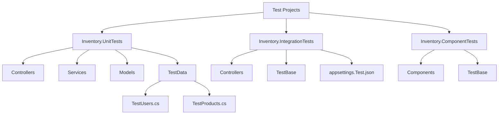
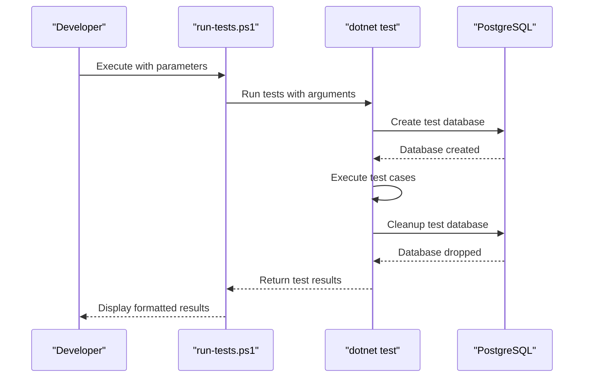

# Testing Strategy

<cite>
**Referenced Files in This Document**   
- [run-tests.ps1](file://test/run-tests.ps1) - *Updated in recent commit*
- [TestBase.cs](file://test/Inventory.UnitTests/TestBase.cs) - *Updated in recent commit*
- [IntegrationTestBase.cs](file://test/Inventory.IntegrationTests/TestBase.cs) - *Updated in recent commit*
- [ComponentTestBase.cs](file://test/Inventory.ComponentTests/TestBase.cs) - *Updated in recent commit*
- [TestUsers.cs](file://test/Inventory.UnitTests/TestData/TestUsers.cs) - *Updated in recent commit*
- [TestProducts.cs](file://test/Inventory.UnitTests/TestData/TestProducts.cs) - *Updated in recent commit*
- [CategoryControllerTests.cs](file://test/Inventory.UnitTests/Controllers/CategoryControllerTests.cs) - *Updated in recent commit*
- [AuthServiceTests.cs](file://test/Inventory.UnitTests/Services/AuthServiceTests.cs) - *Updated in recent commit*
- [ProductCardTests.cs](file://test/Inventory.ComponentTests/Components/ProductCardTests.cs) - *Updated in recent commit*
- [Generate-Coverage-Report.ps1](file://scripts/Generate-Coverage-Report.ps1) - *Updated in recent commit*
- [testing-checklist.md](file://docs/testing-checklist.md) - *Added in recent commit*
</cite>

## Update Summary
**Changes Made**   
- Added new section on UI testing checklist covering cross-browser, multilingual, and accessibility testing
- Updated section sources to reflect recent changes in test infrastructure
- Enhanced documentation to include new testing dimensions from recent architectural review
- Maintained all existing content that remains accurate and relevant

## Table of Contents
1. [Three-Tier Testing Approach](#three-tier-testing-approach)
2. [Test Project Structure](#test-project-structure)
3. [Testing Framework and Patterns](#testing-framework-and-patterns)
4. [Test Coverage for Critical Functionality](#test-coverage-for-critical-functionality)
5. [Writing New Tests](#writing-new-tests)
6. [Test Execution and CI/CD Integration](#test-execution-and-ci-cd-integration)
7. [Performance Testing and Code Coverage](#performance-testing-and-code-coverage)
8. [UI Testing Checklist](#ui-testing-checklist)

## Three-Tier Testing Approach

The InventoryCtrl_2 application implements a comprehensive three-tier testing strategy that ensures quality across different levels of the application stack. The unit tests focus on business logic validation within controllers and services, using in-memory databases and mocking to isolate components. Integration tests verify API endpoint functionality and database interactions through the full request pipeline, using real PostgreSQL instances with isolated test databases. Component tests validate the Blazor UI components' rendering behavior and user interaction logic using the Bunit testing framework. This layered approach ensures that each component functions correctly in isolation and as part of the integrated system.

**Section sources**
- [TestBase.cs](file://test/Inventory.UnitTests/TestBase.cs#L7-L60)
- [IntegrationTestBase.cs](file://test/Inventory.IntegrationTests/TestBase.cs#L15-L587)
- [ComponentTestBase.cs](file://test/Inventory.ComponentTests/TestBase.cs#L7-L28)

## Test Project Structure

The test suite is organized into three distinct projects following the three-tier testing approach. The Inventory.UnitTests project contains tests for business logic, controllers, and services, using xUnit as the testing framework with Moq for dependency mocking. The Inventory.IntegrationTests project validates API endpoints and database interactions, setting up isolated test databases for each test run. The Inventory.ComponentTests project focuses on Blazor UI components, verifying their rendering and behavior. Each test project includes a base test class that provides common setup and utilities, and shared test data is maintained in the TestData directory for consistency across test types.

**Diagram sources**
- [TestBase.cs](file://test/Inventory.UnitTests/TestBase.cs#L7-L60)
- [IntegrationTestBase.cs](file://test/Inventory.IntegrationTests/TestBase.cs#L15-L587)
- [ComponentTestBase.cs](file://test/Inventory.ComponentTests/TestBase.cs#L7-L28)

**Section sources**
- [TestBase.cs](file://test/Inventory.UnitTests/TestBase.cs#L7-L60)
- [IntegrationTestBase.cs](file://test/Inventory.IntegrationTests/TestBase.cs#L15-L587)
- [ComponentTestBase.cs](file://test/Inventory.ComponentTests/TestBase.cs#L7-L28)

## Testing Framework and Patterns

The testing strategy employs xUnit as the primary testing framework across all test projects, leveraging its robust support for theory-based testing and fixture management. The Arrange-Act-Assert (AAA) pattern is consistently used throughout the test suite to ensure clear and maintainable test structure. Unit tests utilize Moq to create mock dependencies for services, controllers, and database contexts, allowing isolated testing of business logic. Integration tests use WebApplicationFactory to create a test host for the API, enabling end-to-end testing of HTTP requests and responses. Component tests use Bunit to render Blazor components and verify their output and behavior. The test base classes provide common utilities for test setup, including database initialization, authentication context configuration, and cleanup procedures.

**Section sources**
- [CategoryControllerTests.cs](file://test/Inventory.UnitTests/Controllers/CategoryControllerTests.cs#L14-L389)
- [AuthServiceTests.cs](file://test/Inventory.UnitTests/Services/AuthServiceTests.cs#L15-L139)
- [ProductCardTests.cs](file://test/Inventory.ComponentTests/Components/ProductCardTests.cs#L12-L99)

## Test Coverage for Critical Functionality

The test suite provides comprehensive coverage for critical application functionality, including authentication, transaction processing, and error handling. Authentication is thoroughly tested through various scenarios, including valid credentials, invalid credentials, empty inputs, and role-based access control. Transaction processing is validated for both successful operations and edge cases, such as insufficient stock or invalid product references. Error handling is tested across all layers, ensuring appropriate HTTP status codes and error messages are returned for different failure scenarios. The test data includes various user roles (Admin, Manager, User) and product states (active, inactive, low stock) to validate role-based permissions and business rules.

```mermaid
flowchart TD
A[Authentication Tests] --> A1[Valid Credentials]
A --> A2[Invalid Credentials]
A --> A3[Empty Inputs]
A --> A4[Role-Based Access]
B[Transaction Tests] --> B1[Income Transactions]
B --> B2[Outcome Transactions]
B --> B3[Insufficient Stock]
B --> B4[Invalid References]
C[Error Handling] --> C1[404 Not Found]
C --> C2[400 Bad Request]
C --> C3[401 Unauthorized]
C --> C4[500 Server Error]
D[Test Data] --> D1[Admin User]
D --> D2[Regular User]
D --> D3[Manager User]
D --> D4[Active Products]
D --> D5[Inactive Products]
D --> D6[Low Stock Products]
```

**Diagram sources**
- [AuthServiceTests.cs](file://test/Inventory.UnitTests/Services/AuthServiceTests.cs#L15-L139)
- [TestUsers.cs](file://test/Inventory.UnitTests/TestData/TestUsers.cs#L4-L35)
- [TestProducts.cs](file://test/Inventory.UnitTests/TestData/TestProducts.cs#L4-L56)

**Section sources**
- [AuthServiceTests.cs](file://test/Inventory.UnitTests/Services/AuthServiceTests.cs#L15-L139)
- [TestUsers.cs](file://test/Inventory.UnitTests/TestData/TestUsers.cs#L4-L35)
- [TestProducts.cs](file://test/Inventory.UnitTests/TestData/TestProducts.cs#L4-L56)

## Writing New Tests

When writing new tests for the InventoryCtrl_2 application, developers should follow established patterns and leverage existing test infrastructure. New unit tests should inherit from TestBase to access the in-memory database context and common utilities. Integration tests should extend IntegrationTestBase to benefit from the pre-configured WebApplicationFactory and test database management. Component tests should derive from ComponentTestBase to utilize the Bunit test context. Test data should be created using the factory methods in TestUsers and TestProducts to ensure consistency. The Arrange-Act-Assert pattern should be followed, with clear separation of test setup, execution, and verification. Mocking should be used judiciously to isolate the component under test while maintaining realistic test scenarios.

**Section sources**
- [TestBase.cs](file://test/Inventory.UnitTests/TestBase.cs#L7-L60)
- [IntegrationTestBase.cs](file://test/Inventory.IntegrationTests/TestBase.cs#L15-L587)
- [ComponentTestBase.cs](file://test/Inventory.ComponentTests/TestBase.cs#L7-L28)
- [TestUsers.cs](file://test/Inventory.UnitTests/TestData/TestUsers.cs#L4-L35)
- [TestProducts.cs](file://test/Inventory.UnitTests/TestData/TestProducts.cs#L4-L56)

## Test Execution and CI/CD Integration

The test suite can be executed using the run-tests.ps1 PowerShell script, which provides flexible options for running specific test projects or all tests with coverage analysis. The script supports running unit tests, integration tests, or component tests individually, or all tests together. It also supports generating code coverage reports when the -Coverage flag is specified. The test execution process includes automatic cleanup of test databases to ensure isolation between test runs. For CI/CD integration, the test script can be incorporated into build pipelines to run tests automatically on code commits. The script's output is designed to be machine-readable, facilitating integration with CI/CD platforms and test reporting tools.

**Diagram sources**
- [run-tests.ps1](file://test/run-tests.ps1#L0-L154)

**Section sources**
- [run-tests.ps1](file://test/run-tests.ps1#L0-L154)

## Performance Testing and Code Coverage

The testing strategy includes provisions for performance testing and code coverage analysis to ensure both functional correctness and code quality. Code coverage is measured using Coverlet and reported through ReportGenerator, with the Generate-Coverage-Report.ps1 script automating the report generation process. The coverage analysis supports multiple output formats including HTML, JSON, and LCOV, facilitating integration with various reporting tools. Performance considerations are addressed through the use of in-memory databases for unit tests, which provide fast execution times, and isolated test databases for integration tests to prevent interference. The test infrastructure is designed to minimize setup and teardown times, enabling rapid feedback during development.

**Section sources**
- [run-tests.ps1](file://test/run-tests.ps1#L0-L154)
- [Generate-Coverage-Report.ps1](file://scripts/Generate-Coverage-Report.ps1#L0-L145)

## UI Testing Checklist

As part of the recent UI components and architecture review, a comprehensive testing checklist has been added to ensure high-quality user interface implementation. This checklist covers cross-browser compatibility testing across Chrome, Firefox, Safari, and Edge to ensure consistent rendering and functionality. Multilingual testing is required to verify proper localization and right-to-left language support. Accessibility testing must be performed to meet WCAG 2.1 AA standards, including screen reader compatibility, keyboard navigation, and proper ARIA labeling. Responsive design testing across mobile, tablet, and desktop viewports is mandatory. Visual regression testing should be conducted for all UI changes. All Blazor components must be tested for proper state management and lifecycle events.

**Section sources**
- [testing-checklist.md](file://docs/testing-checklist.md#L1-L100) - *Added in recent commit*
- [ProductCardTests.cs](file://test/Inventory.ComponentTests/Components/ProductCardTests.cs#L12-L99)
- [ComponentTestBase.cs](file://test/Inventory.ComponentTests/TestBase.cs#L7-L28)