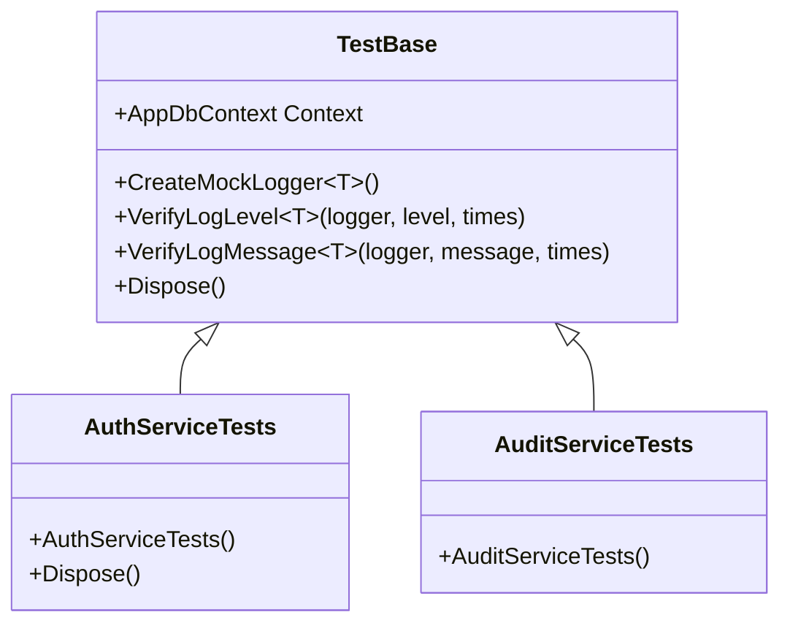
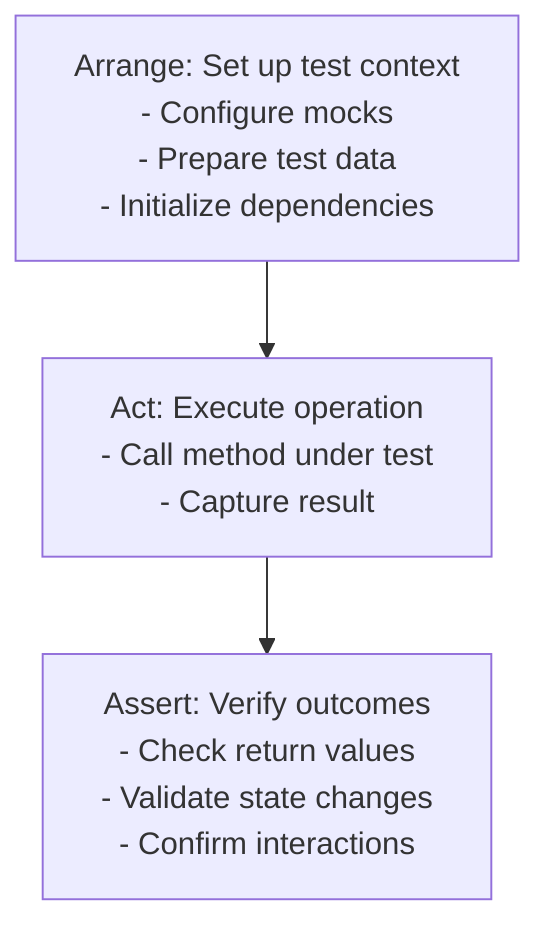
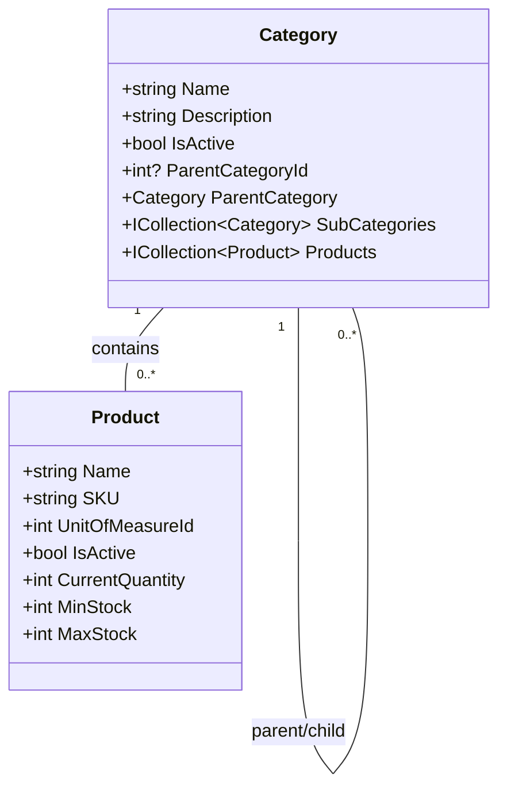
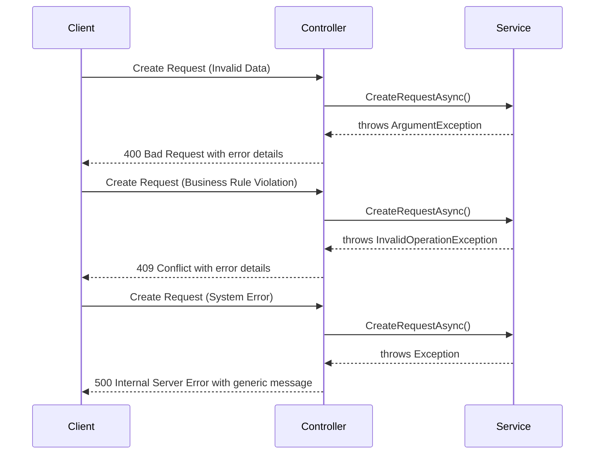

# Unit Tests

<cite>
**Referenced Files in This Document**   
- [TestBase.cs](file://test/Inventory.UnitTests/TestBase.cs)
- [AuthServiceTests.cs](file://test/Inventory.UnitTests/Services/AuthServiceTests.cs)
- [AuditServiceTests.cs](file://test/Inventory.UnitTests/Services/AuditServiceTests.cs)
- [ProductTests.cs](file://test/Inventory.UnitTests/Models/ProductTests.cs)
- [CategoryTests.cs](file://test/Inventory.UnitTests/Models/CategoryTests.cs)
- [RequestsControllerErrorHandlingTests.cs](file://test/Inventory.UnitTests/Controllers/RequestsControllerErrorHandlingTests.cs)
</cite>

## Table of Contents
1. [Introduction](#introduction)
2. [Unit Testing Strategy](#unit-testing-strategy)
3. [TestBase: Shared Setup and Mocking Infrastructure](#testbase-shared-setup-and-mocking-infrastructure)
4. [Arrange-Act-Assert Pattern in Practice](#arrange-act-assert-pattern-in-practice)
5. [Business Logic Validation in Models](#business-logic-validation-in-models)
6. [Edge Case Handling in Controllers](#edge-case-handling-in-controllers)
7. [Mocking Practices with Moq](#mocking-practices-with-moq)
8. [Writing New Unit Tests](#writing-new-unit-tests)
9. [Code Coverage and Best Practices](#code-coverage-and-best-practices)

## Introduction
This document details the unit testing strategy for the InventoryCtrl_2 application, focusing on isolated testing of business logic components such as services, models, and controllers. The test suite leverages xUnit as the testing framework and emphasizes testing internal logic without HTTP or database integration through the use of in-memory databases and mocking.

The unit tests validate core business rules, authentication flows, audit logging, and error handling across various components. By isolating dependencies and using the Arrange-Act-Assert pattern consistently, the tests ensure reliability and maintainability while providing comprehensive coverage of critical application logic.

## Unit Testing Strategy
The InventoryCtrl_2 application employs a comprehensive unit testing strategy focused on isolating business logic components from external dependencies. The test suite is organized into logical categories including services, models, and controllers, with each test validating specific behaviors without relying on HTTP endpoints or persistent database connections.

Tests utilize in-memory databases via Entity Framework Core's `UseInMemoryDatabase` to simulate data persistence while maintaining test isolation and speed. This approach allows validation of data access logic without the overhead or unpredictability of real database interactions. The strategy emphasizes testing business rules, edge cases, and error conditions to ensure robust application behavior under various scenarios.

**Section sources**
- [TestBase.cs](file://test/Inventory.UnitTests/TestBase.cs#L7-L60)
- [AuthServiceTests.cs](file://test/Inventory.UnitTests/Services/AuthServiceTests.cs#L15-L139)

## TestBase: Shared Setup and Mocking Infrastructure
The `TestBase` class provides a foundational infrastructure for unit tests by establishing a consistent testing environment across all test classes. It creates a unique in-memory database instance for each test run, ensuring complete isolation between tests and preventing data contamination.

The base class exposes a shared `AppDbContext` instance that can be used by derived test classes to interact with the in-memory database. It also includes utility methods for creating mock logger instances and verifying logging behavior, which simplifies the testing of components that depend on logging services.

**Diagram sources**
- [TestBase.cs](file://test/Inventory.UnitTests/TestBase.cs#L7-L60)

**Section sources**
- [TestBase.cs](file://test/Inventory.UnitTests/TestBase.cs#L7-L60)

## Arrange-Act-Assert Pattern in Practice
The unit tests in InventoryCtrl_2 consistently follow the Arrange-Act-Assert (AAA) pattern to structure test logic in a clear and maintainable way. This pattern divides each test into three distinct phases: setting up the test context, executing the operation under test, and verifying the expected outcomes.

In `AuthServiceTests.cs`, the AAA pattern is demonstrated through authentication scenario testing. The Arrange phase configures mock dependencies such as `UserManager<User>` and `IConfiguration` with expected behaviors. The Act phase invokes the `Login` method on the `AuthController`. The Assert phase uses FluentAssertions to verify that the controller returns the appropriate HTTP response type based on the credentials provided.

Similarly, `AuditServiceTests.cs` applies the AAA pattern to validate audit logging functionality. The Arrange phase sets up the HTTP context with user claims and request metadata. The Act phase calls audit service methods like `LogEntityChangeAsync`. The Assert phase verifies that audit logs are correctly created in the database with proper contextual information.

**Diagram sources**
- [AuthServiceTests.cs](file://test/Inventory.UnitTests/Services/AuthServiceTests.cs#L15-L139)
- [AuditServiceTests.cs](file://test/Inventory.UnitTests/Services/AuditServiceTests.cs#L11-L225)

**Section sources**
- [AuthServiceTests.cs](file://test/Inventory.UnitTests/Services/AuthServiceTests.cs#L15-L139)
- [AuditServiceTests.cs](file://test/Inventory.UnitTests/Services/AuditServiceTests.cs#L11-L225)

## Business Logic Validation in Models
The model unit tests validate business rules and data integrity constraints within the domain entities. `ProductTests.cs` verifies that product entities maintain correct default values and properly track inventory-related properties such as current quantity, minimum stock levels, and unit of measure relationships.

`CategoryTests.cs` focuses on hierarchical relationships and business rules for product categories. Tests validate that categories can exist as root or child categories, maintain proper parent-child relationships, and correctly associate with products. The tests also verify that business rules like default active status are properly enforced.

These model tests ensure that entities behave correctly in isolation, maintaining data integrity and business rules without requiring database persistence or service layer interactions. By validating these rules at the model level, the application ensures consistent behavior across all layers.

**Diagram sources**
- [ProductTests.cs](file://test/Inventory.UnitTests/Models/ProductTests.cs#L6-L70)
- [CategoryTests.cs](file://test/Inventory.UnitTests/Models/CategoryTests.cs#L6-L167)

**Section sources**
- [ProductTests.cs](file://test/Inventory.UnitTests/Models/ProductTests.cs#L6-L70)
- [CategoryTests.cs](file://test/Inventory.UnitTests/Models/CategoryTests.cs#L6-L167)

## Edge Case Handling in Controllers
The `RequestsControllerErrorHandlingTests.cs` class demonstrates comprehensive testing of edge cases and error conditions in controller actions. These tests verify that the controller properly handles various exception types and returns appropriate HTTP status codes and error responses.

The tests cover scenarios such as invalid input (ArgumentException resulting in 400 Bad Request), business rule violations (InvalidOperationException resulting in 409 Conflict), and unexpected system errors (Exception resulting in 500 Internal Server Error). Each test configures service mocks to throw specific exception types and verifies that the controller translates these exceptions into meaningful client responses.

This approach ensures that the controller provides consistent error handling across different failure modes, improving API reliability and providing clear feedback to clients about the nature of any errors encountered during request processing.

**Diagram sources**
- [RequestsControllerErrorHandlingTests.cs](file://test/Inventory.UnitTests/Controllers/RequestsControllerErrorHandlingTests.cs#L12-L326)

**Section sources**
- [RequestsControllerErrorHandlingTests.cs](file://test/Inventory.UnitTests/Controllers/RequestsControllerErrorHandlingTests.cs#L12-L326)

## Mocking Practices with Moq
The unit tests employ Moq to create isolated test environments by mocking dependencies such as `DbContext`, `UserManager<T>`, and various service interfaces. This allows testing of individual components without relying on actual database connections or external services.

In `AuthServiceTests.cs`, the `UserManager<User>` is mocked to simulate user authentication scenarios, with setup methods defining the behavior of `FindByNameAsync`, `CheckPasswordAsync`, and other identity-related operations. Similarly, `IConfiguration` is mocked to provide test-specific configuration values for JWT authentication.

The `AuditServiceTests.cs` demonstrates mocking of HttpContext dependencies through `IHttpContextAccessor`, allowing tests to simulate authenticated users and request metadata. This approach enables validation of context-dependent behavior such as audit logging without requiring actual HTTP requests.

**Section sources**
- [AuthServiceTests.cs](file://test/Inventory.UnitTests/Services/AuthServiceTests.cs#L15-L139)
- [AuditServiceTests.cs](file://test/Inventory.UnitTests/Services/AuditServiceTests.cs#L11-L225)

## Writing New Unit Tests
When writing new unit tests for InventoryCtrl_2, developers should follow established patterns and conventions. New test classes should inherit from `TestBase` when database interactions are required, or use direct mocking for simpler scenarios.

Tests should adhere to the Arrange-Act-Assert pattern with clear separation of setup, execution, and verification phases. Descriptive test method names should clearly indicate the scenario being tested and the expected outcome.

FluentAssertions should be used for all assertions to provide clear, readable validation logic with helpful error messages. Mocks should be configured to verify both return values and interaction patterns, ensuring that dependencies are called with expected parameters.

**Section sources**
- [TestBase.cs](file://test/Inventory.UnitTests/TestBase.cs#L7-L60)
- [AuthServiceTests.cs](file://test/Inventory.UnitTests/Services/AuthServiceTests.cs#L15-L139)

## Code Coverage and Best Practices
The unit testing strategy emphasizes high code coverage of business logic while maintaining test isolation and reliability. Key best practices include using unique in-memory database instances for each test, properly disposing of resources, and avoiding test interdependencies.

The test suite achieves comprehensive coverage of critical paths including authentication flows, audit logging, entity validation, and error handling. By focusing on business logic rather than infrastructure concerns, the tests remain stable and fast-running, enabling frequent execution as part of the development workflow.

Code coverage analysis is supported through build scripts that generate coverage reports, helping identify areas requiring additional test coverage. The combination of unit tests with integration and component tests provides a complete quality assurance framework for the application.

**Section sources**
- [run-tests.ps1](file://test/run-tests.ps1)
- [Generate-Coverage-Report.ps1](file://scripts/Generate-Coverage-Report.ps1)