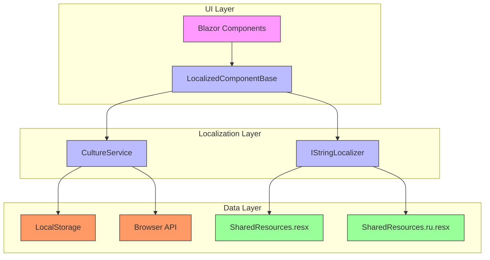
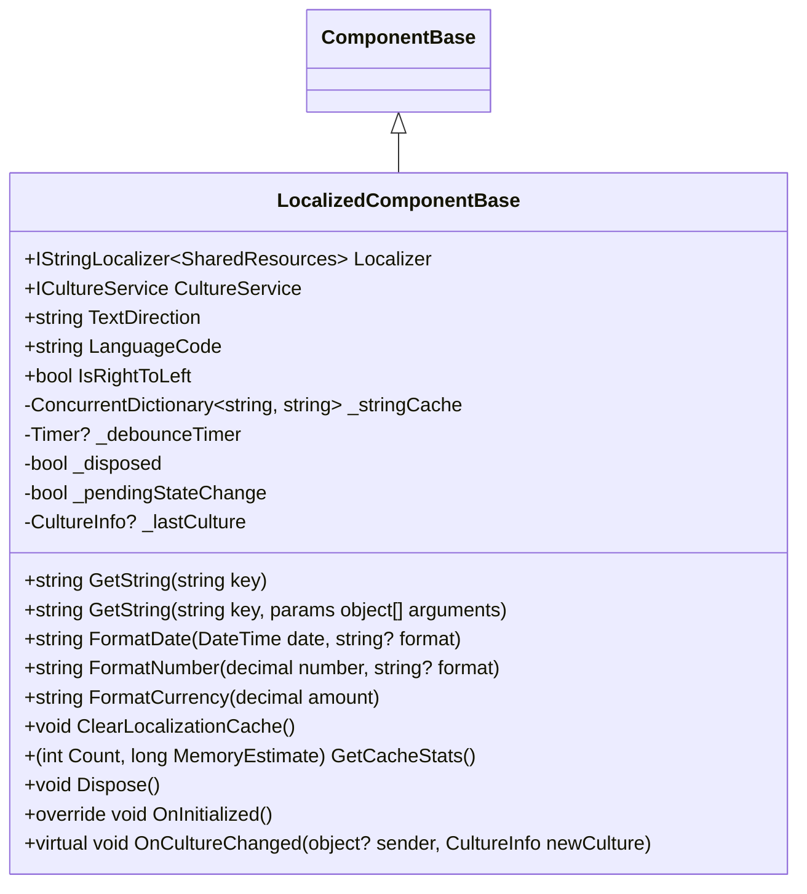
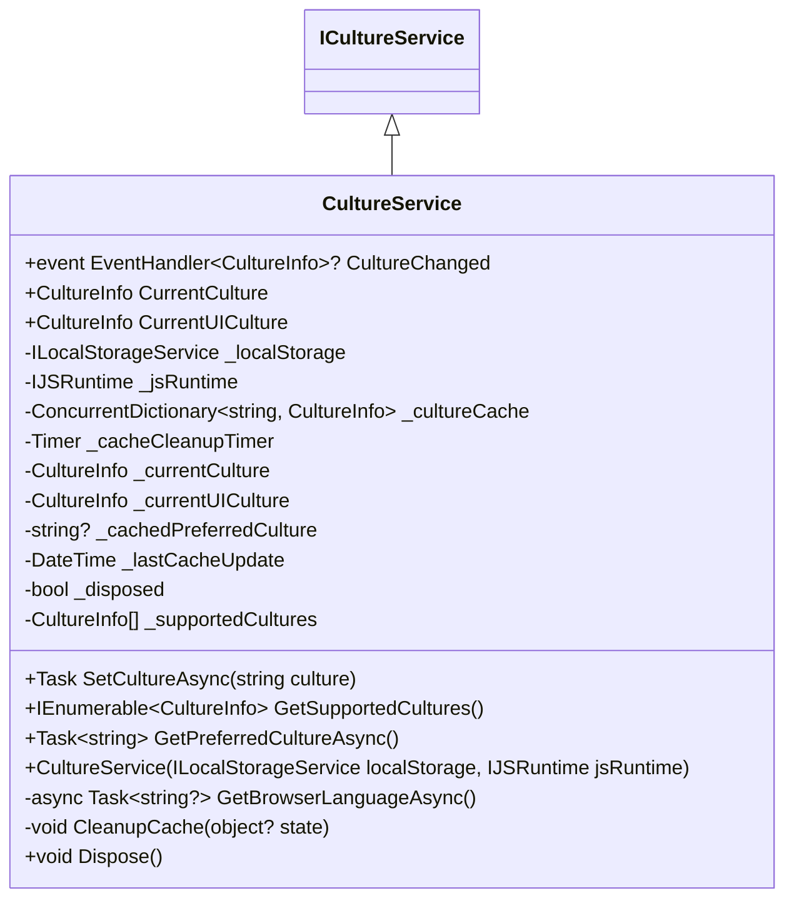
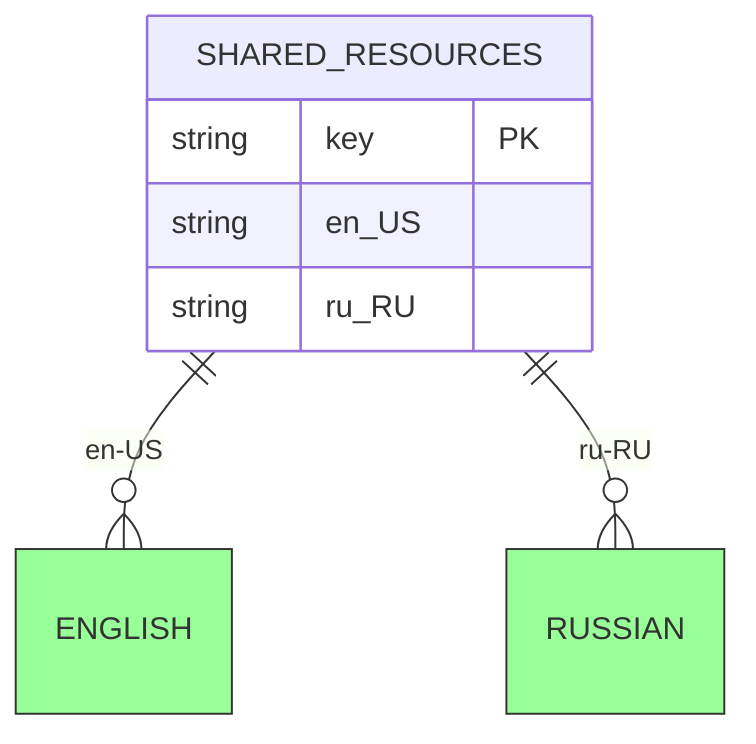
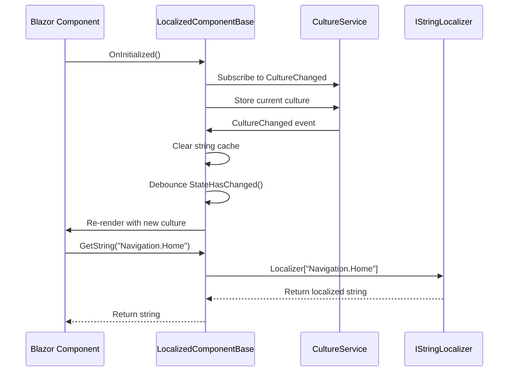
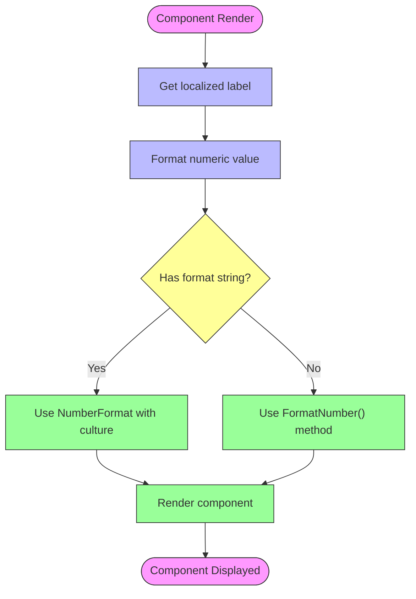
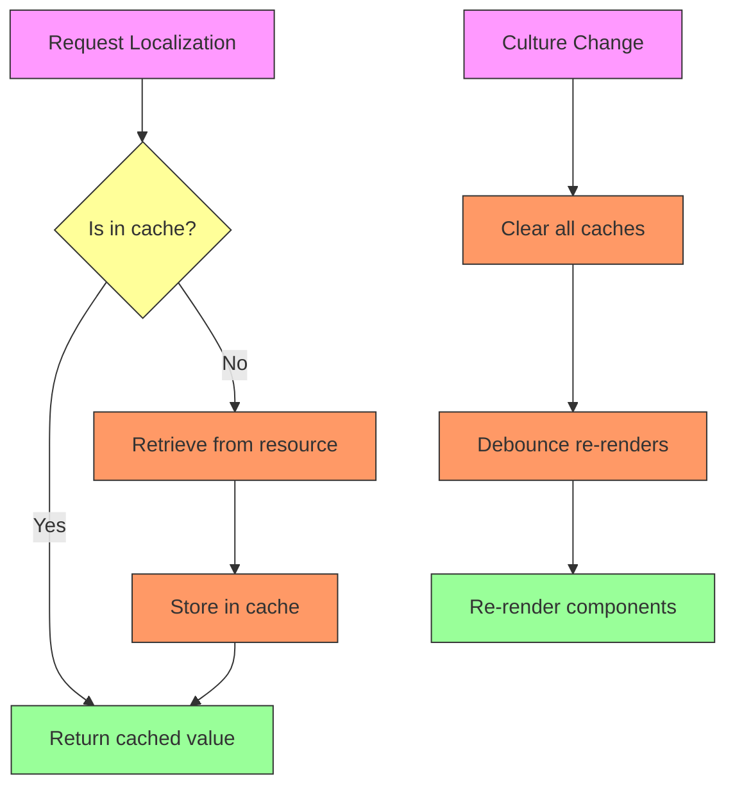

# UI Localization Infrastructure

<cite>
**Referenced Files in This Document**  
- [LocalizedComponentBase.cs](file://src/Inventory.Shared/Components/LocalizedComponentBase.cs)
- [CultureService.cs](file://src/Inventory.Web.Client/Services/CultureService.cs)
- [SharedResources.resx](file://src/Inventory.Shared/Resources/SharedResources.resx)
- [SharedResources.ru.resx](file://src/Inventory.Shared/Resources/SharedResources.ru.resx)
- [StatsWidget.razor](file://src/Inventory.UI/Components/Dashboard/StatsWidget.razor)
- [Home.razor](file://src/Inventory.UI/Pages/Home.razor)
</cite>

## Table of Contents
1. [Introduction](#introduction)  
2. [Architecture Overview](#architecture-overview)  
3. [Core Components](#core-components)  
4. [Resource Management](#resource-management)  
5. [Implementation Patterns](#implementation-patterns)  
6. [Integration Examples](#integration-examples)  
7. [Performance Considerations](#performance-considerations)  
8. [Troubleshooting Guide](#troubleshooting-guide)  
9. [Conclusion](#conclusion)

## Introduction

The UI Localization Infrastructure provides a comprehensive solution for multilingual support in the Inventory Control application. This system enables dynamic language switching, cultural formatting, and right-to-left (RTL) layout support while maintaining high performance through caching and optimized rendering. The infrastructure supports English (en-US) and Russian (ru-RU) languages with extensibility for additional languages.

The system is designed for Blazor WebAssembly applications and integrates seamlessly with the existing component architecture. It handles both static text localization and dynamic content formatting (dates, numbers, currency) according to cultural conventions. The infrastructure also manages user preferences by storing selected languages in local storage and detecting browser language settings for initial culture selection.

## Architecture Overview

The UI Localization Infrastructure follows a layered architecture with clear separation of concerns between resource management, culture state management, and component integration.



**Diagram sources**  
- [LocalizedComponentBase.cs](file://src/Inventory.Shared/Components/LocalizedComponentBase.cs)
- [CultureService.cs](file://src/Inventory.Web.Client/Services/CultureService.cs)

**Section sources**  
- [LocalizedComponentBase.cs](file://src/Inventory.Shared/Components/LocalizedComponentBase.cs)
- [CultureService.cs](file://src/Inventory.Web.Client/Services/CultureService.cs)

## Core Components

### LocalizedComponentBase

The `LocalizedComponentBase` class serves as the foundation for all localized components in the application. It provides a rich set of localization methods and handles culture change events efficiently.



**Diagram sources**  
- [LocalizedComponentBase.cs](file://src/Inventory.Shared/Components/LocalizedComponentBase.cs#L13-L203)

**Section sources**  
- [LocalizedComponentBase.cs](file://src/Inventory.Shared/Components/LocalizedComponentBase.cs)

### CultureService

The `CultureService` manages the application's cultural state and provides methods for culture detection, persistence, and switching.



**Diagram sources**  
- [CultureService.cs](file://src/Inventory.Web.Client/Services/CultureService.cs#L12-L226)

**Section sources**  
- [CultureService.cs](file://src/Inventory.Web.Client/Services/CultureService.cs)

## Resource Management

### Resource Files Structure

The localization system uses .resx files to store localized strings for different languages. The base file contains English translations, while language-specific files contain translations for other supported languages.



**Section sources**  
- [SharedResources.resx](file://src/Inventory.Shared/Resources/SharedResources.resx)
- [SharedResources.ru.resx](file://src/Inventory.Shared/Resources/SharedResources.ru.resx)

### Resource Key Organization

Resource keys follow a hierarchical naming convention that groups related strings by functional area:

| Category | Example Keys | Purpose |
|---------|-------------|---------|
| Navigation | Navigation.Home, Navigation.Catalog | Menu items and navigation links |
| Dashboard | Dashboard.KeyMetrics, Dashboard.Welcome | Dashboard content and labels |
| Stats | Stats.TotalProducts, Stats.LowStock | Statistical data labels |
| Common | Common.Loading, Common.Error | Common UI elements and messages |
| Validation | Validation.Required, Validation.InvalidEmail | Form validation messages |
| Field Names | Field.Name, Field.Email | Form field labels |
| Product Related | Product.SKU, Product.Category | Product-specific labels |
| Actions | Action.Edit, Action.Delete | Button and action labels |

This organization enables maintainable and scalable resource management, making it easy to locate and update specific translations.

## Implementation Patterns

### Component Integration

Components inherit from `LocalizedComponentBase` to gain access to localization methods and automatic culture change handling.



**Diagram sources**  
- [LocalizedComponentBase.cs](file://src/Inventory.Shared/Components/LocalizedComponentBase.cs)
- [CultureService.cs](file://src/Inventory.Web.Client/Services/CultureService.cs)

### Localization Methods

The `LocalizedComponentBase` provides several methods for retrieving localized content:

| Method | Parameters | Return Type | Description | Caching |
|-------|-----------|------------|-------------|---------|
| GetString | string key | string | Retrieves a localized string by key | Yes |
| GetString | string key, params object[] arguments | string | Retrieves a formatted localized string | No |
| FormatDate | DateTime date, string? format | string | Formats a date according to current culture | Yes |
| FormatNumber | decimal number, string? format | string | Formats a number according to current culture | Yes |
| FormatCurrency | decimal amount | string | Formats a currency amount according to current culture | Yes |

**Section sources**  
- [LocalizedComponentBase.cs](file://src/Inventory.Shared/Components/LocalizedComponentBase.cs)

## Integration Examples

### Dashboard Stats Widget

The StatsWidget component demonstrates practical localization implementation with dynamic value formatting.



**Diagram sources**  
- [StatsWidget.razor](file://src/Inventory.UI/Components/Dashboard/StatsWidget.razor)

**Section sources**  
- [StatsWidget.razor](file://src/Inventory.UI/Components/Dashboard/StatsWidget.razor)

### Home Page Localization

The Home page demonstrates comprehensive localization usage across different UI elements.

```mermaid
flowchart TD
A[Page Initialization] --> B[Set Page Title]
B --> C[Display Greeting]
C --> D[Show Dashboard Labels]
D --> E[Render Action Buttons]
B --> B1[GetString("Navigation.Home")]
C --> C1[GetString("Greeting.Hello", userName)]
C --> C2[GetString("Dashboard.Welcome")]
D --> D1[GetString("Dashboard.KeyMetrics")]
D --> D2[GetString("Dashboard.QuickActions")]
E --> E1[GetString("Action.AddProduct")]
E --> E2[GetString("Action.ProductIncome")]
E --> E3[GetString("Action.ProductExpense")]
E --> E4[GetString("Action.Reports")]
style A fill:#f9f,stroke:#333
style B fill:#bbf,stroke:#333
style C fill:#bbf,stroke:#333
style D fill:#bbf,stroke:#333
style E fill:#bbf,stroke:#333
style B1 fill:#9f9,stroke:#333
style C1 fill:#9f9,stroke:#333
style C2 fill:#9f9,stroke:#333
style D1 fill:#9f9,stroke:#333
style D2 fill:#9f9,stroke:#333
style E1 fill:#9f9,stroke:#333
style E2 fill:#9f9,stroke:#333
style E3 fill:#9f9,stroke:#333
style E4 fill:#9f9,stroke:#333
```

**Diagram sources**  
- [Home.razor](file://src/Inventory.UI/Pages/Home.razor)

**Section sources**  
- [Home.razor](file://src/Inventory.UI/Pages/Home.razor)

## Performance Considerations

### Caching Strategy

The localization infrastructure implements multiple levels of caching to optimize performance:



**Section sources**  
- [LocalizedComponentBase.cs](file://src/Inventory.Shared/Components/LocalizedComponentBase.cs)

### Performance Features

The UI Localization Infrastructure includes several performance optimizations:

| Feature | Benefit | Implementation |
|--------|-------|---------------|
| String Caching | Reduces repeated resource lookups | ConcurrentDictionary with culture-key composite key |
| Debounced Re-renders | Prevents excessive rendering during rapid culture changes | Timer-based debounce with 100ms delay |
| Culture Info Caching | Avoids repeated CultureInfo instantiation | ConcurrentDictionary in CultureService |
| Asynchronous Storage | Prevents blocking UI thread | Task.Run for localStorage operations |
| Cache Cleanup | Prevents memory leaks | Timer-based cleanup every 30 minutes |

These optimizations ensure smooth user experience even when switching between languages frequently.

## Troubleshooting Guide

### Common Issues and Solutions

| Issue | Possible Cause | Solution |
|------|---------------|----------|
| Text not updating after language change | Component not inheriting from LocalizedComponentBase | Ensure component inherits from LocalizedComponentBase |
| Missing translations showing keys | Resource key not found in .resx file | Add missing key to both en-US and target language .resx files |
| Incorrect date/number formatting | Culture not properly set on thread | Verify CultureService sets CultureInfo.CurrentCulture |
| Language preference not persisting | LocalStorage access blocked | Check browser settings and ensure no extensions block localStorage |
| RTL layout not applying | CSS :lang() selectors missing | Add appropriate :lang() CSS rules for RTL languages |
| Performance issues with frequent culture switching | Cache not properly implemented | Verify string cache is being used and cleared appropriately |

### Debugging Tools

The localization system provides built-in debugging capabilities:

```csharp
// Get cache statistics for performance analysis
var (count, memory) = GetCacheStats();
Console.WriteLine($"Cache contains {count} entries, estimated {memory} bytes");

// Clear cache for fresh translations
ClearLocalizationCache();

// Check current culture settings
Console.WriteLine($"Current culture: {CultureService.CurrentCulture.Name}");
Console.WriteLine($"Text direction: {TextDirection}");
Console.WriteLine($"Language code: {LanguageCode}");
```

**Section sources**  
- [LocalizedComponentBase.cs](file://src/Inventory.Shared/Components/LocalizedComponentBase.cs)

## Conclusion

The UI Localization Infrastructure provides a robust, high-performance solution for multilingual support in the Inventory Control application. By leveraging ASP.NET Core's built-in localization framework and extending it with custom optimizations, the system delivers seamless language switching, cultural formatting, and RTL support.

Key strengths of the infrastructure include its component-based architecture, comprehensive caching strategy, and seamless integration with Blazor's component model. The use of .resx files for resource storage ensures compatibility with standard localization tools and workflows.

The system is designed for extensibility, making it straightforward to add support for additional languages by creating new .resx files and updating the supported cultures list in CultureService. Future enhancements could include automated translation workflows, language fallback mechanisms, and user interface for managing translations.